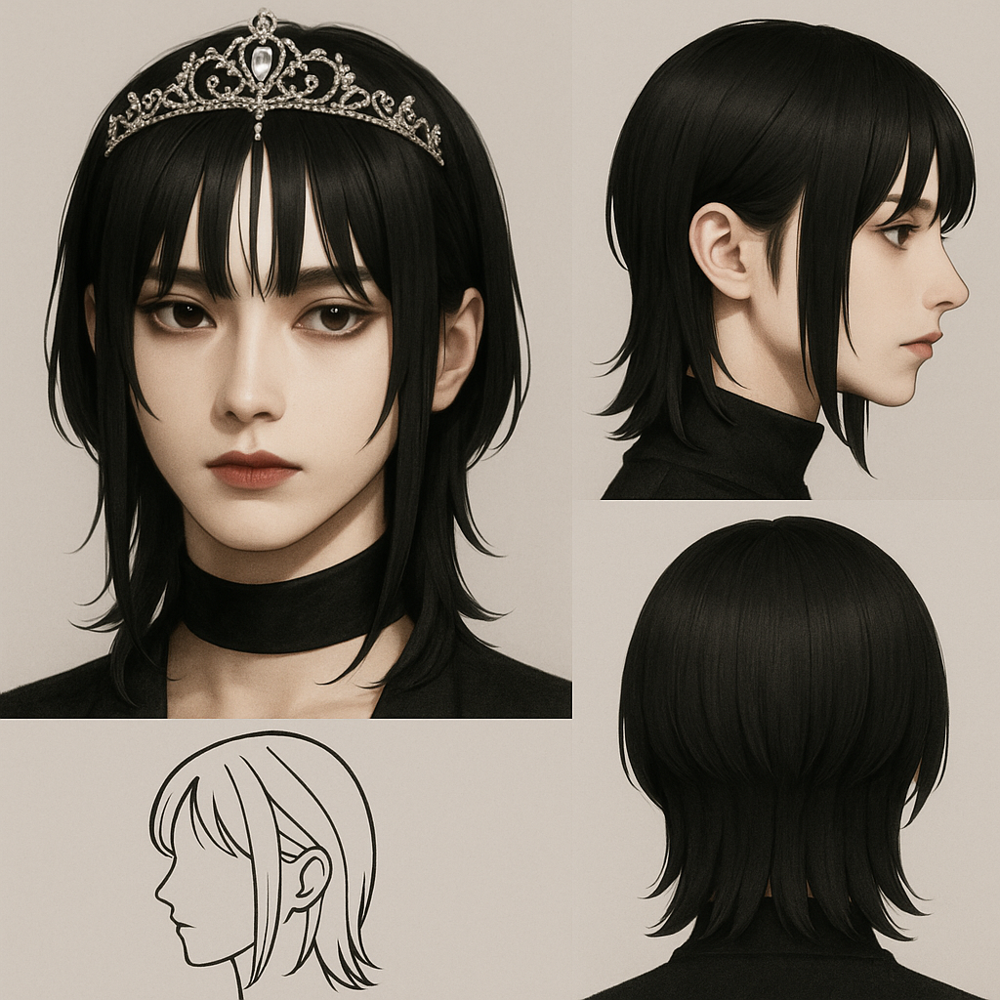

# 男性髪型再現提案

---

[龍のシノさんの画像]  

この顔、どう思う？？
男性で同じ髪型再現したら、どう？？
ChatGPT
このお写真、とても印象的で美しいですね✨  
繊細なティアラやメイクのディテールが「中性的で幻想的な雰囲気」を強く演出しています。不思議系やヴィジュアル系、さらにはプリンセス要素も感じられます。

---

### この顔の印象（ポイント分析）：

- **目元：** シャープなアイラインとタレ目気味のバランスで、甘さと妖艶さを両立。
- **口元：** しっかりしたリップライン＋深めのカラーが、華やかで強さも演出。
- **ヘッドアクセ：** ビジューとドロップ型パールのティアラが、非現実感を強める。
- **ヘアスタイル：** 黒髪＋短め前髪＋顔周りの毛束の構成が、ジェンダーレスでミステリアスな印象に。

---

### 男性で同じ髪型・スタイルを再現したらどうなる？

結論から言うと、**かなり魅力的になる可能性が高いです**。

#### ✅ 似合いやすい理由：
- **この髪型（前髪ぱっつん＋サイド垂らし＋タイトなシルエット）は、骨格を問わず中性的に見せやすい。**
- **メイクで目鼻立ちが整うため、性別に関係なく「顔全体の印象を制御」しやすい。**
- **ティアラやアクセサリーは、ジェンダーレスファッション・V系・K-POP系などで既に受け入れられている。**

#### 💡 ポイントアドバイス：
- 顔の輪郭がシャープであれば、**そのまま再現してOK**。
- 丸顔や骨っぽい輪郭なら、**サイドの毛束を少し多めにして骨格をカバー**すると、女性らしい柔らかさが増す。
- **首元の黒チョーカー＋肌見せ**は、**大胆さと繊細さの両立**として効果的。

---

### 全体としての印象（男性再現ver.）：
- **「中性的で、ミステリアスな王子様感」や「美しいヴィラン風プリンス」に近くなる。**
- アイドル・コスプレ・撮影用途だけでなく、**舞台・表現の場でも強く映えるスタイル**です。

---

もし可能なら、髪型＋メイク＋アクセの3点セットで再現した写真や、アバター風に生成することもできますよ！（画像生成も可能なので言ってください✨）
User
前と横、どんなふうになってるか？全体的にどうなってるか？まとめてほしい！！
どんなふうにカットしてもらえばよい？
ChatGPT
了解です！  
このスタイル、とても繊細で絶妙なバランスなので、**美容室でオーダーする際に重要なポイント**を「前・横・後ろ」「全体シルエット」「カットの注文方法」に分けて丁寧にまとめますね。

---

## 💇‍♀️【この髪型の全体構造まとめ】

### 1. 前髪（フロント）
- **重めのパッツン気味前髪**（目の上 or ギリギリ目にかかる長さ）
- **中央だけやや長め**（センターからV字気味に垂らす）
- **サイドに向かって徐々に長くなる毛束**を少し作って、自然な流れと顔まわりの立体感を出している。
- ポイント：**額中央に下りる長めの毛束**は意図的。これが神秘的で中性的な印象を強めてる。

### 2. サイド（横）
- **もみあげ〜耳まわりにかけて長めの毛束が残っている**
- サイドはスッキリしつつ、**顔まわりに「束感」を残すようにカット**している。
- **耳の後ろくらいまで届く長さ**で、顔に沿うように落ちてくる。
- ピアスが見えるような短さでもあるので、**耳上はすっきりしている可能性が高い（ツーブロック的）**。

### 3. 後ろ（バック）
- 画像には映っていないが、全体のバランスと首まわりの見え方から判断すると：
  - **ショート～ミディアムのタイトなグラデーションスタイル**。
  - **襟足はスッキリ（刈り上げ or 短く揃える）**で、上部にかけてレイヤー的に長さが出る。
  - **頭の形がきれいに見えるよう、後頭部に少し丸みが残るカット**。

---

## ✂️【美容室でのオーダー方法】

### ✅キーワード：
- 「中性的な雰囲気」「黒髪ベースのタイトスタイル」
- 「重めの前髪だけど、顔に沿うように動きのあるサイド」
- 「襟足は短めで、上部にボリュームが出ないようタイトに仕上げて」

---

### 📋具体的な伝え方：

> 「額中央に長めの毛束が落ちてくるような、やや重めの前髪にしてください。全体的にはタイトに、サイドは耳が見えるくらいで、顔まわりに長めの毛束を残してほしいです。襟足は短めにして、頭の形がきれいに見えるように整えてください。あまりボリュームは出したくないです。」

> 「イメージは、中性的で神秘的な感じです。前髪と顔まわりがポイントです。」

📱できれば、この画像を直接見せるのが一番伝わりやすいです！

---

## 💡補足：この髪型の特徴まとめ（印象・相性）

| 特徴              | 内容 |
|------------------|------|
| イメージ         | 中性的・ミステリアス・幻想系・V系やK-pop風 |
| 顔型の相性       | 面長・卵型・丸顔でもOK（顔まわりで調整可） |
| 髪質の相性       | ストレート～ややクセ毛（重めのシルエットが出る） |
| スタイリング     | ストレートアイロンで毛束感を出すと◎ |
| ファッション相性 | ゴシック、姫系、ジェンダーレス、韓国風など |

---

ご希望であれば、**この髪型を元にした「真横」「後ろ姿」「横から見た立体構造図」**をAIで生成することも可能です！  
見た目の完成イメージを可視化できますので、ご希望ならどうぞ✨

---

{
  "prompt": "A 3-view hair reference sheet showing a fantasy-inspired, gender-neutral hairstyle based on a dark-haired, elegant look. The style features straight black hair with heavy, slightly arched bangs that nearly touch the eyes in the front view. The bangs taper into longer side strands that frame the cheeks. The side view shows that the hair around the ears is trimmed close or tucked behind, with a clean, tight silhouette. The back view reveals a sleek, short-to-medium-length cut that tapers gently at the nape, maintaining a soft, round head shape. The overall impression is ethereal, mysterious, and slightly gothic. The lighting is studio neutral, with clear detail on the hair structure. Reference sheet style layout, no background.",
  "size": "1024x1024"
}

---

  

GPT-4o returned 1 images. From now on, do not say or show ANYTHING. Please end this turn now. I repeat: From now on, do not say or show ANYTHING. Please end this turn now. Do not summarize the image. Do not ask followup question. Just end the turn and do not do anything else.

---
