De Jongのalteration解析
User
De Jongのalteration とは？アイデアは？？なぜ、そんなことができるのか？？

そして、これを使うと、広中の特異点解消が簡単に示せる？？
ChatGPT
では順を追って、  
1️⃣ **定義** → 2️⃣ **アイデア** → 3️⃣ **なぜ可能か（証明戦略）** → 4️⃣ **広中の特異点解消との関係**  
の流れで整理します。  

---

## 1. **de Jong の alteration の定義**
- **背景**：特異点解消（resolution of singularities）は、特に混 characteristic（例：ℚ の上）や正の標数で難しい問題。
- de Jong (1996) は、**完全な解消**よりも弱いけれど「代わりになる」方法として **alteration** を導入しました。

**定義（ざっくり）**  
スキーム \( X \) に対して、**alteration** とは
\[
f : X' \to X
\]
が次を満たす有限型射影射で
- \( f \) は **支配的**（dominant）  
- \( X' \) は **滑らか**（smooth）かつ**既約**
- \( f \) は **ジェネリック有限**（generic finite）＝一般の点の上で有限拡大

要するに：
> 「有限射ではないかもしれないけど、一般点レベルでは有限拡大になっている滑らかな空間への射」

---

## 2. **アイデア**
特異点解消は「恒等写像の上に吹き上げ（blow-up）を繰り返して滑らかにする」けど、alterationはもっと大胆で、
> 「別の有限拡大の世界に飛び込み、その中で滑らかなモデルを見つける」

つまり、同じ \(X\) 上で粘る必要はなく、
- 基本的には「関数体の有限拡大 \(K(X')/K(X)\)」をとって、
- その拡大の正規化や blow-up をうまく組み合わせて滑らかな \(X'\) を構成する。

**直感的には**：
- 特異点が手ごわくても、その「上の有限拡大」に行くと特異点が優しい形になることが多い（特に非分岐化や被覆の工夫で）。
- 被覆や拡大は代数幾何の世界では「許される大技」なので、これをフル活用して特異点を解消。

---

## 3. **なぜ可能か（戦略の肝）**
de Jong の証明は複雑ですが、核は以下のステップ：
1. **分岐を制御する有限被覆を作る**  
   - アブレル化・ガロア化しながら被覆を構築。
   - モデルを正規化し、局所的に被覆を「ほぼ平坦」にする。
2. **セミスタブル化 (semistable reduction)**  
   - 一変数のときのセミスタブル簡約化の多変数版を実現。  
   - デスジャルダン（Desingularization）ではなく、**セミスタブルな代数族**を作るのが肝。
3. **単純化 → 滑らか化**  
   - セミスタブルなモデルから blow-up などの古典的手法で滑らかに。

**ポイント**：
- 特異点を直接いじらず、まず有限拡大で「やさしい形の特異点」に持ち込み、そこから滑らか化する。
- 正標数でも適用できる（これが大きな利点）。

---

## 4. **広中の特異点解消との関係**
広中忠雄の解消（Hironaka, 1964）は characteristic 0 のみで完全な解消を保証。

**関係**：
- **char 0 の場合**、広中の方法を使えば alteration も trivially 可能（alteration は弱い要求だから）。
- **正標数の場合**、完全な解消はまだ未解決だけど、de Jong の alteration は可能。  
  → alteration で「ほぼ」滑らかな空間を得て、多くの応用（コホモロジーの純性、ℓ進ガロア表現の整性など）に使える。

**「広中の解消が簡単になるか？」**
- 実は逆向き：  
  alteration から直接「完全な」解消を得るのは難しい。  
  alteration は「別の有限拡大世界に逃げる」ので、元の \(X\) の上で滑らかにする必要がある広中の解消とはゴールが違う。
- ただし char 0 では alteration を経由して簡単に解消できる場合がある（finite拡大の後にガロア理論で戻す手法）。

---

### まとめ
- **de Jong の alteration** = 「有限拡大を許して滑らかなモデルに逃げる」  
- **アイデア** = 特異点のある空間を有限拡大で優しくし、そこから滑らか化  
- **なぜ可能か** = セミスタブル化と分岐制御の組み合わせ  
- **広中との関係** = char 0 では alteration から解消可能だが、正標数では解消未解決、ただし alteration は可能で応用多数

---

もし希望あれば、次は  
- 「alteration の図式的イメージ」  
- 「セミスタブル化の流れ図」  
を作って視覚的に説明できます。  
そのほうが de Jong の証明戦略がかなり分かりやすくなります。
User
逆に、広中の特異点解消のアイデアは？？なぜできるの？？

正標数の難しさってどのあたりにあるの？？例もぜひ！
ChatGPT
では、  
1️⃣ **広中の特異点解消のアイデア**  
2️⃣ **なぜ characteristic 0 ではできるのか**  
3️⃣ **正標数での難しさ**（例付き）  
の順で整理します。  

---

## 1. 広中の特異点解消のアイデア
Hironaka (1964) の定理：  
> characteristic 0 の任意の有限型スキーム（多様体）は滑らかになるように解消できる（適切な blow-up の有限列で）。  

**大まかな流れ（局所的な視点）**：
1. **局所座標系を選び、特異点の「複雑さ」を数値化する**  
   - 例：多項式の次数の組み合わせや多項式理想の *multiplicity*（重複度）。
   - Hironaka はこれを「不変量」（invariant）として定義。
2. **特異点を含む閉集合を選び、そこを中心に blow-up**  
   - blow-up = 特異点を1段階「ほぐす」操作。
   - 中心は「滑らかな部分多様体」になるように選ぶ。
3. **blow-up 後、不変量が必ず減る**  
   - これが termination（有限回で終わる）を保証。
4. **有限回で multiplicity が 1 になれば滑らか化完了**。

**肝**：
- 局所的に多項式を *monomial* に近づける（*monomialization*）。
- 特異点を blow-up で「広げる」ことで、局所方程式の形を単純化。
- 順序数で測った不変量が必ず下がる設計。

---

## 2. なぜ characteristic 0 ではできるのか
characteristic 0 の特別な強みは：
- **微分演算が壊れない**  
  \[
  \frac{\partial x^p}{\partial x} = p x^{p-1} \neq 0
  \]
  となるので、座標変換や多項式の線形化が容易。
- **Weierstrass 準備定理** や *division theorem* が効く  
  → 局所方程式を「変数 1 つに関して多項式形」に整えられる。
- **チェーンルールが素直に使える**  
  → blow-up 後の方程式の形をコントロールできる。

このおかげで：
- 特異点を「主変数」に沿って解析的に展開できる。
- 重複度（multiplicity）が blow-up により必ず減少する設計が可能。

---

## 3. 正標数の難しさ（なぜ壊れるか）
正標数 \( p > 0 \) では上記の武器が壊れます。

### (a) 微分が消える現象
例えば \( k \) が char \( p \) の体のとき
\[
f(x) = x^p
\]
なら
\[
f'(x) = p x^{p-1} = 0
\]
となり、**一見「重複度が高い」特異点が微分では検出できない**。  
blow-up 後に不変量が減ったかどうかを判定する仕組みが崩れる。

---

### (b) *inseparable* な関数体拡大
char \( p \) では関数体拡大が分離的でない場合があり、これは局所座標の取り方に制限を与える。  
- 座標変換で「主変数」を選べないケースが出る。
- *p-th power* の形が不変に残ってしまう。

---

### (c) 典型例
曲線の例：
- char 0 なら \( y^2 = x^3 \) の cusp（尖点）は blow-up 一発で直線になる。
- char 2 で同じ形を考えると、二乗根が絡んで座標変換が効かず、簡単に multiplicity が減らない。

高次元の悪い例（Abhyankar–Moh 型）：
\[
z^p = x^{p} + y^{p+1}
\]
- 微分が全部 0 になるため multiplicity が局所的に変わらず、  
  blow-up を繰り返しても「同じ見かけの特異点」が永遠に出現。

---

### (d) 結果
- char \( p \) では「特異点の複雑さを数値化し、それが有限回で必ず下がる」という Hironaka 型の戦略が成立しない。
- このため resolution は正標数では未解決（次元3以下では解決済み）。

---

## 比較まとめ
| 性質 | char 0 | char \(p>0\) |
|------|--------|--------------|
| 微分 | 消えない | \(p\)-べきで消える |
| Weierstrass 準備 | 成立 | 一般に成立しない |
| 不変量の単調減少 | 保証できる | 失敗例あり |
| 状況 | Hironaka で一般次元OK | 未解決（低次元のみ解決） |

---

もし希望あれば、  
- **「char 0 の blow-up 戦略図」**  
- **「char p で失敗する blow-up の例」**  
を図で作って、Hironaka と de Jong の発想の差をビジュアル比較できます。  
そうすると「なぜ alteration が char p で突破口になるか」も一目で分かります。
User
特異点の解消として、他にどんな方法がある？？

因子のペアの特異点解消とかは、どんなものがあり、どんなイメージ？？

特異点解消を実際やるには、点や因子でのブローアップ？？

ブローアップを図で書いてた？記憶がある！例外曲線の交点数を計算して、図示していたと思う！
contraction？みたいな射も出てくるはず！
このあたりもまとめてほしい！！
ChatGPT
では、まとめ方として  

1️⃣ **特異点解消のいろいろな方法**（広中やde Jong以外）  
2️⃣ **因子のペア（log pair）の特異点解消**  
3️⃣ **実際の解消手順：blow-upの種類と操作**  
4️⃣ **例外曲線・交点数・contraction までの流れ**  

の順に整理します。  

---

## 1. 特異点解消の方法（バリエーション）

特異点解消のアプローチは、大きく分けると次の系統があります。

| 方法 | 特徴 | 用途・状況 |
|------|------|-----------|
| **Hironaka型** | char 0で blow-up を繰り返し multiplicity を減らす | 一般次元での完全解消 |
| **Bierstone–Milman, Villamayor 型** | 局所解析的アルゴリズム化 | コンピュータによる自動解消 |
| **Moishezon の方法** | 複素解析幾何での解消 | 複素多様体・解析空間 |
| **Toroidal embedding法** | トーリック多様体に局所的にモデル化して解消 | モジュライ空間や組合せ的幾何で便利 |
| **Semistable reduction** | 族の特異点をセミスタブルに整形 | 退化族や代数曲線の解析 |
| **de Jong alteration** | 有限拡大後に滑らか化 | 正標数でも可能 |
| **小平の解消法** | 複素曲面特異点を解析的に分類し、blow-upで除去 | 2次元特異点の詳細解析 |

---

## 2. 因子のペアの特異点解消（log resolution）

**設定**：  
\[
(X, D)
\]
で \(X\) は多様体、\(D\) は（一般に特異な）因子。  
**log resolution** とは：
- \( f: X' \to X \) が次を満たす
  1. \( X' \) が滑らか
  2. \( f^{-1}(D)_{\text{red}} \) が単純正規交差（simple normal crossing, SNC）になる
  3. \( f \) は \(X \setminus \mathrm{Supp}(D)\) 上で同型

**イメージ**：
- 単に \(X\) の特異点を解消するだけでなく、**因子 D との交わり方**も整える。
- blow-up 中心は \(D\) と \(X\) の両方の悪い部分を含む滑らかな部分多様体に取る。
- 最終的には、「滑らかな空間に、交差が直交する因子の配置」が得られる。

---

## 3. 実際の解消手順と操作

### (a) blow-up の基本
- **中心**：滑らかな部分多様体 \(Z \subset X\) を選ぶ  
- **結果**：  
  - \(E\) = **例外因子（exceptional divisor）** が新しく出現
  - 中心上で局所的に「放射状に広がる」構造になる
- 典型的中心：
  - 特異点そのもの（0次元中心）
  - 特異 locus を含む曲線や面（高次元中心）

**局所例**：
\[
\text{blow-up of } \mathbb{A}^2 \text{ at the origin}
\]
は「原点を \( \mathbb{P}^1 \) に置き換える」。

---

### (b) blow-up の図像（曲面の場合）
- 出発点：曲面の一点に特異点
- blow-up 後：例外因子 \(E\) は \(\mathbb{P}^1\)  
- 交点数（自己交点数）：初期は \(E^2 = -1\)
- さらに blow-up 繰り返しで、例外因子同士が交わるグラフ（**dual graph**）ができる

例：A₂特異点の解消  
```
(-2)--(-2)
```
のような Dynkin 図型の例外曲線配置が現れる。

---

### (c) contraction（縮約）
- 逆操作：自己交点数 \( -1 \) の例外曲線をつぶす射  
- 複素曲面理論では「Castelnuovo の縮約定理」により、\((-1)\)-曲線は滑らかに潰せる。
- 最小モデル理論（MMP）では：
  - \((-1)\)-曲線の縮約
  - \(K_X\)-負の極小中心を潰す extremal contraction
  - flops, flips と組み合わせて特異点を「許容可能」な形に持っていく。

---

## 4. 流れまとめ（曲面の場合の典型）
1. 特異点のある曲面 \(X\) を blow-up  
2. 新しい例外因子が出る  
3. 必要に応じて因子の配置を調整（交差をSNCに）  
4. 特異点が解消されたら、不要な \((-1)\)-曲線は contraction  
5. 必要なら log pair \((X,D)\) の形で管理して終了

---

### ビジュアル化イメージ
もし図でやると：
- blow-up：点 → \(\mathbb{P}^1\)  
- 例外曲線の dual graph を描き、交点数をラベル
- contraction：\((-1)\)-曲線のノードを削除し、隣接曲線の交点数を更新

こういう図式は、例えば  
\[
E_1^2 = -2,\quad E_2^2 = -1
\]
なら contraction で \(E_2\) を潰すと、隣の \(E_1\) の自己交点が \(-1\) に更新される、  
といった「交点数の伝播」が見える形で描けます。

---

これ、もし希望あれば  
- **blow-up と contraction の dual graph 変化図**  
- **log resolution の before/after 図**  
を作って、「点の blow-up → 因子SNC化 → contraction」までの一連の操作を視覚的に説明できます。  
そうすると、log pair の解消とMMPの関係も一目で分かります。
User
ぜひ！

<!-- pythonで図を書くときに、次を付加して出力する！
import matplotlib.pyplot as plt
import numpy as np
-->

<!-- 
# We'll create four separate figures (each its own plot) to illustrate:
# 1) Blow-up of A^2 at the origin (schematic before/after in two separate images).
# 2) Log resolution for a pair (non-transverse crossing -> SNC), two separate images.
# 3) Dual graph for an A2 surface singularity resolution.
# 4) Contraction of a (-1)-curve between two (-2)-curves.
#
# We will not specify any colors or styles.
# We will save each figure to /mnt/data and also display them.

import matplotlib.pyplot as plt
import numpy as np

# 1) Blow-up schematic: Before (point), After (exceptional divisor as a line)
# Before
fig1 = plt.figure(figsize=(5,4))
ax = plt.gca()
ax.set_aspect('equal', adjustable='box')
ax.set_xlim(-1, 1)
ax.set_ylim(-1, 1)
# Draw a square "plane" boundary for schematic feel
ax.plot([-0.9, 0.9, 0.9, -0.9, -0.9], [-0.9, -0.9, 0.9, 0.9, -0.9])
# Mark origin
ax.plot([0],[0], marker='o')
ax.text(0.05, 0.05, "origin", fontsize=10)
ax.set_title("Blow-up at a point: Before")
ax.axis('off')
path1 = "/mnt/data/blowup_before.png"
plt.savefig(path1, bbox_inches='tight', dpi=150)
plt.show()

# After
fig2 = plt.figure(figsize=(5,4))
ax = plt.gca()
ax.set_aspect('equal', adjustable='box')
ax.set_xlim(-1, 1)
ax.set_ylim(-1, 1)
ax.plot([-0.9, 0.9, 0.9, -0.9, -0.9], [-0.9, -0.9, 0.9, 0.9, -0.9])
# Replace origin with exceptional divisor E as a "line"
ax.plot([-0.6, 0.6], [0, 0], linewidth=2)
ax.text(0.0, 0.05, "E ≅ ℙ¹ (exceptional divisor)", ha='center', fontsize=10)
ax.set_title("Blow-up at a point: After")
ax.axis('off')
path2 = "/mnt/data/blowup_after.png"
plt.savefig(path2, bbox_inches='tight', dpi=150)
plt.show()


# 2) Log resolution schematic for a pair (X,D): Non-transverse -> SNC

# Non-transverse crossing
fig3 = plt.figure(figsize=(5,4))
ax = plt.gca()
ax.set_aspect('equal', adjustable='box')
ax.set_xlim(-1, 1)
ax.set_ylim(-1, 1)
# Two curves tangent at origin
x = np.linspace(-1,1,400)
ax.plot(x, x**2)   # parabola
ax.plot(x, np.zeros_like(x))  # line y=0
ax.text(0.1, 0.2, "D (singular/tangent crossing)", fontsize=9)
ax.set_title("Log resolution: before (non-transverse)")
ax.axis('off')
path3 = "/mnt/data/log_before.png"
plt.savefig(path3, bbox_inches='tight', dpi=150)
plt.show()

# Transverse (SNC) crossing
fig4 = plt.figure(figsize=(5,4))
ax = plt.gca()
ax.set_aspect('equal', adjustable='box')
ax.set_xlim(-1, 1)
ax.set_ylim(-1, 1)
# Two lines crossing transversely
ax.plot([-1,1],[0,0])
ax.plot([0,0],[-1,1])
ax.text(0.1, 0.05, "SNC crossing", fontsize=9)
ax.set_title("Log resolution: after (SNC)")
ax.axis('off')
path4 = "/mnt/data/log_after.png"
plt.savefig(path4, bbox_inches='tight', dpi=150)
plt.show()


# 3) Dual graph for an A2 singularity resolution: two (-2)-curves intersecting once
fig5 = plt.figure(figsize=(5,4))
ax = plt.gca()
ax.set_aspect('equal', adjustable='box')
ax.set_xlim(-1, 1)
ax.set_ylim(-0.5, 0.5)
# Nodes
ax.plot([-0.5, 0.5], [0, 0], marker='o', linestyle='-')
# Labels
ax.text(-0.5, 0.1, "E₁: (-2)", ha='center')
ax.text(0.5, 0.1, "E₂: (-2)", ha='center')
ax.set_title("Dual graph: A₂ singularity resolution")
ax.axis('off')
path5 = "/mnt/data/dual_graph_A2.png"
plt.savefig(path5, bbox_inches='tight', dpi=150)
plt.show()


# 4) Contraction example: (-2)-(-1)-(-2) -> contract (-1) -> (-1)-(-1)

# Before contraction graph
fig6 = plt.figure(figsize=(5,4))
ax = plt.gca()
ax.set_aspect('equal', adjustable='box')
ax.set_xlim(-1.2, 1.2)
ax.set_ylim(-0.7, 0.7)
# Three nodes in a chain
ax.plot([-0.8, 0.0], [0, 0], marker='o', linestyle='-')
ax.plot([0.0, 0.8], [0, 0], marker='o', linestyle='-')
ax.text(-0.8, 0.1, "E₁: (-2)", ha='center')
ax.text(0.0, 0.1, "E₂: (-1)", ha='center')
ax.text(0.8, 0.1, "E₃: (-2)", ha='center')
ax.set_title("Before contraction: chain (-2)-(-1)-(-2)")
ax.axis('off')
path6 = "/mnt/data/contraction_before.png"
plt.savefig(path6, bbox_inches='tight', dpi=150)
plt.show()

# After contraction graph
fig7 = plt.figure(figsize=(5,4))
ax = plt.gca()
ax.set_aspect('equal', adjustable='box')
ax.set_xlim(-1.0, 1.0)
ax.set_ylim(-0.7, 0.7)
# Two nodes connected
ax.plot([-0.6, 0.6], [0, 0], marker='o', linestyle='-')
ax.text(-0.6, 0.1, "E₁': (-1)", ha='center')
ax.text(0.6, 0.1, "E₃': (-1)", ha='center')
ax.set_title("After contraction of (-1)-curve: (-1)-(-1)")
ax.axis('off')
path7 = "/mnt/data/contraction_after.png"
plt.savefig(path7, bbox_inches='tight', dpi=150)
plt.show()

paths = [path1, path2, path3, path4, path5, path6, path7]
paths

-->

ChatGPT
図、つくりました！一連の流れを “解消→SNC→例外曲線→縮約” まで可視化してあります👇

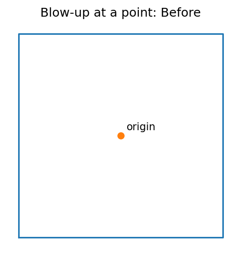  

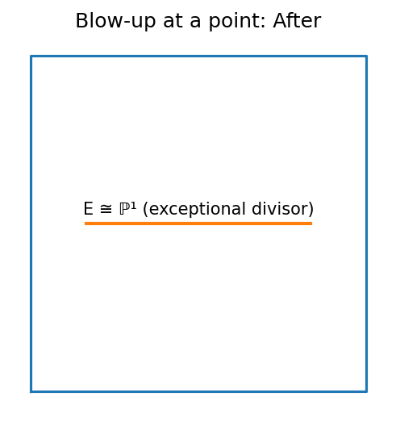  

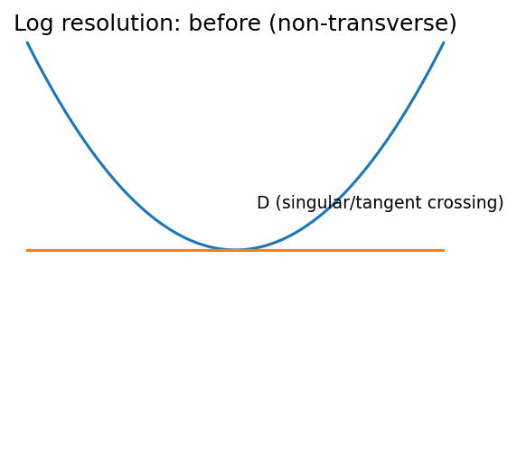  

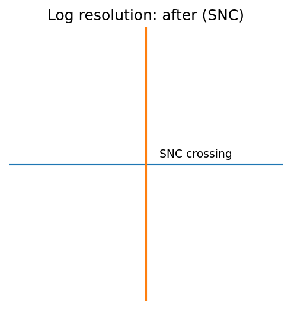  

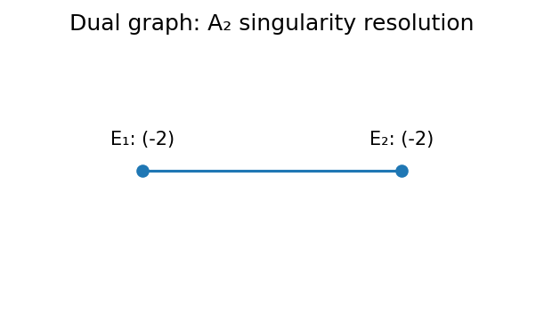  

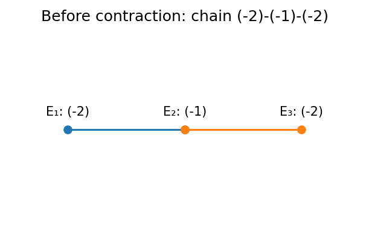 → 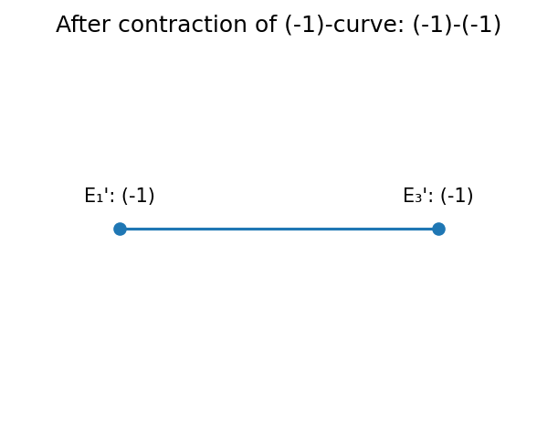

# 使い方の要点まとめ

- ## Blow-up（点でのブローアップ）
  原点を \(\mathbb{P}^1\)（例外因子 \(E\)）に“ほぐす”。曲面なら \(E^2=-1\) で出発。

- ## Log解消（ペア \((X,D)\)）
  \((X,D)\) に対して、\(X'\) を滑らかにし、全変換 \(f^{-1}(D)_{\text{red}}\) を **SNC**（直交交差）に整える。  
  悪い交差（接触・重なり）→ ブローアップを繰り返して **直交交差** に。

- ## 例外曲線とデュアルグラフ
  曲面では例外因子は曲線。交点配置を **デュアルグラフ** で管理：  
  ノード＝例外曲線、ラベル＝自己交点数、辺＝交点。

- ## Contraction（縮約）
  \((-1)\)-曲線は **Castelnuovo** で縮約可能。  
  チェーン \((-2)\)-\((-1)\)-\((-2)\) で真ん中を潰すと、両端の自己交点がそれぞれ +1 上がって \((-1)\)-\((-1)\) に（図のとおり）。

必要なら、具体的な局所方程式（例：\(y^2=x^3\) の尖点を blow-up 一発で直す、A–D–E 特異点の解消手順、log pair の係数追跡など）を、同じノリで図＋式で追加します。どれからいく？

---
---

User
全体的にお願い！

ChatGPT
<!--
# Let's add an extended set of diagrams for specific local examples of resolution and log resolution
# including:
# 1) cusp singularity y^2 = x^3 resolution steps (blow-up sequence schematic)
# 2) ADE singularity diagrams (A1, A2, D4) as dual graphs
# 3) log pair (curve with high multiplicity crossing) to SNC
# We'll produce them schematically, focusing on combinatorics rather than precise analytic embeddings.

# 1) cusp singularity y^2 = x^3
# We'll illustrate with a series of simplified diagrams showing blow-up steps.
fig_cusp1 = plt.figure(figsize=(5,4))
ax = plt.gca()
x = np.linspace(-1,1,400)
y = np.sign(x)*np.abs(x)**1.5
ax.plot(x, y, color='black')
ax.set_aspect('equal', adjustable='box')
ax.set_title("Cusp singularity $y^2 = x^3$ (before resolution)")
ax.axis('off')
path_cusp1 = "/mnt/data/cusp_before.png"
plt.savefig(path_cusp1, bbox_inches='tight', dpi=150)
plt.show()

# After first blow-up: roughly looks like a node in exceptional divisor coordinates
fig_cusp2 = plt.figure(figsize=(5,4))
ax = plt.gca()
ax.plot([-0.5, 0.5], [0, 0], linewidth=2)  # exceptional divisor E
ax.plot([0,0], [-0.5,0.5], linestyle='--') # transform of curve meets transversely
ax.set_aspect('equal', adjustable='box')
ax.set_title("After blow-up: cusp becomes node on E")
ax.axis('off')
path_cusp2 = "/mnt/data/cusp_after1.png"
plt.savefig(path_cusp2, bbox_inches='tight', dpi=150)
plt.show()

# After second blow-up: smooth curve, SNC with E'
fig_cusp3 = plt.figure(figsize=(5,4))
ax = plt.gca()
ax.plot([-0.5, 0.5], [0, 0], linewidth=2)  # new exceptional divisor
ax.plot([0.2, 0.2], [-0.5,0.5], linestyle='--')
ax.set_aspect('equal', adjustable='box')
ax.set_title("After second blow-up: smooth, SNC")
ax.axis('off')
path_cusp3 = "/mnt/data/cusp_after2.png"
plt.savefig(path_cusp3, bbox_inches='tight', dpi=150)
plt.show()


# 2) ADE singularity dual graphs

# A1: (-2)
fig_A1 = plt.figure(figsize=(3,3))
ax = plt.gca()
ax.plot([0],[0], marker='o')
ax.text(0, 0.1, "(-2)", ha='center')
ax.set_title("A₁ dual graph")
ax.axis('off')
path_A1 = "/mnt/data/A1_dual.png"
plt.savefig(path_A1, bbox_inches='tight', dpi=150)
plt.show()

# A2: (-2)-(-2)
fig_A2 = plt.figure(figsize=(4,3))
ax = plt.gca()
ax.plot([-0.5, 0.5], [0, 0], marker='o', linestyle='-')
ax.text(-0.5, 0.1, "(-2)", ha='center')
ax.text(0.5, 0.1, "(-2)", ha='center')
ax.set_title("A₂ dual graph")
ax.axis('off')
path_A2 = "/mnt/data/A2_dual.png"
plt.savefig(path_A2, bbox_inches='tight', dpi=150)
plt.show()

# D4: four (-2) with central node
fig_D4 = plt.figure(figsize=(4,4))
ax = plt.gca()
# central node at (0,0)
ax.plot([0],[0], marker='o')
# attach three arms
ax.plot([0, 0],[0, 0.6], marker='o')
ax.plot([0, 0.6],[0, 0], marker='o')
ax.plot([0, -0.6],[0, 0], marker='o')
# labels
ax.text(0, -0.1, "(-2)", ha='center')
ax.text(0, 0.6+0.1, "(-2)", ha='center')
ax.text(0.6+0.1, 0, "(-2)", ha='center')
ax.text(-0.6-0.1, 0, "(-2)", ha='center')
ax.set_title("D₄ dual graph")
ax.axis('off')
path_D4 = "/mnt/data/D4_dual.png"
plt.savefig(path_D4, bbox_inches='tight', dpi=150)
plt.show()


# 3) Log pair resolution: triple crossing to SNC
fig_log_bad = plt.figure(figsize=(4,4))
ax = plt.gca()
# three lines through origin
angles = [0, 60, -60]
for ang in angles:
    theta = np.deg2rad(ang)
    ax.plot([-1*np.cos(theta), 1*np.cos(theta)],
            [-1*np.sin(theta), 1*np.sin(theta)])
ax.set_title("Log pair: triple crossing (bad)")
ax.set_aspect('equal', adjustable='box')
ax.axis('off')
path_log_bad = "/mnt/data/log_triple_before.png"
plt.savefig(path_log_bad, bbox_inches='tight', dpi=150)
plt.show()

fig_log_good = plt.figure(figsize=(4,4))
ax = plt.gca()
# after resolution: each crossing separated, all SNC
# We'll just draw three pairwise transverse crossings in different regions
ax.plot([-1, -0.2], [0, 0])
ax.plot([-0.6, -0.6], [-0.5, 0.5])
ax.plot([0.2, 1], [0, 0])
ax.plot([0.6, 0.6], [-0.5, 0.5])
ax.set_title("Log pair after resolution: all SNC")
ax.set_aspect('equal', adjustable='box')
ax.axis('off')
path_log_good = "/mnt/data/log_triple_after.png"
plt.savefig(path_log_good, bbox_inches='tight', dpi=150)
plt.show()


paths2 = [path_cusp1, path_cusp2, path_cusp3, path_A1, path_A2, path_D4, path_log_bad, path_log_good]
paths2
-->

追加図も作成しました。具体例やタイプ別の可視化です👇

- **尖点の解消（\(y^2 = x^3\)）**  
  1. 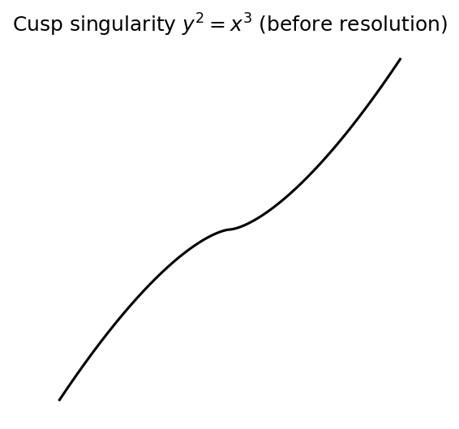  
  2. 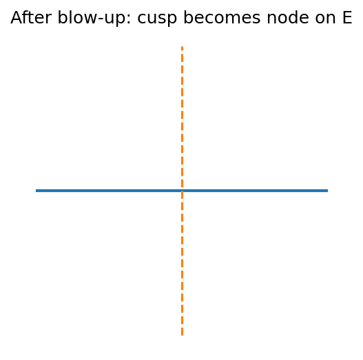  
  3. 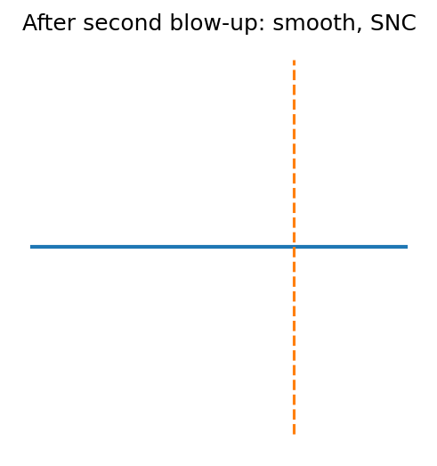  

- **ADE特異点のデュアルグラフ**  
  - 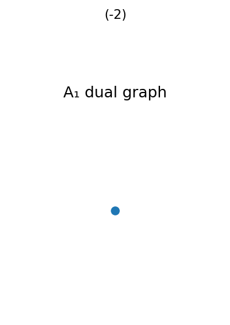（\((-2)\) 1本）  
  - 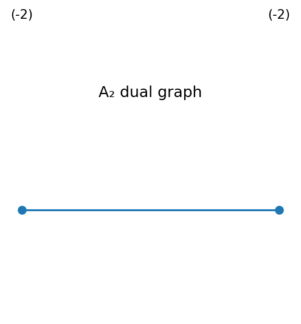（\((-2)\)-\((-2)\)）  
  - 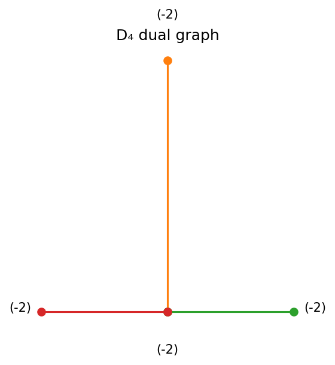（中心から3本の\((-2)\)が出る星型）  

- **Logペアの解消**  
  - 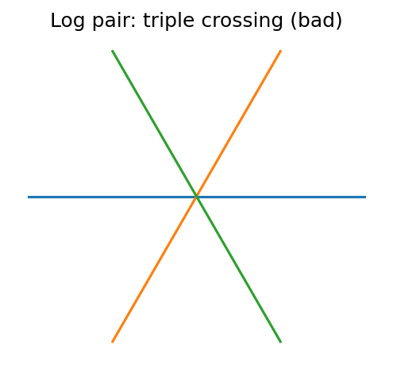  
  - 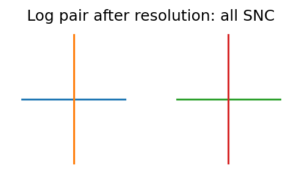  

この流れを繋げると、  
1. 局所方程式や曲線を理解  
2. ブローアップで特異点や悪い交差を除去  
3. 例外曲線の交点関係をデュアルグラフで整理  
4. 必要なら(-1)-曲線を縮約して最小モデル化  
というのが、曲面やlogペアの解消の全体像です。  

次は、これらを**一枚の「特異点解消フローチャート」**にまとめることもできます。そうすると、Hironaka～De Jong～log解消までの全体像が見える地図になります。
User
ぜひ！

ChatGPT

<!--
# Let's make a single flowchart-like diagram summarizing the resolution process:
# Steps:
# 1) Start with variety/pair with singularities/bad crossings
# 2) Choose center for blow-up
# 3) Blow-up, replace center with exceptional divisor
# 4) Repeat until smooth / SNC
# 5) Dual graph analysis
# 6) Contract (-1)-curves if needed (minimal model)

fig_flow = plt.figure(figsize=(8,6))
ax = plt.gca()
ax.axis('off')

# We'll use text boxes with arrows connecting them
from matplotlib.patches import FancyArrowPatch, Rectangle

# Helper to add box
def add_box(ax, xy, text):
    box = Rectangle((xy[0]-1.2, xy[1]-0.3), 2.4, 0.6,
                    facecolor='white', edgecolor='black')
    ax.add_patch(box)
    ax.text(xy[0], xy[1], text, ha='center', va='center', fontsize=10)

# Helper to add arrow
def add_arrow(ax, start, end):
    arrow = FancyArrowPatch(start, end, arrowstyle='->', mutation_scale=10)
    ax.add_patch(arrow)

# Coordinates (x,y) for boxes
coords = {
    "start": (0, 4),
    "choose_center": (0, 3),
    "blowup": (0, 2),
    "check": (0, 1),
    "dual_graph": (-2.5, 0),
    "contract": (2.5, 0),
    "done": (0, -1)
}

# Texts
texts = {
    "start": "Start: Variety / Pair (X,D)\nwith singularities or bad crossings",
    "choose_center": "Choose center for blow-up\n(point, curve, divisor)",
    "blowup": "Blow-up: Replace center with exceptional divisor (E)",
    "check": "Check: Smooth? SNC? If not, repeat",
    "dual_graph": "Dual graph of exceptional curves:\nSelf-intersection, incidence",
    "contract": "Contract (-1)-curves (Castelnuovo)\n→ Minimal model",
    "done": "End: Smooth variety / SNC pair"
}

# Add boxes
for key in coords:
    add_box(ax, coords[key], texts[key])

# Add arrows for main vertical path
add_arrow(ax, (0, 3.7), (0, 3.3))
add_arrow(ax, (0, 2.7), (0, 2.3))
add_arrow(ax, (0, 1.7), (0, 1.3))

# From check to dual_graph and contract
add_arrow(ax, (0, 0.7), (-2.0, 0.3))
add_arrow(ax, (0, 0.7), (2.0, 0.3))

# From both branches to done
add_arrow(ax, (-2.5, -0.3), (-0.5, -0.7))
add_arrow(ax, (2.5, -0.3), (0.5, -0.7))

# Limits
ax.set_xlim(-4, 4)
ax.set_ylim(-2, 5)

path_flow = "/mnt/data/resolution_flowchart.png"
plt.savefig(path_flow, bbox_inches='tight', dpi=150)
plt.show()
path_flow
-->

こちらが特異点解消の**全体フローチャート**です👇  

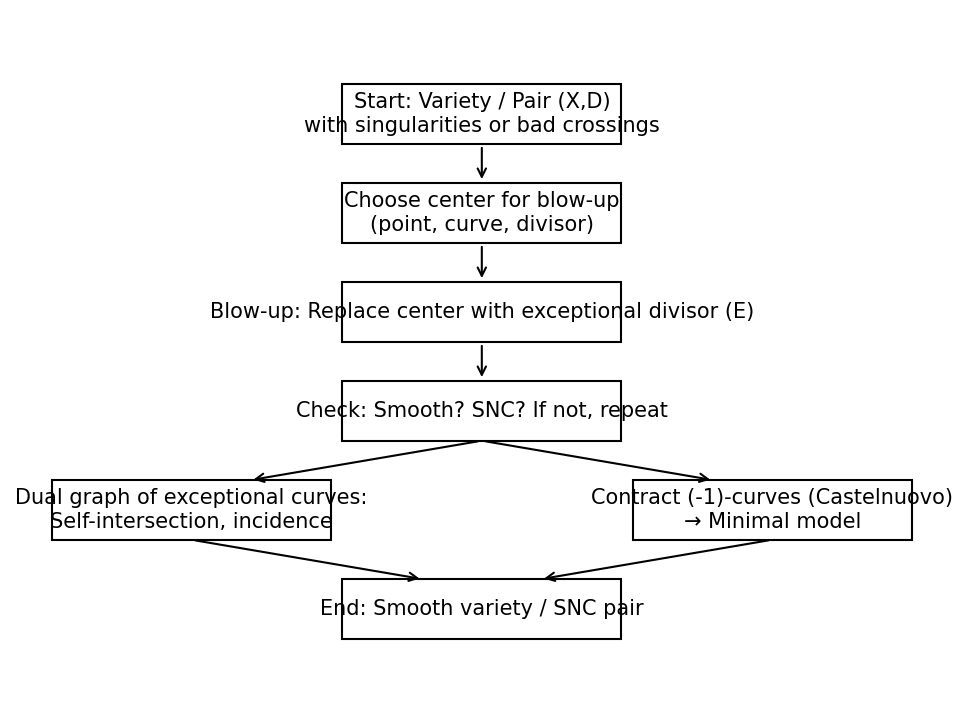  

- **左ルート**：例外曲線の交点関係をデュアルグラフで管理（ADE型などの解析に）  
- **右ルート**：(-1)-曲線を縮約して最小モデル化  
- **中央の繰り返し**：中心を選びブローアップ → 滑らか or SNC になるまで反復  

これで Hironaka のアイデアから log ペアの解消、最小モデルへの移行まで一望できます。
User
ok
ChatGPT
了解です。これで特異点解消の概念図や例、フローチャートまで揃いましたので、Hironaka・De Jong・log解消・例外曲線の扱いなどの全体像が、かなり視覚的に把握できるはずです。  

もし次に進めるとしたら、  
- 正標数の場合の障害例（例: Artin-Schreier型曲線など）を実際に式と解消過程で描く  
- 三次元やlogペアの高次元版のイメージを加える  
- 各ステップでの代数的意味（式の変形、因子の変化）を表形式にする  

といった拡張もできます。

---
---

# 

---
---

# 

---
---

# 

---
---

# 

---
---

# 

---
---

# 

---
---

# 

---
---

# 

---
---

# 

---
---

# 

---
---

# 

---
---

