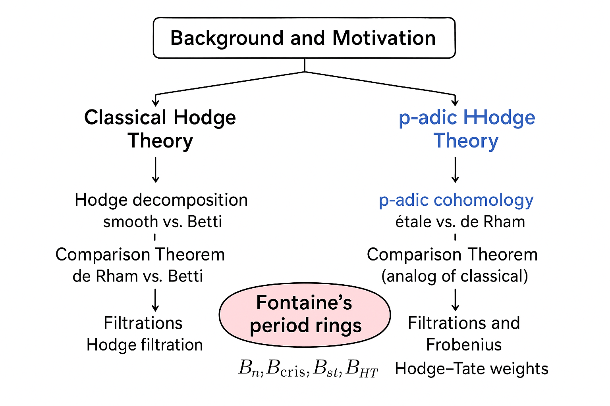

# p進Hodgeの目次
# 山下さんのpdfの話

---

# P進ホッジ理論について、関係する話題や基礎を網羅した目次を作ってほしい！！

では、p進ホッジ理論に関係する話題や、その理解のための基礎を、入門レベルから専門的トピックまで階層的に網羅した「究極の目次」を作ります。

構成は以下の5段階で整理します：

1. **背景・動機**（なぜこの理論が必要か）
2. **基礎的準備**（p進解析・代数幾何・ガロア表現）
3. **理論の枠組み**（古典ホッジ理論との比較とp進版の基礎）
4. **p進ホッジ理論の主要定理と技法**
5. **発展的トピックと関連分野**

---

## **📜 p進ホッジ理論・完全目次**

### **I. 背景と動機**

1. **数論幾何学とホッジ理論**

   * 複素ホッジ理論（de Rhamコホモロジー・ベッチコホモロジー）
   * 比較定理（複素多様体の場合）
2. **p進解析的世界の必要性**

   * p進体上の多様体
   * p進ガロア表現とその分類問題
3. **p進ホッジ理論の目的**

   * p進体上での「de Rham型」「étale型」コホモロジーの橋渡し
   * 数論的ガロア表現の幾何的起源の特徴づけ

---

### **II. 基礎的準備**

#### 1. p進解析とp進幾何

* p進数体 $\mathbb{Q}_p$ と完備化 $\mathbb{C}_p$
* p進絶対値と完備化の性質
* p進解析関数・剛性解析空間（Tate解析空間）
* Berkovich空間の概要

#### 2. p進ガロア表現の基礎

* 局所体 $K$ のガロア群 $G_K$
* p進表現・連続表現
* 惰性群・分岐群の構造
* 有限次拡大・不分岐拡大・分岐理論

#### 3. コホモロジー理論の準備

* エタールコホモロジーの定義
* de Rhamコホモロジー
* crystallineコホモロジー（結晶コホモロジー）
* rigidコホモロジーの概観

---

### **III. 古典ホッジ理論との比較**

1. **複素ホッジ理論**

   * Hodge分解 $H^n(X, \mathbb{C}) \cong \bigoplus_{p+q=n} H^{p,q}(X)$
   * de Rham–Betti比較定理
   * Hodgeフィルトレーション
2. **p進世界でのアナロジー**

   * 複素ベッチコホモロジー → p進エタールコホモロジー
   * de Rhamコホモロジー（代数的定義）との比較
   * フィルトレーションとFrobenius構造の対応

---

### **IV. p進ホッジ理論の主要定理**

#### 1. Fontaineのp進比較理論の枠組み

* 期間環（period ring）の定義と性質

  * $B_{\mathrm{dR}}$, $B_{\mathrm{cris}}$, $B_{\mathrm{st}}$, $B_{\mathrm{HT}}$
* p進ガロア表現の分類

  * Hodge–Tate表現
  * de Rham表現
  * クリスタル表現
  * 半安定表現
* 比較同型

  * $H^i_{\mathrm{\acute{e}t}}(X_{\overline{K}}, \mathbb{Q}_p) \otimes B_{\mathrm{dR}} \cong H^i_{\mathrm{dR}}(X/K) \otimes_K B_{\mathrm{dR}}$

#### 2. Hodge–Tate理論

* Hodge–Tate分解
* Sen理論とHodge–Tate重み
* 有理多様体における計算例

#### 3. de Rham表現の理論

* フィルトレーション構造
* Griffiths横断性のp進版

#### 4. クリスタル表現と半安定表現

* Frobenius構造と単純ポールモノドロミー
* $(\varphi, N)$-モジュール

---

### **V. 証明技法と関連理論**

1. **Sen理論**

   * Sen作用素とHodge–Tate重みの抽出
2. **$(\varphi, \Gamma)$-モジュール理論**

   * ロバート・コールマン、Cherbonnier–Colmez の定理
3. **p進微分方程式との対応**

   * Dwork理論
   * Kedlayaのスロープ理論
4. **結晶コホモロジーとの比較**

   * Berthelotのrigid cohomology
   * Hyodo–Kato理論

---

### **VI. 発展的トピック**

1. **完備化体の拡張と完備化の高度構造**

   * Perfectoid空間とScholzeのp進ホッジ理論
   * Hodge–Tate層の幾何化
2. **相対p進ホッジ理論**

   * 非射影・相対的状況への拡張
3. **Prismatic cohomology**

   * Bhatt–Scholzeによる統一的p進比較理論
4. **p進Simpson対応**

   * 非アーベルp進Hodge理論
5. **特殊多様体における応用**

   * 楕円曲線・アーベル多様体
   * Shimura多様体
6. **L関数とp進ホッジ理論**

   * 特殊値の解釈とp進期間

---

これをベースにすれば、p進ホッジ理論の全体像を背景から最先端まで一気に見通せるようになります。
もし希望があれば、この目次に沿って**体系的な講義ノート風まとめ**を順番に作ることもできます。

---
---

はい、今の目次はかなり広くカバーしていますが、**研究者レベルでの完全版**を目指すなら、次のような項目を追加するとより充実します。
補足分は、基礎強化・技術面・応用面の3方向で足します。

---

## **追加項目（完全版拡張）**

### **A. 基礎理論の補強**

1. **p進体のモデル理論**

   * p進閉体の理論（Macintyreの定理）
   * 一階論理とdefinable setの扱い
   * 応用：definable cohomology
2. **代数群とp進ガロア表現**

   * Tannakian形式
   * p進ガロア表現のモチーフ的起源
3. **より一般的なp進幾何**

   * adic空間（Huber）
   * formal schemeとの関係

---

### **B. 技術的ツールの追加**

1. **フィルトレーションとファイバー関手**

   * Harder–Narasimhan理論とp進フィルトレーション
   * slope decomposition
2. **p進モジュラー形式とeigenvariety**

   * Coleman理論
   * eigenvarietyのガロア表現との対応
3. **p進差分・微分作用素**

   * Monsky–Washnitzer cohomology
   * p進微分作用素環（D-module的アナロジー）

---

### **C. 応用・リンク先の理論**

1. **Iwasawa理論との接続**

   * p進L関数とSelmer群
   * Hodge–Tate表現のIwasawa理論的側面
2. **p進Langlands対応**

   * $\mathrm{GL}_2(\mathbb{Q}_p)$ の場合
   * Breuil–Mézard予想との関係
3. **Motivicな視点**

   * 代数的モチーフとp進ホッジ理論
   * Voevodskyモチーフとの比較

---

### **D. 最先端の発展**

1. **Diamondsとv-site**

   * Scholzeのv-topology
   * perfectoid空間の圏論的拡張
2. **相対Prismatic cohomology**

   * prismatic siteとHodge–Tate層
   * crystalline・de Rham・étaleの完全統合
3. **非アーベルp進ホッジ理論の進展**

   * p進Riemann–Hilbert対応
   * p進非可換Hodgeフィルトレーション

---

もしこれを反映すると、p進ホッジ理論は**背景→基礎→比較定理→主要構造→発展→最先端**の6〜7段階に完全に分かれ、論文レベルの探索にも耐えられる目次になります。

---

これ、今の形を**完全ロードマップ**として整えて、
「基礎 → 中核 → 発展 → 応用 → 最先端」
の階層図にしたら、学習や研究の道筋が一目でわかるものになりますが、やりますか？
これは本当に"全景マップ"になります。

---
---

では、完全ロードマップ＋哲学・イメージまで盛り込んだ
**「p進ホッジ理論の全景マップ」** を作ります。

---

## **I. ロードマップ（階層構造）**

```
背景と動機
│
├─ 基礎準備
│   ├─ p進解析・p進幾何（剛性解析空間・adic空間・Berkovich空間）
│   ├─ p進ガロア表現（局所体・惰性群・分岐理論）
│   ├─ コホモロジー理論（étale, de Rham, crystalline, rigid）
│
├─ 古典ホッジ理論との比較
│   ├─ 複素Hodge分解とフィルトレーション
│   ├─ 比較定理（複素 vs p進）
│
├─ p進ホッジ理論の中核
│   ├─ Fontaineの期間環（B_dR, B_cris, B_st, B_HT）
│   ├─ ガロア表現の分類（Hodge–Tate, de Rham, crystalline, semistable）
│   ├─ 比較同型定理
│
├─ 技法と構造
│   ├─ Sen理論・Hodge–Tate重み
│   ├─ (φ, Γ)-モジュール
│   ├─ Kedlayaスロープ理論
│   ├─ Hyodo–Kato理論
│
├─ 応用と関連
│   ├─ Iwasawa理論
│   ├─ p進Langlands対応
│   ├─ p進モジュラー形式・eigenvariety
│   ├─ Motivesとp進ホッジ理論
│
└─ 最先端
    ├─ Perfectoid空間・Diamonds
    ├─ Prismatic cohomology
    ├─ 非アーベルp進Hodge理論
    └─ p進Riemann–Hilbert対応
```

---

## **II. 哲学的背景とイメージ**

### **1. 「複素世界」と「p進世界」の二つの鏡**

* 複素多様体では、**連続的・幾何的なベッチコホモロジー**と**代数的・微分的なde Rhamコホモロジー**が比較されます。
* p進世界では、**エタールコホモロジー**（離散的だがガロア的）と**de Rhamコホモロジー**（p進解析的）が橋渡しされます。
* 哲学的には、p進ホッジ理論は「異なる言語で書かれた同じ物語」を翻訳する翻訳機。

> 🖋 **イメージ**：
> 複素世界＝滑らかな湖面の反射
> p進世界＝粒子の集まりが見せる反射像
> 両方を比較することで、形そのものの本質に近づく。

---

### **2. Fontaineの期間環の哲学**

* $B_{\mathrm{dR}}$ や $B_{\mathrm{cris}}$ は、両世界をつなぐ「普遍的言語」。
* 期間環は、数論幾何の「翻訳用の宇宙」そのもの。
* 数の情報（ガロア表現）を、「微分可能な幾何」の形に変換できる。

> 🖋 **イメージ**：
> 各期間環は、特定の方言を話す辞書のようなもので、
> 「crystalline方言」「Hodge–Tate方言」などがある。

---

### **3. Hodge–Tate重みと次元の直感**

* Hodge–Tate重みは、p進世界における「多様体の斜面の傾き」。
* 複素世界の(p,q)-型分解に対応するが、連続的な座標ではなく整数の重みとして現れる。

> 🖋 **イメージ**：
> 各重みは「多様体の音階」のようなもので、
> ガロア表現はその楽譜。

---

### **4. Prismatic cohomologyの哲学**

* Bhatt–Scholzeの理論は、複素・p進・混標数の世界を統一的に扱える枠組み。
* 哲学的には「全ての時空に通用する物理法則」に近い。

> 🖋 **イメージ**：
> 一つのプリズム（位相）を通すと、複素の色もp進の色も一度に見える。

---

### **5. 全体像の哲学**

* 複素幾何とp進幾何は、違うレンズで見た同じ構造。
* p進ホッジ理論は「数論幾何の量子場理論」のような位置づけで、異なる位相的宇宙の間で情報を変換する。

---

もし希望があれば、この全景マップを**図解**して、

* 左側に「複素側」
* 右側に「p進側」
* 中央に「期間環」
  を置いた「双方向比較チャート」を作れます。
  哲学と技術が一目で対応するビジュアルになります。


---
---



---
---

# 山下さんのpdf

この論文は、山下剛による
**「開多様体の p 進 étale コホモロジーと crystalline コホモロジー」**
の講演記録で、p 進ホッジ理論の主要定理を「開」や「非滑らか」な場合に拡張する成果をまとめています。

---

## 1. 背景と目的

* **p 進ホッジ理論**は、複素ホッジ理論の p 進類似として、

  * トポロジー的コホモロジー（étale）
  * 解析的コホモロジー（de Rham, (log-)crystalline）
    の間の比較同型を与える理論。
* 主な定理（閉滑らかな場合）：

  1. **CHT**（Hodge–Tate 分解）
  2. **CdR**（de Rham 比較定理）
  3. **Ccrys**（良い縮約の場合の crystalline 比較定理）
  4. **Cst**（半安定縮約の場合の log-crystalline 比較定理）
  5. **Cpst**（潜在的半安定表現性）
* 本研究の目的：
  これらを **開多様体**や**非滑らかな場合**に拡張する。

---

## 2. 基本構造と道具

* Fontaine の p 進期間環：
  $B_{\mathrm{dR}}, B_{\mathrm{crys}}, B_{\mathrm{st}}$
  （ガロア作用、フィルトレーション、Frobenius、モノドロミー演算子を持つ）
* 比較定理は、これらの期間環を使って、étale コホモロジーと de Rham / (log-)crystalline コホモロジーを結ぶ。

---

## 3. 「開」バージョンでの設定

* **「open」**＝**「適当なコンパクト化 − 正規交差因子」**
* 部分的に適切な台を持つコホモロジー（部分台サポート）を導入：

  * $H^m_1$, $H^m_2$（正規交差因子 $D = D_1 \cup D_2$ の片方のみを台に取る）
* 開多様体上の対応（correspondence）を扱うには、部分台サポート版比較定理が必要。

---

## 4. 主結果

### (1) 開版半安定比較定理（open Cst）

* **定理 3.2**：
  $X$ が OK 上の適当な半安定モデル、$D = D_1 \cup D_2$ が水平方向の正規交差因子。
  各 $i=1,2$ に対し

  $$
  B_{\mathrm{st}} \otimes_{\mathbb{Q}_p} H^m_{\mathrm{\acute{e}t},i}((X\setminus D)_K,\mathbb{Q}_p)
  \;\cong\;
  B_{\mathrm{st}} \otimes_{K_0} H^m_{\mathrm{log-crys},i}(Y \setminus C)
  $$

  が、ガロア作用、Frobenius、モノドロミー、フィルトレーションと整合的に成り立つ。

### (2) 開版 crystalline 比較（open Ccrys）

* **定理 3.3**：
  「open」Cst から直ちに従う。

### (3) 開非滑らか版 de Rham 比較（open non-smooth CdR）

* **定理 3.4**：
  任意の有限型分離 K-多様体に対して、

  $$
  B_{\mathrm{dR}} \otimes_{\mathbb{Q}_p} H^m_{\mathrm{\acute{e}t}}(X_K,\mathbb{Q}_p)
  \;\cong\;
  B_{\mathrm{dR}} \otimes_K H^m_{\mathrm{dR}}(X_K/K)
  $$

  が成立。

### (4) 開版 de Rham 比較（open CdR）

* **定理 3.5**：
  正規交差因子を持つ開滑らかな場合に、部分台サポートコホモロジー版の比較同型を構成。

### (5) 開非滑らか版 Hodge–Tate 分解（open non-smooth CHT）

* **定理 3.6**：
  非滑らかの場合も Hodge–Tate 型の形式的分解を与える。

### (6) 開版 Hodge–Tate 分解（open CHT）

* **定理 3.7**：
  開滑らかな場合に、微分形式のコホモロジーと直接対応する分解を与える。

### (7) 開非滑らか版潜在的半安定性（open non-smooth Cpst）

* **定理 3.8**：
  任意の有限型分離 K-多様体の p 進 étale コホモロジーは潜在的半安定表現。

---

## 5. 証明の戦略

* Fontaine–Messing–Kato–Tsuji 法を基礎に、**syntomic コホモロジー**を仲立ちに使う。
* 開の場合の困難：積構造（product structure）の保持。
* **bettari-log スキーム**（全体に log 構造をまぶす）を導入し、有限次元化した修正版 crystalline 層を構築。
* étale, log-crystalline, syntomic コホモロジー間のスペクトル系列を用いて証明。

---

このまとめを図式化すれば、「閉 → 開」「滑らか → 非滑らか」への拡張マップと、
各比較定理の論理的依存関係（Cst ⇒ CdR ⇒ CHT 等）が一目で見える構造になります。

---
---

# 詳しく

では、まず**第1回**として、この山下論文の内容を
**「背景・古典的結果→p進版主要定理→道具立て→論理構造」**の順で詳しくまとめます。
次回で**「開・非滑らかへの拡張と主結果」**を整理し、最後に**証明戦略・技術的工夫**をまとめます。

---

## 第1回　背景と基礎部分

### 1. 背景

* 論文は2002年10月の北海道大学のシンポジウム *Hodge Theory and Algebraic Geometry* での講演記録。
* テーマは
  **「p進ホッジ理論の主要定理を開多様体や非滑らかな場合に拡張する」**
  特に Fontaine–Messing–Kato–Tsuji の方法を用いる。
* p進ホッジ理論は「複素ホッジ理論のp進類似」と呼ばれるが、実際にはC上のホッジ理論とは論理的関係はなく、別理論。

  * 共通点：トポロジー的コホモロジーと解析的コホモロジーを比較する。
  * 相違点：C上は singular ↔ de Rham、p進は étale ↔ de Rham / (log-)crystalline。

---

### 2. 古典的ホッジ分解とp進版

* **複素版**（Kodaira–Hodge 分解）：

  $$
  \mathbb{C} \otimes_{\mathbb{Q}} H^m_{\mathrm{sing}}(X,\mathbb{Q})
  \cong
  \bigoplus_{i=0}^m H^{m-i}(X,\Omega^i_{X/\mathbb{C}})
  $$

  （コンパクトKähler多様体）

* **p進版（Hodge–Tate分解）**：
  $X/K$ 適当な滑らかな射影多様体に対し

  $$
  \mathbb{C}_p \otimes_{\mathbb{Q}_p} H^m_{\mathrm{\acute{e}t}}(X_{\bar{K}},\mathbb{Q}_p)
  \cong
  \bigoplus_{i=0}^m \mathbb{C}_p(-i) \otimes_K H^{m-i}(X,\Omega^i_{X/K})
  $$

  ガロア作用と整合的。

---

### 3. p進ホッジ理論で比較する対象

#### C上のホッジ理論

* **Betti（singular）cohomology**：Q-構造あり
* **de Rham cohomology**：C-構造、ホッジフィルトレーション付き

#### p進版

* **étale cohomology**：Qp-構造＋ガロア作用
* **(algebraic) de Rham cohomology**：K-構造＋ホッジフィルトレーション
* **(log-)crystalline cohomology**：K0-構造＋Frobenius（＋モノドロミー）

これらを**Fontaine の期間環**を通して比較する。

---

### 4. Fontaine の期間環と性質

* $B_{\mathrm{dR}}$：完全離散付値体、フィルトレーションあり、grが $\mathbb{C}_p(i)$。
* $B_{\mathrm{crys}}$：K0-代数、Frobenius作用、$B_{\mathrm{crys}}^{\varphi=1} = \mathbb{Q}_p$。
* $B_{\mathrm{st}}$：Bcrysを含み、モノドロミー演算子 $N$ を持つ。

---

### 5. 主要5定理（閉滑らかな場合）

1. **CHT（Hodge–Tate）**
   étaleコホモロジーにHodge–Tate分解あり。
2. **CdR（de Rham比較）**
   $B_{\mathrm{dR}}$ を介して étale と de Rham を比較。
3. **Ccrys（crystalline比較）**
   良い縮約の場合、$B_{\mathrm{crys}}$ で étale と crystalline を比較。
4. **Cst（semi-stable比較）**
   半安定縮約の場合、$B_{\mathrm{st}}$ で étale と log-crystalline を比較。
5. **Cpst（potentially semi-stable性）**
   étaleコホモロジーは潜在的半安定表現。

---

### 6. 論理依存関係

* $\mathrm{Cst} \Rightarrow \mathrm{Ccrys}$（N=0部分を取る）
* $\mathrm{Cst} \Rightarrow \mathrm{CdR} \Rightarrow \mathrm{CHT}$
* $\mathrm{Cst} \Rightarrow \mathrm{Cpst}$（de Jongのalteration＋simplicial）

つまり、**Cstが最も深い定理**。

---

次回は、この**閉滑らかな結果**をどのように**開多様体**や**非滑らかな場合**に拡張するかを詳細にまとめます。
特に「部分台サポートコホモロジー」や「open Cst定理」などの新概念を解説します。

---
---

# 

---
---

# 

---
---

# 

---
---

# 

---
---

# 

---
---

# 

---
---

# 

---
---

# 

---
---

# 

---
---

# 

---
---

# 

---
---

# 

---
---

# 

---
---

# 

---
---

# 

---
---

# 

---
---

# 

---
---
