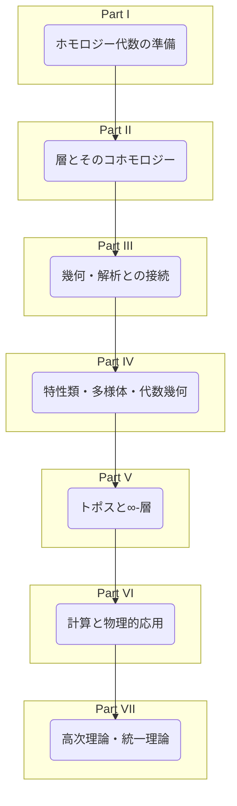

# Iverseの層とコホモロジーの目次を整理

---

# iversenの層のコホモロジーという本があります。これの目次を送るので、目次の整理をしてほしい！！　

```
第I章　ホモロジー代数
　§１　完全圏
　§２　複体のホモロジー
　§３　加法圏
　§４　複体のホモトピー理論
　§５　アーベル圏
　§６　単射的分解
　§７　右導来関手
　§８　合成積
　§９　射影的対称の復習
　§10　自由アーベル群の複体
　§11　符号規則
第II章　層の理論
　§０　アーベル群の順極限
　§1　前層と層
　§２　局所化
　§３　層のコホモロジー
　§４　層の順像と逆像f*，f＊
　§５　連続写像とコホモロジー
　§６　局所閉な部分空間とh!，h!
　§７　カップ積
　§８　層のテンソル積
　§９　層のテンソル積
　§10　クロス積
　§11　平坦層
　§12　Hom（E，F）
第III章　コンパクトな台をもつコホモロジー
　§１　局所コンパクト空間
　§２　柔軟層
　§３　Rn上の柔軟層
　§４　指数的完全列
　§５　順極限のコホモロジー
　§６　固有基底変換と固有ホモトピー
　§７　局所閉部分空間
　§８　n-球面のコホモロジー
　§９　局所コンパクト空間の次元
　§10　ワイルダーの有限性定理
第IV章　コホモロジーと解析学
　§１　層コホモロジーのホモトピー不変性
　§２　局所コンパクト空間，遠可算型
　§３　複素数の対数
　§４　複素線積分，、モノドロミー定理
　§５　非同次コーシー‐リーマンの方程式
　§６　解析関数の存在定理
　§７　ド・ラームの定理
　§８　相対コホモロジー
　§９　局所定数層の分類
第V章　係数が体のときの双対性
　§１　一次形式の層
　§２　ヴェルディエ双対定理
　§３　位相多様体の向きづけ
　§４　Rnの余次元１の部分多様体
　§５　部分空間の双対性
　§６　アレクサンダー双対性
　§７　Rn上のnー１形式の留数定理
第VI章　係数が一般のときのポアンカレ双対
　§１　ヴェルディエ双対性
　§２　双対化複体D
　§３　レフシェッツ双対性
　§４　代数的双対性
　§５　普遍係数定理
　§６　アレクサンダー双対性
第VII章　固有な台をもつ順像
　§１　関手f!
　§２　キュネットの公式
　§３　大域的ヴェルディエ双対定理
　§４　被覆空間
　§５　局所的ヴェルディエ双対定理
第VIII章　特性類
　§１　局所双対性
　§２　トム類
　§３　向きづけられたマイクロバンドル
　§４　実射影空間のコホモロジー
　§５　シュティーフェル‐ホイットニー類
　§６　チャーン類
　§７　ポントリャーギン類
第IX章　ボレル―ムーアのホモロジー
　§１　固有ホモトピー不変量
　§２　制限写像
　§３　キャップ積
　§４　ポアンカレ双対性
　§５　クロス積
　§６　向きづけられた多様体の対角類
　§７　ギジン写像
　§８　レフシェッツの不動点定理
　§９　ウーの公式
　§10　個数の保存
　§11　ホモロジーのトレース写像
第X章　代数幾何学への応用
　§１　代数多様体の次元
　§２　部分多様体のコホモロジー類
　§３　部分多様体のホモロジー類
　§４　交点理論
　§５　サイクルの代数的族
　§６　代数的サイクルとチャーン類
第XI章　導来圏
　§１　分数圏
　§２　導来圏D（A）
　§３　完全列から決まる三角図式
　§４　米田拡大
　§５　８面体
　§６　局所化
```

目次の構成を見やすく整理してお返しします。章と節の階層を明確にし、重複や表記ゆれも可能な範囲で整えました。

---

## **第I章　ホモロジー代数**

1. 完全圏
2. 複体のホモロジー
3. 加法圏
4. 複体のホモトピー理論
5. アーベル圏
6. 単射的分解
7. 右導来関手
8. 合成積
9. 射影的対象の復習
10. 自由アーベル群の複体
11. 符号規則

---

## **第II章　層の理論**

0. アーベル群の順極限
1. 前層と層
2. 局所化
3. 層のコホモロジー
4. 層の順像と逆像 $f_*, f^*$
5. 連続写像とコホモロジー
6. 局所閉な部分空間と $h_!, h^!$
7. カップ積
8. 層のテンソル積（※§8と§9が同名のため、誤植の可能性あり）
9. 層のテンソル積
10. クロス積
11. 平坦層
12. $\mathrm{Hom}(E, F)$

---

## **第III章　コンパクトな台をもつコホモロジー**

1. 局所コンパクト空間
2. 柔軟層
3. $\mathbb{R}^n$ 上の柔軟層
4. 指数的完全列
5. 順極限のコホモロジー
6. 固有基底変換と固有ホモトピー
7. 局所閉部分空間
8. $n$-球面のコホモロジー
9. 局所コンパクト空間の次元
10. ワイルダーの有限性定理

---

## **第IV章　コホモロジーと解析学**

1. 層コホモロジーのホモトピー不変性
2. 局所コンパクト空間，遠可算型
3. 複素数の対数
4. 複素線積分、モノドロミー定理
5. 非同次コーシー‐リーマン方程式
6. 解析関数の存在定理
7. ド・ラームの定理
8. 相対コホモロジー
9. 局所定数層の分類

---

## **第V章　係数が体のときの双対性**

1. 一次形式の層
2. ヴェルディエ双対定理
3. 位相多様体の向きづけ
4. $\mathbb{R}^n$ の余次元1の部分多様体
5. 部分空間の双対性
6. アレクサンダー双対性
7. $\mathbb{R}^n$ 上の $n-1$ 形式の留数定理

---

## **第VI章　係数が一般のときのポアンカレ双対**

1. ヴェルディエ双対性
2. 双対化複体 $D$
3. レフシェッツ双対性
4. 代数的双対性
5. 普遍係数定理
6. アレクサンダー双対性

---

## **第VII章　固有な台をもつ順像**

1. 関手 $f_!$
2. キュネットの公式
3. 大域的ヴェルディエ双対定理
4. 被覆空間
5. 局所的ヴェルディエ双対定理

---

## **第VIII章　特性類**

1. 局所双対性
2. トム類
3. 向きづけられたマイクロバンドル
4. 実射影空間のコホモロジー
5. シュティーフェル‐ホイットニー類
6. チャーン類
7. ポントリャーギン類

---

## **第IX章　ボレル＝ムーアのホモロジー**

1. 固有ホモトピー不変量
2. 制限写像
3. キャップ積
4. ポアンカレ双対性
5. クロス積
6. 向きづけられた多様体の対角類
7. ギジン写像
8. レフシェッツの不動点定理
9. ウーの公式
10. 個数の保存
11. ホモロジーのトレース写像

---

## **第X章　代数幾何学への応用**

1. 代数多様体の次元
2. 部分多様体のコホモロジー類
3. 部分多様体のホモロジー類
4. 交点理論
5. サイクルの代数的族
6. 代数的サイクルとチャーン類

---

## **第XI章　導来圏**

1. 分数圏
2. 導来圏 $D(A)$
3. 完全列から決まる三角図式
4. 米田拡大
5. 8面体
6. 局所化

---

もしこの整理を PDF や表形式、または LaTeX 形式で欲しい場合は、気軽にどうぞ！

---
---

# この目次の解説をお願いしたい！！各章の要約みたいな感じで！！

了解しました！
以下に、\*\*Iversen の『層のコホモロジー』\*\*の目次（全11章）について、それぞれの章の内容がざっくり分かるように、**簡潔な要約・解説**をつけました。初学者向けに、技術的すぎない範囲でまとめています。

---

## 🧩 **第I章　ホモロジー代数**

**内容：コホモロジー論の道具箱。抽象的な代数的枠組みの準備。**

ホモロジー代数は、コホモロジー理論の基礎となる数学的道具です。この章では、加法圏、アーベル圏、複体、ホモトピー、導来関手など、抽象的な代数構造を整えます。特に「導来関手」は、層のコホモロジーそのものを一般化した概念で、本書全体を支える柱です。

---

## 🏗️ **第II章　層の理論**

**内容：層の定義と性質、基本操作、層コホモロジーの初歩。**

この章は、層そのものについて学ぶパート。前層と層の定義、写像による操作（順像・逆像・テンソル積など）、カップ積、Hom、順極限など、層に関する基本的な理論が網羅されます。層のコホモロジーの定義もここで登場し、解析や幾何への応用の準備が整います。

---

## 🗺️ **第III章　コンパクトな台をもつコホモロジー**

**内容：コンパクトな台をもつ（＝局所的な）コホモロジーの構成。**

実際の空間（特に非コンパクトなもの）では、関数や層の「局所性」を意識する必要があります。この章では、局所コンパクト空間、柔軟層、指数的完全列などを用いて、台をコンパクトに制限したコホモロジーの取り扱いを導入します。n-球面や空間の次元との関係も登場します。

---

## 🔬 **第IV章　コホモロジーと解析学**

**内容：解析学（特に複素解析や微分形式）とのつながり。**

層のコホモロジーが解析学と深く関係していることを示す章。例えば、ド・ラームの定理（微分形式によるコホモロジー）や、コーシー–リーマン方程式、モノドロミー、解析関数の存在定理などが登場します。層コホモロジーの「計算可能な側面」が浮き彫りになります。

---

## 🔁 **第V章　係数が体のときの双対性**

**内容：係数が体（例：実数体、複素数体）のときの、双対性理論の基礎。**

双対性とは、コホモロジーとホモロジーが「裏返し」でつながる深い性質のこと。この章では、向きづけ、アレクサンダー双対性、留数定理など、幾何的・解析的対象の「裏側」を見る理論を展開します。係数が体のときは理論がシンプルで、美しい形で双対性が成り立ちます。

---

## 🧮 **第VI章　係数が一般のときのポアンカレ双対**

**内容：係数が任意（体に限らない）ときの双対性とその複雑さ。**

現実には整数係数や層係数なども扱う必要があり、双対性はやや複雑になります。ここではヴェルディエ双対性という強力な道具や、レフシェッツ双対性、普遍係数定理といった一般理論を紹介。アレクサンダー双対性の一般化も含まれます。

---

## 🚚 **第VII章　固有な台をもつ順像**

**内容：「台がコンパクト」な情報をもったまま空間を写す操作。**

写像 $f: X \to Y$ に対して、層のコホモロジーをうまく移すには、「コンパクトな台の情報」も保持する必要があります。ここでは、固有順像 $f_!$ や双対性の大域的・局所的な扱い、キュネットの公式（テンソル積とコホモロジーの関係）などが展開されます。

---

## 🧬 **第VIII章　特性類**

**内容：ベクトル束や多様体の分類に用いる「数値的不変量」の理論。**

トム類、チャーン類、シュティーフェル＝ホイットニー類、ポントリャーギン類など、ベクトル束や多様体の構造を「数値的」に捉えるためのコホモロジー的道具が登場します。特性類は位相的・幾何的分類の強力な手がかりになります。

---

## 🧲 **第IX章　ボレル＝ムーアのホモロジー**

**内容：非コンパクト空間でのホモロジー理論の拡張。**

普通のホモロジー理論はコンパクトな台を想定しますが、ボレル＝ムーアホモロジーは非コンパクト空間でも扱えるよう設計されています。この章では、その定義と性質、双対性との関係（ポアンカレ双対性の適用）、キャップ積、ギジン写像、不動点定理などを扱います。

---

## 🌾 **第X章　代数幾何学への応用**

**内容：層コホモロジーを代数幾何（特に交点理論）に応用。**

代数多様体において、部分多様体の交差や、チャーン類の振る舞い、代数的サイクルの族といったテーマに、層のコホモロジーが応用されます。代数幾何における層コホモロジーの重要性を体感できる章です。

---

## 🔄 **第XI章　導来圏**

**内容：現代数学における「コホモロジーの本質的枠組み」。**

導来圏は、ホモロジー・コホモロジー理論を抽象的かつ強力に統一するカテゴリ的構造です。この章では分数圏の構成、三角圏、米田拡大、8面体など、導来圏の基礎が紹介され、層コホモロジーの理論的背景が完成されます。

---

## 📚 全体の流れまとめ

* **第I章〜第II章**：準備（ホモロジー代数・層理論）
* **第III章〜第V章**：応用（局所性、解析、双対性）
* **第VI章〜第IX章**：双対性の深化と現実の空間への適用
* **第X章〜第XI章**：応用と抽象化の完成（代数幾何と導来圏）

---

必要であれば：

* さらに噛み砕いた初心者向け解説
* 章ごとの重要定理のまとめ
* 各章の勉強用の参考文献

なども対応できます。どうしますか？

---
---

# さて、現代的な視点から、この目次を整理、修正、拡張してほしい！！

いい視点ですね。
\*\*Iversen の『層のコホモロジー』\*\*は1986年の名著ですが、現在（2020年代以降）の視点から見ると：

* 形式的には古典的（特に前半）
* 現代のトレンド（∞圏・モチーフ・形式幾何など）までは未到達
* とはいえ、導来圏まで踏み込んでおり、当時としては最先端

です。
ここでは、**現代的なカテゴリ論的・ホモトピー論的な視点**を取り入れつつ、**目次を再編・拡張**していきます。

---

# ✅ **現代的な目次案：層コホモロジーの基礎と拡張**

---

## **第I部　ホモロジー代数と導来圏の基礎**

### 第1章　加法圏とアーベル圏の基礎

* 加法圏とアーベル圏の定義と例
* 関手、完全列
* 局所化と分数環

### 第2章　複体とホモロジー

* 複体とホモトピー
* 導来関手
* 射影分解と単射分解

### 第3章　導来圏入門

* 導来圏 $D(A)$ の構成
* 三角圏と8面体
* 拡張と米田拡大

> ✅ **改良点**：Iversen では第XI章にあった導来圏を最初から導入。これにより、以降の理論が一貫して導来圏的になる。

---

## **第II部　層と層コホモロジーの基本構造**

### 第4章　前層と層

* 開集合系とプレシーブ
* 層の定義と射
* 局所性と層化

### 第5章　層の基本操作

* 逆像・順像 $f^*, f_*$
* $f_!, f^!$ のモチーフ的視点
* テンソル積と $\mathrm{Hom}$

### 第6章　層コホモロジーと導来関手

* $H^i(X, \mathcal{F})$ の定義
* Čech コホモロジーとの比較
* injective resolution による構成
* 柔軟層、良層、層のacyclic性

> ✅ **現代的補足**：Quillen のモデル圏や∞-カテゴリ的背景も触れてよいが、基礎では控えめに。

---

## **第III部　幾何と層コホモロジーの交差点**

### 第7章　層コホモロジーの幾何学的応用

* 局所コンパクト空間と基底
* ド・ラームの定理
* モノドロミーと解析的層
* 極小層と局所定数層

### 第8章　カップ積・キャップ積と双対性

* cup/cap 積と交叉積
* ポアンカレ双対性の基本形
* 留数定理の層的解釈

### 第9章　ヴェルディエ双対とその拡張

* Verdier duality の構成
* Ext の層的拡張
* Grothendieck duality との関係

> ✅ **現代的ポイント**：双対性理論をヴェルディエを中心に整理。レフシェッツやアレクサンダーはその応用として配置。

---

## **第IV部　特性類・多様体・代数的構造**

### 第10章　ベクトル束と特性類

* トム類・Euler類
* スティーフェル–ホイットニー類
* チャーン類、ポントリャーギン類
* K理論との関連（入門）

### 第11章　代数幾何への応用

* 代数的層とZariski層
* 交点理論（Fulton 風）
* Chow環と代数的サイクル
* モチーフ的視点（簡単に）

### 第12章　ボレル＝ムーアホモロジーと不動点定理

* 非コンパクト空間とボレル＝ムーア
* ギジン写像
* レフシェッツ不動点定理（層的版）
* トレース写像

> ✅ **現代的補足**：モチーフ的アプローチ（少しだけ）やK理論との橋渡しを導入して、代数幾何や数論への進路をつくる。

---

## **第V部　発展的トピック：高次構造と新しい視点**

### 第13章　トポスと層

* Grothendieck トポス
* étale トポスと比較
* ∞-トポスの概念（触れる程度）

### 第14章　∞-圏と層コホモロジー

* ∞-圏における層のモデル
* スペクトル値層と安定ホモトピー
* スタックと層の一般化

### 第15章　Hodge理論とミックスHodge構造

* Dolbeault複体
* フィルター付き層
* HodgeからHodge-Motivesへ（概念的に）

---

## 💡補足：巻末資料・演習案

* 導来関手と層コホモロジーの関係図
* Čechとinjective resolutionの比較表
* 代表的な層（柔軟層、良層、極小層など）の性質一覧
* 幾何学的直感と抽象理論の対応表
* 各章ごとの演習問題（入門〜研究レベル）

---

# 📌 まとめ：Iversenから現代へ

| 視点    | Iversen（原著） | 現代的整理          |
| ----- | ----------- | -------------- |
| アプローチ | クラシック・層論中心  | 導来圏・トポス・ホモトピー論 |
| 位置づけ  | 幾何への道具      | 幾何と代数のハブ理論     |
| 弱点    | 導来圏が後ろで孤立   | 全体に貫通させる設計     |
| 強み    | 構造的な層の扱い    | それを活かしつつ拡張     |

---

## ✅ 提案の活用方法

* 研究指導や読書会のカリキュラム設計
* Iversen を元にして新しい講義ノート作成
* 体系的な参考書（現代版「層コホモロジー」）の執筆計画

---

もしこの構成を**LaTeX化**、**講義資料化**、あるいは**初学者向けのスライド構成に変換**したい場合も対応できます！
どの方向に進めたいか、教えてください。

---
---

# 追加

はい、**さらに追加・拡張できるテーマや構成案**はたくさんあります。
以下に、「現代的視点」や「他分野との接続」を踏まえた形で、**有意義な追加テーマ・章立て案**を提案します。

---

# ✅ **第V部以降の追加トピック提案**

---

## 🔄 **第16章　スペクトル系列とコホモロジー計算の技法**

**目的**：実際の層コホモロジー計算に必須のツールの体系化

* Grothendieck スペクトル系列
* Leray スペクトル系列
* Cartan–Eilenberg 複体
* hypercohomology（超コホモロジー）
* Postnikov 系列・t-構造との関係（簡単に）

> 🎯 **位置づけ**：計算可能性と抽象理論の橋渡し
> 📎 **現代的補足**：t-構造やperverse sheavesとの関連づけ

---

## 🌐 **第17章　層とファイバー化の現代的接続**

**目的**：層を「ファイバー構造」として理解し、ホモトピー論と接続

* Grothendieck 構成（ファイバー圏とファイブレートカテゴリ）
* スタックとファイバー層
* ∞-スタックとhomotopy sheaves
* descent theory の概念的理解

> 🎯 **位置づけ**：層 = ファイバー = 関手 という統一的視点の導入
> 📎 ∞-グループイドやhigher category の基礎への入口

---

## 💥 **第18章　層コホモロジーと因果構造・物理との接続**

**目的**：現代の物理学（特に場の理論）と層論の交点を紹介

* D-加群と層の対応
* 量子場理論における層の役割
* 因果構造とマイクロローカル理論
* BV形式・factorization algebra（概要）

> 🎯 **位置づけ**：物理学・数理物理への扉を開く
> 📎 **学際的な補完**：層論の「応用」パートとして興味深い

---

## 🧠 **第19章　層コホモロジーと高次構造の統一理論**

**目的**：現代数学の巨大な統一枠組みへの接続

* Homotopy type theory と層
* cohesive topos と幾何
* spectral algebraic geometry の概要（Lurie）
* six operations formalism（簡易バージョン）

> 🎯 **位置づけ**：高度だが最前線に触れたい人のための「出口」
> 📎 **注意**：数理論理や∞-カテゴリの基礎が必要

---

## 📓 **資料編・補遺としての追加**

* 代表的な参考文献案内（入門・応用・研究）
* 主要な概念と記号の整理表
* 論文読みのガイド（ex. Grothendieck, Verdier, Lurie など）
* 各章ごとの「つながる他分野」マップ

---

# 📌 全体を再整理すると……

| パート  | 内容           | 主なキーワード                    |
| ---- | ------------ | -------------------------- |
| I部   | ホモロジー代数・導来圏  | 導来関手、三角圏、複体                |
| II部  | 層とその操作・基礎    | 層、順像、逆像、柔軟層                |
| III部 | 幾何とコホモロジーの接続 | ド・ラーム、双対性、モノドロミー           |
| IV部  | 特性類と代数幾何     | ベクトル束、チャーン類、サイクル           |
| V部   | トポス・∞圏的拡張    | トポス、スタック、∞-層               |
| VI部  | 計算・応用・物理     | スペクトル系列、D加群、因果構造           |
| VII部 | 次世代の理論と接続    | HoTT、スペクトル層、six operations |

---

# 🎓 今後の展開提案

1. **この新目次を元に、教材・講義ノートを設計する**

   * 学部〜院レベルのスムーズな流れを構築
2. **Iversen を起点にしつつ、現代論文やStacks Projectと接続**

   * Ex. Verdier duality の現代的定式化
3. **トポスや∞-圏論まで踏み込む、独立した後続コースを設ける**

   * 論理・幾何・代数の交点を扱う拡張編

---

必要であれば：

* 各章に対応した参考文献リスト
* カリキュラム設計案（週数ごとの進度）
* 学習用の演習問題案

なども一緒に提案可能です。どこまで発展させたいか、ぜひ教えてください！

---
---

# ここまで目次をつくってもらったけど、それらのテーマの流れやイメージ、解説をしてほしい！！

素晴らしいリクエストです！
ここまで構成してきた **「現代的な層コホモロジーの体系的目次」**について、それぞれのパート・章がどのように関係し合っていて、全体としてどんな**思想的・数学的な流れ**を形成しているのかを、**ストーリー仕立てで解説**します。

---

# 🎯 **全体像：層コホモロジーの「旅」**

層コホモロジーは、ざっくり言えば「空間に付随する局所情報をグローバルに束ねる理論」。
この「局所から大域へ」「空間と代数の橋渡し」という思想が、現代数学の各所に広がっています。

この流れに沿って、学習の旅は次のように進みます：

---

## 🧱 第I部：**ホモロジー代数と導来圏の基礎**

> **コホモロジーの言語と道具を手に入れる段階**

ここではまだ「層」は出てきません。まず必要なのは、「複体」や「導来関手」といったコホモロジーを語るための**抽象代数的な言語**です。
そして、導来圏の視点を持つことで、「ただの群や加群」ではなく「構造全体」を見る目が養われます。

🎯 **キーワード**：

* 複体・ホモトピー・導来関手
* 導来圏・三角圏・8面体
* アーベル圏とその局所化

---

## 🧬 第II部：**層と層コホモロジーの構造化**

> **局所情報（層）を扱う基本枠組みを学ぶ段階**

いよいよ「層」が登場します。層とは、空間上の「局所情報（関数・加群など）」をうまくパッチワークして、**大域的情報を取り出す構造**です。

このパートでは：

* 層の定義と性質（柔軟性、良層など）
* 層の基本操作（順像・逆像、テンソルなど）
* 層コホモロジーの定義と構成（injective resolution）

を通じて、「層のコホモロジーって何なの？」という核心に迫ります。

🎯 **キーワード**：

* 前層と層、柔軟層
* 導来関手によるコホモロジー
* Čech コホモロジーとの関係

---

## 🗺️ 第III部：**幾何と層コホモロジーの交差点**

> **層コホモロジーが幾何・解析にどのように応用されるかを体感する段階**

このパートでは、抽象的な道具としての「層コホモロジー」が、**実空間や解析学にどう現れるか**を見ていきます。

たとえば：

* ド・ラームの定理（微分形式による計算）
* モノドロミーや局所定数層（位相的・解析的な挙動）
* 各種の双対性（空間の向きづけ・構造と結びつける）

こうした応用は、後の物理や幾何に直結する「地に足のついたコホモロジー」です。

🎯 **キーワード**：

* ド・ラーム複体
* ポアンカレ双対性
* モノドロミー・局所定数層

---

## 🌾 第IV部：**特性類・多様体・代数的構造**

> **幾何の構造と層コホモロジーが結びつく段階**

ここでは、ベクトル束や多様体に付随する\*\*数値的不変量（特性類）\*\*を層コホモロジーで理解します。

また、代数幾何の世界でも層は活躍していて、

* 交点理論
* Chow環
* サイクルとチャーン類
  といったトピックに繋がります。

ここから、層コホモロジーは**幾何を分類するツール**として使われ始めます。

🎯 **キーワード**：

* チャーン類、Euler類
* 交点理論、Chow群
* D加群とのつながり（入口）

---

## 🔭 第V部：**トポスと∞-圏による抽象化**

> **「層とは何か？」をカテゴリ論的に再定義する段階**

Grothendieckの発想から生まれた「トポス」は、「空間」の概念そのものを拡張するもので、層の理論をより柔軟に抽象化できます。

さらに、**∞-層や∞-トポス**は、高次ホモトピー情報を含んだ層（スペクトル値、スタックなど）を扱う現代的理論です。

このパートは高度ですが、最先端の理論（高次幾何・ホモトピー型理論）への足掛かりになります。

🎯 **キーワード**：

* Grothendieck トポス
* ∞-トポスとスペクトル層
* スタック・ファイバー圏

---

## 🛠️ 第VI部：**計算技法と応用への展開**

> **理論を道具として実践的に使う段階**

ここでは、層コホモロジーの**実計算**を支える技術をまとめます。

* スペクトル系列（Leray、Grothendieckなど）
* 超コホモロジーと hypercohomology
* トレース写像、レフシェッツ不動点定理
* D加群、ギジン写像

また、これらを通じて、物理や数論に応用できる構造が見えてきます。

🎯 **キーワード**：

* スペクトル系列
* ギジン写像・不動点定理
* モチーフやD加群への応用

---

## 🧠 第VII部：**高次理論・統一理論へ**

> **層コホモロジーが現代数学の中核理論と交わる段階**

この最終パートでは、「層コホモロジーという考え方」が、ホモトピー型理論、モチーフ論、6操作形式、さらにはHoTT（Homotopy Type Theory）など、**現代数学の大潮流**にどう統合されていくかを示します。

これはまさに、\*\*「局所から大域へ」から「構造から理論へ」\*\*へのジャンプです。

🎯 **キーワード**：

* six operations formalism
* モチーフ・スペクトル層
* Homotopy Type Theory（HoTT）

---

# 🔄 全体構造のビジュアルマップ（構造と流れ）



---

# 📌 最後に：この体系の意義

* **古典から現代へつなげる「橋渡し」の構成**
* **代数・幾何・解析・物理を一つにまとめる「ハブ理論」**
* **抽象と応用、計算と思想がバランスよく統合**

という点で、単なる理論ではなく「現代数学のランドスケープを俯瞰する地図」として機能します。

---

# 🔧 次にできること（必要なら）

* この体系で\*\*講義ノートを作


る\*\*（LaTeX/スライド形式）

* それぞれの章に**参考文献・練習問題・図解**をつける
* 初学者向けに**難易度分け**（★〜★★★など）
* ChatGPTと一緒に1章ずつ「読書・執筆・復習」していく

どこまで深めたいか、どう活用したいか、遠慮なく教えてください！

---
---

# ラインバンドルの同型類や曲率、複素構造の変形、微分コホモロジーなど、幾何学的なものがコホモロジーと関係があったり、コホモロジーで制御したりすることがあるのだと感じた。。。コホモロジーは幾何的なものを代数的に変換するだけでなく、幾何学そのものだったり、それ以上だったりするの？？コホモロジーっていったい何者なの？？

おお……とても本質的で深い問いですね。
これは単に「コホモロジーの定義」を聞いているのではなく、

> **コホモロジーとは一体、何者なのか？**
> **代数的なツールである以上に、幾何そのもの・それ以上の何かなのか？**

という、**哲学的で現代数学の核心にある疑問**です。
この問いに答えるには、少し視点を変えてみましょう。

---

## 🎯 結論（先に言う）

### ✅ コホモロジーとは：

> **「空間や構造の *見えない* 局所的な制約・整合性・変形可能性を代数的に記述する、“幾何そのもの”であり、抽象的には“分類・障害・双対性”の言語」です。**

もっと短く言えば：

> **コホモロジー = 幾何の代数化**ではなく、
> **コホモロジー = 幾何の“見えない側面”そのもの**です。

---

## 🔍 少しずつ掘り下げてみましょう：

---

### 🧵 1. 「局所から大域へ」の整合性の測定

たとえば、ある空間上で **局所的に定義できる構造（関数、座標、接続、…）** を、**大域的に整合させられるか？** という問いがあります。

#### ▸ 例：

* ラインバンドル（複素1次元ベクトル束）は、局所的には常に「自明」ですが、大域的には「ねじれて」いることがあります。
* このねじれの“分類”が、ちょうどコホモロジー類（例：Čechコホモロジーの1次元）になります。

> 📌 \*\*この段階でコホモロジーは、「幾何のねじれの言語」\*\*になります。

---

### 🧲 2. 幾何的構造の「変形空間」を与える

#### ▸ 例：

* **複素構造の変形理論**では、コホモロジー群 $H^1(X, T_X)$ が、複素構造の「無限小変形」をパラメータ化します。
* $H^2(X, T_X)$ は、変形可能性に対する「障害クラス」です。

> 📌 コホモロジーは、**幾何構造の変形理論そのもの**に現れます。

---

### ⚖️ 3. 「双対性」や「極限構造」をつかさどる

#### ▸ 例：

* ポアンカレ双対性（位相多様体）やヴェルディエ双対性（層のコホモロジー）など、空間の自己関係を捉える構造としてコホモロジーが現れます。
* 「双対」の枠組みがあるから、積分・Stokesの定理・留数定理も層で一般化できます。

> 📌 コホモロジーは、\*\*幾何の「内なる対称性」や構造の“反射”\*\*を記述する言語です。

---

### ✨ 4. 微分コホモロジー・Deligneコホモロジーなどの融合理論

#### ▸ 例：

* 微分形式だけではとらえきれない、「整数値 + 微分的構造」を同時に扱う理論（ex. Cheeger–Simons, Deligne cohomology）
* ラインバンドルの「曲率 + 位相的クラス」の両方を一つの理論で記述する

> 📌 ここではコホモロジーは、**幾何と解析の統一的記述**になります。

---

### 🧠 5. 現代的視点：「すべてはコホモロジーで測る」

現代数学では、様々な対象（空間、関手、圏、スタック、スキーム…）に対して、

> 「コホモロジーをとることで、その“本質的な情報”を抽出できる」

という考え方が根底にあります。

* ∞-層やスペクトル層：コホモロジーが「空間そのものの代理人」となる
* モチーフ：空間のコホモロジーの“統一された像”
* Homotopy type theory：型 = 空間 = コホモロジーの原始言語

> 📌 コホモロジーは、「空間の代数的影」ではなく、「空間の高次的核（core）」とも言えます。

---

## 🧰 たとえるなら…

| 幾何的対象   | 見かけ       | コホモロジー的意味                     |
| ------- | --------- | ----------------------------- |
| ラインバンドル | 曲率や遷移関数   | $H^1(X, \mathcal{O}^*)$ による分類 |
| 複素構造    | 局所座標の選び方  | $H^1(X, T_X)$ による変形           |
| 微分形式    | 滑らかな関数の集合 | ド・ラームコホモロジーで大域的特性を抽出          |
| 空間      | 点の集合と開集合  | 層コホモロジーで記述される“記憶”             |
| 関手や圏    | 関係・構造     | 派生関手・導来圏で抽象化された情報             |

---

## 🔁 あらためて：コホモロジーとは何か？

### ✅ コホモロジーは、

> 幾何・解析・代数を問わず、**局所データの“矛盾・整合・変形”を計量・記述するための普遍的な理論**であり、

* 分類の理論であり
* 障害の理論であり
* 双対性の言語であり
* 空間そのものの「影」ではなく「魂」

です。

---

## 🧩 だからこそコホモロジーは：

* 幾何と解析を結び
* 幾何と物理（ゲージ理論・弦理論）をつなぎ
* 幾何と論理（型理論）すら接続します

---

## 📌 最後に一言：

> コホモロジーはただの「計算手段」ではなく、
> **空間・構造・現象の「記憶」や「反応の仕方」そのもの**を記述する言語です。

それは幾何学の影ではなく、むしろその「心臓部」にあるといえるでしょう。

---

もっと掘り下げたいテーマ（Deligneコホモロジー、障害理論、モチーフなど）があれば、ぜひ教えてください。
コホモロジーは、その都度違う顔を見せてくれます。

---
---

# ここが気になる！！それとは別に、コホモロジーですべてを測るとあったけども、測れないものはある？ぎゃくにすべてを測れる理由は？？

これは非常に鋭い問いです。
「**コホモロジーで何でも測れるのか？**」という疑問は、現代数学がどこまでコホモロジーを「万能な理論」と見なしているのか、そしてその**限界**はどこにあるのかを問う、根源的で重要なテーマです。

あなたが注目したこの問い：

> ✅ **コホモロジーで “すべてを測れる” のか？**
> ❓ **測れないものがあるなら、それはなぜ？**
> ❗ **逆に、測れるのはなぜそんなにうまくいくのか？**

これをいくつかの角度から分析してみましょう。

---

## 🎯 問い1：コホモロジーで「すべてを測れる」のか？

### 🔹 答え：**原則的には「測れないものもある」**。ただし…

* コホモロジーは非常に多くの「構造的・不変的」な情報を記述できます。
* しかし、すべてを測れるわけではなく、以下のような情報は**測れないか、捕まえきれない**ことがあります。

---

## ⚠️ 測れないもの・限界とは？

### ❶ **非不変な構造**

* コホモロジーは「ホモトピー不変」な性質を捉えるのが本質。
* 逆に言えば、「ホモトピーでつぶれる違い」や「具体的な座標構造」は捉えません。

> 例：開集合の具体的な配置、関数の具体的形、Riemann面のモジュライの詳細な構造など。

---

### ❷ **高次の構造（非可換・非アーベル）**

* 古典的なコホモロジーはアーベル圏で定義されるため、「アーベル構造」しか捉えられません。
* 非可換層（例えばベクトル束の構造群が非可換な場合など）は通常のコホモロジーでは不十分です。

> 解決法：**非アーベルコホモロジー**、\*\*高次コホモロジー（∞-層、スタック）\*\*へと拡張が必要。

---

### ❸ **具体的な幾何的情報（定量的なもの）**

* コホモロジーは「定性的」情報（例：連結数、穴の数、ねじれ）には強い。
* しかし、「距離」「曲率の分布」「測地線の長さ」などの**定量的幾何情報**は直接は測れません。

> 解決法：**微分コホモロジー**や\*\*指数定理的枠組み（Atiyah–Singerなど）\*\*を通じて補完。

---

### ❹ **ダイナミクスや時間的な変化**

* コホモロジーは静的な空間に強く、動的な情報（変化の仕方、進化、流れ）は直接は扱えません。

> 例：フロー、リーマン幾何におけるリッチフローなどは別の理論（力学系、非可換幾何など）が必要。

---

### ❺ **グローバルなファイン構造**

* 「異なる空間が同じコホモロジー群を持つ」ことはあり得る（つまり**情報の損失**がある）。

> 例：いくつかの異なる多様体が同じド・ラームコホモロジーを持つ。
> ⇒ コホモロジーは「完全な分類不変量」ではない。

---

## ✅ ではなぜ「すごく測れてしまう」のか？

コホモロジーがこんなにも様々な分野で使われる理由、それは：

---

### 🧠 **理由1：抽象的で普遍的な構成だから**

* 層・加群・関手といった\*\*「形に依存しない枠組み」\*\*で定義されるため、非常に多くの状況に適用可能。
* 一度定義すれば、幾何・代数・解析・物理に同時に通用する。

---

### 🔍 **理由2：「局所から大域へ」の整合性が万物に通じるから**

* 多くの現象は「局所的には定義できるが、グローバルには整合しない」。
* コホモロジーはまさにこの「整合性」や「ねじれ」を測る道具として**自然に現れる**。

---

### 🔁 **理由3：双対性・トレース・障害の言語として万能だから**

* 例えば：

  * チャーン類＝構造の分類
  * 障害類＝存在・拡張可能性の判断
  * トレース＝大域的な振る舞いの要約

> 📌 つまり、**構造・存在・変形・双対性・分類**すべてに一つの言語で対応できるのが強み。

---

### 🔢 **理由4：複雑な情報を“階層化”できるから**

* コホモロジーには次数があり、情報が「レイヤー構造」で保存される。
* これは多くの数学的・物理的構造（エネルギー、保存量、変形など）とよく対応する。

---

## 🌟 まとめ：測れないものもあるが、それでも…

| 観点     | 測れないこと            | 測れる理由             |
| ------ | ----------------- | ----------------- |
| 幾何の具体性 | 距離・座標・局所形状        | 抽象的ねじれ・分類を扱う      |
| 非可換性   | 非アーベル構造は古典的には無理   | 高次層・スタックに拡張       |
| 時間的変化  | 動的な挙動             | 静的な障害や分類に強い       |
| 完全な識別  | 異なる対象が同じコホモロジーを持つ | 高次・強化版（モチーフなど）で対応 |

> 🧭 コホモロジーは **「すべてを測る魔法」ではないが、「測るための最強の枠組み」の一つ**です。

---

## 🔮 あなたが注目した Deligneコホモロジーの話にもつながる

* **Deligneコホモロジー**や**微分コホモロジー**のような理論は、まさに：

  > 「**トポロジー（整数） + 微分幾何（曲率）**」を一つの理論で同時に測る
* 測れないものを「拡張されたコホモロジー理論」で**測れるようにする試み**の一つです。

---

## 🔧 もっと知りたいテーマがあれば…

以下のような関連テーマも掘り下げられます：

* ⛓ 非アーベルコホモロジーと∞-層（分類空間の高次化）
* 📐 指数定理とコホモロジー的計算（解析⇔位相）
* 🧪 物理との接点（ゲージ理論、Bモデルなど）
* 📚 モチーフと「究極のコホモロジー」構想

---

興味ある方向があれば、どこまでも掘り下げられます！
どの「測れなさ」や「測れる力」をさらに見てみたいですか？

---
---

# ラインバンドルの「曲率 + 位相的クラス」の両方を一つの理論で記述する、ってどういうこと？？それから、コホモロジーから元の幾何学対象を完全に復元できるの？？

とてもいい質問です！
この2つの問いはどちらも\*\*コホモロジーの「記述力」とその限界」\*\*にかかわる話です：

---

## 🔷 質問1：

> **「ラインバンドルの“曲率 + 位相的クラス”を一つの理論で記述する」ってどういうこと？**

### 🔑 背景から整理します：

#### ✳ ラインバンドルとは？

* 空間 $X$ 上の **複素1次元ベクトル束**。
* 局所的には自明（$U_i \cong U_i \times \mathbb{C}$）だけど、大域的には「ねじれ」がある。
* その**同型類の集合**は：

  $$
  \text{Pic}(X) := \text{isomorphism classes of complex line bundles on } X
  $$

  で、これは：

  $$
  \text{Pic}(X) \cong H^1(X, \mathcal{O}^*)
  $$

  というコホモロジーで分類されます。

---

### 🧭 問題はこれ：

* この $H^1(X, \mathcal{O}^*)$ は**位相的な分類**（遷移関数による「ねじれ」）を表す。
* 一方、**接続（connection）**や**曲率（curvature）**といった**微分幾何的な情報**は入っていません。

---

## 💡 解決法：微分コホモロジー（Deligneコホモロジー）

これは、

> **「位相的データ（整数値のコホモロジー）＋ 微分幾何的データ（曲率）」の両方を一つの枠組みで記述する理論**
> です。

---

### 🎯 たとえば：

#### ラインバンドル $L$ に接続 $\nabla$ を加えたもの：

$$
(L, \nabla)
$$

このような **“接続付きラインバンドル”** は、次の集合で分類されます：

$$
\widehat{H}^2(X, \mathbb{Z}) := \text{degree 2 differential cohomology group}
$$

ここでの $\widehat{H}^2$ は、DeligneコホモロジーやCheeger–Simons理論の形で定式化される**微分コホモロジー群**。

---

### ✅ この群の中の1要素には：

* ラインバンドルの**位相的クラス**（＝Chernクラス $c_1(L) \in H^2(X, \mathbb{Z})$）と、
* 接続の**曲率** $F_\nabla \in \Omega^2_{\text{cl}}(X)$
  の両方がエンコードされています。

---

### 🔁 つまり：

| データ    | 従来の理論                | 微分コホモロジーでの扱い                  |
| ------ | -------------------- | ----------------------------- |
| 位相的クラス | $H^2(X, \mathbb{Z})$ | 同じように含まれる                     |
| 曲率（解析） | 微分形式 $F_\nabla$      | それも含めて記述可能                    |
| 両者の整合性 | 不明確                  | 曲率の積分がChernクラスに一致、などの整合条件が内在化 |

このように、Deligneコホモロジーは「**トポロジーと解析の統合言語**」になっています。

---

## 🔷 質問2：

> **コホモロジーから元の幾何学対象を完全に復元できるの？**

### ❌ 一般には「**できない**」です。

#### なぜか？

コホモロジーは、空間や構造の **“不変量”** を抽出する手段です。
つまり、「変わらない特徴」だけを取り出すので、**元の具体的な形や細かい構造は失われます。**

---

### 🎲 例：同じコホモロジーを持つ異なる空間

たとえば、次の2つの空間：

* トーラス $T^2$
* 楕円曲線（複素代数曲線）

は、**ド・ラームコホモロジーとしては同じベクトル空間構造を持つ**けれど、幾何学的には大きく異なります。

> ✅ 同じコホモロジー → 同じ「穴の数」「次数別の不変量」
> ❌ しかし形や構造はまったく違う

---

### 🎯 コホモロジーが抽出するのは：

* **ホモトピー不変な情報**
* **層や複体の“局所一致の障害”**
* **変形や分類の抽象データ**

であって、\*\*具体的な空間や構造を一意に復元するには「情報が足りない」\*\*のです。

---

## 🧠 ではどうすれば復元に近づけるのか？

### 1. **層の圏や導来圏を使う**

* 空間に付随する**層の導来圏 $D^b(\text{Coh}(X))$** などを考えると、より詳細な復元が可能になります（Bondal–Orlovの定理など）。
* これが「コホモロジーを超えた復元可能性」の世界。

---

### 2. **モチーフ（motives）**

* 「すべてのコホモロジー理論を統合する究極の像」としてモチーフが構想されており、空間を“最大限に抽象化されたコホモロジー的対象”として扱います。
* まだ完全には理解されていない領域も多いですが、**空間の深層構造を取り戻そうとする理論**です。

---

### 3. **∞-トポスやホモトピー型理論（HoTT）**

* 近年では、空間の“ホモトピー型”や“∞-構造”を使って、より豊かな情報を復元できるようになってきています。

---

## ✅ 最終的なまとめ

| テーマ      | コホモロジーの役割   | 限界 or 解決策              |
| -------- | ----------- | ---------------------- |
| 曲率と位相の統合 | 微分コホモロジーが解決 | DeligneやCheeger–Simons |
| 幾何構造の復元  | 不変量としての情報のみ | 層圏、導来圏、モチーフで補完         |
| 全てを測る能力  | 非可換や動的構造は限界 | 高次理論や∞-圏が補完            |

---

もし、「微分コホモロジーの定義をちゃんと見たい」とか、「Deligneコホモロジーの具体的計算例が見たい」などあれば、それもやれますよ！どこを深掘りしましょう？

---
---

# ⛓ 非アーベルコホモロジーと∞-層（分類空間の高次化）
# 📐 指数定理とコホモロジー的計算（解析⇔位相）
# 🧪 物理との接点（ゲージ理論、Bモデルなど）
# 📚 モチーフと「究極のコホモロジー」構想
# コホモロジーの復元定理？(Bondal-Orlov??)　これらについてまとめてほしい！！

ご要望いただいたテーマ — **非アーベルコホモロジー／∞‑層、指数定理とコホモロジー、物理との接点（ゲージ理論・Bモデル）、モチーフ／復元定理** — を、コンパクトに整理して解説します。

---

## 1. 非アーベルコホモロジーと ∞‑層（分類空間の高次化）

**非アーベルコホモロジー**は、非アーベルな係数（群、群層など）に対するコホモロジーで、典型には分類空間やファイバー層、スタックの形で現れます。高次ホモトピー情報を扱う枠組みとして、\*\*∞‑層（∞‑スタック）\*\*が重要です。これにより「非可換データの分類」が可能となります ([ウィキペディア][1])。

* *要点*: ホモトピー型や分類的構造を取り込むことで、非アーベル構造をコホモロジー的に扱えるようになる。

---

## 2. 指数定理とコホモロジー的計算（解析 ⇔ 位相）

**アティヤー＝シンガー指数定理**は、解析的指数（微分作用素の核の次元差）と位相的不変量（コホモロジーによる表現）が一致するという深遠な結果です ([ウィキペディア][2], [MathOverflow][3])。

* *インパクト*: 複雑な解析問題（解空間の次元など）を、コホモロジー的／K理論的不変量で「計算」できる強力な橋となる。

---

## 3. 物理との接点（ゲージ理論・Bモデルなど）

### ゲージ理論とBRSTコホモロジー

**BRST形式主義**は、ゲージ理論の量子化において現れる数学構造を記述し、**BRSTコホモロジー**を通じて「物理状態」を分類します ([ウィキペディア][4], [arXiv][5])。

* *要点*: コホモロジーが“物理的状態”の整合性を保証する言語となる。

### Bモデルとコホモロジー

位相ひも理論の**Bモデル**では、物理的状態の空間は**Q‑operator**のコホモロジーとして表され、これが**ホッシールド–コホモロジー**などと関連します ([スプリンガーリンク][6], [MathOverflow][7])。

* *要点*: コホモロジーにより、物理モデルの状態空間つまり「観測可能性」を構築する。

---

## 4. モチーフと「究極のコホモロジー」構想、復元定理（Bondal–Orlov など）

### モチーフ（Motives）

モチーフは、「すべてのコホモロジー理論を統一的に捉える究極の像」として提案される高度な抽象理論です。幾何構造をコホモロジーを通じて包摂的に理解しようとする試みです。

### 復元定理（Bondal–Orlov）

具体的には、ある種類の導来圏（例：$D^b(\mathrm{Coh}(X))$）が空間 $X$ を決定する、という**幾何復元の定理**があります。これは「コホモロジー的側面（導来圏）が十分詳細であれば、元の幾何構造を復元できる」ことを示唆します。

* *要点*: コホモロジー的／導来圏的なデータが幾何構造の完全な再構築に使える可能性。

---

## まとめの表

| 項目              | キー概念・意義               |
| --------------- | --------------------- |
| 非アーベルコホモロジー／∞‑層 | 高次・非可換構造のコホモロジー的分類    |
| 指数定理とコホモロジー     | 解析的問題を位相・コホモロジーで解く橋   |
| ゲージ理論・Bモデル      | 物理状態空間の本質をコホモロジーで理解   |
| モチーフ・復元定理       | コホモロジーが幾何を再現しうる強力な理論枠 |

---

このように、コホモロジーは単なる「計算道具」ではなく、**幾何・解析・物理・高次構造を横断する普遍言語**として、深く現代数学／理論物理に根づいています。

もっと詳しく掘りたいトピックや具体例（例：BRST計算例、Bondal–Orlov定理の内容、モチーフ構造など）があれば、お気軽に教えてください！

[1]: https://en.wikipedia.org/wiki/Nonabelian_cohomology?utm_source=chatgpt.com "Nonabelian cohomology"
[2]: https://en.wikipedia.org/wiki/Atiyah%E2%80%93Singer_index_theorem?utm_source=chatgpt.com "Atiyah–Singer index theorem"
[3]: https://mathoverflow.net/questions/23409/intuitive-explanation-for-the-atiyah-singer-index-theorem?utm_source=chatgpt.com "vector bundles - Intuitive explanation for the Atiyah-Singer index theorem - MathOverflow"
[4]: https://en.wikipedia.org/wiki/BRST_quantization?utm_source=chatgpt.com "BRST quantization"
[5]: https://arxiv.org/abs/1205.3293?utm_source=chatgpt.com "BRST Symmetry and Cohomology"
[6]: https://link.springer.com/article/10.1007/s00023-022-01225-6?utm_source=chatgpt.com "Gauge Theory and the Analytic Form of the Geometric Langlands Program | Annales Henri Poincaré"
[7]: https://mathoverflow.net/questions/358968/b-model-and-hochschild-cohomology?utm_source=chatgpt.com "ag.algebraic geometry - B-model and Hochschild cohomology - MathOverflow"

---
---

# 最後に、コホモロジーやそれ以外も含めて、幾何の復元定理をまとめてほしい！！

了解です！
「幾何の復元定理」をコホモロジーや周辺理論も含めて、できるだけ体系的にまとめますね。

---

# 幾何の復元定理まとめ ～コホモロジーと関連理論による空間・構造の復元～

---

## 1. 背景

幾何学的対象（多様体、代数多様体、位相空間など）を、ある種の**代数的・圏論的データ**（コホモロジー群や導来圏など）から**元の幾何を「復元」**（再構築）することは、現代数学の重要なテーマです。

---

## 2. 代表的な復元定理・理論

### (1) ホモトピー型復元

* **ホモトピー型理論**は、位相空間の「ホモトピー型（同値類）」が基本的な不変量であることを示す。
* **ホモトピー圏の理論**では、多くの情報を失うものの、**連続変形で不変な本質的構造**を捉え、空間をホモトピー的に分類可能。

---

### (2) コホモロジーによる部分的復元

* ド・ラームの定理（滑らかな多様体の微分形式のコホモロジーは位相コホモロジーに同型）により、

  * **ド・ラームコホモロジー**は多様体の「穴の数」など位相的不変量を与える。
* しかし、コホモロジー群は**幾何的細部の多くを失うため、完全な復元は不可**。
* 例：異なる多様体で同一コホモロジーを持つことも。

---

### (3) 導来圏による復元定理（Bondal–Orlov）

* **導来圏** $D^b(\mathrm{Coh}(X))$（有理係数上の代数多様体の完備な導来圏）は、元の代数多様体 $X$ を決定づける場合がある（特に「十分良い」条件下）。
* これにより、単なるコホモロジーよりはるかに強力に「空間の復元」が可能に。
* **Bondal–Orlovの復元定理**は、正則な代数多様体の場合に適用される代表例。
* さらに、同様の考えが「ミラー対称性」や「非可換幾何学」の基盤にもなっている。

---

### (4) モチーフ理論と復元の試み

* **モチーフ**は、様々なコホモロジー理論を統一し、「究極的な幾何の普遍対象」として空間を捉える枠組み。
* まだ理論は未完成ながら、モチーフを使うことで異なる理論間の橋渡しや復元への道が模索されている。

---

### (5) ∞-トポス理論・ホモトピー型理論

* **∞-トポス**は、位相空間やスタックのホモトピー型を高次圏論で拡張したもの。
* これにより、従来のホモトピーやコホモロジーでは扱えない高度な「層の階層的構造」を含む情報を復元可能に。

---

## 3. まとめ：復元できる情報の階層と限界

| 情報の種類             | 対応理論                | 復元できる範囲         | 限界・注意点       |
| ----------------- | ------------------- | --------------- | ------------ |
| 位相的基本構造（穴の数、連結成分） | ホモトピー型、コホモロジー       | ホモトピー型までの大まかな分類 | 詳細な幾何的形状は不明  |
| 微分・複素構造など詳細       | ド・ラームコホモロジー、Hodge理論 | 位相＋微分構造の一部情報    | 依然として全体復元は困難 |
| 圏論的構造（導来圏、層の圏）    | 導来圏、スタック理論          | 特定条件下で空間を復元可能   | 高度な理論、条件が限定的 |
| 普遍的抽象構造           | モチーフ理論、∞-トポス        | 異なるコホモロジー理論の統合  | 理論は発展途上      |

---

## 4. 最後に

「復元定理」は数学の各分野で形を変えて現れますが、

* **単なるコホモロジーは「空間の全情報を失うことが多い」**
* **しかし導来圏やモチーフなど、より豊かな構造を扱う理論は復元力が強い**

という点が、現代的な理解の核心です。

---

もし特定の復元定理や理論の詳細、例、証明のスケッチなどが欲しければ教えてください。より深掘りします！

---
---

# 微分コホモロジーの解説

了解です！
それでは「微分コホモロジー」の定義とその意味を、できるだけわかりやすくまとめますね。

---

# 微分コホモロジーの定義と解説

---

## 1. 微分コホモロジーとは？

\*\*微分コホモロジー（Differential Cohomology）\*\*は、トポロジー的なコホモロジー（例：整数係数のコホモロジー）と幾何的・微分的な情報（例：微分形式や曲率など）を一体化して扱う理論です。

* つまり、位相的情報＋微分幾何的情報を同時に持つ「強化されたコホモロジー」です。

---

## 2. 代表的なモデル

### (1) チェッカー・デラング・ハーストモデル（Cheeger-Simons）

* 微分キャラクター（微分コホモロジー類）は、整数係数コホモロジーと閉微分形式の間にあるデータを組み合わせたもので、例えばラインバンドルの\*\*位相的クラス（第一Chern類）**と**曲率（微分形式）\*\*の両方を同時に保持します。

### (2) セットアップ

ある滑らかな多様体 $M$ に対して、微分コホモロジー群 $\hat{H}^k(M)$ は以下の図式を満たす「ファイバー積」的な構成で定義されます：

$$
\hat{H}^k(M) \to H^k(M; \mathbb{Z}) \quad \text{と} \quad \hat{H}^k(M) \to \Omega^k_{\mathrm{cl}}(M)
$$

ここで

* $H^k(M; \mathbb{Z})$ は整数係数コホモロジー、
* $\Omega^k_{\mathrm{cl}}(M)$ は閉じた $k$-形式（曲率のモデル）

を表します。

---

## 3. 微分コホモロジーの特徴

* **位相的不変量**と\*\*幾何的微分形式（曲率など）\*\*を組み合わせて扱える
* 例：1次微分コホモロジーは「複素線バンドルの同型類 + 曲率2-形式（磁場）」をまとめる
* **物理のゲージ理論や弦理論の場の理論の数学的基盤にもなる**

---

## 4. なぜ重要？

* 単なる位相的分類では微分幾何の情報を捉えきれないため
* 曲率情報を含めて「より精密な」対象の分類ができる
* 幾何学・物理で「トポロジー＋解析」が不可分に絡む場面で活躍

---

## 5. 参考例

* ラインバンドルの第一Chern類 $c_1 \in H^2(M; \mathbb{Z})$ と曲率2-形式 $F \in \Omega^2_{\mathrm{cl}}(M)$ を一体的に記述する微分コホモロジー類 $\hat{c}_1$
* これにより「位相的な束の分類」と「物理的な磁場の強さのデータ」を一つの理論で扱える

---

もし具体的な定義の「チェーン複体レベルの構成」や「具体的なファイバー積の説明」も欲しい場合、詳細をお伝えしますね！

---
---

# ラインバンドル、曲率のコホモロジーについて、まとめてほしい！！

了解です！
「ラインバンドルと曲率のコホモロジー」について、基本からまとめますね。

---

# ラインバンドルと曲率のコホモロジー

---

## 1. ラインバンドルとは？

* **ラインバンドル**は、ある基底空間 $M$ の各点に「1次元複素ベクトル空間（線）」を滑らかに割り当てたもの。
* 幾何学的には、最も基本的な**ベクトルバンドル**の一種。
* 例：円周上の単純な複素線バンドルは「位相的にねじれているかどうか」で分類される。

---

## 2. ラインバンドルの同型類の分類

* ラインバンドルの同型類は、位相的に\*\*第一チェルン類（Chern class）\*\*というコホモロジー類で分類可能。
* 第一チェルン類は整数係数コホモロジー群の中のクラスで、

$$
c_1(L) \in H^2(M; \mathbb{Z})
$$

* これにより、「どのくらいねじれているか」「どのように複雑に絡んでいるか」が定量化される。

---

## 3. 曲率と接続

* ラインバンドルには\*\*接続（コネクション）\*\*を付けることができる。

* 接続は、線バンドルの中のベクトルの「変化の仕方」を滑らかに制御する道具。

* 接続の曲率は、閉じた2-形式 $F \in \Omega^2(M)$ で表され、

$$
F = \mathrm{d}A
$$

（ここで $A$ は接続1-形式）

* 曲率は、**幾何的な局所情報**（例えば磁場の強さや曲率の局所的変化）を捉える。

---

## 4. 曲率とコホモロジーの関係

* 重要な結果として、曲率2-形式 $F$ のデ・ラームコホモロジー類は、ラインバンドルの第一チェルン類の実数化（写像による拡張）に対応する。

$$
[c_1(L)]_{\mathbb{R}} = \frac{1}{2\pi i} [F]_{\mathrm{dR}} \in H^2_{\mathrm{dR}}(M)
$$

* これにより、**位相的な「ねじれ」情報**と**局所的な曲率情報**がリンクする。

---

## 5. 微分コホモロジーの視点

* 微分コホモロジー理論では、ラインバンドルの分類と曲率2-形式を一つの理論で同時に扱う。
* 微分コホモロジーのクラスは、位相的な第一チェルン類 $c_1$ と曲率 $F$ を合わせ持つデータとして現れる。

---

## 6. まとめ

| 項目          | 内容                                                        |
| ----------- | --------------------------------------------------------- |
| ラインバンドル     | 1次元複素ベクトルバンドル                                             |
| 同型類の分類      | 第一チェルン類 $c_1 \in H^2(M;\mathbb{Z})$                       |
| 接続          | 滑らかな「方向づけ」、接続1-形式 $A$                                     |
| 曲率          | 接続の微分 $F = \mathrm{d}A$、閉じた2-形式                           |
| 曲率とチェルン類の関係 | $[c_1]_{\mathbb{R}} = \frac{1}{2\pi i} [F]_{\mathrm{dR}}$ |
| 微分コホモロジー    | 位相＋曲率情報を統一的に扱う理論                                          |

---

もしさらに具体例や数式展開、接続や曲率の計算例が欲しい場合もお知らせください！

---
---

# chern類とは？ラインバンドルをどう分類するの？？

いい質問ですね！では、**チェルン類**の基本と、特に**ラインバンドルの分類における役割**をわかりやすく説明します。

---

# チェルン類とは？ ラインバンドルの分類のカギ

---

## 1. チェルン類とは？

* チェルン類は、ベクトルバンドルの**位相的な特徴を捉えるコホモロジー類**のこと。
* 「ベクトルバンドルのねじれや複雑さを定量化する」不変量です。

### 具体的には

* 多様体 $M$ 上の複素ベクトルバンドル $E$ に対して、
  $c_k(E) \in H^{2k}(M; \mathbb{Z})$ というコホモロジー類が定義される（$k = 1, 2, \dots$）。
* これを**k次チェルン類**と呼びます。

---

## 2. ラインバンドルの場合

* ラインバンドルは**1次元の複素ベクトルバンドル**なので、
  非自明なチェルン類は「第一チェルン類 $c_1(L)$」だけ。
* この第一チェルン類は、

$$
c_1(L) \in H^2(M; \mathbb{Z})
$$

に属するコホモロジー類で、ラインバンドルの「ねじれの度合い」を表す。

---

## 3. ラインバンドルの分類

* トポロジー的には、**ラインバンドルの同型類は第一チェルン類によって完全に分類できる**。

つまり、

$$
L_1 \cong L_2 \quad \Longleftrightarrow \quad c_1(L_1) = c_1(L_2) \in H^2(M; \mathbb{Z})
$$

* $H^2(M; \mathbb{Z})$ は多様体の2次整数係数コホモロジー群。
  ラインバンドルの「異なるねじれ方」全てがこの群の元で表現される。

---

## 4. 直感的イメージ

* 例えば、トーラスの上に「ねじれのある円環（ラインバンドル）」を置くと、そのねじれの情報が第一チェルン類に対応。
* ねじれがなければ $c_1(L) = 0$、ねじれがあると非ゼロになる。

---

## 5. まとめ

| ポイント       | 内容                                                  |
| ---------- | --------------------------------------------------- |
| チェルン類      | ベクトルバンドルの位相的特徴を表すコホモロジー類                            |
| 第一チェルン類    | ラインバンドルの「ねじれの度合い」を表す $c_1(L) \in H^2(M;\mathbb{Z})$ |
| ラインバンドルの分類 | $c_1$ が一致すれば同型、異なれば異なる同型類                           |
| 意味         | トポロジー的な分類不変量であり、曲率など微分幾何情報とも密接に関係                   |

---

もし具体例や、なぜこういうコホモロジー類が出てくるのか、計算方法なども知りたければ教えてくださいね！

---
---

# 球面やトーラスなど具体例ぜひ！！

いいですね！具体例で見るとイメージがぐっとつかみやすいので、球面（2次元の球）とトーラス（2次元のドーナツ型）について、ラインバンドルの第一チェルン類と分類を見てみましょう。

---

# ラインバンドルの第一チェルン類の具体例：球面とトーラス

---

## 1. 球面 $S^2$ の場合

### コホモロジー

* $S^2$ の整数係数コホモロジーは以下のようになります：

$$
H^0(S^2; \mathbb{Z}) \cong \mathbb{Z}, \quad H^2(S^2; \mathbb{Z}) \cong \mathbb{Z}, \quad \text{他は } 0
$$

* 特に、2次コホモロジー群は整数のコピー1つ。

### ラインバンドルの分類

* ラインバンドルの同型類は第一チェルン類 $c_1(L) \in H^2(S^2; \mathbb{Z}) \cong \mathbb{Z}$ によって分類される。
* つまり、

$$
c_1(L) = n \in \mathbb{Z}
$$

で、$n$ は任意の整数。

### 具体例：ホップ束（Hopf bundle）

* 例えば、**ホップ束**というラインバンドルの第一チェルン類は $1$。

* ホップ束は「非自明なねじれ」を持つ代表例で、 $n=1$ のクラスを持つ。

* ねじれがない（自明）バンドルは $n=0$ 。

---

## 2. トーラス $T^2 = S^1 \times S^1$ の場合

### コホモロジー

* トーラスの整数係数コホモロジーは：

$$
H^0(T^2; \mathbb{Z}) \cong \mathbb{Z}, \quad H^1(T^2; \mathbb{Z}) \cong \mathbb{Z}^2, \quad H^2(T^2; \mathbb{Z}) \cong \mathbb{Z}
$$

* 2次コホモロジーはまた1つの整数群。

### ラインバンドルの分類

* こちらも同様に、ラインバンドルは第一チェルン類で分類される：

$$
c_1(L) = n \in H^2(T^2; \mathbb{Z}) \cong \mathbb{Z}
$$

* トーラスのラインバンドルの「ねじれ度合い」も整数値で表現可能。

### 追加のポイント

* トーラスは1次コホモロジー群 $H^1(T^2;\mathbb{Z}) \cong \mathbb{Z}^2$ が大きいので、フラットバンドル（曲率ゼロのもの）なども豊富。
* 第一チェルン類は曲率やねじれの「トポロジカルな総量」を示すため、複雑な構造もこの整数値でキャプチャできる。

---

## 3. まとめ

| 空間         | $H^2(M;\mathbb{Z})$ | ラインバンドル分類          | 具体例                    |
| ---------- | ------------------- | ------------------ | ---------------------- |
| 球面 $S^2$   | $\mathbb{Z}$        | 第一チェルン類で分類。整数値 $n$ | ホップ束（$n=1$）、自明束（$n=0$） |
| トーラス $T^2$ | $\mathbb{Z}$        | 第一チェルン類で分類。整数値 $n$ | 曲率ゼロのフラットバンドル、多様なねじれ   |

---

もし、ホップ束の具体的な構成や、トーラス上の平坦接続の話など、もう少し深い話が聞きたい場合も遠慮なくどうぞ！

---
---

なるほど、「トーラス上の平坦接続」についてもう少し詳しく知りたい感じですね！わかりました、説明しますね。

---

# トーラス上の平坦接続とは？

---

## 1. 平坦接続（Flat Connection）とは？

* 接続（コネクション）とは、バンドル上で「ベクトルの平行移動の仕方」を決めるもの。
* **平坦接続**は、曲率がゼロの接続のこと。

$$
F = \mathrm{d}A + A \wedge A = 0
$$

* つまり、曲率2-形式 $F$ がゼロ → 局所的に「まっすぐな移動」が可能。

---

## 2. トーラスの特徴

* トーラス $T^2 = S^1 \times S^1$ は基本群が

$$
\pi_1(T^2) = \mathbb{Z} \times \mathbb{Z}
$$

で2つの独立したループを持つ。

---

## 3. 平坦ラインバンドルの分類

* ラインバンドルに平坦接続を付けると、「曲率ゼロ」であるため、第一チェルン類は $0$ になる。
* しかし、平坦接続には「モノドロミー（ループを一周したときの変換）」があり、これはホリノミー表現と呼ばれ、

$$
\rho: \pi_1(T^2) \to U(1)
$$

の群準同型として記述できる。

* $U(1)$ は複素単位円。平坦接続は、2つの独立したループそれぞれに位相（角度）を割り当てることで決まる。

---

## 4. トーラス上の平坦ラインバンドルのパラメータ空間

* したがって、平坦接続を持つラインバンドルの分類は

$$
\mathrm{Hom}(\pi_1(T^2), U(1)) \cong U(1) \times U(1)
$$

で表される。

* つまり、トーラス上の平坦接続のパラメータ空間はトーラス自身と同じ形状をしている！

---

## 5. まとめ

| 項目       | 内容                                          |
| -------- | ------------------------------------------- |
| 平坦接続     | 曲率ゼロの接続、局所的に「まっすぐ」                          |
| トーラスの基本群 | $\pi_1(T^2) = \mathbb{Z} \times \mathbb{Z}$ |
| モノドロミー表現 | $\rho: \pi_1 \to U(1)$ で平坦接続を分類             |
| 平坦接続の分類  | $U(1) \times U(1)$、つまりトーラス自身の形状             |
| 意味       | 第一チェルン類はゼロでも、異なる平坦接続（ねじれのない異なる構造）が存在        |

---

### 簡単に言うと…

トーラス上の平坦ラインバンドルは「曲率はゼロ」だけど、「ループを回ったときにどんな位相変化が起きるか（モノドロミー）」が違うことで区別される。
このモノドロミーの情報は2つの角度（$U(1) \times U(1)$）でパラメータ化されている、ということです。

---

もっと例や具体的な計算が欲しいときは言ってくださいね！

---
---
