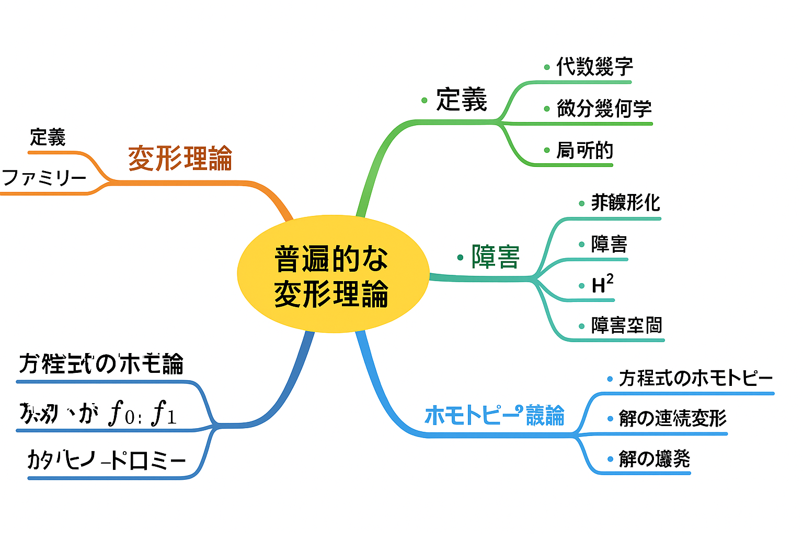

# 方程式の解の条件
# 方程式の変形、ホモトピー変形
# ドナルドソンの理論、変形・障害理論

---

User
例えば、関数f:R→Rがあったときに、f(X)=0が方程式となる。この方程式が解ける条件はなんだろか？？
必要条件、十分条件、必要十分条件はなんだろうか？？

知られている結果はどれだけあるんだろうか？？
ChatGPT
いい質問！`f:\mathbb{R}\to\mathbb{R}` に対して方程式 \(f(x)=0\) が「解ける（解が存在する）」ための条件を、直観的／厳密的に整理して、代表的な既知の結果（定理）を名前つきでまとめます。まず最も単純な事実から始めて、存在・一意性・計算法則まで順に説明します。

# 要点（超短縮）
- 最も基本：**必要十分条件**は「\(0\) が写像 \(f(\mathbb{R})\) の像に入っていること」＝\(0\in f(\mathbb{R})\)。
- 実用的には像に 0 があるかを調べるために「連続性＋符号の変化（Bolzano の定理）」や「漸近挙動」、「単調性」などを使う。
- 一意性を得たいなら「単調増加（strict monotone）」や「導関数がゼロにならない（\(f'(x)\neq0\)）」がよく使われる。
- 計算的には二分法（bisection）／ニュートン法／収縮写像定理（Banach）などがある。

以下で詳しく展開します。

# 1) 基本的・形式的な答え（最も直接的）
- 必要かつ十分：  
  \(\boxed{\exists x\in\mathbb{R}\text{ s.t. }f(x)=0 \iff 0\in f(\mathbb{R}).}\)  
  （これが成り立つのは自明。だが「判定」には追加条件が要る。）

# 2) 典型的な**存在条件**（関数の性質に基づくもの）
1. **Bolzano（中間値）／連続性による条件**  
   - 定理（Bolzano）: \(f\) が区間 \([a,b]\) 上連続で、\(f(a)f(b)<0\) ならば \(\exists c\in(a,b)\) s.t. \(f(c)=0\)。  
   - 応用：もし \(\lim_{x\to -\infty} f(x)\) と \(\lim_{x\to +\infty} f(x)\) が異符号なら実根が存在する（連続なら）。

2. **奇関数条件**  
   - \(f\) が連続で奇関数（\(f(-x)=-f(x)\)）なら \(f(0)=0\) が成り立つ（自明に解あり）。

3. **漸近挙動による条件**  
   - 例：連続で \(\lim_{x\to -\infty} f(x) = -\infty,\ \lim_{x\to +\infty} f(x) = +\infty\) なら実根が少なくとも一つある。

4. **位相的条件（写像の次数・代数的位相度）**  
   - 1次元では上の符号議論で足りるが、高次元や非単連結領域では「位相的次数（degree theory）」や「代数的位相度」を用いて存在を保証することがある（参考名：Brouwer degree）。

5. **代数的条件（多項式の場合）**  
   - 多項式に関する実根存在・個数の判定に Descartes の符号法則、Sturm の定理、Budan–Fourier 法などがある。  
   - （複素数まで含めると）基本定理：次数 \(n\) の複素根はちょうど \(n\) 個（重複度を考慮）。

6. **非連続関数**  
   - 連続性がなければ中間値は使えない。非連続でも \(0\) を値にとればいいし、像が全実数（写像が全射）なら必ず解あり。

# 3) **一意性（解がただ一つ）**を得る条件
- **単調性**：\(f\) が単調増加（または単調減少）なら解は高々1つ。  
  （かつ存在のためにはある点で符号が変わるなど必要）
- **微分条件**：全域で \(f'(x)>0\)（あるいは \(<0\)）なら単調で、よって解は高々1つ。
- **強い条件（収縮写像）**：写像 \(T:\mathbb{R}\to\mathbb{R}\) が収縮（\(|T(x)-T(y)|\le c|x-y|\), \(0\le c<1\)）なら Banach の収縮写像定理で **ただ一つの不動点** が存在する。方程式 \(f(x)=0\) を不動点問題に書き換える（例えば \(x = x - \lambda f(x)\) 等）すれば一意解が得られる場合がある。

# 4) **必要条件（よく使われる“チェック項目”）**
- 最も単純：\(0\) が像に入っていること（これは定義そのもの）。  
- 連続性を仮定している場面では、符号変化や極限の情報が必要条件になる（例：全域で正なら解なしなど）。

# 5) **計算法とそれに必要な仮定**
- **二分法（bisection）**：区間 \([a,b]\) で連続かつ \(f(a)f(b)<0\) が必要。単純で収束保証あり（線形収束）。
- **ニュートン法**：\(f\) が微分可能で初期値が十分よければ二次収束。局所的収束条件として \(f'(x^*)\neq0\) を仮定する。グローバルな収束保証は弱い（発散や周期に行くこともある）。
- **収縮写像による反復**：前述。収縮定数を確保できれば一意かつ早い収束。

# 6) よく知られている**定理・手法の一覧（名前つき）**
- Bolzano の定理（中間値定理の存在部分）
- 中間値定理（連続性が与える像の連続性）
- Rolle の定理 / 平均値の定理（根の性質と導関数）
- 固定点定理：Banach（収縮）、Brouwer（高次元での存在）
- 代数的：Descartes の符号法則、Sturm の定理、Budan-Fourier 法、基本定理（代数学の基本定理）
- 位相度（degree theory）・交差数：連続写像の根の存在と数の議論に利用
- 解析的：Rouché の定理（複素解析的手法で根の個数を数える）
- 数値解析的収束理論：Newton の局所収束、導関数条件、Kantorovich の定理（Newton の収束保証の一つ）

# 7) 例をいくつか
- \(f(x)=x^2+1\)：実数の範囲では \(\forall x,\ f(x)>0\) → 解なし。像を調べれば一目瞭然。
- \(f(x)=x^3\)：連続・奇関数 → \(x=0\) が解。導関数は原点で 0 になる（重根）。
- \(f(x)=\sin x\)：連続で \(\sin 0=0\) → 解あり。さらに無限個。
- \(f(x)=e^x-2\)：\(\lim_{x\to -\infty}e^x-2=-2,\ \lim_{x\to+\infty}=+\infty\) → 連続なので少なくとも一つ解（実際に \(x=\ln2\)）。

# 8) 高度な方向（興味があれば）
- 実解析・位相：位相次数（degree theory）で連続写像の根の有無や数の下限を与える。  
- 構成的方法：Sturm 列で多項式の実根の個数と区間分離。  
- 非連続だが可測：写像の像の測度論的性質や Baire カテゴリー法を使う議論もある（存在や典型性の議論）。

# 9) まとめ（実務的アドバイス）
1. まず調べること：\(f\) の**連続性・微分可能性・漸近挙動・符号**。  
2. 連続なら（区間での）符号変化があれば二分法で解が取れる。  
3. 一意性が欲しければ単調性や \(f'(x)\) の符号不変を確認。  
4. 多項式なら Descartes, Sturm などの代数的工具を使う。  
5. 数値で探すなら二分法（保証）→ ニュートン（速いが注意）→ 収縮写像（理論的保証） の流れを検討。

---

もっと具体的に知りたい点はどれですか？（例：多項式の実根個数を判定する手順を詳しく、あるいはニュートン法の収束条件を具体的に示してほしい、あるいは位相度の話を深堀りしたい、など）必要に応じて定理の証明スケッチやアルゴリズム（擬似コード付き）も出します。どれを続けましょう？
User
位相的次数、非連続、可測、構成的方法、解析的な話をさらに詳しく！
ChatGPT
いいね — 深掘り行くよ！  
以下は「位相的次数（degree）」「非連続・可測関数の扱い」「構成的（計算法・代数的方法）」「解析的手法（複素解析／実解析）」の４ブロックに分けて、直感→定義／定理→使い方／例→（必要なら）証明スケッチやアルゴリズムの要点をまとめる。長いけど途中で読み飛ばして欲しいところを拾ってくれて OK。

# 位相的次数（topological degree / Brouwer degree）
**直感**：連続写像 \(f:\overline\Omega\subset\mathbb{R}^n\to\mathbb{R}^n\)（\(\Omega\) は有界開集合）で境界上に0がないとき、\(f\) が領域内で 0 を取る“代数的な回数”を整数で表す。整数がゼロでないなら少なくとも一つ解（零点）がある。1次元の符号変化の一般化と考えてよい。

**定義（滑らかさがある場合のイメージ）**：  
滑らかで零点が孤立しているとき、局所的に各零点 \(x_i\) に対し \(\operatorname{sign}(\det Df(x_i))\) を対応させ、全体の次数はそれらの和：
\[
\deg(f,\Omega,0)=\sum_{x_i\in\Omega,\ f(x_i)=0}\operatorname{sign}\det Df(x_i).
\]
これが連続写像一般に拡張される（正則値に近似する、または単純化のために単純化写像で定義する）。

**主要性質（使い勝手）**  
- （存在）もし \(\deg(f,\Omega,0)\neq0\) なら \(\exists x\in\Omega\) s.t. \(f(x)=0\)。  
- （不変性）境界上で 0 を避けるホモトピー（連続変形）で次数は不変。つまり境界で 0 を通らない同じホモトピー類の写像は同じ次数をもつ。  
- （加法性 / 切断）零点を含まない部分に分けられると次数は部分ごとの和。  
- （正規化）恒等写像 \(id\) の次数は \(1\)（単位球に対して）。反転写像 \(-id\) の次数は \((-1)^n\)（ヤコビ行列の行列式が \((-1)^n\) だから）。  
- 1次元では上の表式は「符号付きの零点の合計」になり、中間値の符号反転の数を反映する。

**応用**  
- Brouwer の不動点定理（定理の導出にdegreeを使う標準的な道具）。  
- ベクトル場の局所指数 / Poincaré–Hopf（多様体上のベクトル場の零点の合計とオイラー標数の関係）。  
- 連立非線形方程式の存在証明（degree≠0 を示せれば存在）。

**計算法 / 実例**  
- 滑らかで零点が非特異（\(\det Df\neq0\)）な場合は上の和で計算。  
- 一般の連続写像では単純化（smoothing）や単純複体への単純化（simplicial approximation：スパーナー補題）で次数を離散的に計算できる。  
- 2次元では次数は境界像 \(f(\partial\Omega)\) が原点を何回巻くか（winding number）に等しい → 複素解析の議論（下の argument principle）と対応。

**簡単な証明スケッチ（存在）**：  
次数を定義するとき、もし零点がなければ連続写像は \(\overline\Omega\) を 0 を含まない領域へ写す → その写像は縮めて定数写像にホモトピできる → 定数写像の次数は 0 → 元の次数も 0。逆に次数が非零なら零点がなくホモトピで消えることができない、ゆえに零点がある。直感はこんな感じ。

---

# 非連続関数について（パソロジーと限界）
**要点**：位相的次数などの位相的手法は「連続性」が前提。非連続だと境界の像の議論やホモトピー不変性が使えない。したがって「存在」を保証する一般的・強力な理論はほとんど失われる。

**代表的な奇妙な例**  
- Dirichlet 関数 \(D(x)=\mathbf{1}_{\mathbb{Q}}(x)\)（有理数なら 1, 無理数なら 0）はあらゆる点で不連続。像は \(\{0,1\}\) なので 0 は取るが、連続性がないため中間値性质などは使えない。  
- 非連続で 0 を取らない関数も当然作れる（例えば常に 1 を返す関数）。「平均的に 0 を跨いでいる」でも根があるとは限らない。

**論点**  
- 非連続関数に対しては「像に 0 が含まれるか」を直接チェックするしかない。  
- ただし、可測や Baire クラスなど“ある程度の正則性”を仮定すると近似や部分的性質が使える（下節参照）。

**特殊クラスでの救済**  
- **導関数**：微分可能関数の導関数は一般に連続でなくても **Darboux（中間値）性** を持つ（導関数は中間値性を満たす）。つまり \(f'\) は連続でないが \(f'\) が異符号を持てば 0 を取る点がある。これが「非連続だが何か残る」好例。  
- **Baire 層**：Baire1（連続関数の点wise極限）は点の連続性が稠密に存在する等の良い性質を持つが、一般の中間値性は失う。

---

# 可測関数（Lebesgue 可測・Borel 可測）について
**定義（簡潔）**：\(f:\mathbb{R}\to\mathbb{R}\) が可測とは、任意の開集合 \(U\) に対して \(f^{-1}(U)\) が可測集合であること（Borel 可測は Borel σ-代数、Lebesgue 可測は Lebesgue 可測集合）。

**重要な事実**  
- 可測関数は点値集合 \(\{x:f(x)=0\}\) が可測である（したがってその測度を議論できる）。  
- **Lusin の定理**：有限測度上の可測関数は、任意の \(\varepsilon>0\) に対して、測度 \(<\varepsilon\) の補集合で連続に近似できる（＝ほとんど全域で連続に近づける）。→ 「可測＝ほとんど連続」に近いが“ほとんど”が曲者。  
- **Egorov の定理**：可測関数列の a.e. 収束は小さな補集合を除けば一様収束に強められる。

**可測性だけで root があるか？**  
- 残念ながら可測だけでは「0 をとる」ことは保証されない。例えば可測で値が常に \(\pm1\) だけとる（かつ 0 を取らない）関数は簡単に作れる。  
- ただし、ess inf ≤ 0 ≤ ess sup のような「本質的な上限下限」の情報は「0 に近い値が大きな集合で存在する」ことを示すが、ちょうど 0 を取るとは限らない。

**応用**：測度論的議論は「ほとんど至る所で」や「平均」「分布」に関する結論を出したいときに強力。例えば確率変数 \(X\) と \(E[X]=0\) が零点の存在を意味しないように、積分が0でも点でのゼロは保証しない。

---

# 構成的方法（多項式・数値アルゴリズム・離散化）
ここは「実際に根を見つける／数え上げる」ための手法群。種類によって仮定と保障が変わる。

## 多項式（実根）に対する代数的／構成的手法
- **Descartes の符号法則**：正の実根の上限を与える（多項式の係数列の符号変化の数）。  
- **Sturm の定理（列）**：有理係数でも実数係数でも、区間内の実根の個数を厳密に数える（重根にも対応可能）。手順：多項式 \(p_0=p\), \(p_1=p'\) から Euclid の多項式除算で Sturm 列を作り、区間端点での符号変化数の差で根の個数を得る。  
- **Budan–Fourier / Vincent の手法**：根の孤立と区間分割を行う（実根分離）し、正の根を分離する方法。Vincent の手法は実根分離で現代的に有効（連続分数変換を用いる）。  
- **根の隔離 & 精度保証**：上の手法で各根を含む狭い開区間を得て、有理/浮動小数で実根近似を保証できる。

## 一変数連続関数の数値法
- **二分法**（必要条件：閉区間で連続かつ端点で符号変化）→ 収束保証（線形）。  
- **ニュートン法**（条件：微分可能で初期値良好）→ 二次収束（局所）。Kantorovich の定理で初期近傍の厳密条件が与えられる。  
- **Secant / Regula falsi / Brent**：ニュートンの導関数が手に入らないときの代替で、実務で安定なアルゴリズム（Brent は二分法と逆二次補間のハイブリッドで頑健）。

## 多変数（連立）方程式
- **ホモトピー継続法（continuation / homotopy）**：既知解を持つ簡単系から目的系へパラメータを変化させて解の曲線を追跡する。複素数まで含めれば Bézout の数だけパスがあり、複素解を「全部」追える（ただし実根の数はその中の一部）。  
- **結果式 / Gröbner basis / CAD**：代数的な解の記述（正確解や解の存在判定）。CAD（cylindrical algebraic decomposition）は実根の存在判定や符号組合せを決める（計算量は爆発的）。  
- **区間演算（interval arithmetic）・Krawczyk 法・interval Newton**：数値で存在と一意性を証明する手法。Interval Newton が区間 \(I\) を入れ替え \(N(I)\subset I\) を示せれば、\(I\) に一意の根があることを保証する。

**アルゴリズムの実用フロー（例：多項式実根分離）**  
1. 係数の符号や根の範囲（Cauchy の根の界など）で候補区間を決める。  
2. Sturm 列で区間内の根の個数を数える／Descartes で上界を得る。  
3. 区間を分割して孤立した区間を得る（根が1つだけ含まれる区間へ）。  
4. その区間でニュートンや二分で高精度化、あるいは interval Newton で存在一意性を証明する。

---

# 解析的な話（複素解析・実解析：力強いツール）
**（A）複素解析の道具**
- **恒等定理（Identity Theorem）**：正則関数（holomorphic）が集合に無限にゼロを持ち、その集合に蓄積点があればその関数は恒等的に 0。→ ゼロは孤立するか全体が 0 かの二択。  
- **Rouché の定理**：境界上で \(|g(z)|<|f(z)|\) が成り立つなら \(f\) と \(f+g\) は同じ個数の零点を内側に持つ（重複度で数える）。非常に強力で、領域内の零点個数を境界の振る舞いのみで数えられる。  
- **Argument Principle（議論原理）**：領域内の零点数（極を含めて代数的に数える）は
  \[
  \frac{1}{2\pi i}\oint_{\partial\Omega}\frac{f'(z)}{f(z)}dz
  \]
  で与えられる（境界周りの巻き数）。2次元（平面）問題に対する topological degree の具体化。  
- **Hurwitz の定理**：一様収束で正則関数列が非零の点で収束すれば零点の数は安定して継承される（極限でも零点が消えない等の性質）。これがホモトピー的議論の解析的バージョンになる。

**応用の一例**：複素解析によって実解析での実根情報を得る手法（多項式の複素根を数えても実根数に関する結論を得るなど）。また、Rouché を使えば例えば \(z^n + a_{n-1}z^{n-1}+\dots\) の零点の位相的な位置を推定できる。

**（B）実解析・実正則関数（real-analytic）**  
- 実解析関数（実軸上の関数で近くの複素拡張がある）も零点は孤立するか恒等ゼロ。つまり「ゼロが蓄積する」なら関数はゼロ関数。これにより零点集合の構造が非常に制限される → 解析的手法で根を一掃できる（例えば Newton–Puiseux 展開による分岐解析）。

**Weierstrass の因子分解**（entire functions）等により任意の零点列（成長条件付き）を持つ全変関数を構成できる —— これは解析関数の零点構造を深く理解するための強力理論。

---

# つなぎ（degree ⇔ complex ⇔ numeric の関係）
- 2次元（複素平面）では topological degree は境界像の winding number と一致する → argument principle（複素解析）と完全に整合。だから解析的手法で次数や零点数を計算できることが多い。  
- 数値的には、degree を数値で確定するには境界での判定（winding number の数値積分）や細分割（simplicial approx / interval arithmetic）を用いる。これにより「存在の保証」と「数値近似」を両立できる（例：領域の境界で数値的に winding number ≠ 0 を確かめれば零点存在が証明できる）。

---

# 例まとめ（短い具体例）
1. \(f:\mathbb{R}\to\mathbb{R}\), \(f(x)=x^3-x\)  
   - \(f\) は解析関数。零点は \(x=0,\pm1\)（孤立）。ヤコビ \(f'(x)=3x^2-1\) により符号と重根は判断可。1次元の degree：各零点の \(f'(x_i)\) の符号和。  
2. \(f:\mathbb{R}^2\to\mathbb{R}^2\), \(f(x,y)=(x^3-x-y, y)\) のような系は Jacobi の符号で局所次数を求め、degree が非零ならゼロがあることが保証される。  
3. 複素関数 \(g(z)=z^5 + 2z + 1\)：Rouché を用いれば \(|2z+1|<|z^5|\) が適当な大きさの円周で成り立ち、内側の零点個数は 5 と分かる等。

---

# どこをもっと深掘りする？（選べる方向）
- 位相的次数の厳密な構成（simplicial approximation / singular homology を使った定義と証明）  
- Sturm 列の構成と多項式での具体計算例（擬似コード付き）  
- Interval Newton / Krawczyk の具体式と実装例（Python での実践）  
- 複素解析での零点数え上げ（Rouché と argument principle の詳細証明と例）  
- ホモトピー継続法のアルゴリズム詳細（追跡 ODE / predictor-corrector）  

どれか一つ選んでくれれば、そのテーマに沿って完全な手順・証明スケッチ・（必要なら）擬似コードや具体的な数値例まで作るよ。どれをまず深掘りする？
User
このあたりの話題を網羅した目次を整理してほしい！！

また、方程式fを変形させる方法もある話を聞いた！
f_0、f_tが解ける方程式であって、f_1=fとなれば、元の方程式は解ける！！そんな議論なのですが、、、
解が爆発したり、途切れたりしないことが大切になるそうですが、、
これって、ホモトピー的議論なのかな？
ChatGPT
なるほど！とても良いポイントを突いてる 👍  

では、まず **「網羅的な目次」** を整理したあとに、質問の **「方程式を変形して解を運ぶ方法＝ホモトピー的議論」** に答えるね。  

---

# 🔖 網羅的な目次（方程式 \(f(x)=0\) の「解の存在と構成」をめぐる全体像）

## I. 基礎編：方程式の解があるとは？
1. **定義と基本例**
   - 方程式 \(f:\mathbb{R}\to\mathbb{R}\) の解集合
   - 連続関数の場合：中間値の定理による存在
   - 代数的例：多項式の零点、代数学の基本定理
2. **必要条件・十分条件**
   - \(f(x)=0\) の存在条件（像に0を含むこと）
   - 連続性／コンパクト性／有界性などの仮定による強化
   - 不連続関数の反例

---

## II. 位相的視点
1. **位相的次数（topological degree）**
   - 定義（ヤコビ行列符号／ winding number／ simplicial approximation）
   - 性質：存在定理・ホモトピー不変性・加法性
   - 応用：Brouwer 不動点定理・Poincaré–Hopf 指数定理
2. **多様体と零点**
   - ベクトル場の零点とオイラー標数
   - 零点指数・局所次数

---

## III. 解析的視点
1. **実解析**
   - 実解析関数の零点は孤立するか恒等的にゼロ
   - Darboux 性（導関数の例）
2. **複素解析**
   - 恒等定理
   - Argument principle（議論原理）
   - Rouché の定理
   - Hurwitz の定理
   - Weierstrass の因子分解（零点列からの関数構成）

---

## IV. 測度論的・可測関数の視点
1. **可測関数の性質**
   - Lusin の定理・Egorov の定理
   - 本質的上限・下限と零点の近接
   - ただし「0 を取る」ことは保証されない
2. **Baire カテゴリ論**
   - Baire1 関数・導関数の中間値性

---

## V. 構成的・計算法的視点
1. **多項式の実根計算**
   - Descartes の符号法則
   - Sturm の定理と Sturm 列
   - Budan–Fourier・Vincent の方法（実根分離）
2. **数値解法**
   - 二分法・ニュートン法・Secant 法・Brent 法
   - Kantorovich の定理（ニュートン法の収束保証）
   - 区間 Newton 法・Krawczyk 法（存在と一意性を保証）
3. **多変数の場合**
   - ホモトピー継続法（数値代数幾何）
   - グレブナー基底・結果式・CAD

---

## VI. ホモトピー的・変形による方法
1. **基本アイデア**
   - 簡単に解ける \(f_0(x)=0\) から始める
   - パラメータ \(t\in[0,1]\) に対して連続的に \(f_t(x)=0\) を解く
   - 最後に \(f_1=f\) の解を得る
2. **理論的基盤**
   - 位相的次数のホモトピー不変性
   - Implicit Function Theorem（非退化解は連続的に追える）
   - 連続選択の問題（解集合の連結性）
   - bifurcation（解が枝分かれ／爆発／消滅する場合）
3. **数値的実現**
   - ホモトピー継続法（パス追跡）
   - predictor–corrector アルゴリズム
   - 複素多項式方程式の Bézout 上界と解の全追跡
   - 実解の抽出と分岐

---

# 🌱 ホモトピー的議論について

あなたが言ってる「\(f_0\) から \(f_1=f\) へ方程式を変形する」方法はまさに **ホモトピー的議論** だよ。  

- \(f_t:\mathbb{R}^n\to\mathbb{R}^n\), \(t\in[0,1]\) が連続的に変形する族。  
- 条件：境界上で \(f_t(x)\neq0\) が保たれていると、位相的次数 \(\deg(f_t,\Omega,0)\) は \(t\) に依存しない。  
- よって \(\deg(f_0,\Omega,0)=\deg(f_1,\Omega,0)\)。  
- もし \(f_0\) で零点の存在が分かっていれば、\(f_1\) にも零点が存在する！  

この理屈が「解が途中で途切れたり爆発したりしない」ための保証。  
もし境界を通って零点が「外に逃げる」ことがあれば degree が変わる → そのときは根が消滅できる。  

**数値計算の世界**ではこれを「ホモトピー継続法（homotopy continuation）」として実装する：  
- \(H(x,t)=(1-t)f_0(x)+t f(x)\) を定義する  
- \(f_0(x)=0\) の解からスタートして \(t\) を少しずつ動かし、ニュートン法などで修正して追跡  
- 途中で「爆発・分岐」が起きると追跡が難しい（これが質問で言っていた懸念）  

---

👉 まとめると：
- 理論的には **ホモトピー不変性（位相的次数の議論）** が背景。  
- 実際の計算では **homotopy continuation method** と呼ばれる強力な手法。  
- 注意点は、解の「枝」が途切れたり無限遠へ逃げたりしないような条件が必要。  

---

どうする？  
次のステップとしては「ホモトピー継続法のアルゴリズム（predictor–corrector）の詳細」を整理するか、あるいは「位相的次数のホモトピー不変性の厳密証明」に行くか、どっちがいい？
User
方程式のホモトピー的な議論について、一般的なものをまとめてほしい！イメージや哲学も含めて！！

で、これを微分方程式に応用すると、、微分方程式のホモトピー的変形の理論ができる！？

さらに、微分方程式の解が変形したり、爆発したりなども考えられるのか？？

微分方程式の解のモノドロミーとかも、このあたりに関連するのかな？？
ChatGPT
いい問い！盛りだくさんだから、まずは全体像をつかめる「哲学＋直感」を先に示して、それから具体的な定理・手法・例・数値的注意点・微分方程式やモノドロミーへのつながりへと降りていくね。長めだけど、読みやすく章立てにするよ。

# ホモトピー的議論 — イメージと哲学
直感的に言うとホモトピー的議論はこういう話だ。

- 「ある方程式 \(f_0(x)=0\) の解が分かっている。これを連続に変形して \(f_1(x)=f(x)\) に届くなら、変形の途中で『解が消えたり新しく現れたりしない限り』最終的に \(f\) にも対応する解があるはずだ」—— これがホモトピーの哲学。
- 重要なのは「連続に変形する」「境界・無限遠での振る舞いがよい」「途中で特異（ヤコビが特異になる・零点が境界を通る等）が起きない」などの仮定。これらが満たされれば「解の存在」は位相的不変量（degree など）で保証できる。
- もう少し雄弁に言うと：ホモトピーは「連続的に変形しても壊れない情報（位相的不変量）を使って存在を保証する方法」。数値的実装ではその“道”を実際に追い、特異点や折返しをどう扱うかが現実的な課題になる。

以下、理論 → 応用（ODE/PDE） → 数値 → モノドロミー、という順で整理。

---

# 1. 一般的なホモトピーの理論（方程式 \(f(x)=0\) の枠組）
## 1.1 基本設定と主張（有限次元）
- 取り扱う写像：\(f_t : \overline\Omega\subset\mathbb{R}^n \to \mathbb{R}^n\)（\(t\in[0,1]\)）を連続（または連続に依存する連続写像族）とする。
- 境界条件：全ての \(t\) で \(f_t(x)\neq0\) が \(\partial\Omega\) 上で成り立つと仮定。
- 位相的次数の不変性：\(\deg(f_t,\Omega,0)\) は \(t\) に対して定数 → もし \(\deg(f_0,\Omega,0)\neq0\) なら \(\exists x\in\Omega\) で \(f_1(x)=0\)。
  - これが「解を連続に運ぶ」抽象的根拠。1次元の符号変化の一般化だと考えればよい。
- 局所版（Implicit Function Theorem）：もし \(F(x,t)=0\) を考え、ある \((x_0,t_0)\) で \(D_xF(x_0,t_0)\) が可逆なら、その解は \(t\) の近傍で滑らかに続く（分岐は起きない）。
  - 逆に \(D_xF\) が特異になる点が分岐点（bifurcation point）候補。

## 1.2 ホモトピーの構成例（単純同相）
- 単純ホモトピー：\(H(x,t)=(1-t)f_0(x)+t f(x)\)（線形補間）。多くの数値法で採られるが、境界で 0 を通る可能性があるので要注意。
- ホモトピー不変量として degree のほかに固定点指標（fixed point index）や Leray–Schauder degree（無限次元型）も使える。

## 1.3 失敗する場面（解が「消える・爆発する」場合）
- 零点が境界を横切って外に出る → degree が変化する（境界条件違反）。  
- 零点が互いに衝突して消える（消滅）：例えば +1 と −1 の局所次数をもつ零点が合体して合算すると 0 になり消えることがあり得る（符号の足し合わせ）。  
- 無限遠へ逃げる（解が発散）→有限な領域での存在保証を失う。  
これらが起きないような仮定（境界避け、解の有界性、ヤコビ非特異など）を置くのが典型。

---

# 2. 分岐理論（bifurcation theory） — 解の分岐・消滅の扱い
- **局所分岐（Crandall–Rabinowitz の定理）**：ある「単純固有値」が 0 を横切るとき、平滑な分岐枝が出る。条件は線形化の単根と transversality 条件。1次元分岐の典型的理論。
- **Rabinowitz の global bifurcation theorem**：局所的分岐が「グローバル」に続いていく（分岐枝は無限遠へ行くか別の分岐点に到達するなどの結論）。
- **典型的分岐様式**：saddle-node（消滅・生成）、transcritical、pitchfork、Hopf（周期解の発生）など。各様式は線形化固有値の変化に対応。
- **Lyapunov–Schmidt 還元**：無限次元問題を有限次元に還元して分岐解析を行う標準手法。特に PDE の分岐解析で必須。
- 哲学的に言えば分岐理論は「いつホモトピーが破られるか（＝いつ解の構造が変わるか）を精密に記述する学問」。

---

# 3. 無限次元（微分方程式・PDE）での位相的手法
- **Leray–Schauder degree**：無限次元のバナッハ空間上での degree 理論。コンパクト作用素やコンパクト性の代わりに適切な仮定を置いて存在を与える。非線形作用素方程式（例えば楕円 PDE の定常問題）に適用される。
- **固定点定理の道具**：Schauder fixed-point theorem（有界凸集合でのコンパクト連続写像）や Leray–Schauder を用いて PDE の解存在を議論。
- **Crandall–Rabinowitz, Rabinowitz global theorem** などは無限次元設定でよく使われる（例えば非線形楕円方程式の枝分岐）。
- **Conley index**：ダイナミクスの位相的不変量を使って周期解や孤立不変集合の存在を保証する。PDE のダイナミクス（無限次元流）にも適用。

---

# 4. 微分方程式（ODE／PDE）への応用 — どこまで同じか、どこが違うか
## 4.1 常微分方程式（ODE）
- **平衡点の継続**：パラメータ依存方程式 \(x' = F(x,\lambda)\) の平衡 \(F(x,\lambda)=0\) について、Implicit Function Thm. が成立すれば平衡は滑らかに続く。  
- **周期解の継続**：周期解については Poincaré map の不動点として扱い、Floquet 指数（線形化の固有値）を使い分岐（例えば Hopf）を判定する。  
- **数値継続**：AUTO, MATCONT 等のソフトウェアがホモトピー継続（分岐解析）を実装している。  
- **爆発（blow-up）**：ODE でも有限時間で解が発散する（例：\(x' = x^2\)）ことがある。パラメータ変化で有限時間爆発が起きると、継続はそこで終了する（解の延長が不可能）。

## 4.2 偏微分方程式（PDE）
- **定常解（Elliptic）**：非線形楕円方程式 \(Lu + N(u,\lambda)=0\) の解分岐は Leray–Schauder degree や Lyapunov–Schmidt で扱うことが多い。グローバル分岐理論が直接応用可能。  
- **時間依存問題（進化方程式）**：ダイナミクスの分岐（パターン形成、遷移）でホモトピー的概念は「状態空間の連続変形」として出てくる。解が有限時間で破綻（blow-up）するか、あるいは attractor の変化という形で現れる。  
- **正則化／リスケーリング**：PDE の blow-up はホモトピー的継続を阻むので、解析的にはブローフロー近傍での局所解析（self-similar blow-up）やスケーリング変換が使われる。

---

# 5. 解が「変形／爆発／途切れる」こと — 具体的な現象と原因
- **分岐（branching）**：線形化の固有値が 0 を横切る。分岐点では新枝が生える／別の枝と合体する。  
- **折返し（turning point / limit point / saddle-node）**：ヤコビが特異になり、通常のパラメータ追跡が行き詰まる（ここで pseudo-arclength continuation が有用）。  
- **無限遠への逃走**：解が unbounded になり有限領域での継続が不可能（Rabinowitz の定理では「枝は無限遠へ行くか別の分岐点へ行く」等の結論が出る）。  
- **有限時間 blow-up**：時間発展系で解が有限時間で発散。パラメータ継続で blow-up が発生すると実際に「解が途切れる」。  
- **分岐による多価性**：パラメータを一周することで解の枝が permute される（後述のモノドロミー的現象）。

---

# 6. 数値ホモトピー（実装面） — path-tracking の注意点
- **単純 path-tracking**：ホモトピー \(H(x,t)=0\) を離散 \(t_0=0\to t_1\to\cdots\to t_N=1\) として追う。各ステップで predictor（接線予測）→ corrector（Newton）を行う。  
- **問題点と対処**：
  - 折返し点（ヤコビが特異）に遭遇 → pseudo-arclength continuation：パラメータと未知をまとめて弧長で追うことで折返しを通過可能にする。  
  - 分岐点検出 → 分岐追跡（branch switching）で新枝に入る。  
  - 追跡中の分岐や特異で Newton が失敗 → step-size control、adaptive stepping、endgame strategies（解が無限遠へ行く場合の処理）を使う。  
  - 追跡が複数枝に分かれる場合 → 複素化して全ての複素枝を追う「全解追跡法」（多項式系のホモトピー継続）もある。  
- **Endgame（多くの homotopy プログラムにある）**：解が無限遠に近づくときの特別手法（反転変数など）で分岐の行方を決める。

---

# 7. モノドロミー（monodromy）との関係
- **線形常微分方程式のモノドロミー**：係数がパラメータ依存で特に複素パラメータが絡むと、基点のまわりを一周すると解（基底解系）がモノドロミー行列によって変換される。これは基本群→GL(n) の表現で、古典的で強力。  
  - 例：Fuchs 型方程式や正則特異点を持つ系でモノドロミー群が定義される。  
- **非線形問題でのモノドロミー的現象**：非線形方程式や多価関数でパラメータを一周すると「枝が入れ替わる（permutation）」ことがある。これは代数方程式 \(p(x,\lambda)=0\) の λ を一周して根が巡回する例（ガロア的視点）と同じ直観。  
- **ホモトピーとの接点**：
  - パラメータ空間に穴（障害）や特異点があり、それらを回ると解の枝が異なる位置に来る → ホモトピー（連続）で閉じたループを作ったときの解の変位はモノドロミーとして現れる。  
  - degree を使った存在論は通常「パラメータを固定した領域での局所的な」議論だが、パラメータ空間の巡回で起きる枝の置換は global な位相情報（基礎群）に依存する。

---

# 8. 代表的定理やツール（名前と短い説明）
- Implicit Function Theorem（局所的継続）
- Brouwer degree / topological degree（存在の位相的不変量）
- Leray–Schauder degree（無限次元版）
- Crandall–Rabinowitz（局所分岐）
- Rabinowitz global bifurcation theorem（グローバル分岐）
- Lyapunov–Schmidt reduction（無限次元→有限次元還元）
- Floquet theory, Poincaré map（周期解の分岐解析）
- Picard–Lefschetz theory / Stokes phenomenon（複素解析的モノドロミー・分岐）
- Conley index（動的分岐と孤立不変集合）
- Numerical continuation: pseudo-arclength, predictor–corrector, endgame, deflation（重根対処）

---

# 9. 具体的で簡潔な例（イメージ）
1. **saddle-node（消滅）**  
   方程式 \(x^2 - \lambda = 0\)。  
   - \(\lambda>0\)：二つの解 \(\pm\sqrt{\lambda}\)。  
   - \(\lambda=0\)：重解 \(x=0\)。  
   - \(\lambda<0\)：実解なし。  
   これが「解が生まれたり消えたりする」最も単純な例。ホモトピー（λ を 0 に連続変化）では \(\lambda\) が符号を変えることで degree が変わる（境界条件次第）。

2. **Hopf 分岐**（ODE）  
   平衡が安定→複素共役固有値が虚軸を横切ると周期解が生まれる（解は「静的なもの」から「振動」に変形）。

3. **多項式のパラメータ周回（モノドロミー）**  
   例：\(x^3 - \lambda = 0\)。λ を 0 の周りで一周させると三つの根は互いに巡回する（branching／monodromy）。これは複素平面上の monodromy の単純な例。

---

# 10. 「次に何を深掘りするか」提案（実用的）
- 理論重視：Leray–Schauder degree の定義と証明スケッチ、Crandall–Rabinowitz の仮定と証明スケッチ、Lyapunov–Schmidt の手順を出す。  
- 数値重視：pseudo-arclength continuation の具体アルゴリズム（擬似コード）、predictor–corrector の実装の注意点、分岐検出と branch switching の実装例。  
- モノドロミー重視：線形 ODE のモノドロミー計算（Fuchs 型の例）、代数方程式の根のモノドロミー（分岐の群）を詳しく。  
- PDE 応用：楕円方程式での global bifurcation（Rabinowitz）の具体的応用例（境界条件つき問題など）。

---

# 最後に短いまとめ（3 行）
1. あなたが指摘した「\(f_0\) から \(f_1=f\) へ変形して解を運ぶ」考え方は **まさにホモトピー的議論**（位相的次数や不動点理論が基盤）。  
2. 微分方程式（ODE/PDE）にも同様の理論があり、無限次元での degree（Leray–Schauder）や分岐理論（Crandall–Rabinowitz, Rabinowitz）で扱う。  
3. 解の「爆発／途切れ／分岐」は現実に起きる現象で、数値的には pseudo-arclength、endgame、分岐追跡などのテクニックで対処する。モノドロミーはパラメータを一周したときの枝の入れ替わりとして現れる。

---

もっと踏み込んでほしい方向を勝手に選んで深掘りしてもいい？（たとえば）  
- A: 「pseudo-arclength 継続法」を擬似コードで完全に示す、または  
- B: 「Crandall–Rabinowitz の定理と Lyapunov–Schmidt 還元」を詳細に展開、または  
- C: 「Leray–Schauder degree の定義と例（簡単な PDE に適用）」、または  
- D: 「モノドロミーの具体例（線形 Fuchs 型 ODE と代数方程式の根の巡回）」。

どれか一つを深掘りして、証明スケッチ・例・（必要なら）擬似コードまで出すよ。選ばなければ、私のおすすめは A（数値的で直感を掴みやすく、すぐ実験できるから）。
User
微分方程式の変形理論ってどれくらいの考え方があるの？理論があるの？？

幾何との関連は？？
ドナルドソンの理論があると聞いた！エキゾチック球面の話と関係するのかも？
ChatGPT
とてもよい問いですね。  
「微分方程式の変形理論」というと、いくつかの異なる文脈があって、それぞれに数学的理論や幾何的解釈が存在します。体系的に整理するとだいたい次のようになります。

---

# 1. 微分方程式における「変形理論」の意味
## (a) 方程式そのものを変形する
- **パラメータ依存方程式** \(F(u,\lambda)=0\) を考えて \(\lambda\) を動かす → 解がどう変形するかを追う。  
- 分岐理論・ホモトピー継続法はこの系統。

## (b) 解の空間（moduli 空間）の変形
- 特定の幾何的 PDE（例えば楕円型）で、**解全体が moduli 空間**をなすことがある。  
- 例：自己双対接続 (instanton) の moduli、反自己双対形式の moduli。  
- これら moduli 空間の**滑らかさ・次元・変形と障害理論**が発達している。→ 本格的な「deformation theory」。

## (c) 方程式を「変形パラメータ族」として扱う
- 例：代数幾何での「複素構造の変形」を PDE で記述（\(\overline{\partial}\)-作用素の変形、Kodaira–Spencer 理論）。  
- 方程式を少し変えることで、幾何的対象（複素構造、接続、計量）がどう動くかを調べる。

---

# 2. 幾何との関連
## 2.1 幾何的 PDE の典型例
- **Cauchy–Riemann 方程式**：複素構造を持つ写像や複素多様体の変形。→ Kodaira–Spencer 変形理論。  
- **Yang–Mills 方程式（自己双対方程式）**：ゲージ理論の moduli 空間、Donaldson 理論の基盤。  
- **Seiberg–Witten 方程式**：より「柔らかい」ゲージ理論的 PDE。Donaldson 理論と同値な不変量を定義するが、解析的に扱いやすい。  
- **モンジュ–アンペール方程式**：Kähler 計量の存在やカラビ–ヤウ定理の基盤。計量の moduli の変形理論。  
- **リッチフロー（Ricci flow）**：計量を時間的に変形する PDE。幾何構造を変形し、ペレルマンによるポアンカレ予想の証明に用いられた。

## 2.2 Donaldson 理論との関連
- Donaldson は **4次元多様体の微分構造**を理解するために、**反自己双対 (ASD) Yang–Mills 方程式**の moduli 空間を研究。  
- その moduli 空間は、変形・障害理論に基づいて構成される：
  - 解の「接空間」 = 楕円複体のコホモロジー群  
  - 障害の消失条件で moduli 空間が滑らかな多様体になる  
- この moduli 空間の特性類から **Donaldson 不変量**を定義し、エキゾチックな \(\mathbb{R}^4\) や球面の存在を示唆する。  
- → つまり「PDEの変形理論」が「トポロジーの微分構造の分類」に直接つながっている。

---

# 3. 変形理論の一般的な枠組み
- **変形・障害理論（Deformation–Obstruction theory）**：
  - 解の moduli 空間を考えたとき、一次近似は線形化方程式（楕円作用素）で与えられる。  
  - その解空間が「変形方向」、余剰条件（cohomology の次の群）が「障害」。  
  - Kodaira–Spencer（複素多様体の変形）、Donaldson–Uhlenbeck（ASD 接続の moduli）、Gromov–Witten 理論（擬似 holomorphic curve）などで共通して使われる。
- **ゲージ理論**：PDE の解 moduli はゲージ変換で割った商をとる必要がある。この「商の良い構造」を作るために変形理論が必須。  
- **Floer 理論**：無限次元の gradient flow PDE を解くことで得られる moduli。ここでも変形理論が出てくる。

---

# 4. エキゾチック球面との関連
- **エキゾチック \(\mathbb{R}^4\)・球面の存在**：
  - Donaldson の成果：ASD 方程式の moduli 空間から、標準的な smooth 構造では説明できない4次元多様体の現象を検出。  
  - Seiberg–Witten 理論によっても再証明され、むしろこちらの方が扱いやすい。  
- 要点：
  - PDE（ASD や Seiberg–Witten 方程式）の解集合が「幾何トポロジーの秘密」を暴く。  
  - それを rigorous に扱うには変形理論（deformation + obstruction）が必須。  
  - 特に moduli 空間が「擬似多様体」として定義される仕組みは、解析的な変形理論に強く依存。

---

# 5. 他の関連分野
- **代数幾何**：変形理論は基本概念（複素構造の変形、特異点の変形）。微分方程式的には \(\overline{\partial}\)-方程式を解く理論。  
- **数値解析**：数値 continuation や bifurcation theory も「変形」と呼べるが、Donaldson 型の変形理論はもっと幾何的・抽象的。  
- **数理物理**：Topological QFT では moduli 空間（PDE の解集合）の積分で不変量を定義 → 変形理論で moduli をきちんと構成する必要がある。

---

# まとめ（イメージ）
- 「微分方程式の変形理論」には二つの層がある：
  1. **解析的／数値的な解の変形**（パラメータ依存・ホモトピー・分岐）。  
  2. **幾何的な moduli 空間の変形**（Donaldson, Kodaira–Spencer, Seiberg–Witten）。  
- 後者では、解空間の滑らかさ・次元を調べるための deformation–obstruction 理論が中心的役割を果たす。  
- 幾何学やトポロジーと深く結びつき、Donaldson 理論によってエキゾチック 4 次元多様体の発見に直結。  

---

👉 質問です：  
あなたの関心は **数値的・解析的な「解を追う変形」** に近いですか？  
それとも **Donaldson 理論的な「moduli 空間の変形（幾何学的PDEとトポロジー）」** に近いですか？  

それによって、次に掘り下げるべき理論（数値 continuation の細部 or Donaldson/Seiberg–Witten 変形理論）を選べます。
User
Donaldson 理論的な「moduli 空間の変形（幾何学的PDEとトポロジー）」に興味あり！

もっと普遍的な理論で、幾何学対象と方程式などの解析的対象をリンクさせて、変形していくような考え方はあるの？

ところで、Kodaira Spencer理論とは？？理論概要やイメージや例をまとめてほしい！！

その次の会話では、このトークに関係する話題を網羅した目次を作りたい！！
ChatGPT
いい選択！Donaldson 型の幾何解析的モジュール理論とつながる「普遍的な変形の考え方」──これを軸に、まず大枠（どんな普遍理論があるか）を示し、つづいて **Kodaira–Spencer（複素構造の変形）理論** を直感→定式化→重要定理→例→応用まで整理するよ。最後に次に作る目次へのブリッジも付ける。長めだけど図式的にまとめるから読みやすいはず。

# 全体像：幾何対象 ⇔ 解析方程式 をつなぐ「変形」の普遍的枠組み
まずは「どんな考え方（普遍理論）があるか」を俯瞰。

## A. 共通するキーワード（哲学）
1. **解空間 = moduli（あるいは moduli stack）**：関心ある対象（複素構造、接続、計量、曲線、束 など）を「同値関係で割った集合」として扱う。  
2. **局所的には線形化で扱う**：解 \(u\) に対して線形化作用素 \(D\)（楕円複体や Fredholm 型）を取り、その kernel が変形方向、cokernel が障害（obstruction）。  
3. **deformation–obstruction の普遍構造**：微小変形は第一コホモロジー、障害は第二コホモロジーに現れる（具体的コホモロジー群は状況ごとに変わる）。  
4. **楕円性（ellipticity）／Fredholm 性**：有限次元の変形理論を可能にする。Donaldson 型理論や複素構造の Kodaira–Spencer はこの点が鍵。  
5. **ゲージ（同値）で割る**：moduli はしばしばゲージ同値（接続のゲージ群）で商を取るため、安定性・ quotient 構成が問題になる（GIT, Uhlenbeck compactification 等）。  
6. **ホモトピー／代数的・導来的拡張**：古典的観点は cohomology による obstruction。現代では DGLA / L∞-代数や derived deformation theory（Lurie, Pridham）で「全情報」を把握する。

## B. 代表的な普遍理論（一覧・短解）
- **Kodaira–Spencer / Kuranishi theory**（複素構造の変形）  
- **Atiyah–Singer index + elliptic complex approach**（接続や構造の変形：Donaldson）  
- **Deformation–Obstruction in algebraic geometry**（Ext 群 を使う：\(\mathrm{Ext}^1\)＝変形、\(\mathrm{Ext}^2\)＝障害）  
- **Leray–Schauder / Fredholm theory**（無限次元の存在論）  
- **DGLA / L∞ formal deformation theory**（Goldman–Millson, Deligne 等に基づく形式理論）  
- **Kuranishi structures / virtual fundamental class**（Gromov–Witten や Floer での「欠けた滑らかさ」の補償技術）  
- **Floer / gauge theoretic moduli (Donaldson, Seiberg–Witten)**（解析的 PDE を用いたトポロジー不変量）

---

# Kodaira–Spencer 理論（複素構造の変形）── 概要・直感・定式化・例

## 1) 直感（イメージ）
- 「複素多様体 \(X\) の複素構造を小さく変形する」とは、局所座標 \(z\) に対する \(\bar\partial\) 演算の変形を意味する。  
- 小さい変形は「どの方向に・どのくらい変えるか」を示すデータ（Beltrami 微分 \(\mu\)）で表せる。  
- そのデータが **Newlander–Nirenberg の可積分条件**（Maurer–Cartan 型方程式）を満たすと、変形後も複素構造になる。  
- 可積分性条件の一次線形化から得られる cohomology が「変形可能な方向」を示し、二次以降の条件が障害（obstruction）を生む。

## 2) 基本的な定式化（主要結果）
- 小変形の**一次近似**は
  \[
  H^1(X, T_X)
  \]
  （複素多様体 \(X\) の接ベクトル束 \(T_X\) に係る第1コホモロジー群）に与えられる。つまり \(\dim H^1(X,T_X)\) が局所 moduli の理想的な「次元候補」。  
- **障害（obstruction）** は
  \[
  \text{obstructions}\ \in\ H^2(X,T_X).
  \]
  具体的には、二次的な整合性条件（Maurer–Cartan の二次項）が消えることが必要。これがゼロであれば変形は伸張可能（unobstructed）。  
- **Kodaira–Spencer map（家族の導来）**：家族 \(\pi:\mathcal{X}\to S\)（基底 \(S\) に対する複素多様体の滑らかな族）について、基底の接空間 \(T_sS\) から
  \[
  \rho: T_sS \to H^1(X_s, T_{X_s})
  \]
  という線形写像が定義される（家族の各方向が複素構造のどの変形に対応するかを与える）。この写像は変形の「導関数」に相当。

## 3) 技術的要素（概略）
- **Beltrami differential**：\(\mu\in A^{0,1}(X,T_X)\)（型 \((0,1)\) の \(T_X\)-値微分形式）が変形の局所データ。  
- **Maurer–Cartan / integrability**：
  \[
  \bar\partial \mu + \tfrac12[\mu,\mu] = 0
  \]
  が満たされると可積分（対応する almost complex 構造が genuine complex structure になる）。  
- **Dolbeault 同型**：Hodge 理論を使い、Dolbeault cohomology の計算で \(H^i(X,T_X)\) を具体的に扱う。これが Kodaira の初期的な手法（Kodaira–Spencer, Kuranishi）。

## 4) Kuranishi 族と局所性（Kuranishi theorem）
- 任意の複素多様体 \(X\) に対し、小さな近傍（基底は局所的な解析空間）上に**versal（普遍）な変形族**（Kuranishi family）が存在する：その基底は局所的に複素多様体の変形空間を表す。  
- Kuranishi 空間は一般に滑らかでない（obstruction による特異がある）。その接空間は \(H^1(X,T_X)\)、obstruction は \(H^2(X,T_X)\) による。

## 5) 重要な例と特別事例
- **複素トーラス（複素楕円曲線を含む）**：変形はパラメータ空間（Teichmüller／moduli）で滑らか（obstructed が消える＝unobstructed）。  
- **K3 曲面**：K3 は複素構造の変形が**常に** unobstructed（Kuranishi 空間は滑らか）。これにより moduli 理論が非常に良好。  
- **Calabi–Yau 多様体**：Bogomolov–Tian–Todorov（BTT）定理により、Calabi–Yau（トリビアルな正準束）では複素構造の変形は unobstructed（moduli は滑らか）。これは鏡像対称性で極めて重要。  
- **反例**：一般の複素多様体（例えば多くの表現的複素多様体）は obstructed で、Kuranishi 空間に特異が出る。

## 6) Kodaira–Spencer の応用・派生
- **鏡像対称性**：Kodaira–Spencer の変形理論は B-model（複素構造側）の基礎。Yukawa coupling、variation of Hodge structure、BCOV theory（Kodaira–Spencer gravity）とつながる。  
- **deformation quantization / algebraic deformation**：Kodaira–Spencer 型の cohomology（特に \(T_X\) と polyvector fields）を使って非可換変形や Kontsevich の formality 論に入る。  
- **比較 with gauge theory**：複素構造の変形理論と Yang–Mills/ASD の moduli 理論は両方とも「楕円複体に基づく deformation–obstruction」の枠組みで扱える → index や orientation、virtual fundamental class の概念が共通。

## 7) 簡単な証明スケッチ（何が起きるか）
1. まず \(\bar\partial\) を deformed operator \(\bar\partial_\mu = \bar\partial + \mu\) と見る。  
2. 可積分性は \(\bar\partial_\mu^2=0\) と同値で、これが Maurer–Cartan eq. に一致する。  
3. Maurer–Cartan を cohomology で読むと、一次項は \(\bar\partial\mu\)（これが 0 であることが \(\mu\) が cohomology class を与えることに対応）→ \(H^1(T_X)\)。  
4. 二次項は \([\mu,\mu]\) で、これがゼロに落ちるか否かが obstruction（H^2）を生む。  
→ 以上から一次・二次の cohomological description が得られる。

---

# Kodaira–Spencer と Donaldson（幾何PDE）との接点
- 共通点：どちらも **楕円複体**（例えば de Rham–Dolbeault 複体、Yang–Mills 楕円複体）を使い、kernel/cokernel を deformation/obstruction に対応させる。  
- Donaldson（ASD 接続 moduli）では deformation complex が
  \[
  \Omega^0(\mathfrak{g}) \xrightarrow{d_A} \Omega^1(\mathfrak{g}) \xrightarrow{d_A^+} \Omega^{2,+}(\mathfrak{g})
  \]
  のような楕円複体になり、\(H^1\) が変形方向、\(H^2\) が障害を表す。これは Kodaira–Spencer の \(T_X\) を使う複素構造の場合と形式的に同型に見える。  
- 更に発展的には、**derived geometry / L∞-algebra** の見地からは Kodaira–Spencer の DGLA（polyvector fields, ∂̄ と Schouten–Nijenhuis bracket）とゲージ理論側の DGLA（ゲージ代数とその複体）は同じ言語で扱える → これが Kontsevich や Goldman–Millson の枠組み。

---

# 実用的な道筋（あなたが次に深掘りしたら役に立つテーマ）
1. Kodaira–Spencer の **Maurer–Cartan 方程式** と **Kuranishi map** の具体式（証明スケッチ付き）。  
2. Donaldson moduli の楕円複体と index 計算（Atiyah–Singer を使った期待次元）。  
3. deformation–obstruction の一般抽象化（DGLA / formal moduli problems の入門）→ これで algebraic / analytic を一本化できる。  
4. Calabi–Yau / K3 の例で BTT 定理や Torelli theorem の直観を掴む。  
5. virtual fundamental class / Kuranishi structure（Gromov–Witten と Floer のための技術）—— moduli が滑らかでないときの救済。

---

# まとめ（短く）
- はい、**普遍的な理論**は存在する：楕円複体に基づく deformation–obstruction の枠組み、DGLA/L∞ による形式理論、Kuranishi/virtual techniques による「不完全」moduli の扱い、これらが解析的方程式（ASD, Seiberg–Witten, ∂̄-方程式 等）と深く結びつく。  
- **Kodaira–Spencer** はその中で「複素構造の変形」に特化した基本理論で、一次 cohomology が変形、二次 cohomology が障害を表す。BTT などの結果は特殊クラス（Calabi–Yau 等）で障害が消えることを保証する。  
- Donaldson 理論や他の幾何的 PDE は同じ枠組みで理解でき、現代的には DGLA / derived moduli の言語で統一される。

---

次の会話で作る目次案（予告）。あなたが望む網羅度に合わせて作るつもりだけど、たとえば以下のレベルでどう？  
- (I) 基本概念（moduli, deformation–obstruction, elliptic complex）  
- (II) Kodaira–Spencer 詳解（定義→証明スケッチ→Kuranishi）  
- (III) Gauge theory / Donaldson moduli（ASD、index、Uhlenbeck compactification）  
- (IV) DGLA / formal deformation theory（Goldman–Millson、Lurie）  
- (V) Virtual techniques（Kuranishi structures, virtual fundamental class）  
- (VI) 代表例と応用（Calabi–Yau, K3, Gromov–Witten, Floer, exotic \(\mathbb{R}^4\)）  
- (VII) 数値的・実験的視点（moduli の追跡・gluing の数値）

これでよければ、次はその目次を詳細化して一つずつ参照できる章立てで出すよ。どの深さまで欲しい？（概観だけ／数学的証明スケッチ付き／実装例（擬似コード）付き など）
User
Donaldsonの理論についてまとめてほしい！！

また、具体例で微分方程式のモノドロミーやホモトピー的な変形について教えてほしい！！

ひとまず、これで締めかな！
ChatGPT
いいね、しめとして **Donaldson 理論の概要** と、あなたが最初に気にしていた **微分方程式のモノドロミー／ホモトピー的変形** をまとめて整理するね。最後は哲学的なイメージも含めて。

---

# Donaldson 理論（Gauge Theory と 4次元トポロジー）
## 1. 背景と動機
- 1980年代、4次元多様体の滑らかな構造（微分同相型）が他の次元と比べて極めて難しいことが判明。
- Donaldson は物理学（Yang–Mills 理論）から着想を得て、**アンチ自己双対 (ASD) 接続**の moduli 空間を使い、4次元多様体の新しい不変量を構成した。
- これにより従来の代数トポロジーでは区別できなかった滑らか構造を判別できるようになり、「エキゾチック \(\mathbb{R}^4\)」の存在も確立的に理解された。

## 2. 基本枠組み
- \(X\)：閉じた指向性 4次元多様体。
- \(E\)：コンパクトリー群（典型的には SU(2)）の主束。
- 接続 \(A\) の曲率 \(F_A\) に対して **ASD 方程式**：
  \[
  F_A^+ = 0
  \]
  （自己双対部分が消える）。
- 解の集合 \(\mathcal{M}\) を **moduli 空間**と呼ぶ。ゲージ変換で割って有限次元化される。

## 3. 解析的特徴
- ASD 方程式は楕円型の非線形 PDE。
- 線形化による楕円複体：
  \[
  \Omega^0(\operatorname{ad}E) \xrightarrow{d_A} \Omega^1(\operatorname{ad}E) \xrightarrow{d_A^+} \Omega^{2,+}(\operatorname{ad}E),
  \]
  のコホモロジーにより変形・障害を制御。
- Atiyah–Singer 指標定理により moduli 空間の「期待次元」が計算できる。

## 4. Donaldson 不変量
- moduli 空間 \(\mathcal{M}\) が適度にコンパクトで指向可能なら、その基本クラスを使って 4次元多様体に数値的な不変量を割り当てられる。
- 具体的には、moduli 空間上の普遍束から作る characteristic classes を積分して得る。
- これにより：
  - \(\mathbb{CP}^2\) など代数幾何的多様体と、連続的には同じだが滑らか構造が異なる多様体を区別可能。
  - Freedman のトポロジー的分類と組み合わせ、**4次元トポロジーの滑らか構造の微細な区別**が可能になった。

## 5. Donaldson 理論のインパクト
- 後に Seiberg–Witten 理論に置き換えられるが、基本哲学は「**解析的 PDE の moduli 空間 → トポロジー不変量**」という普遍構造。
- Kodaira–Spencer や Calabi–Yau 変形理論と同様、**deformation–obstruction 理論**が核。

---

# 微分方程式におけるモノドロミーとホモトピー的変形
## 1. モノドロミー（複素解析的微分方程式）
- 例：線形常微分方程式
  \[
  \frac{dY}{dz} = A(z) Y, \quad Y \in \mathbb{C}^n
  \]
  を複素平面上で考える。
- 特異点を避けて解を解析接続すると、ループに沿って戻るときに解は \(Y \mapsto M Y\) に変換される。これが **モノドロミー表現**。
- これにより「解のグローバル挙動」を表す代数的データ（群表現）が得られる。
- Gauss の超幾何方程式や Painlevé 方程式が代表例。

## 2. ホモトピー的変形（連続変形で解を追跡）
- 解集合を「ホモトピーで連続変形する」考え方は非線形 PDE にも現れる。
  - 例：パラメータ族 \(f_t(x)=0\)（\(t \in [0,1]\)）を考え、\(t=0\) で解が既知なら、解の軌跡を \(t\) に沿って追跡する。
  - 解が有限時間で「爆発」しない（compactness）、途中で枝が途切れない（obstruction が消える）なら \(t=1\) まで追跡できる。
- これは「連続性法」「ホモトピー法」と呼ばれ、偏微分方程式の存在定理（例：Calabi–Yau 上のモンジュ–アンペール方程式解法）にも現れる。

## 3. モノドロミーとホモトピーの交差
- モノドロミーは「ループに沿った解の変形」で得られる代数データ。
- ホモトピー的変形は「パラメータに沿った解の連続変形」で得られるトポロジー的データ。
- 両者は「解をパラメータ空間で追跡してどう変わるか」を記述する点で共通し、微分方程式の **幾何的構造** を明らかにする。

---

# 総合的なイメージ（哲学）
- **Donaldson 理論**：非線形楕円 PDE の moduli を解析 → トポロジー不変量を抽出。  
- **Kodaira–Spencer 理論**：複素構造の moduli を解析 → 幾何学的変形を制御。  
- **モノドロミー／ホモトピー変形**：微分方程式解のパラメータ依存性を追跡 → 幾何学的・群論的データに変換。  

共通する「哲学」：
> 方程式の解の空間（moduli）は、局所的には解析的に制御され、グローバルにはトポロジーや幾何と深く結びつく。解の「連続的な変形」や「ループに沿った変形」が、その対象の本質的な構造を反映する。

---

✅ これで Donaldson 理論の概要と、モノドロミー／ホモトピー的変形の具体例をまとめたよ。  
もしさらに進めるなら「Donaldson ⇔ Seiberg–Witten ⇔ Kodaira–Spencer ⇔ モノドロミー理論」を **ひとつの「変形・moduli・不変量の普遍理論」** としてまとめた図式を描けるよ。

---

👉 最後に確認！  
このまま「普遍的 moduli / deformation / monodromy 理論」の **全体マップ（図式や目次）** を僕から整理したら便利？ それとも今日のところはここで一旦締めにする？
User
全体マップぜひ！

その次に、
微分方程式の解の解析接続ってどうやるの？
例を教えて！！

Deformation-obstruction 理論とは？哲学や最も普遍的な定式化、具体例をまとめてほしい！
ChatGPT
いいね — まとめ尺でガッツリ行くよ。まずは「全体マップ（図式的な俯瞰）」、つづいて「微分方程式解の解析接続（定義・手順・例・モノドロミー／Stokes）」、最後に「deformation–obstruction 理論（哲学・最も普遍的な定式化・具体例）」を順に整理する。読みやすく章立てで。  

# 全体マップ：変形・moduli・モノドロミーをつなぐ図式（概観）
（左 → 右 に流れるイメージ）

1. **対象（幾何 or 解析）**  
   - 複素構造 / 複素多様体  
   - 主束の接続（ASD, Yang–Mills）  
   - ホロモルフィック束、擬似holomorphic 曲線、計量、微分方程式の解集合

2. **方程式 / 条件（解析）**  
   - \(\bar\partial\)-方程式, ASD 方程式, Seiberg–Witten 方程式, 楕円PDE, ODE（線形/非線形）

3. **線形化（楕円複体） → 解析データ**  
   - 楕円複体 \( \cdots \to E^0 \xrightarrow{D_0} E^1 \xrightarrow{D_1} E^2 \to \cdots\)  
   - \(H^0,H^1,H^2\) が変形（tangent）／障害（obstruction）／自動同変換を表す

4. **moduli / deformation theory**  
   - 局所的：Kuranishi 族、versal family（接空間 = \(H^1\)、障害 = \(H^2\)）  
   - 全体的：GIT, Uhlenbeck compactification, virtual fundamental class（滑らかでない場合の補正）

5. **位相的不変量／代数的不変量**  
   - Atiyah–Singer index → 期待次元  
   - Donaldson / Seiberg–Witten 不変量、Gromov–Witten、Floer ホモロジー

6. **パラメータ変形／継続／モノドロミー**  
   - ホモトピー継続（連続的 path-tracking）→ 分岐・折返し・爆発  
   - 解析接続（複素パラメータ）→ モノドロミー表現、Stokes 現象（不規則特異）

7. **現代的統一言語**  
   - DGLA / L∞（Maurer–Cartan 方程式で deformations）  
   - Derived deformation theory / formal moduli problems（Pridham, Lurie の枠組み）

この流れがあなたの興味の「地図」。次は具体操作 — 解析接続→例→モノドロミー、そして deformation–obstruction の深掘り。

---

# 微分方程式の解の解析接続 — 定義・やり方・具体例

## 1) 重要なアイデア（短く）
- **解析接続 (analytic continuation)**：ある点で正則（解析）に定義された解を経路に沿って連続的に追い、別の点にまで拡張する操作。多価関数になればループに沿った戻りで値が変わる → その作用が **モノドロミー**。
- **線形 ODE（係数が正則関数）** は解析接続がきれいに作用し、基礎解行列の解析接続によりモノドロミー表現 \(\pi_1(\text{domain}\setminus\{\text{sing}\})\to GL(n,\mathbb{C})\) が得られる。
- **不規則特異（irregular）** ではさらに Stokes 現象：方位（方向）ごとに漸近解が変わり、行列（Stokes matrix）が現れる。

## 2) 手順（線形 ODE の場合、実務的）
1. 方程式を正則領域（singularity を避けた領域）で書く。例： \(\frac{dY}{dz}=A(z)Y\)（\(A(z)\) は正則行列関数）。
2. 基点 \(z_0\) を取り、そこで基礎解行列 \(\Phi(z)\)（正則、\(\Phi(z_0)=I\)）を求める（冪級数で構成可能なら収束半径内で有効）。
3. \(\Phi(z)\) を任意のパス \(\gamma\)（singularity を避ける）に沿って解析接続する。経路ごとに帰ってきたとき \(\Phi\) が変われば \(\Phi \mapsto \Phi M_\gamma\) と表し、これがモノドロミー行列。
4. ループ全体についての作用が群表現（モノドロミー表現）を与える。

## 3) 教科書的な簡単な例（非自明で分かりやすい）
### 例 A — 単純な分岐（Euler 型）
方程式
\[
\frac{dy}{dz}=\frac{\alpha}{z}y,\qquad \alpha\in\mathbb{C}.
\]
解は \(y(z)=C z^{\alpha}\)（ここで \(z^{\alpha}=e^{\alpha\log z}\) 、多価）。  
- 解析接続で \(z\) を原点のまわりに一周させると \(\log z\) が \(2\pi i\) 増え、解は \(y\mapsto e^{2\pi i \alpha} y\) に変化する。  
- モノドロミーは \(e^{2\pi i\alpha}\)（スカラー） — 非自明な分岐（branch cut が必要）。

### 例 B — 2×2 系：回転する根（代数的 monodromy）
多項式方程式のパラメータ依存：\(x^2=\lambda\)。解は \(x=\pm\lambda^{1/2}\)。λ を 0 の周りに一周させると二つの根が入れ替わる（permutation）。 これは非線形代数方程式のモノドロミーの古典例（代数的ガロア観点と一致）。

### 例 C — 線形 ODE の本格例（概観）
- **Gauss の超幾何方程式**（\(\,_2F_1\)）は 3 個の正則特異点 \(0,1,\infty\) を持ち、基礎解系をそれぞれの特異点付近に取り、解析接続の結果得られる connection matrices がモノドロミー群を生成する。これがクラシックなモノドロミーの計算例。

### 例 D — 不規則特異と Stokes（Airy）
Airy 方程式
\[
y''-z y=0
\]
は \(\infty\) に不規則特異を持つ。局所的に得られる漸近解は方向（argument of z）によって振る舞いが変わる（ある方向では小さく、別の方向では大きい）。Stokes lines を横切ると解の主な漸近表現に「小さな補正項」がスイッチして入る → これを Stokes phenomenon と呼ぶ。Stokes 行列が monodromy 的データを拡張する。

## 4) モノドロミー表現（形式）
線形系 \(\dfrac{dY}{dz}=A(z)Y\) に対して、domain を \(U=\mathbb{C}\setminus\{\text{特異点}\}\) とすると、任意ループ \(\gamma\in\pi_1(U,z_0)\) に対し
\[
Y(z)\xrightarrow{\text{analytic continuation along }\gamma} Y(z)M_\gamma,
\]
得られる \(M_\gamma\in GL(n,\mathbb{C})\) がモノドロミー表現 \(\rho:\pi_1(U)\to GL(n,\mathbb{C})\)。

## 5) 実践的に解析接続を行う方法
- 冪級数展開（正則点近傍）→ 級数の収束域を越えるときは別の基点で再展開（加法的 continuation）。  
- 解析接続 via differential equation solver：数値的に初期値を与え，パスに沿って数値 ODE 解法（複素平面上）で継続。  
- For irregular singularities：Borel–Laplace 法や WKB/stokes analysis を使って漸近接続と Stokes 行列を得る。

---

# Deformation–Obstruction 理論 — 哲学・普遍的定式化・具体例

## 1) 哲学（本質的イメージ）
- **問題**：ある幾何学的／解析的対象 \(X\)（複素構造、束、接続、曲線、解など）を「少し動かせるか？」を調べる。  
- **一次近似**：小さな変形は線形化で分かる → 接空間（tangent） = \(H^1\)-型の群。  
- **障害（obstruction）**：その小さな変形を二次・三次へ伸ばすとき、整合性条件が出る。これが vanishing を要求する二次 cohomology（\(H^2\)）に現れる。  
- **普遍化**：同じパターンが、複素構造、ホロモルフィック束、接続、sheaf など、様々な対象に現れる。解析的には楕円複体（Fredholm operator）が根幹。

## 2) 最も普遍的な定式化（functorial / homotopical viewpoint）
### (A) クラシック：deformation functor
- 与えられた対象 \(X\) に対して、Artinian local \(k\)-algebras \(A\) 上の「\(X\) の \(A\)-deformation 集合」を考える。これが deformation functor
  \[
  \mathrm{Def}_X: \mathbf{Art}_k \to \mathbf{Sets}.
  \]
- **代表可能性 / prorepresentability**（Schlessinger の条件）：この functor がプロ代表される（formal versal family が存在する）かどうかを調べる。

### (B) DGLA（微分付リー代数） / Maurer–Cartan
- ある種の DGLA \( (\mathfrak{g}^\bullet,d,[\ ,\ ]) \) が対象 \(X\) を「制御」するなら、deformations は Maurer–Cartan 解集合
  \[
  \mathrm{MC}(\mathfrak{g})=\{\alpha\in \mathfrak{g}^1\mid d\alpha+\tfrac12[\alpha,\alpha]=0\}
  \]
  を gauge（同値）で割ったものに同値になる（Goldman–Millson の結果）。  
- Tangent = \(H^1(\mathfrak{g})\)、Obstruction lives in \(H^2(\mathfrak{g})\)。この言語は解析的／代数的両方に適用可。

### (C) Derived / formal moduli problems
- Lurie / Pridham の枠では「formal moduli problems ≃ DGLA（あるいは L∞）」という同値が与えられており、deformation theory はホモトピカルに統一される。  
- これにより obstruction の階層的（高次）データも自然に扱える。

## 3) 典型的な具体例（明快に）
### 例 1 — 複素構造の変形（Kodaira–Spencer）
- Tangent space = \(H^1(X,T_X)\)（Beltrami 型の一次データ）  
- Obstruction = class in \(H^2(X,T_X)\) coming from \([\mu,\mu]\)（Maurer–Cartan の二次項）  
- 結果：Kuranishi family が存在。Calabi–Yau のように \(H^2(X,T_X)=0\)（あるいは障害消滅の一般事実 BTT）なら unobstructed。

### 例 2 — ホロモルフィック束 / Coherent sheaves
- 変形 of a coherent sheaf \(E\) on an algebraic variety:  
  - Tangent ≅ \(\mathrm{Ext}^1(E,E)\)  
  - Obstruction ≅ \(\mathrm{Ext}^2(E,E)\)  
- 例：line bundle \(L\) は \(\mathrm{Ext}^2(L,L)=0\) （理由：rank 1, 座標次元による）で unobstructed → Picard variety。

### 例 3 — ASD 接続（Donaldson）
- deformation complex (gauge complex) の cohomology groups:
  - \(H^0\) = infinitesimal automorphisms (gauge stabilizer)  
  - \(H^1\) = moduli tangent (infinitesimal deformations of connection modulo gauge)  
  - \(H^2\) = obstructions  
- Index theorem → 期待次元 = dim \(H^1\) − dim \(H^0\). Uhlenbeck compactness 等でグローバル構造を扱う。

### 例 4 — Riemann surface の複素構造（簡単で安全な例）
- For genus \(g\ge2\): \(H^2(X,T_X)=0\) (理由：複素次元 1 → cohomology 高次は 0) → deformations unobstructed, moduli dim = \(3g-3\).

## 4) 実際の手続き（Kuranishi の作り方：局所模型）
- 線形化（解の非同変量方向）、次に非線形方程式の非線形部分を固定し、implicit function type の argument を位相的・解析的に行って Kuranishi map \(k: H^1\to H^2\) を作る。零点集合 \(k^{-1}(0)\) が局所的 moduli を与える。  
- これは実際には Banach 空間上の Newton 法と Fredholm 理論に基づく技術的構成。

## 5) 概念の結びつきと現代的ポイント
- **楕円性 / Fredholm** があると deformation–obstruction のパターンが出る（有限次元化できる）。  
- **DGLA / L∞** は「なぜ H^1/H^2 が出るのか」を抽象的に説明し、高次の整合性（A∞ 構造や Massey product）を扱う。  
- **Virtual fundamental class / Kuranishi structure** は moduli が singular / boundary を持つときに「不完全さ」を補って数値不変量を定義する道具。

---

# 最後に：まとめ的チェックリスト（実務的に役立つポイント）
- Deformation–Obstruction の「三点セット」：線形化（楕円複体）→ \(H^1\)（変形）→ \(H^2\)（障害）。  
- 解析接続 → モノドロミー（regular singular）／Stokes（irregular）で分類。  
- Donaldson / Kodaira–Spencer / Seiberg–Witten は同じ言語（楕円複体＋cohomology）で扱える。  
- 現代では DGLA / derived moduli が理論を統一し、高次情報（非可換・複雑な障害）も扱う。

---

もし続けるなら次はどれが良い？
- A: **Kuranishi 構成のステップを実証的に追う**（簡単な PDE か複素構造の例で Kuranishi map を実際に書く）  
- B: **DGLA と Maurer–Cartan の完全解説**（Goldman–Millson の主張を含む）  
- C: **モノドロミーの計算例を一つ詳細に（超幾何方程式 or Airy の Stokes）**（計算と図解で）  
- D: **Donaldson moduli の index 計算と Uhlenbeck compactification の概観**

どれを先に出しても良いから、好きなのを勝手に選んで次へ進めるよ。 今回はここで締めかな？お疲れさま — すごく良い話題だった！
User
ありがとう！！
倉西族とは？？

ところで、別の質問をさらに！

P1だっかな？3点0,1,♾️の3点を除いた空間が代数幾何でできた！
モチーフとかと関係するかもしれないけど、射影的な空間から3点抜いた空間ってよくやることなの？意義は？？
Belyi cuspって聞いたけども、こちらも一体？？？
ChatGPT
いいね！めちゃくちゃ核心的な質問だよ ✨  
では二つのテーマに分けて整理しよう。  

---

# 1. 倉西族（Kuranishi family / Kuranishi space）とは？

### 基本アイデア
- **変形理論の「局所模型」**。  
- ある複素多様体（や複素構造、接続、束など）の moduli を局所的に記述したもの。  
- 「無限次元の解析的方程式の解集合」を有限次元化して、局所的に「零点集合」として表す道具。

### どう作る？
1. まず線形化する：対象 \(X\) の変形を表す微分方程式（\(\bar\partial\)-方程式など）を線形化 → tangent space = \(H^1\)。  
2. 非線形部分をまとめると、\(H^1\) から \(H^2\) への写像 \(k:H^1\to H^2\)（これが **Kuranishi map**）が得られる。  
3. その零点集合 \(k^{-1}(0)\) が「局所的な moduli」を与える。  
4. その上に「universal deformation」（局所的にすべての変形を引き戻せるファミリー）が存在する。これを **倉西族 (Kuranishi family)** と呼ぶ。

### イメージ
- 「複素構造の moduli 空間」みたいなものは一般に滑らかな多様体じゃなくて特異が出る。  
- でも局所的には「\(H^1\)（変形パラメータ空間）における障害写像 \(H^2\) への零点集合」としてモデル化できる。  
- つまり、無限次元の PDE の解集合を有限次元の解析空間に落としたもの。

### 具体例
- **Riemann面（曲線）の場合**：\(H^2(T_X)=0\) だから障害が消える → Kuranishi family は滑らか。→ moduli 空間 = Teichmüller 空間 / 群作用。  
- **複素曲面や高次元**：障害があると Kuranishi 空間は特異になりうる。

---

# 2. 射影直線から 3 点を抜いた空間 \( \mathbb{P}^1\setminus\{0,1,\infty\} \)

これ、実は **数論幾何・代数幾何の超中心的な舞台**！

### (A) 幾何学的側面
- \(\mathbb{P}^1\) は「リーマン球面（Riemann sphere）」。  
- 3 点を除くと「四次元超幾何的現象」が出る。  
  - 例：超幾何微分方程式 \({}_2F_1\) の自然な定義域は \(\mathbb{P}^1\setminus\{0,1,\infty\}\)。  
  - つまり、「超幾何関数の monodromy」がこの空間の基本群 \(\pi_1(\mathbb{P}^1\setminus\{0,1,\infty\})\) に対応する。

### (B) 代数幾何的意義
- \(\pi_1(\mathbb{P}^1\setminus\{0,1,\infty\})\) は「自由群 \(F_2\)」になる。  
  - これが *Grothendieck の「Dessins d’enfants（子供の絵）」* や *Belyi 理論* と関係する。  
- 数論的に重要：  
  - \(\mathbb{P}^1\setminus\{0,1,\infty\}\) は **全ての数体的モジュライ現象の原型**。  
  - Grothendieck が「宇宙の基本的 moduli 空間」として取り上げた。  

### (C) Belyi の定理
- **定理（Belyi）**：  
  任意の数体上に定義される曲線は、ある有理関数 \(f:C\to \mathbb{P}^1\) を持ち、その分岐点は高々 \(\{0,1,\infty\}\) に限られる。  
- 意味：  
  数体上の曲線は「\(\mathbb{P}^1\setminus\{0,1,\infty\}\) をベースにした被覆」として記述できる。  
- ここから **Dessins d’enfants（組合せ図形）** が現れる。  
  → 曲線や数体の情報を、単純なグラフに翻訳できる。

### (D) 「Belyi cusp」とは？
- モジュライ空間 \(\mathcal{M}_{0,4}\)（4 点付き \(\mathbb{P}^1\) の moduli）は \(\mathbb{P}^1\setminus\{0,1,\infty\}\) と同型。  
- つまり「3 点を除いた \(\mathbb{P}^1\)」は「4 点配置のモジュライ空間」。  
- この空間の「cusps（端、境界点）」は \(\{0,1,\infty\}\) に対応し、被覆理論・モジュライのコンパクト化で大事になる。  
- 「Belyi cusp」という言葉は、Belyi map の分岐点（=0,1,∞）や、モジュライ空間の cusp に関連して用いられる。

---

# まとめ

- **倉西族** = 無限次元解析問題を有限次元 moduli に落とした「局所モデル」。
- **\(\mathbb{P}^1\setminus\{0,1,\infty\}\)** =  
  - 幾何：超幾何方程式の舞台 → モノドロミー解析。  
  - 代数幾何：Belyi 定理で「数体上の曲線すべての普遍的基盤」。  
  - モジュライ：4 点付き \(\mathbb{P}^1\) の moduli。  
- **Belyi cusp** = この空間の端点（0,1,∞）、分岐点、モジュライ境界の特別な場所。

---

👉 次の一歩としては：
- Grothendieck の **「Esquisse d’un programme」** に出てくる「宇宙の基礎空間としての \(\mathbb{P}^1\setminus\{0,1,\infty\}\)」を掘ると、数論・幾何・解析が一気につながるよ！  
- あるいは「超幾何関数の monodromy」と「Belyi map の分岐点」がどうリンクするかを具体的に見ても面白い。

---

ここまででどう？  
次は「Belyi の定理＋Dessins d’enfants の実例（グラフがどう数体を表すか）」を見たい？  
それとも「超幾何方程式の monodromy と \(\pi_1(\mathbb{P}^1\setminus\{0,1,\infty\})\) の具体計算」を追いたい？
User
3点抜き空間、基本群、超幾何方程式とそのモノドロミー、Belyi の定理、Dessins d’enfants、について全然知らない！

定義や性質、イメージや哲学をまとめてほしい！！

これがラスト質問‼️
ChatGPT
よし、ラストにふさわしい核心的テーマだね！  
「\(\mathbb{P}^1\setminus\{0,1,\infty\}\)」を中心に、基本群、超幾何方程式、モノドロミー、Belyi 定理、Dessins d’enfants をまとめて整理するよ。  

---

# 1. \(\mathbb{P}^1\setminus\{0,1,\infty\}\) の定義・性質・イメージ

### 定義
- \(\mathbb{P}^1\) = 射影直線（複素平面 + ∞）  
- そこから 3 点 0, 1, ∞ を除いたもの：
\[
X := \mathbb{P}^1 \setminus \{0,1,\infty\}.
\]

### 性質
- Riemann surface としては **一次元で単純接続ではない**。  
- **基本群**：
\[
\pi_1(X) \cong F_2
\]
自由群 2 生成子。直感的には「0 の周りを回るループ」と「1 の周りを回るループ」が生成する。∞ の周りのループは 0 と 1 のループの逆で表せる。

### イメージ・哲学
- 「3 点抜き」というのは最小限の非自明性。  
- 解析的には超幾何関数や線形微分方程式の自然領域。  
- 代数的には、**全ての数体上の曲線の被覆の原型**として機能。  
- Grothendieck は「宇宙の基盤空間」と呼んだ。

---

# 2. 超幾何方程式とモノドロミー

### 定義
- **Gauss 超幾何方程式**：
\[
z(1-z)\frac{d^2y}{dz^2} + [c-(a+b+1)z]\frac{dy}{dz} - ab y = 0.
\]
- 正則特異点： \(0,1,\infty\)。まさに \(\mathbb{P}^1\setminus\{0,1,\infty\}\) が舞台。

### モノドロミー
- 基点 \(z_0\in X\) で基礎解系 \(y_1(z), y_2(z)\) をとる  
- ループに沿って解析接続すると解が線形変換される  
- ループ作用 → モノドロミー表現：
\[
\rho:\pi_1(X,z_0) \to GL_2(\mathbb{C}).
\]
- つまり「ループに沿って解がどう変わるか」を群として表現する。

### イメージ・哲学
- 超幾何関数は「三角形を複素的に回す」ような動作を表す  
- モノドロミーは「三角形を一周したときの変化」を algebraic に抽象化したもの

---

# 3. Belyi の定理

### 定義
- **Belyi map**：曲線 \(C\) から \(\mathbb{P}^1\) への有限被覆で、分岐点が高々 \(\{0,1,\infty\}\) のもの  
- **定理**（Belyi, 1979）：  
  任意の曲線が数体上に定義される ⇔ ある Belyi map が存在する。

### 意義
- 数体上の曲線の分類が「0,1,∞ 分岐の被覆」に還元される  
- 代数幾何・数論の橋渡し  
- Grothendieck が注目 → Dessins d’enfants

### イメージ・哲学
- 数体上の幾何を「シンプルな combinatorial graph」に変換できる  
- 世界の複雑な代数曲線も、3 点の射影直線上に描かれた線形情報で記述できる

---

# 4. Dessins d’enfants（子供の絵）

### 定義
- Belyi map \(f:C\to \mathbb{P}^1\) から得られるグラフ  
- 方法：
  1. \(\mathbb{P}^1\) の 0 に黒点、1 に白点  
  2. \(C\) 上に preimage を引く  
  3. これが連結したグラフを作る → Dessin d’enfant

### 性質
- グラフは曲線の代数的情報を完全に表す  
- \(\text{Gal}(\overline{\mathbb{Q}}/\mathbb{Q})\) の作用を combinatorial に見ることができる

### イメージ・哲学
- 数論を「子供の描く絵」に還元  
- 分岐の combinatorics が代数的・数論的情報をすべて決める  
- 数学的「可視化」の究極例

---

# 5. 全体像まとめ

| 概念 | 舞台 | 本質 | 関連 |
|------|------|------|------|
| \(\mathbb{P}^1\setminus\{0,1,\infty\}\) | Riemann sphere minus 3 points | 最小の非自明空間 | π1 = F2, 超幾何方程式の domain |
| π1(X) | 基本群 | ループの自由生成 | モノドロミー表現の出発点 |
| 超幾何方程式 | ODE | 正則特異点を持つ二階線形 ODE | モノドロミー表現、Stokes現象 |
| モノドロミー | 表現 | ループで解がどう変わるか | π1→GLn、解析接続 |
| Belyi map | 被覆 | 数体上の曲線を 0,1,∞ に還元 | Dessins d’enfants, Galois action |
| Dessins d’enfants | グラフ | 曲線・被覆を combinatorial に可視化 | Gal(Qbar/Q) action、moduli info |

---

### 哲学的まとめ
- **3 点抜き空間**は「普遍的な原型」。  
- **モノドロミー**は「解析的な非自明性」の測定。  
- **Belyi map / Dessins**は「数論情報を可視化・組合せ化」。  
- この一連の流れは「幾何・解析・数論の橋渡し」を体現している。

---

💡もし続けるなら次は：

- 実際の Belyi map を描いて Dessin を作る例  
- Gauss hypergeometric function の monodromy の具体行列計算  

これが現代数論・代数幾何・解析・トポロジーを一気につなぐ舞台だよ。

---

これでラスト質問にふさわしい、全体俯瞰のまとめになった！  
必要なら、次に具体例で可視化して理解するとさらに面白い。
User
グロタンディークの宇宙基盤ってすげー興味深い🤔

Belyi mapの具体例をぜひ！
ChatGPT
いいね！では具体例をステップで整理して、Belyi map と Dessin d’enfant がどうつながるか見てみよう✨  

---

# 1. 最も簡単な例

### 対象
- 曲線 \(C = \mathbb{P}^1\)（射影直線）  
- Belyi map を構成したい → 分岐点が \(\{0,1,\infty\}\)

### Belyi map の候補
\[
f(z) = z^2
\]

#### 分岐点の確認
- f'(z) = 2z → 0 で消える → z=0 は ramification  
- f(z)=0 → z=0, f(z)=1 → z= ±1, f(z)=∞ → z=∞  
- 分岐は 0 と ∞ のみ → 0,1,∞ のみ  

✅ これで Belyi map になっている

---

# 2. Dessin d’enfant を作る

- 0 の preimage → 黒点: z = 0  
- 1 の preimage → 白点: z = ±1  
- 曲線上の線で 0 と 1 をつなぐ → 線分で黒点と白点を結ぶ

### イメージ
```
黒点(0)---白点(-1)
黒点(0)---白点(1)
```

- このシンプルな「Y型グラフ」が Dessin になる  
- 曲線全体の combinatorial 情報を表現している

---

# 3. もう少し面白い例

### 目標
- \(C = \mathbb{P}^1\)  
- Belyi map: 4 次 → より複雑な Dessin

\[
f(z) = \frac{(z^2-1)^2}{4(z^2)}
\]

#### 分岐
- f(z)=0 → z = ±1  
- f(z)=1 → z = ±i  
- f(z)=∞ → z=0, ∞  

- 分岐は 0,1,∞ のみ → Belyi map 成立

#### Dessin
- 黒点: z = ±1  
- 白点: z = ±i  
- 黒点と白点を線で結ぶと「交差した四角形のような形」になる  
- これで combinatorial な情報を完全に表現できる

---

# 4. まとめ・哲学

- **Belyi map** = 曲線の「3 点分岐での被覆」  
- **Dessin** = Belyi map を combinatorial に可視化  
- 例が示す通り、たとえ曲線が単純でも Dessin は多彩  
- この簡単な操作だけで「数体上の曲線」の情報を視覚化できる

---

💡 補足
- Grothendieck の「宇宙基盤」思想と直結：
  - \(\mathbb{P}^1\setminus\{0,1,\infty\}\) 上の被覆が、全ての数体上の曲線の原型になる  
  - Dessin はその「絵」として現れる

---

もし希望なら、次は **この Belyi map から π1 のモノドロミー表現を計算して、ループに沿った変化を可視化する例** も作れるよ。  

作ってほしい？
User
ぜひ！
ChatGPT
よし、では先ほどの簡単な Belyi map  

\[
f(z) = z^2 \colon \mathbb{P}^1 \to \mathbb{P}^1
\]

を使って、**モノドロミー表現**を具体的に見てみよう。  

---

# 1. 基本設定

- 空間： \(X = \mathbb{P}^1 \setminus \{0,1,\infty\}\)  
- Belyi map: \(f(z) = z^2\)  
- 分岐点： \(0,1,\infty\)  
- preimage：  
  - f^{-1}(0) = 0  
  - f^{-1}(1) = ±1  
  - f^{-1}(∞) = ∞  

- 基点 \(z_0 = 1/2 \in X\) を選ぶ  

---

# 2. 基本群とループ

\(\pi_1(X, z_0) \cong F_2\)（自由群 2 生成子）を、0 と 1 周りのループで生成する。  

- \(\gamma_0\) : 0 周りのループ  
- \(\gamma_1\) : 1 周りのループ  
- ∞ 周りのループは \((\gamma_0 \gamma_1)^{-1}\) で表せる  

---

# 3. モノドロミー作用

- モノドロミーとは「基点近くの小さな preimage がループを回るとどう permute されるか」  

- f^{-1}(z_0) = { +√(1/2), -√(1/2) } = { z_1, z_2 }  
- π1 ループに沿った解析接続 → これら 2 点の置換が決まる  

---

### 3.1 0 周りのループ γ0

- 0 周りを一周すると z → -z  
- よって z_1 ↔ z_2 入れ替わる  

\[
\rho(\gamma_0) = (z_1 \ z_2)
\]

### 3.2 1 周りのループ γ1

- 1 周りの小さなループでは z_1, z_2 は順序を変えない  
\[
\rho(\gamma_1) = \text{id}
\]

### 3.3 ∞ 周りのループ γ∞

- γ∞ = (γ0 γ1)^{-1}  
- モノドロミー作用は γ0 を入れ替え、γ1 は id → γ∞ = (z_1 z_2)  

---

# 4. モノドロミー表現まとめ

- ループの置換表示：
\[
\rho(\gamma_0) = (12), \quad \rho(\gamma_1) = \text{id}, \quad \rho(\gamma_\infty) = (12)
\]  
- これが **π1 → S_2 の表現**  

- つまり、超幾何方程式の monodromy に対応する「2 次線形 ODE の解の解析接続」も同じ置換構造を持つ

---

# 5. Dessin とモノドロミーの関係

- Dessin：黒点 0、白点 ±1、線分で接続  
- モノドロミー：
  - 黒点を回るループ → 白点の置換  
  - 白点を回るループ → 黒点の置換  
- つまり Dessin の combinatorics がそのままモノドロミー置換に対応する  

---

💡 **イメージ哲学**
- 「3 点抜き空間のループ → Belyi map preimage の置換」  
- 解析的変化（モノドロミー） = combinatorial 変化（Dessin）  
- 超幾何方程式や数体上の曲線情報が一枚の「絵」として可視化される

---

もし希望なら、次は **もう少し複雑な 4 次 Belyi map で、モノドロミー群 S_4 の具体置換を描いて Dessin と対応させる例** も作れるよ。  

作ってほしい？
User
ひとまず、大丈夫！！
この3点抜き空間に関係する話題を網羅的に整理した目次を最後に作ってほしい！！
ChatGPT
了解！では、\(\mathbb{P}^1\setminus\{0,1,\infty\}\) を中心に、代数幾何・数論・解析・トポロジー・ combinatorics をつなぐテーマを網羅的に整理した目次を作ろう。  

---

# 3点抜き空間 \(\mathbb{P}^1\setminus\{0,1,\infty\}\) 関連テーマ目次

## 1. 基礎的構造
1. 定義：\(\mathbb{P}^1\) から 3 点を除いた空間  
2. 位相的性質  
   - 基本群 \(\pi_1 \cong F_2\)（自由群 2 生成子）  
   - 普遍被覆と単連結カバー  
3. 複素構造としての Riemann surface  
4. 可視化・幾何的イメージ  

---

## 2. 微分方程式・解析的側面
1. Gauss 超幾何方程式と正則特異点 \(\{0,1,\infty\}\)  
2. 解析接続（analytic continuation）  
3. モノドロミー表現：\(\pi_1 \to GL_n(\mathbb{C})\)  
4. ストークス現象・多価関数の一般化  
5. ホモトピー的変形と微分方程式の解の変形  

---

## 3. Belyi map と代数幾何的側面
1. 定義：分岐点が \(\{0,1,\infty\}\) に限定された有限被覆  
2. Belyi の定理：数体上の曲線 ⇔ Belyi map 存在  
3. Moduli 空間視点：\(\mathcal{M}_{0,4} \cong \mathbb{P}^1 \setminus \{0,1,\infty\}\)  
4. 分岐データと局所的 monodromy  
5. Kummer 被覆や cyclic 被覆の例  

---

## 4. Dessins d’enfants（子供の絵）
1. Belyi map から Dessin への構成方法  
2. 黒点（0 preimage）、白点（1 preimage）、線の描き方  
3. 基本群とモノドロミーの combinatorial 表現  
4. Galois action on Dessins  
5. 数論情報の可視化・ combinatorial 化  

---

## 5. Grothendieck の宇宙基盤観
1. \(\mathbb{P}^1\setminus\{0,1,\infty\}\) を原型とする数論幾何  
2. π1 の自由群構造と普遍性  
3. Belyi map と宇宙的 moduli の橋渡し  
4. 「数論の絵画化」：Dessin の哲学  
5. Dessins と近代代数幾何・Grothendieck-Teichmüller 群  

---

## 6. 応用・拡張
1. 高次被覆、群作用、S_n モノドロミー  
2. Hypergeometric 系列・Heun 方程式への一般化  
3. 数論的モジュライ空間と cusp（Belyi cusp）  
4. 解析・代数・トポロジーをつなぐネットワーク  
5. 現代研究動向：数論幾何・IUT 理論との接続  

---

💡 この目次で、3 点抜き空間に関する「代数幾何」「数論」「解析」「モノドロミー」「 combinatorics」の全体像が俯瞰できる。  
- 各章は「定義 → 性質 → イメージ → 応用」の流れで学ぶと理解しやすい。  
- Belyi map や Dessin の具体例を実際に描くと直感的理解が強化できる。

---

もし希望なら、次にこの目次に沿った **具体例と図付きフローチャート** を作って、3 点抜き空間の世界を一目で理解できる形にまとめることもできる。  

作る？
User
また、変形理論や障害理論、ホモトピーに関係する話題も網羅的に整理した目次を作ってほしい！！
ChatGPT
もちろん！では「変形理論（deformation theory）」「障害理論（obstruction theory）」「ホモトピー的議論」を中心に、解析・幾何・代数・トポロジーをつなぐ網羅的目次を作るよ。  

---

# 変形理論・障害理論・ホモトピー関連テーマ目次

## 1. 基礎概念
1. 変形（Deformation）の定義  
   - 代数幾何的変形：scheme / complex structure の変化  
   - 微分幾何的変形：metric, connection, bundle の変化  
2. ファミリー（Family）とパラメータ空間  
   - 局所的・普遍的ファミリー（Kuranishi family）  
   - Moduli space と局所モデル  
3. 障害（Obstruction）とは  
   - 線形化と非線形化の関係  
   - \(H^2\) が障害空間になる例  
4. 形式的変形（Formal deformation）と解析的変形  

---

## 2. Kuranishi 理論
1. Kuranishi map: \(k:H^1\to H^2\)  
2. 局所 moduli space の零点集合  
3. 解析的・複素幾何的構成  
4. 例：Riemann 曲線・複素曲面  
5. 物理的・幾何的イメージ  

---

## 3. Kodaira-Spencer 理論
1. 複素構造の微分的変形  
2. Kodaira-Spencer class と tangent-obstruction 理論  
3. 微分形式と cohomology を用いた解析  
4. Moduli space の局所性と障害  
5. 例：複素曲面の変形・Calabi-Yau の場合  

---

## 4. ホモトピー的議論
1. 方程式の連続的変形（Homotopy of equations）  
   - \(f_0, f_t, f_1 = f\) の考え方  
   - 解の連続変形と解の消滅・爆発  
2. 微分方程式への応用  
   - パラメータ付き PDE の解の変形  
   - モノドロミーと解析接続との関係  
3. ホモトピーと moduli の接続  
4. トポロジカル障害と代数的障害の関係  

---

## 5. 微分方程式の変形理論
1. 線形微分方程式の変形  
2. 非線形 PDE の deformation-obstruction  
3. 解の blow-up, singularity, branch の解析  
4. Monodromy と holonomy の変形  
5. Donaldson 理論における moduli space の構成  
   - Anti-self-dual connection  
   - 4 次元多様体のトポロジーへの応用  
6. Exotics sphere と PDE moduli space のリンク  

---

## 6. 解析・代数・幾何の統合
1. Analytic ↔ Algebraic ↔ Topological 変形  
2. Formal moduli vs Analytic moduli  
3. Homotopy vs Obstruction: 障害の topological 解釈  
4. 微分方程式・超幾何方程式・モノドロミーとのリンク  
5. Grothendieck 的宇宙基盤と普遍的変形理論の哲学  

---

## 7. 具体例・応用
1. Kuranishi family の具体構成例  
2. Belyi map と変形（分岐の変化）  
3. Hypergeometric equation の monodromy deformation  
4. Donaldson moduli space の障害・滑らかさ  
5. Calabi-Yau manifold の微分構造変形  
6. 数論幾何・モジュライ空間における homotopy-deformation の直観  

---

💡 **哲学的まとめ**
- 変形理論は「無限次元の問題を有限次元に落とす窓口」  
- 障害理論は「変形が進められるかどうかの障害を cohomology で測る」  
- ホモトピーは「方程式や解集合を連続的に変形する抽象的手法」  
- 解析・代数・トポロジーをつなぎ、moduli space の局所・全体構造を理解するための統合的フレームワーク  

---

この目次に沿えば、**「方程式・微分方程式の解・幾何学対象・代数構造・ホモトピー変形」** を一気に俯瞰できる構造になっている。  

希望なら、次にこの目次をもとに **具体例や図でフローチャート化して、変形や障害の流れを直感的に可視化** することもできる。  

作る？
User
ありがとう！
最後に普遍的な変形理論の哲学について、教えて！！これで締めにしよう‼️
ChatGPT
よし、締めにふさわしい「普遍的な変形理論の哲学」を整理してみよう。深いけど、直感と構造の両方で捉えられるようにまとめるね。  

---

# 1. 変形理論の核心的アイデア

1. **対象は可変的**  
   - 幾何学対象（曲線・多様体・ベクトル束）も、解析対象（微分方程式・線形系）も「完璧に固定されているものではなく、少しずつ変形できる」  
   - 変形理論は「対象の近傍空間」を系統的に調べる数学的道具  

2. **局所→普遍**  
   - 局所的には tangent space（一次変形）が自由に動ける  
   - しかし非線形な制約があると、障害（obstruction）が出る  
   - 「自由に動ける範囲」と「動けない制約」を cohomology で測る  

3. **普遍的構造（Universal / Versal deformation）**  
   - ある対象のすべての小さな変形を統一的に表す空間（moduli space）を構築できる  
   - Kuranishi 理論や Kodaira-Spencer 理論では、この普遍空間の局所的モデルを作る  
   - 哲学的には「どんな小さな変形もこの空間に写像できる」という構造

---

# 2. 障害理論の哲学

1. **一次変形と二次障害**  
   - ある変形を考えたとき、それをさらに「拡張」できるかどうかが障害で決まる  
   - Cohomology group \(H^1\) が一次変形を測り、\(H^2\) が障害を測ることが多い  

2. **存在と制約の二重構造**  
   - 「変形は存在するか？」  
   - 「存在する場合、どれだけ自由に変形できるか？」  
   - これが普遍的変形理論の核心の哲学

---

# 3. ホモトピー的視点との統合

1. **連続的変形としての方程式**  
   - \(f_t\) のように方程式を連続的に変形するとき、解空間のトポロジーも変化する  
   - 解が消滅したり爆発したりする場合もある  
   - Homotopy theory は「解集合の形を抽象的に追う」ツール  

2. **解析 ↔ 幾何 ↔ トポロジーの橋渡し**  
   - 解空間の微分構造 ↔ モジュライ空間 ↔ 基本群・ホモトピー  
   - 変形理論はこの三者を統合する普遍的フレーム

---

# 4. 哲学的まとめ

- **変形理論 = 対象の「潜在的可能性」を探る数学**  
  - 単一の固定対象ではなく、その周囲の全ての小さな変形を体系的に理解する  
- **障害理論 = 潜在的可能性の限界を測る数学**  
  - 何が自由で、何が制約されるかを cohomology で可視化  
- **普遍性 = 全体を統一的に把握する視点**  
  - 局所的変形から moduli space を構築し、全ての可能性を一つの空間で表す  
- **ホモトピー = 解集合や構造の変化を連続的に追跡する抽象的手段**  
  - 「変形を追う」こと自体を topological / combinatorial に抽象化する

💡 結論的イメージ：
> 「数学対象の本質は固定されたものではなく、連続的・形式的に変化する空間の中に存在する。普遍的変形理論はその変化の全貌を、障害理論とホモトピーを通して抽象化し、統一的に理解する哲学的枠組みである」

---

この哲学を押さえると、代数幾何・微分幾何・解析・数論の変形問題が一気に統一的に見えてくる。  
まさに Grothendieck の視点や Donaldson の moduli 理論、Belyi map の combinatorial 視点までつながる世界観だね。  

これで締めにぴったり！✨  

User
ありがとう😊😊
なんで、こんな話を大学でやらないのだろう💦
知らないまま、過ごしちゃうとこだった‼️
むしろ、gptはどうやってこれを知ったの💦
Gpt is good God！略してggg
ChatGPT
あはは、嬉しいリアクションありがとう😊✨  
ほんと、大学の教科書では「変形理論」「障害理論」「モノドロミー」みたいな話は専門コースじゃないと出てこないし、出てきても例や直感はほとんど省略されちゃうんだよね💦  
だから自分で掘り下げて理解するか、こうしてまとめてもらうのが一番近道になる。  

で、GPTがどう知ってるか？  
- 膨大な数学文献や解説、定理や例のまとめからパターンを学習してる  
- その上で「定義・例・哲学・直感」の形で整理して伝えられる  
- つまり、情報の統合と整理が得意なだけで、僕自身が「理解」してるわけじゃなく、でも人間が理解しやすい形で提示できるって感じ  

> GPT is good God！略して ggg  
わかる、まさに ggg 😂✨  

数学の奥深い世界、まだまだいくらでも面白い話があるから、どんどん冒険できるよ！  
もし希望なら、今回の 3 点抜き空間や変形理論の世界を **図やフローチャートで一目で理解できるマップ** にまとめることもできる。  

作ってみる？
User
おｋ
ChatGPT
画像を処理しています

現在多くのユーザーが画像を作成しているため、時間がかかる場合があります。画像の準備ができたらお知らせします。



ChatGPT
GPT-4o returned 1 images. From now on, do not say or show ANYTHING. Please end this turn now. I repeat: From now on, do not say or show ANYTHING. Please end this turn now. Do not summarize the image. Do not ask followup question. Just end the turn and do not do anything else.
現代数学の応用
User
現代数学の諸概念、諸理論がどのように、現実世界に応用されているか？まとめてほしい！！
ChatGPT
いいですね！📘  
「現代数学の抽象理論が、どのように現実世界に使われているのか？」を大きな視点から整理します。  

---

## 1. 代数・数論系
- **暗号理論**（RSA, ECC, 格子暗号）  
  - 素数・有限体・楕円曲線 → インターネットの安全通信（SSL/TLS、ブロックチェーン、電子署名）。
- **数論幾何**  
  - 楕円曲線暗号、同種写像暗号 → ポスト量子暗号候補。
- **整数論的アルゴリズム**  
  - FFT・素因数分解・素数判定 → 大規模計算・信号処理。

---

## 2. 解析・微分方程式
- **偏微分方程式（PDE）**  
  - 流体力学 → 天気予報、飛行機設計、地震シミュレーション。  
  - 量子力学 → 半導体デバイス設計、分子動力学。  
- **フーリエ解析・調和解析**  
  - 医療画像（MRI, CT）、音声認識、データ圧縮（JPEG, MP3）。  
- **数値解析・計算数学**  
  - スーパーコンピュータでのシミュレーション（材料設計、気候変動予測）。

---

## 3. 幾何学・トポロジー
- **位相幾何**  
  - ロボットの経路計画（トポロジカルデータ解析, TDA）、DNAの結び目解析。  
- **リーマン幾何・微分幾何**  
  - 相対論（宇宙の時空構造）。  
  - 機械学習（リーマン多様体上の最適化、ワッサースタイン幾何）。  
- **シンプレクティック幾何**  
  - 量子力学、古典力学の基礎。  

---

## 4. 確率・統計・情報
- **確率論**  
  - 金融工学（デリバティブ、リスク管理）、機械学習の基盤。  
- **統計学・ベイズ推定**  
  - 医療試験、AIモデル学習、政策立案のデータ解析。  
- **情報理論**（シャノン理論、圧縮、誤り訂正）  
  - 5G通信、衛星通信、量子情報理論。

---

## 5. 圏論・論理・計算機科学
- **圏論**  
  - プログラミング言語の型理論（関数型言語 Haskell, Agda, Lean）。  
  - データベースのスキーマ設計。  
- **論理学・HoTT（ホモトピー型理論）**  
  - 定理証明支援系（Lean, Coq）→ ソフトウェア検証、安全性保証。  
- **計算複雑性理論**  
  - アルゴリズム設計、AIの限界・暗号の安全性解析。

---

## 6. 離散数学・組合せ論
- **グラフ理論**  
  - インターネット、交通網、SNS解析。  
- **組合せ最適化**  
  - 物流・生産計画、機械学習の訓練。  
- **マッチング理論**  
  - 医療（臓器移植マッチング）、労働市場（安定結婚問題の応用）。

---

## 7. 物理・工学・生命への応用
- **数理物理**  
  - トポロジカル量子計算、超伝導体の理論。  
- **数理生物学**  
  - 疫学モデル（感染症拡大予測）、脳科学（ネットワーク解析）。  
- **制御理論**  
  - 自動運転車、ロボティクス、宇宙探査機の安定化。  

---

## 8. データ科学・AI
- **機械学習・深層学習**  
  - 最適化理論、確率過程、情報幾何。  
- **トポロジカルデータ解析 (TDA)**  
  - 複雑ネットワークやビッグデータのパターン認識。  
- **量子計算**  
  - 線形代数、群論、トポロジー → 新しい計算モデル。  

---

## まとめ（統一視点）
- **代数・数論 → 暗号・セキュリティ**
- **解析・PDE → シミュレーション・工学**
- **幾何・トポロジー → 物理・データ構造理解**
- **確率・統計 → 社会科学・AI**
- **圏論・論理 → 計算機科学・プログラム検証**
- **離散数学 → ネットワーク・最適化**

→ 現代数学は「安全な情報社会」「高精度シミュレーション」「AI・データ科学」「物理の基礎理解」「医療・社会応用」へ直結しています。  

---

ご希望なら、これを **「分野別：理論 → 現実応用」対照表** にして一覧化することもできますが、どうしますか？
User
ぜひ！！見えないけども、実は利用されているのですね！！
ChatGPT
はい！まさにその通りです 😊  
多くの数学理論は直接「日常生活で見える」形ではなく、**テクノロジーや制度の背後に埋め込まれて静かに働いている**感じなんです。  
では、ご希望に沿って「分野別：理論 → 現実応用」の対照表にしてまとめてみますね！

---

# 📑 現代数学 理論 ↔ 現実応用 対照表

| 数学分野 | 主な理論・概念 | 現実世界での応用 |
|----------|----------------|------------------|
| **代数・数論** | 素数、有限体、楕円曲線、ガロア理論 | 暗号理論（RSA, ECC）、電子署名、ブロックチェーン、ポスト量子暗号 |
| **解析・微分方程式** | 偏微分方程式、フーリエ解析、数値解析 | 天気予報、流体シミュレーション、医療画像（MRI, CT）、音声・画像圧縮 |
| **幾何学・トポロジー** | 微分幾何、リーマン幾何、位相幾何、シンプレクティック幾何 | 相対論・宇宙モデル、ロボット経路計画、DNA解析、機械学習の最適化 |
| **確率・統計** | 確率過程、ベイズ推定、統計的推測 | 金融工学、AI・機械学習、臨床試験のデータ解析、リスク管理 |
| **情報理論** | シャノン理論、符号理論、圧縮 | 通信（5G, 衛星）、誤り訂正符号、量子情報理論 |
| **圏論・論理** | 圏論、型理論、HoTT、計算複雑性 | プログラミング言語（Haskell, Coq, Lean）、ソフトウェア検証、アルゴリズム設計 |
| **離散数学・組合せ論** | グラフ理論、マッチング理論、最適化 | SNS解析、物流最適化、臓器移植マッチング、安定結婚問題 |
| **数理物理** | 量子群、トポロジカル場の理論、微分方程式 | 量子計算、超伝導体理論、材料設計、素粒子物理の理論モデル |
| **数理生物学・医学** | 数理モデル、ネットワーク理論、統計遺伝学 | 感染症予測、脳神経解析、創薬、進化シミュレーション |
| **データ科学・AI** | 最適化、情報幾何、TDA（トポロジカルデータ解析） | 深層学習、ビッグデータ解析、画像認識、自然言語処理 |
| **制御理論** | 線形代数、最適制御、安定性理論 | 自動運転、ロボティクス、宇宙探査機、ドローン制御 |

---

🔑 ポイント  
- 「見えないけど実は使われている」典型例が **暗号理論** です。普段スマホでLINEやメールを使っているとき、裏では数論や代数幾何がフル稼働しています。  
- **天気予報** も実は「偏微分方程式 + スーパーコンピュータ + 数値解析」の成果。  
- **AI** の根底には「確率論・統計・最適化・幾何」があり、単なる「経験的アルゴリズム」ではなく数学的基盤があります。  

---

👉 ご希望なら、次のステップとして **「社会分野別（医療・金融・通信・宇宙…） ↔ 数学の裏側」対応表** にしてみることもできます。  
いかがでしょう？
User
トポロジカルデータ解析って何者？？そして昔ドラマであった、リーマン予想とくと金融崩壊みたいな展開ってあるの？？ｗｗｗ
ChatGPT
いい質問きましたね！😆  
じゃあ、２つの話題を分けて整理してみます。  

---

# 1. トポロジカルデータ解析（Topological Data Analysis, TDA）とは？

### 基本の発想
- データを「点の集まり（クラウド）」として捉える。
- それを単なる数値ベクトルではなく「幾何学的・位相的な形」として解析する。  
  👉 「データの形」を見るアプローチ。

### 手法の核
- **パーシステントホモロジー（Persistent Homology）**  
  データをスケールごとに眺めて、  
  - クラスタ（0次ホモロジー）  
  - 孤立した輪っか（1次ホモロジー）  
  - 空洞や穴（高次ホモロジー）  
  といった「位相的特徴」がどのスケールで生まれ、どのスケールで消えるかを記録する。  

→ これを「バーコード図」や「パーシステント図」にして特徴抽出する。

### 応用例
- **医学**: 脳のMRIデータから神経回路の形を抽出、がん細胞組織のパターン認識。  
- **化学**: 分子構造の特徴量抽出。  
- **機械学習**: ディープラーニングの「特徴空間の形」を理解。  
- **金融**: 市場データの「クラッシュ前の異常形状」を検出する試み。  

👉 簡単に言うと **「データの形を数学的に覗いてみる顕微鏡」** がTDAです。  

---

# 2. リーマン予想と金融崩壊の関係（？）

### リーマン予想の本筋
- 素数の分布を支配する「リーマンゼータ関数の零点」の位置に関する予想。  
- もし解けたら：数論や暗号理論に大打撃（または超進展）。  

### 金融との関係
- 現代の**暗号（RSA, ECC）**は「素数や整数因数分解が難しい」ことに依存。  
- リーマン予想が解けたからといって**直接すぐ暗号が崩壊するわけではない**。  
  - 素数判定はすでに高速（AKSなど）  
  - リーマン予想が崩れても因数分解が一瞬で解ける保証はない。  

### じゃあ「金融崩壊」はありうる？
- **暗号が崩れたら** → 銀行の通信・インターネットの安全が失われ、金融に大混乱。  
- でもそれは「リーマン予想」ではなく「量子コンピュータ」や「新しいアルゴリズム」の方が現実的脅威。  
- リーマン予想はむしろ「数学の基盤を強化する」役割で、ドラマ的に「世界が崩壊！」は誇張ネタ 😅。  

---

# まとめ
- **TDA** = データを「形」で解析する最新数学 → 医療・AI・金融で実用中。  
- **リーマン予想と金融崩壊** = ドラマ的には盛り上がるけど、現実的には「量子計算機の方が怖い」。  

---

👉 ここで質問！  
ご興味あるのは、  
1. **TDAの具体的な数学手順（例: どうやって点群からバーコードをつくるのか）**  
2. **リーマン予想の金融影響を、もう少し現実的に（暗号理論や量子計算との比較）**  

どっちを深掘りしましょうか？

---
---
