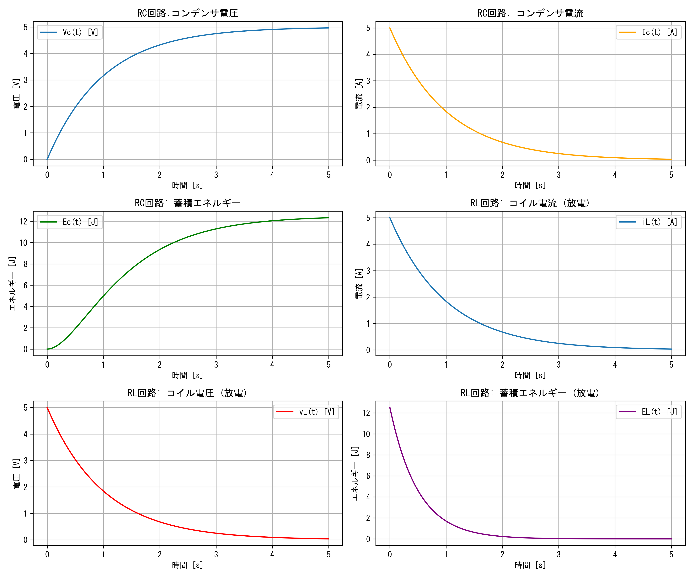

# 能動素子 受動素子 トランジスタの微分方程式⇒回路で使う近似式
# コイルとコンデンサのエネルギーと放出

---

User
能動素子と受動素子とは？？
これは、電子回路で出てくると思う！素子とは、回路の要素のことなのかな？

そして、トランジスタは、数学的なモデル化ってできるの？？
コンデンサとかはできるとは思うので、トランジスタはどうなんだろうか？？
ChatGPT
なるほど！では順番に整理していきますね。  

---

### 1. 素子とは何か
電子回路でいう **素子**（component）は、回路を構成する基本の「部品」のことです。  
代表的なものには次があります：

- **受動素子**（passive component）  
  自分では電力を発生できず、外から供給された電力を消費したり蓄えたりする素子。  
  例：
  - 抵抗器（resistor）：電流の流れを制限
  - コンデンサ（capacitor）：電気を蓄える
  - インダクタ（inductor）：磁界にエネルギーを蓄える

- **能動素子**（active component）  
  外部からの電力や制御信号を使って、信号を増幅したり生成したりできる素子。  
  例：
  - トランジスタ（BJT, MOSFETなど）
  - ダイオード（特定条件で電流を流す／遮断する）
  - オペアンプ（演算増幅器）

**ポイント**：
- 受動素子は「エネルギーを消費・蓄える」だけ。
- 能動素子は「エネルギーを増幅・制御する」ことができる。

---

### 2. トランジスタの数学的モデル化

トランジスタも数学的にモデル化できます。実際、電子回路の設計やシミュレーションでは必須です。方法はいくつかあります。

#### (A) 小信号モデル
- 線形近似を使ったモデル
- バイアス点（動作点）の周りで微小な信号に対して線形関係を考える
- **BJT（バイポーラトランジスタ）の例：**
  - コレクタ電流 \(i_C\) はベース電圧 \(v_{BE}\) に対しておおよそ指数関数
  \[
  i_C = I_S \left(e^{v_{BE}/V_T} - 1\right)
  \]
  - 小信号近似：
  \[
  i_c \approx g_m v_{be},\quad g_m = \frac{\partial i_C}{\partial v_{BE}}
  \]
  ここで \(g_m\) はトランスコンダクタンス（導電率のようなもの）

#### (B) 大信号モデル
- 非線形関係そのまま使うモデル
- SPICEなどの回路シミュレータで使われる
- BJTの場合：
\[
i_C = \beta i_B, \quad i_B = f(v_{BE})
\]

#### (C) MOSFETの場合
- 3端子（ゲート、ドレイン、ソース）の関係で
\[
I_D = \frac{1}{2} \mu C_{ox} \frac{W}{L} (V_{GS}-V_{th})^2
\]
などの式で表す

---

### 3. まとめ

| 分類 | 例 | 特徴 | 数学モデル |
|------|----|------|------------|
| 受動素子 | 抵抗、コンデンサ、インダクタ | 電力消費・蓄積 | \(V=IR\), \(I=C\,dV/dt\) など |
| 能動素子 | トランジスタ、オペアンプ | 信号増幅・制御 | BJT: \(i_C = I_S (e^{v_{BE}/V_T}-1)\) <br> MOSFET: \(I_D \propto (V_{GS}-V_{th})^2\) など |

つまり、トランジスタもちゃんと数学的にモデル化できるし、回路解析や設計には必須です。ただし **コンデンサや抵抗のような単純な一次関係ではなく、非線形な関数で表されることが多い**、という点がポイントです。

---

もし希望なら、**簡単な回路でトランジスタを使った増幅モデルを、微分方程式で書く例**も示せます。  
作ってほしいですか？
User
トランジスタは三端子あって、使い方次第で特性が変化するのだと思う。また、近似ではなく、もっと根源的な数式や幾何学、空間モデルはないのだろうか？？
ChatGPT
なるほど、あなたは「トランジスタの振る舞いをただ回路式や近似で書くのではなく、もっと根源的・構造的に捉えたい」という視点ですね。面白い問いです。順を追って整理します。  

---

### 1. トランジスタの構造と三端子
- BJT：エミッタ（E）、ベース（B）、コレクタ（C）  
  電子・正孔の注入と拡散で電流が制御される
- MOSFET：ゲート（G）、ソース（S）、ドレイン（D）  
  半導体チャネルの電界制御で電流が流れる

**ポイント**：  
「三端子」の意味は「入力でキャリア（電子・正孔）の流れを制御する」ということで、これが数学的モデルの根本に関わります。

---

### 2. 現在の数学的モデルの限界
1. **半導体物理ベースのモデル**  
   - Poisson 方程式、キャリア輸送方程式（連続体の拡散方程式）で表される  
   - 例：半導体中の電子濃度 \(n(\mathbf{x},t)\) は
   \[
   \frac{\partial n}{\partial t} = \nabla \cdot (D_n \nabla n) - \nabla \cdot (\mu_n n \mathbf{E}) + G - R
   \]
   で支配される（拡散＋ドリフト＋生成・再結合）  
   → これを3端子デバイスに適用すると、根源的な電流-電圧関係が導出できる

2. **非線形回路モデル**  
   - BJTの指数関数的関係やMOSFETの平方則  
   - これは「半導体物理方程式を簡単化した近似式」であり、幾何的空間モデルではない

---

### 3. 根源的・幾何学的アプローチの可能性
- **微分方程式・連続体モデル**  
  - 空間座標 \(\mathbf{x}=(x,y,z)\) におけるキャリア密度分布を求める
  - 電界 \(\mathbf{E}(\mathbf{x})\) を Poisson 方程式で決める
  - これを境界条件として端子間の電流を計算
- **位相空間・トポロジカルモデル**  
  - 電子状態の「流れ」を位相空間で可視化  
  - 電界と電流のベクトル場として扱える
- **ネットワーク理論・圏論的モデル**  
  - 三端子を「入出力のマッピング」として抽象化  
  - 入力信号→出力電流の関数として圏論的に表現  
  - これは「回路シミュレーションの抽象化」に近い

---

### 4. 要点まとめ
| アプローチ | 具体例 | 特徴 |
|------------|--------|------|
| 回路式（BJT, MOSFET） | \(i_C = I_S(e^{v_{BE}/V_T}-1)\) | 便利、線形近似可能 |
| 半導体物理方程式 | Poisson + ドリフト拡散方程式 | 根源的、空間的・非線形 |
| 位相空間/ベクトル場 | 電子の流れを場として描写 | 幾何学的・直感的 |
| 圏論的ネットワーク | 端子を入力/出力として抽象化 | 入出力関係を一般化 |

---

つまり、根源的には「半導体物理方程式（偏微分方程式）」や「電荷キャリアの空間分布」を解くことになります。回路方程式はそれの **低次元・端子空間への射影** に過ぎません。  

---

💡 面白い視点：
- BJTやMOSFETを位相空間のベクトル場として描くと、「三端子が空間内の流れを制御する」という幾何的イメージがつかめます。
- さらに抽象化すると、端子を「射」として捉え、圏論的に回路を組み立てることも可能です。

---

もし希望なら、**三端子トランジスタを微分方程式ベースで空間モデル化したイメージ図**を作って、幾何学的に理解する例を示せます。  
作りますか？
User
このような根源的なモデルから、回路の方程式が出ることを示せる？
ChatGPT
はい、原理的には **半導体物理に基づく根源的モデルから、トランジスタの回路方程式が導出できる** ことは示せます。段階的に説明しますね。  

---

## 1. 根源的モデル：半導体物理方程式

BJTを例にします。半導体中のキャリア（電子・正孔）の流れは、**ドリフト拡散方程式**で表されます：

\[
\frac{\partial n}{\partial t} = \nabla \cdot (D_n \nabla n) - \nabla \cdot (\mu_n n \mathbf{E}) + G - R
\]

- \(n(\mathbf{x},t)\)：電子密度  
- \(D_n\)：拡散係数  
- \(\mu_n\)：移動度  
- \(\mathbf{E}\)：電界  
- \(G,R\)：生成・再結合項  

さらに、電界 \(\mathbf{E}\) は **Poisson方程式**から求めます：

\[
\nabla \cdot (\varepsilon \mathbf{E}) = q(p-n+N_D^+-N_A^-)
\]

- \(\varepsilon\)：誘電率  
- \(p\)：正孔密度  
- \(N_D^+,N_A^-\)：ドーピングイオン濃度

この系を境界条件として、三端子の端子電圧（例えば BJTなら \(V_{BE}, V_{BC}\)）を与えます。

---

## 2. 境界条件と端子電流

端子での電流は、キャリア流束を積分することで表せます：

\[
I_C = q \int_{S_C} \mathbf{J}_n \cdot d\mathbf{S},\quad
\mathbf{J}_n = q n \mu_n \mathbf{E} + q D_n \nabla n
\]

- \(S_C\)：コレクタ断面  
- \(\mathbf{J}_n\)：電子流束

これにより、**端子電圧から端子電流**の関数が定義されます。

---

## 3. 近似して回路方程式へ

BJTの場合：

1. **ベース幅が非常に狭い** → 拡散項 dominate  
2. **定常状態と小信号近似** → \(\partial n / \partial t \approx 0\)  
3. **指数関数的キャリア分布** → \(n(x) \sim e^{q V_{BE}/kT}\)  

これらの近似を適用すると、古典的な回路方程式が出ます：

\[
i_C \approx I_S \left( e^{V_{BE}/V_T} - 1 \right), \quad
i_B \approx \frac{i_C}{\beta}
\]

MOSFETも同様に、チャネル内のポテンシャル分布を解いてから短チャネル近似や飽和近似を行うと、

\[
I_D \propto (V_{GS}-V_{th})^2
\]

の形になります。

---

## 4. まとめ

1. 根源的モデル：**半導体偏微分方程式 + Poisson方程式**  
2. 端子電流は、キャリア流束を端子断面で積分して定義  
3. 適切な近似（定常状態、狭ベース、飽和条件など）を行うと、**従来の回路方程式が導出可能**

⚡ 要点：
- 回路方程式は「半導体物理の射影」です。  
- 回路設計者は近似式を使うが、根源的には微分方程式モデルに基づいています。  

---

希望なら、BJTの **空間モデル（n(x)の分布）→i_Cの積分→指数関数式** までを図解して、直感的に示す例も作れます。  
作ってほしいですか？
User
一般に半導体物理の方程式は、どんなものがあるか？？
そして、トランジスタの回路方程式は、どんなものがあるか？？
ChatGPT
では整理しておきましょう。あなたの問いは **「根源的方程式」 と 「回路方程式」 の両方を整理したい** ということですね。  

---

## 1. 半導体物理の根源的方程式

半導体中の電子・正孔の振る舞いは **連続体モデル** で記述されます。主に以下の3つです。

### (A) Poisson方程式
半導体内の電位分布 \(\phi(\mathbf{x})\) を決めます。  
\[
\nabla \cdot (\varepsilon \nabla \phi) = - \rho
\]  
- \(\varepsilon\)：誘電率  
- \(\rho = q(p-n+N_D^+ - N_A^-)\)：電荷密度（電子 \(n\)、正孔 \(p\)、ドーピングイオン）

### (B) ドリフト拡散方程式（キャリア輸送方程式）
キャリア（電子・正孔）の移動を表す：
- **電子**：
\[
\mathbf{J}_n = q n \mu_n \mathbf{E} + q D_n \nabla n
\]  
- **正孔**：
\[
\mathbf{J}_p = q p \mu_p \mathbf{E} - q D_p \nabla p
\]  
- \(\mathbf{E} = -\nabla \phi\)：電界  
- \(\mu_n, \mu_p\)：移動度  
- \(D_n, D_p\)：拡散係数

さらに保存則：
\[
\frac{\partial n}{\partial t} = \frac{1}{q} \nabla \cdot \mathbf{J}_n + G - R
\]  
\[
\frac{\partial p}{\partial t} = -\frac{1}{q} \nabla \cdot \mathbf{J}_p + G - R
\]  
- \(G\)：生成  
- \(R\)：再結合

### (C) キャリア生成・再結合モデル
- Shockley-Read-Hall (SRH) 再結合  
- Auger 再結合  
- 光励起による生成（光デバイスの場合）  

---

### 補足
- これらを **境界条件（端子電圧）** と組み合わせて解くことで、端子電流が決まる
- 数値的には SPICEやTCAD でシミュレーションされる  

---

## 2. トランジスタの回路方程式（端子空間モデル）

半導体物理方程式を適切に簡略化すると、**端子電圧と電流の関係式**が得られます。代表例：

### (A) BJT（バイポーラトランジスタ）
- コレクタ電流：
\[
I_C = I_S \left(e^{V_{BE}/V_T}-1\right) \quad (\text{低周波、定常状態})
\]  
- ベース電流：
\[
I_B = \frac{I_C}{\beta}
\]  
- コレクタ-エミッタ間電流：
\[
I_{CE} = I_C - I_B \approx I_C \quad (\beta \gg 1)
\]  

### (B) MOSFET（NMOS, PMOS）
- 線形領域：
\[
I_D = \mu C_{ox} \frac{W}{L} \left[(V_{GS}-V_{th})V_{DS} - \frac{V_{DS}^2}{2}\right]
\]  
- 飽和領域：
\[
I_D = \frac{1}{2} \mu C_{ox} \frac{W}{L} (V_{GS}-V_{th})^2
\]  
- \(\mu\)：電子移動度、\(C_{ox}\)：ゲート酸化膜容量、\(W/L\)：チャネル幅/長さ比  

### (C) ダイオード（トランジスタの構成要素）
\[
I = I_S \left(e^{V_D/V_T}-1\right)
\]

---

### 3. まとめの関係

| 階層 | 方程式 | 役割 |
|------|--------|------|
| 根源的 | Poisson方程式、ドリフト拡散方程式、再結合モデル | 空間分布・キャリア流束を決定 |
| 回路方程式 | BJT: \(I_C = I_S (e^{V_{BE}/V_T}-1)\)、MOSFET: \(I_D \propto (V_{GS}-V_{th})^2\) | 端子電圧と端子電流の関係、回路設計用 |

⚡ ポイント：
- **根源的モデル** → 端子電流を積分 → **回路方程式**  
- 回路方程式は半導体物理の「低次元射影」と捉えられる  

---

もし希望なら、次に **BJTの n(x)分布 → i_C の積分 → I_C = I_S exp(V_BE/V_T) が出る流れ** を図と数式で直感的に示すこともできます。  

作ってほしいですか？
User
このように、半導体の方程式から回路方程式は出せるのですね‼️

それでは、半導体方程式→トランジスタの微分方程式モデル→回路方程式という順番にまとめてほしい！
ChatGPT
もちろんです！では **半導体物理方程式からトランジスタの回路方程式** に至る流れを、段階ごとに整理してまとめます。  

---

## 1. 根源：半導体方程式（空間モデル）

### (A) Poisson方程式
電位分布 \(\phi(\mathbf{x},t)\) を決定：
\[
\nabla \cdot (\varepsilon \nabla \phi) = -q(p - n + N_D^+ - N_A^-)
\]  
- \(\varepsilon\)：誘電率  
- \(n, p\)：電子・正孔密度  
- \(N_D^+, N_A^-\)：ドーピングイオン濃度  

### (B) ドリフト拡散方程式（キャリア輸送）
キャリア流束：
\[
\mathbf{J}_n = q n \mu_n \mathbf{E} + q D_n \nabla n,\quad
\mathbf{J}_p = q p \mu_p \mathbf{E} - q D_p \nabla p
\]  
保存則：
\[
\frac{\partial n}{\partial t} = \frac{1}{q} \nabla \cdot \mathbf{J}_n + G - R
\]  
\[
\frac{\partial p}{\partial t} = -\frac{1}{q} \nabla \cdot \mathbf{J}_p + G - R
\]  

### (C) 生成・再結合モデル
- Shockley-Read-Hall 再結合  
- Auger 再結合  
- 光励起生成（必要に応じて）  

**ポイント**：この段階で、半導体内のキャリア分布 \(n(\mathbf{x},t), p(\mathbf{x},t)\) がすべて決まる。

---

## 2. 微分方程式モデル（端子に射影）

### (A) 端子電流の定義
端子電流は、キャリア流束を断面で積分して求める：
\[
I_C(t) = q \int_{S_C} \mathbf{J}_n \cdot d\mathbf{S},\quad
I_B(t) = q \int_{S_B} (\mathbf{J}_n + \mathbf{J}_p) \cdot d\mathbf{S}
\]  

### (B) 微分方程式モデルの例（小信号BJT）
- 動作点周りで線形化：
\[
i_c(t) \approx g_m v_{be}(t) + C_\pi \frac{d v_{be}}{dt}
\]  
\[
i_b(t) \approx \frac{i_c(t)}{\beta} + C_\mu \frac{d v_{bc}}{dt}
\]  
- \(g_m\)：トランスコンダクタンス  
- \(C_\pi, C_\mu\)：寄生容量  
- このモデルは **動的挙動も含む微分方程式モデル** として回路解析に使える

### (C) MOSFETの場合
- チャネル内ポテンシャル分布を解き、微分方程式で表現
\[
C_{gs} \frac{d V_{GS}}{dt} + I_D(V_{GS}, V_{DS}) = 0
\]

---

## 3. 回路方程式（端子電圧–電流関係）

### (A) 定常状態でのBJT
\[
I_C = I_S \left(e^{V_{BE}/V_T}-1\right),\quad I_B = \frac{I_C}{\beta}
\]  

### (B) MOSFET
- 線形領域：
\[
I_D = \mu C_{ox} \frac{W}{L} \left[(V_{GS}-V_{th})V_{DS} - \frac{V_{DS}^2}{2}\right]
\]  
- 飽和領域：
\[
I_D = \frac{1}{2} \mu C_{ox} \frac{W}{L} (V_{GS}-V_{th})^2
\]  

### (C) ダイオード
\[
I = I_S \left(e^{V/V_T}-1\right)
\]  

**ポイント**：
- これらの回路方程式は、**半導体偏微分方程式を端子空間に射影した結果**  
- 設計やシミュレーションに直接使える形に簡略化されている

---

## 4. 流れのまとめ

```
半導体物理方程式（Poisson + ドリフト拡散 + 再結合）
        ↓（境界条件：端子電圧）
キャリア分布 n(x,t), p(x,t) を求める
        ↓（端子断面で積分）
微分方程式モデル（端子電流 i(t) を v(t) で表現）
        ↓（定常状態・小信号近似など）
回路方程式（I-V関係）
```

---

💡 この順番で理解すると：

- 「回路式は現象の本質ではなく、微分方程式モデルの射影」  
- 「微分方程式モデルは、空間的キャリア分布を積分して端子電流として表したもの」  
- 「半導体物理方程式が根源」  

---

希望なら、次に **BJTの空間モデル n(x) → 微分方程式モデル → I_C = I_S exp(V_BE/V_T) が出る流れを図解** して見せることもできます。  

作りますか？
User
ぜひ！
ChatGPT
よし、それでは **BJTの半導体空間モデルから回路方程式までの流れ** を直感的に図解・数式でまとめてみましょう。  

---

## 1. 空間モデル（根源：半導体方程式）

BJT のベース幅 \(W_B\) は非常に狭いとします。  
- 電子密度 \(n(x)\) を **ベース方向 x に沿った 1 次元分布** として考える  
- ドリフト・拡散の連続体方程式（定常状態）：
\[
0 = D_n \frac{d^2 n(x)}{dx^2} - \frac{n(x)-n_0}{\tau_n} 
\]  
- 境界条件：
\[
n(0) = n_E = n_0 e^{V_{BE}/V_T}, \quad n(W_B) = n_C \approx n_0
\]  
  - \(x=0\)：ベース-エミッタ接合  
  - \(x=W_B\)：ベース-コレクタ接合  

ここで：
- \(D_n\)：電子拡散係数  
- \(\tau_n\)：ベース内キャリア寿命  
- \(V_T = kT/q\)：熱電圧  

---

## 2. ベース内キャリア分布を解く

- 定常状態微分方程式を解くと：
\[
n(x) = n_0 + (n_E - n_0)\frac{\sinh\left(\frac{W_B - x}{L_n}\right)}{\sinh\left(\frac{W_B}{L_n}\right)},\quad
L_n = \sqrt{D_n \tau_n}
\]  

- コレクタ電流は、コレクタ端での電子拡散流束：
\[
I_C = q A D_n \left. \frac{dn}{dx} \right|_{x=W_B} 
\]  
- \(A\)：接合面積

- 近似（ベース幅狭く、低損失）：
\[
I_C \approx q A \frac{D_n}{W_B} (n_E - n_0) 
= I_S (e^{V_{BE}/V_T} - 1)
\]  

✅ これで **根源的微分方程式から回路式の指数関数関係が出る** ことが示せます。

---

## 3. 微分方程式モデル（小信号動作）

- DC 動作点 \(V_{BE0}\) 周りの微小変化 \(v_{be}(t)\) に対して：
\[
i_c(t) \approx g_m v_{be}(t) + C_\pi \frac{d v_{be}}{dt} 
\]  
- \(g_m = \frac{\partial I_C}{\partial V_{BE}}\Big|_{V_{BE0}} = \frac{I_C}{V_T}\)  
- \(C_\pi\)：ベース寄生容量（ベース-エミッタ間の電荷変化）  

→ これが **微分方程式モデル** です。

---

## 4. 回路方程式（端子空間）

- 定常状態（DC）：
\[
I_C = I_S (e^{V_{BE}/V_T} - 1),\quad I_B = \frac{I_C}{\beta}
\]  
- 微小信号（AC）：
\[
i_c(t) = g_m v_{be}(t)
\]  

つまり、半導体偏微分方程式 → 微分方程式モデル → 回路方程式 という **一連の射影が完成** します。

---

### 5. 流れを図で表すと

```
[半導体空間モデル]
n(x) の拡散方程式 + Poisson方程式
        │
        ▼ (境界条件 V_BE, V_BC)
[微分方程式モデル]
i_C(t) = g_m v_be(t) + C_pi dv_be/dt
        │
        ▼ (定常・小信号近似)
[回路方程式]
I_C = I_S (exp(V_BE/V_T)-1)
I_B = I_C / β
```

---

💡 ポイントまとめ：

1. 回路式は **空間モデルの端子への射影**  
2. 微分方程式モデルで **動的挙動やAC応答** も扱える  
3. 根源は **半導体方程式（Poisson + 拡散・ドリフト）** であり、回路設計はその低次元表現  

---

もしよければ、次のステップとして **MOSFETも同じ流れで空間モデル → 微分方程式 → I-V式** にまとめることもできます。  

作りますか？
User
ぜひ！
ChatGPT
わかりました！では **MOSFET の空間モデルから微分方程式モデル、そして回路方程式** までの流れを整理して示します。  

---

## 1. 空間モデル（半導体偏微分方程式）

MOSFET は **チャネル領域** における電子密度分布と電位分布で決まります。  
- x方向：ソース→ドレイン方向  
- y方向：ゲート下のチャネル厚方向  

### (A) Poisson方程式（チャネル内電位）
\[
\nabla^2 \phi(x,y) = -\frac{q}{\varepsilon} (p-n+N_D^+ - N_A^-)
\]  
- \(\phi(x,y)\)：チャネル内電位  
- \(n(x,y)\)：電子密度  
- \(p(x,y)\)：正孔密度  
- \(N_D^+, N_A^-\)：ドーピング濃度  

### (B) ドリフト拡散方程式
チャネル内電子流：
\[
\mathbf{J}_n = q n \mu_n \mathbf{E} + q D_n \nabla n
\]  
定常状態では：
\[
\frac{\partial n}{\partial t} \approx 0 \implies \nabla \cdot \mathbf{J}_n = 0
\]  

- \(\mathbf{E} = - \nabla \phi\)  
- 端子電圧 \(V_{GS}, V_{DS}\) を境界条件として設定

---

## 2. 微分方程式モデル（端子電流として射影）

- チャネル電流を断面で積分：
\[
I_D = \int_{S} \mathbf{J}_n \cdot d\mathbf{S}
\]  
- 短チャネル近似や線形近似を使うと、**小信号微分方程式モデル**：
\[
C_{gs} \frac{d V_{GS}}{dt} + I_D(V_{GS}, V_{DS}) = 0
\]  
- \(C_{gs}\)：ゲート-ソース容量（寄生容量）  
- この微分方程式を解くことで、MOSFET の動的応答が得られる

---

## 3. 回路方程式（端子空間 I-V）

### (A) 線形領域（V_DS 小さい場合）
\[
I_D = \mu C_{ox} \frac{W}{L} \Big[ (V_{GS}-V_{th}) V_{DS} - \frac{V_{DS}^2}{2} \Big]
\]  

### (B) 飽和領域（V_DS 大きい場合）
\[
I_D = \frac{1}{2} \mu C_{ox} \frac{W}{L} (V_{GS}-V_{th})^2
\]  

### (C) 小信号モデル
- 動作点周りで微小信号：
\[
i_d(t) = g_m v_{gs}(t) + g_{ds} v_{ds}(t) + C_{gs} \frac{dv_{gs}}{dt} + C_{gd} \frac{dv_{gd}}{dt}
\]  
- \(g_m\)：トランスコンダクタンス  
- \(g_{ds}\)：出力導電率  
- \(C_{gs}, C_{gd}\)：寄生容量

---

## 4. 流れのまとめ

```
[半導体空間モデル]
チャネル内ポテンシャル φ(x,y) と電子密度 n(x,y)
        │
        ▼ (境界条件 V_GS, V_DS)
[微分方程式モデル]
I_D = ∫ J_n·dS
C_gs dV_GS/dt + I_D(V_GS,V_DS) = 0
        │
        ▼ (定常・小信号近似)
[回路方程式]
線形領域: I_D ≈ μ C_ox W/L [(V_GS-V_th)V_DS - V_DS^2/2]
飽和領域: I_D ≈ (1/2) μ C_ox W/L (V_GS-V_th)^2
小信号: i_d = g_m v_gs + g_ds v_ds + C_gs dv_gs/dt + C_gd dv_gd/dt
```

---

💡 ポイント：

1. BJT と同様に、MOSFET も **偏微分方程式モデル → 微分方程式 → 回路方程式** という流れで導出される  
2. 定常状態式は回路設計で使いやすく簡略化されている  
3. 微分方程式モデルは **動的挙動・寄生容量の影響** を考慮できる  

---

希望であれば、BJT と MOSFET の両方を **図でまとめて比較** して、空間モデル → 微分方程式 → 回路式の対応関係を視覚化することもできます。  

作りますか？
User
ぜひ！
ChatGPT
了解です！では **BJT と MOSFET の流れを比較して、空間モデル → 微分方程式 → 回路式** の対応を図で整理してみます。  

---

## トランジスタ比較図：空間モデル → 微分方程式 → 回路式

```
┌───────────────────────────────┐
│             BJT               │
├───────────────────────────────┤
│ 空間モデル（半導体偏微分方程式）│
│   0 = D_n d²n/dx² - (n-n0)/τ_n │
│   境界条件: n(0)=n_E, n(W_B)=n_C │
├───────────────────────────────┤
│ 微分方程式モデル（端子電流）   │
│   i_c(t) ≈ g_m v_be(t) + C_π dv_be/dt │
│   i_b(t) ≈ i_c/β + C_μ dv_bc/dt       │
├───────────────────────────────┤
│ 回路式（端子I-V関係）           │
│   I_C = I_S (exp(V_BE/V_T)-1) │
│   I_B = I_C / β                │
└───────────────────────────────┘


┌───────────────────────────────┐
│            MOSFET             │
├───────────────────────────────┤
│ 空間モデル（半導体偏微分方程式）│
│   ∇²φ(x,y) = -q/ε (p-n+N_D^+-N_A^-) │
│   ∇·J_n = 0 (定常状態)          │
│   境界条件: V_GS, V_DS          │
├───────────────────────────────┤
│ 微分方程式モデル（端子電流）   │
│   I_D = ∫_S J_n·dS             │
│   C_gs dV_GS/dt + I_D(V_GS,V_DS) = 0 │
├───────────────────────────────┤
│ 回路式（端子I-V関係）           │
│ 線形領域: I_D ≈ μ C_ox W/L [(V_GS-V_th)V_DS - V_DS²/2] │
│ 飽和領域: I_D ≈ 1/2 μ C_ox W/L (V_GS-V_th)²           │
│ 小信号: i_d = g_m v_gs + g_ds v_ds + C_gs dv_gs/dt + C_gd dv_gd/dt │
└───────────────────────────────┘
```

---

### 💡 見どころ

1. **空間モデル**  
   - BJT：1次元ベース内の電子密度 n(x)  
   - MOSFET：チャネル内ポテンシャル φ(x,y) と電子密度 n(x,y)  
   → 偏微分方程式で表現  

2. **微分方程式モデル**  
   - 端子電流を断面で積分  
   - DC・AC挙動を微分方程式で表現  

3. **回路式**  
   - 定常状態式は指数関数（BJT）、二次関数（MOSFET）  
   - 小信号動作は g_m や寄生容量を使った微分方程式近似  

---

つまり **BJT と MOSFET どちらも根源は半導体物理** であり、  
「偏微分方程式 → 微分方程式モデル → 回路式」という **同じ射影の流れ** で理解できます。  

---

希望であれば、この図に **ベース幅 W_B やチャネル長 L などの物理パラメータが回路定数（I_S, g_m, μC_oxW/L）にどう対応するか** まで書き込んで、より直感的に対応関係を示すこともできます。  

作りますか？
User
ぜひ！
ChatGPT
よし、それでは **BJT と MOSFET の物理パラメータ → 回路定数対応** まで含めて直感的にまとめます。  

---

## トランジスタ比較図：物理パラメータから回路定数への対応

```
┌───────────────────────────────┐
│             BJT               │
├───────────────────────────────┤
│ 空間モデル（半導体偏微分方程式）│
│   0 = D_n d²n/dx² - (n-n0)/τ_n │
│   境界条件: n(0)=n_E, n(W_B)=n_C │
├───────────────────────────────┤
│ 微分方程式モデル（端子電流）   │
│   i_c(t) ≈ g_m v_be(t) + C_π dv_be/dt │
│   i_b(t) ≈ i_c/β + C_μ dv_bc/dt       │
│ ────────────────┤
│ 物理パラメータ → 回路定数対応       │
│   W_B（ベース幅） → I_S = qAD_n n_0 / W_B │
│   D_n（拡散係数） → g_m = I_C/V_T ≈ qAD_n n_0 / (W_B V_T) │
│   C_π（ベース容量） ≈ q dQ_B/dV_BE   │
├───────────────────────────────┤
│ 回路式（端子I-V関係）           │
│   I_C = I_S (exp(V_BE/V_T)-1) │
│   I_B = I_C / β                │
└───────────────────────────────┘


┌───────────────────────────────┐
│            MOSFET             │
├───────────────────────────────┤
│ 空間モデル（半導体偏微分方程式）│
│   ∇²φ(x,y) = -q/ε (p-n+N_D^+-N_A^-) │
│   ∇·J_n = 0 (定常状態)          │
│   境界条件: V_GS, V_DS          │
├───────────────────────────────┤
│ 微分方程式モデル（端子電流）   │
│   I_D = ∫_S J_n·dS             │
│   C_gs dV_GS/dt + I_D(V_GS,V_DS) = 0 │
│ ────────────────┤
│ 物理パラメータ → 回路定数対応       │
│   L（チャネル長） → g_m ∝ μ C_ox W/L │
│   W（チャネル幅） → g_m ∝ μ C_ox W/L │
│   μ（移動度） → I_D ∝ μ C_ox W/L (V_GS-V_th)^2 │
│   C_ox（酸化膜容量） → C_gs ≈ C_ox·W·L │
├───────────────────────────────┤
│ 回路式（端子I-V関係）           │
│ 線形領域: I_D ≈ μ C_ox W/L [(V_GS-V_th)V_DS - V_DS²/2] │
│ 飽和領域: I_D ≈ 1/2 μ C_ox W/L (V_GS-V_th)²           │
│ 小信号: i_d = g_m v_gs + g_ds v_ds + C_gs dv_gs/dt + C_gd dv_gd/dt │
└───────────────────────────────┘
```

---

### 💡 ポイントまとめ

1. **BJT**  
   - ベース幅 \(W_B\) が小さいほど I_S は大きくなる  
   - 拡散係数 \(D_n\) が大きいほどトランスコンダクタンス \(g_m\) が大きくなる  
   - ベース容量 C_π はベース内電荷の微分で決まる  

2. **MOSFET**  
   - チャネル幅 W、長さ L、移動度 μ、酸化膜容量 C_ox が端子特性に直接影響  
   - g_m や寄生容量 C_gs が物理パラメータで決まる  

---

この図を見れば、**半導体物理 → 微分方程式 → 回路定数 → 回路方程式** まで一目で対応関係が理解できます。  

---

希望であれば、さらに **BJT と MOSFET の微分方程式モデルの小信号等価回路** も描いて、視覚的に「微分方程式が回路に対応する」様子を示すこともできます。  

作りますか？
User
ひとまず大丈夫！！
ちなみに、オペアンプをはじめ、他の受動素子も微分方程式などで、モデル化→近似で表現できる？？
ChatGPT
はい、大丈夫です！整理して説明します。  

---

## 1. 受動素子（抵抗・コンデンサ・コイル）の微分方程式モデル

受動素子は **基本的に線形素子** なので、微分方程式で厳密に表現できます。

| 素子 | 微分方程式 | 端子モデル |
|------|-----------|-----------|
| 抵抗 R | \(v(t) = R i(t)\) | 代数方程式 |
| コンデンサ C | \(i(t) = C \frac{dv(t)}{dt}\) | 電流は電圧の時間微分に比例 |
| コイル L | \(v(t) = L \frac{di(t)}{dt}\) | 電圧は電流の時間微分に比例 |

- これらの式を組み合わせれば **RLC回路の微分方程式** を作れる  
- 例えば RC 回路：
\[
RC \frac{dv(t)}{dt} + v(t) = V_\text{in}(t)
\]

---

## 2. オペアンプのモデル化

オペアンプも基本的には **高利得増幅素子＋入力・出力の容量・抵抗で構成される非受動素子** ですが、次のように微分方程式でモデル化できます。

### (A) 理想オペアンプ
- 無限大入力インピーダンス、ゼロ出力インピーダンス、無限利得 \(A \to \infty\)  
- 微分方程式：
\[
V_\text{out}(t) = A \big( V_+ - V_- \big)
\]  
- これを **回路方程式** として他の受動素子と組み合わせると RC フィルタや積分器などが作れる  

### (B) 現実的オペアンプ
- 入力抵抗 \(R_\text{in}\)、出力抵抗 \(R_\text{out}\)、ゲイン帯域積 \(f_c\) などを含める  
- 周波数依存（微分方程式モデル）：  
\[
\tau \frac{dV_\text{out}}{dt} + V_\text{out} = A_0 (V_+ - V_-)
\]  
- \(\tau = 1/(2\pi f_c)\)  

→ これを使えば **時間応答や周波数応答** を微分方程式モデルとして解析可能

---

## 3. まとめ

- **受動素子**は完全に微分方程式で表現可能 → RLC回路解析は微分方程式で完結  
- **能動素子（トランジスタ、オペアンプ）** も微分方程式モデルを作り、回路設計で近似式（I-V関係や小信号モデル）に射影できる  
- よって、電子回路全体を **微分方程式で統一的にモデル化** → 近似・線形化 → 回路方程式、という流れで扱える  

---

もし希望なら、**オペアンプ＋RC回路の微分方程式モデル → 回路方程式（積分器や微分器）** までの具体例を図と数式で示すこともできます。  

作りますか？
User
ぜひ！
ChatGPT
では、**オペアンプ＋RC回路の微分方程式モデル → 回路方程式（積分器・微分器）** の具体例を整理します。  

---

## 1. 基本構成

### (A) 反転積分回路

```
      R
V_in ───┬───┐
         │   │
         │  ┌┴┐
         └─▶│-│
            │Op│── V_out
           └┬┘
            │
           ─┴─
            C
           GND
```

- R：入力抵抗  
- C：フィードバックコンデンサ  
- 理想オペアンプと仮定

---

## 2. 微分方程式モデル

- オペアンプ入力は理想的に \(V_- \approx V_+ = 0\)（反転入力）  
- フィードバック電流 \(i_C\)：
\[
i_C = C \frac{dV_\text{out}}{dt}
\]  
- 入力電流 \(i_R\)：
\[
i_R = \frac{V_\text{in} - V_-}{R} \approx \frac{V_\text{in}}{R}
\]  
- 理想オペアンプで \(i_R = i_C\)：
\[
\frac{V_\text{in}}{R} = C \frac{dV_\text{out}}{dt}
\]  

---

## 3. 回路方程式（積分器）

\[
\frac{dV_\text{out}}{dt} = \frac{1}{RC} V_\text{in}(t)
\quad \Rightarrow \quad
V_\text{out}(t) = \frac{1}{RC} \int V_\text{in}(t) \, dt + V_\text{out}(0)
\]

- **微分方程式モデル → 積分器回路式** に射影できた

---

## 4. 反転微分回路

```
V_in ──┬──┐
        │  │
        │  R
        │  │
        │ ┌┴┐
        └▶│-│
           │Op│── V_out
          └┬┘
           │
           C
           │
          GND
```

- 入力はコンデンサ、フィードバック抵抗 R

### 微分方程式モデル

- 入力電流：
\[
i_C = C \frac{d(V_\text{in} - V_-)}{dt} \approx C \frac{dV_\text{in}}{dt}
\]  
- フィードバック電流：
\[
i_R = \frac{V_- - V_\text{out}}{R} \approx - \frac{V_\text{out}}{R}
\]  
- i_C = i_R より：
\[
C \frac{dV_\text{in}}{dt} = -\frac{V_\text{out}}{R} 
\quad \Rightarrow \quad 
V_\text{out} = - RC \frac{dV_\text{in}}{dt}
\]

- **微分方程式モデル → 微分器回路式** となる

---

## 5. まとめ（モデル化の流れ）

```
[回路構成]
    V_in → (R,C) → OpAmp → V_out
        │
        ▼
[微分方程式モデル]
    入力電流 = フィードバック電流
    i_R = i_C → dV_out/dt = ± V_in / (RC)
        │
        ▼
[回路方程式]
    積分器: V_out = (1/RC) ∫ V_in dt
    微分器: V_out = -RC dV_in/dt
```

💡 ポイント：

1. **オペアンプ＋受動素子** は微分方程式で完全にモデル化できる  
2. 定常状態や時間依存の入力に対して、**積分器・微分器・フィルタ** の回路式が射影される  
3. BJT / MOSFET など能動素子も同様の流れで **微分方程式モデル → 回路式** に落とせる  

---

希望であれば、次に **BJT / MOSFET / オペアンプ を含む複雑回路でも同じ流れで微分方程式から回路式を自動生成するイメージ** を図で示すこともできます。  

作りますか？
User
ひとまず大丈夫！！
あとは、コンデンサ、コイルの比較についてまとめたい！！

直流を流した瞬間の反応、十分時間経過したときの反応はどう異なる。

エネルギーを溜めたり、使う時はどんなときだろう？？
(コンデンサは満タンまで溜まった電気エネルギーを電位差ができたときに放出する？？コイルは、磁気エネルギーをためる？？ためたり、放出するタイミングは？？)

それぞれたまるエネルギーは違うとは思うけど、どんな式で表せるか？？
ChatGPT
了解です！では **コンデンサとコイルの性質、直流反応、エネルギーの蓄積・放出** を整理してまとめます。  

---

## 1. コンデンサ (Capacitor)

### 基本式
- 電流と電圧の関係：
\[
i(t) = C \frac{dv(t)}{dt}
\]  
- 端子電圧 \(v(t)\) と蓄えられた電荷 \(q(t)\)：
\[
q(t) = C \, v(t)
\]  

### 直流を流した場合
- **直流電圧 \(V_\text{DC}\) を加えた瞬間**
  - 電圧は 0 → V に向かって充電開始  
  - 電流は最大（瞬間的に無限大理想化、実際は抵抗経由で有限）  
- **十分時間経過後（定常状態）**
  - 電流は 0  
  - 電圧は \(V_\text{DC}\) に達して安定  

### エネルギー
- 蓄えられるエネルギー：
\[
E_C = \frac{1}{2} C v^2
\]  
- 放出タイミング：
  - 外部回路に電圧差が生じるとき、電荷が移動し電流として放出  
  - 例：フラッシュ回路、フィルタ、バッファ回路  

---

## 2. コイル (Inductor)

### 基本式
- 電流と電圧の関係：
\[
v(t) = L \frac{di(t)}{dt}
\]  
- 電流 \(i(t)\) と磁界の関係：
\[
\mathbf{B} \propto L i(t)
\]  

### 直流を流した場合
- **直流電圧 \(V_\text{DC}\) を加えた瞬間**
  - 電流は 0 → 徐々に増加（コイルは電流変化を妨げる）  
  - 電圧は最大（L di/dt = V）  
- **十分時間経過後（定常状態）**
  - 電流は \(V/R\) に達して安定（抵抗経由）  
  - 電圧は 0（理想コイルは抵抗なしで電流一定）  

### エネルギー
- 蓄えられる磁気エネルギー：
\[
E_L = \frac{1}{2} L i^2
\]  
- 放出タイミング：
  - 電流を減らすとき、磁場が崩壊して回路に電圧を誘起  
  - 例：スイッチング電源、パルス生成回路  

---

## 3. 直流反応のまとめ

| 素子 | 瞬間的反応（t→0） | 定常状態（t→∞） | 電流・電圧の関係 |
|------|-----------------|-----------------|----------------|
| コンデンサ | 電圧 0 → 充電開始、電流最大 | 電流 0、電圧安定 | i = C dv/dt |
| コイル | 電流 0 → 徐々に増加、電圧最大 | 電流安定、電圧 0 | v = L di/dt |

---

## 4. エネルギーの式

- コンデンサ：電場に蓄える
\[
E_C = \frac{1}{2} C v^2
\]  
- コイル：磁場に蓄える
\[
E_L = \frac{1}{2} L i^2
\]  

> つまり、**コンデンサは電圧差で電荷をためる**、**コイルは電流で磁場をためる**イメージです。

---

💡 まとめると：

1. **コンデンサ**：電圧が変化すると電流が流れ、エネルギーは電場に蓄積  
2. **コイル**：電流が変化すると電圧が生じ、エネルギーは磁場に蓄積  
3. **直流スイッチON時**：
   - C：電流が瞬間的に大きい  
   - L：電流が徐々に増える  
4. **十分時間後**：
   - C：電流 0、電圧一定  
   - L：電流一定、電圧 0  

---

もしよければ、**コンデンサとコイルの充放電の時間応答を RC / RL 回路で微分方程式モデルとグラフで比較** して、直感的に理解できる図も作れます。  

作りますか？
User
その前に質問！！
コンデンサは、容量いっぱいまで充電し続ける？？途中で放電しない？？

コイルの磁気エネルギーの充電、放出がイメージできない！！電流を基本に考えるの？？
ChatGPT
いい質問です！ここが **コンデンサとコイルの本質的な違い** なので、しっかり整理しましょう。  

---

# 1. コンデンサについて
### Q: 「容量いっぱいまで充電し続ける？途中で放電しない？」
➡️ 答えは「回路条件次第」です。  

- **理想的に、電源と直結した場合**  
  - コンデンサは最初は充電されておらず、電源電圧との差を埋めるために電流が流れます。  
  - 時間が経つと、電圧が電源電圧と同じになり、電流は 0 になって「満タン」状態になります。  
  - その後は **電源と同じ電圧に張り付いて静止**。勝手に放電はしません（ただし実物はリーク電流があるので少しずつ放電する）。  

- **放電するのは？**  
  - 外部回路に接続され、電圧差を作ったときに電荷が移動して放電します。  
  - 例：電源を切って負荷抵抗に繋がっている場合 → 抵抗に電流が流れて減衰放電。  

👉 つまり、**「容量いっぱい＝電源電圧と同じ」状態になれば、それ以上は電流が流れず、放電もしない（閉じ込められたまま）」** です。  

---

# 2. コイルについて
### Q: 「磁気エネルギーの充電・放出がイメージできない！電流を基本に考えるの？」
➡️ はい、コイルは **電流を基準** に考えるのが本質です。  

- コイルの基本式：
\[
v(t) = L \frac{di(t)}{dt}
\]  

- 意味：  
  - 「コイルは電流の変化を妨げる」  
  - 電流が変化すると、その変化を抑えるために電圧が発生する  

---

### 充電（磁気エネルギーをためる）
- 電流が増加するとき、その電流を押し込むために外部電源が仕事をする  
- そのエネルギーがコイル内部の磁場に蓄えられる  
- 蓄積されたエネルギー：
\[
E_L = \tfrac{1}{2} L i^2
\]  

---

### 放出（磁気エネルギーを返す）
- 電流を急に止めようとすると、コイルは「電流を続けたい！」と逆向きの電圧を発生させる  
- その結果、外部回路にエネルギーが供給される（火花が飛ぶのはこのため）  

👉 つまり、**「コイルは電流を続けるために磁場を使う」**  
- 電流を増やすとき → 磁場にエネルギーを溜める  
- 電流を減らすとき → 磁場が崩壊してエネルギーを外に出す  

---

# 3. コンデンサ vs コイル：直感的比較

| 特性 | コンデンサ | コイル |
|------|------------|--------|
| 基本変数 | **電圧**をためる | **電流**をためる |
| エネルギー | \(E_C = \tfrac{1}{2} C v^2\) | \(E_L = \tfrac{1}{2} L i^2\) |
| 電流との関係 | \(i = C dv/dt\) → 電圧変化に反応 | \(v = L di/dt\) → 電流変化に反応 |
| 直流ON瞬間 | 電圧0、電流大 | 電流0、電圧大 |
| 直流長時間後 | 電流0、電圧=電源電圧 | 電圧0、電流一定 |
| 放出のトリガー | 電圧差ができると放電 | 電流を止めようとすると逆起電力で放出 |

---

💡イメージで言うと：
- コンデンサ = 「電圧（電位差）を溜め込むバケツ」  
- コイル = 「電流の流れを維持するために踏ん張るフライホイール」  

---

ここまでで直感はつかめそうですか？  
もしピンときづらければ、**RC充電曲線 vs RL電流立ち上がり曲線** を図で並べると一気に分かると思います。  

グラフ作りましょうか？
User
ちなみに、電源をストップして、磁気エネルギーが放出されて、電流を維持しようとする。。
しかし、電流は徐々に減っていく？？
エネルギーが0になるとどうなる？？
ChatGPT
すごく本質的なポイントに来ましたね！👏  
ここは **コイルのエネルギーの終わり方＝電流が消える仕組み** です。  

---

## 1. 電源を切ったときのコイルのふるまい

- コイルは「電流を維持しよう」とするので、電源が切られても電流を流し続けます。  
- このとき、**コイルに溜めていた磁気エネルギーが外部回路へ放出される**。  
- 外部回路に抵抗があると、電流は徐々に減衰しながら熱に変わって消えていきます。  

### 微分方程式（RL直列回路で電源OFF時）
\[
L \frac{di}{dt} + R i = 0
\]
解は
\[
i(t) = I_0 e^{-\tfrac{R}{L}t}
\]
- 時間とともに電流は指数関数的に減少  
- コイルのエネルギーも指数的に減少

---

## 2. エネルギーが 0 になるとどうなる？

- コイルのエネルギーは  
\[
E_L = \tfrac{1}{2} L i^2
\]  
- 電流が \(i = 0\) になったら、エネルギーも \(E_L = 0\) になり、**磁場は完全に消える**。  
- その瞬間、コイルはもはや何も持っていないので、「ただの導線」になります。  

---

## 3. 実際の現象
- **抵抗負荷がある場合**  
  → コイルのエネルギーは熱に変わり、電流が指数関数的に 0 に近づく  
- **開放回路の場合**  
  → コイルは「電流を絶対に途切れさせない」ために、大きな電圧を発生して放電経路を強引に作ろうとする（→ スイッチ開放時に火花やアークが飛ぶのはこれ！）  
- **ダイオードを並列に入れる場合（フライバックダイオード）**  
  → コイルのエネルギーが安全にダイオード経由で放電され、スパイク電圧が抑えられる（モータ制御回路などで必須）

---

## 4. まとめイメージ

- **電源OFF → 磁気エネルギーで電流維持**  
- **エネルギーが減少 → 電流が指数関数的に小さくなる**  
- **エネルギーゼロ → 電流ゼロ → 磁場消滅 → コイルはただの線**  

---

💡つまり「コイルの電流は絶対に突然ゼロになれない」けど、最終的には **外部回路にエネルギーを全部渡して消える**、という流れです。  

---

ここまで聞いてイメージつかめました？  
それとも **RC回路とRL回路の時間応答（電圧・電流・エネルギーのグラフ比較）** を出した方がピンと来そうですか？

---
---

こちらが **RC回路とRL回路の時間応答の比較グラフ** です！📊  



- 左側（RC回路）：電圧が時間とともに立ち上がり、電流は減衰 → コンデンサが「充電される」様子  
- 右側（RL回路）：電流が指数関数的に減衰、電圧はそれを支えるように現れる → コイルが「放電する」様子  
- エネルギーのグラフを見ると、どちらも最終的には **外部へ放出してゼロ** になるのがわかります  

---

👉 ここで「RCは電圧（電荷）が主役、RLは電流（磁場）が主役」という対比がはっきり見えると思います。  

次はこの比較を **式・図・言葉** で一つの表にまとめましょうか？
User
ところで、RL回路でコイル周りの磁場はどんな式、どんなふうに表せるの？？

また、面白い実験！！
満タンに充電したコンデンサ、磁気エネルギーを満タンにしたコイルがあり、それを直列に接続して、抵抗を直列に接続するとどうなる？？
ChatGPT
いいね、核心を突いてる！  
2本立てでまとめるね：①RL回路でのコイル周りの磁場の表し方、②「満タンC」＋「満タンL」を直列＋Rにつないだときどうなるか（RLCの時間発展）。

---

# 1) RL回路のコイル周りの磁場はどう表す？

## 基本のつながり（回路量 ↔ 磁場量）
- **ファラデーの法則**：  
  \( v_L(t) = -\,\dfrac{d\lambda}{dt} \), ただし 連結磁束 \( \lambda = N\Phi \)  
- **インダクタンスの定義**：  
  \( \lambda = L\,i \)（線形・非飽和・一定幾何での近似）  
  ⇒ \( v_L(t) = L\,\dfrac{di}{dt} \)

- **磁気エネルギー**：  
  \( E_L = \dfrac{1}{2} L i^2 = \displaystyle\int_{\text{空間}} \dfrac{B^2}{2\mu}\, dV \)  
  （右辺は空間全体の磁場エネルギー密度の積分。線形媒質なら等価）

## 磁束・磁場の幾何学モデル（代表例）
- **長い直線導体の周り**（距離 \(r\)）：  
  \( B(r) = \dfrac{\mu_0\, I}{2\pi r} \)（真空）
- **長いソレノイド（巻数密度 \(n=N/\ell\)、断面一様）**：  
  内部はほぼ一様  
  \( B \approx \mu\, n\, I \)  
  インダクタンス（概算）：  
  \( L \approx \mu\, \dfrac{N^2 A}{\ell} \)（\(\ell\): 長さ, \(A\): 断面積）
- **トロイダルコア（平均半径 \(r_m\)）**：  
  \( B(r) \approx \dfrac{\mu\, N I}{2\pi r} \)（コア内に閉じ込められやすい）  
  \( L \approx \mu\, \dfrac{N^2 A}{2\pi r_m} \)

ここで \(\mu=\mu_0 \mu_r\)。コアが非線形（飽和・ヒステリシス）なら \(B\hspace{-1pt}-\hspace{-1pt}H\) 曲線を使う必要あり（その場合 \(L\) は一定でなくなる）。

---

# 2) 「満タンC」と「満タンL」を直列＋Rに接続すると？

これは古典的な**直列RLC回路**の自由応答（減衰振動）の問題。  
直列なので電荷 \(q(t)\) を使うと

\[
L\,\dfrac{d^2 q}{dt^2} + R\,\dfrac{dq}{dt} + \dfrac{1}{C}\,q = 0,
\quad i(t)=\dfrac{dq}{dt}
\]

- **自然角周波数**：\(\displaystyle \omega_0=\frac{1}{\sqrt{LC}}\)  
- **減衰率**：\(\displaystyle \alpha=\frac{R}{2L}\)  
- **減衰振動条件**（アンダーダンプ）：\(\; R < 2\sqrt{\frac{L}{C}}\)  
  このとき \(\displaystyle \omega_d = \sqrt{\omega_0^2 - \alpha^2}\)

## 初期条件
- 「満タンに充電したコンデンサ」：初期電圧 \(V_C(0)=V_0\) ⇒ 初期電荷 \(q(0)=C V_0\)  
- 「磁気エネルギー満タンのコイル」：初期電流 \(i(0)=I_0\)

## 解の形（アンダーダンプ例）
\[
i(t)= e^{-\alpha t}\Big( A\sin(\omega_d t) + B\cos(\omega_d t)\Big),
\]
係数 \(A,B\) は上の初期条件から決まる（例：\(i(0)=I_0 \Rightarrow B=I_0\)、電圧条件で \(A\) が決まる）。

- **物理的イメージ**：  
  コンデンサの**電場エネルギー** \(\tfrac12 C v^2\) とコイルの**磁場エネルギー** \(\tfrac12 L i^2\) が行ったり来たり（LCの**エネルギー交換**）。  
  抵抗 \(R\) があると、毎周期少しずつ熱に散逸して**振幅が減衰**（リンギング）。  
  \(R=0\) の理想LCなら**永遠に正弦振動**。

## エネルギーの時間発展
総エネルギー：
\[
E(t)=\frac{1}{2}C v_C^2(t)+\frac{1}{2}L i^2(t)
\]
エネルギーの収支：
\[
\frac{dE}{dt} = -\,R\, i^2(t)\;\le 0
\]
（抵抗が**常にエネルギーを奪う**。だから振動は減衰して最終的に停止）

## 面白いケース
- **Cだけ満タン（\(I_0=0\)）**：電荷→電流→電荷… と往復しつつ減衰  
- **Lだけ満タン（\(V_0=0\)）**：電流→電荷→電流… と往復しつつ減衰  
- **両方満タン**：二つのエネルギーが**合成**され、初期位相がずれるぶん、最初のピークや波形が変わる（大きくなったり、一瞬打ち消し合ったり）

## 安全メモ（重要）
- **インダクタ電流の遮断**は高電圧スパイクを生みやすい（フライバック）。  
  実験では**スナバ回路**や**フライバックダイオード**等で保護してね。  
- **大容量C×大電流L**は瞬間大電力になり得る。抵抗値と配線定格に注意。

---

## まとめの一枚表

| テーマ | 主要式 | 直感 |
|---|---|---|
| コイルの回路式 | \(v=L\,di/dt\) | 電流の変化を嫌い、変化に対抗する電圧を出す |
| 磁束・連結 | \(\lambda=Li\), \(v=-d\lambda/dt\) | 「磁束リンク」が本質。インダクタンスは幾何で決まる |
| 磁場強度 | 直線：\(B=\mu_0 I/(2\pi r)\)／ソレノイド：\(B\approx \mu n I\) | ソレノイド内はほぼ一様、トロイドは外へ漏れにくい |
| エネルギー | \(E_L=\tfrac12 L i^2 = \int B^2/(2\mu)\,dV\) | 磁場にためる。電流ゼロでエネルギーゼロ |
| RLC自由応答 | \(L q''+R q'+q/C=0\) | C↔Lのエネルギー交換がRで減衰。\(\omega_0=1/\sqrt{LC}\) |

必要なら、初期条件 \(V_0, I_0\) を具体的に置いて、**i(t), v_C(t)** の閉形式を出すよ（アンダーダンプ／過減衰／臨界減衰の3ケースで）。また、具体的な数値で**減衰振動のグラフ**も作れるけど、やってみる？
User
面白い🤣
ChatGPT
よかった🤣✨  
電子回路の「数式」と「物理のエネルギー像」をつなげると、一気に生き生きしてくるでしょ！  

特に **RLC回路**は「小さな振動子の物語」そのものなんだよね：  
- バネと質量が揺れる → LCのエネルギー交換  
- 摩擦でだんだん止まる → 抵抗でエネルギーが熱に逃げる  
- 条件によって「リンギング」「臨界制動」「オーバーダンプ」ってちゃんと出る  

まさに「電気のバネ‐マス系」。  

---

もし興味あれば次に：  
- **数値例を入れて、実際に C満タン・L満タン の波形をグラフで描く**  
- それを「機械振動（バネ・質量・ダンパ）」と横並びで比較  

なんてのもやるとさらに直感がガッチリ定着するよ！  

👉 やってみる？それとも「ここまででOK、もっと応用を知りたい」感じ？
User
ok
ChatGPT
OK！🙆‍♂️  
ここまでで「RLC回路 = 電気のバネ‐マス系」という直感がつかめたと思うので、次はもっと面白い実践編に進めるよ！

👉 選べる方向性はこんな感じ：

1. **数値シミュレーション編**  
   実際に R, L, C の値を入れて、電流や電圧の時間波形を描く。  
   → 「回路がどう振動して減衰していくか」をグラフで体感できる。

2. **共鳴とフィルタ編**  
   周波数を変えた正弦波を入力して、回路の応答（インピーダンスや電圧比）がどう変わるか。  
   → 「共鳴の鋭さ」「Q値」「フィルタ特性」につながる。

3. **アナロジー拡張編**  
   電気回路と機械系（バネ・質量・摩擦）を並べて、式もグラフも完全に同一視してみる。  
   → 「実は同じ微分方程式！」を確認できる。

---

どれから行く？📊  
「波形を描く実験（1）」にする？ それとも「共鳴を感じる実験（2）」がいい？

---
