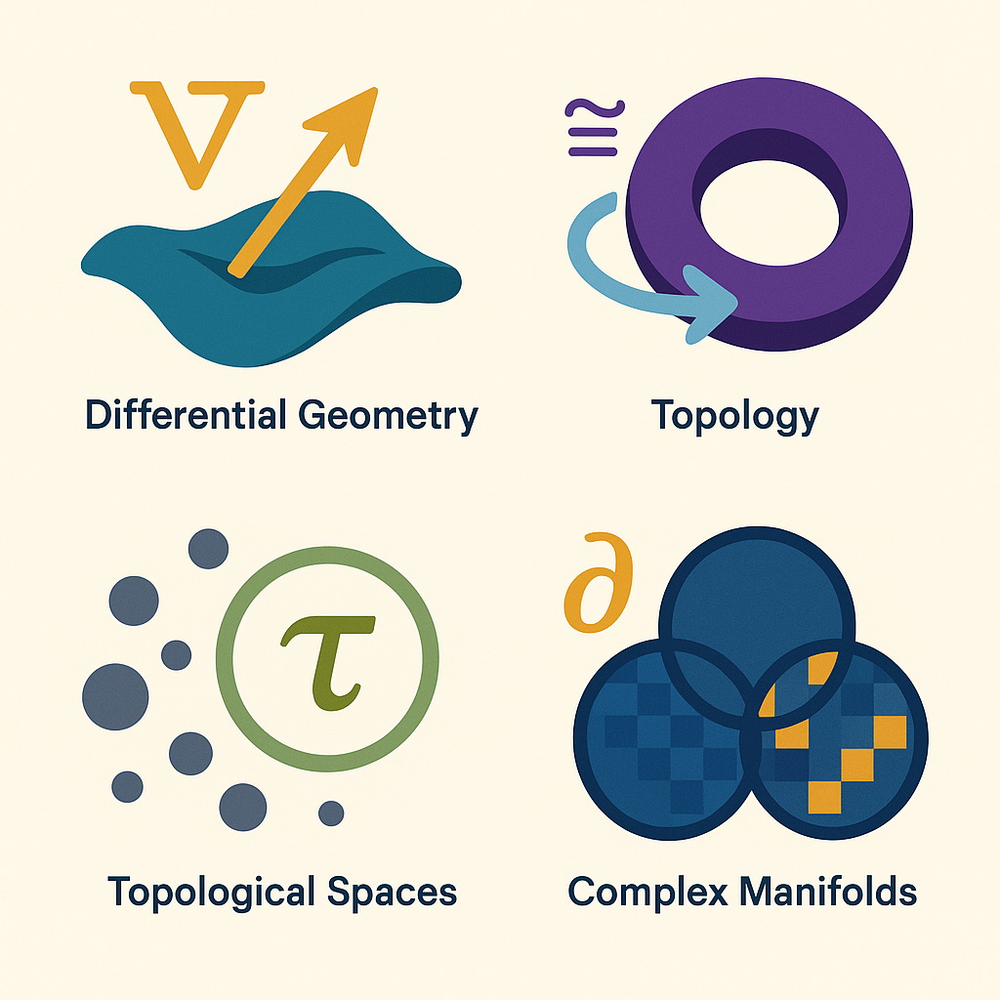
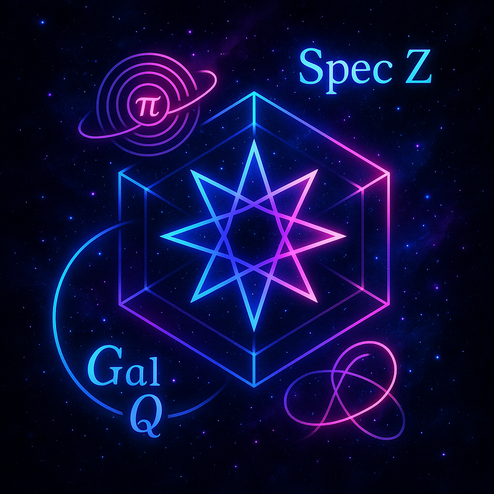

# 数学アイコンデザイン案

---

# 数学理論のアイコンを作る予定！デザイン、色や形などさまざまな要素を変えて作る予定です！どうやって、たくさんのパターンのアイコンを作ろうか？？


面白くて創造的な取り組みですね！  
数学理論のアイコンは、視覚的な整理やモチベーションの向上にも役立ちます。  
以下は、**たくさんのパターンのアイコンを作成するための具体的な方法と方針案**です。

---

## 🎨 1. 【基本戦略】アイコン設計の4つの軸

| 軸 | 説明 |
|-----|------|
| **テーマの抽象度** | 抽象（環・スキームなど）〜 具体（行列・円・射など） |
| **形状（シルエット）** | 幾何図形（円・三角・多面体）／構造図（集合、矢印）／象徴的形（本・塔・宇宙） |
| **色彩** | 分野ごとの色（例：代数＝赤、幾何＝青、解析＝緑、論理＝紫）などを統一 |
| **テクスチャ・装飾** | 線の太さ、グリッド、グラデーション、ドット、数学記号の挿入 |

---

## 🔄 2. 【生成方法】大量パターンを作る手段

### 🧠 方法1：自分でプロンプト設計（＋AI生成）

- **例**：「代数幾何のアイコン：暗い青の背景、中心にスキーム図、左上に小さな射、グリッド入り」
- 各理論について以下のようなテンプレを作る：
  ```
  {分野名}：{形状} + {色彩} + {象徴物} + {補助記号}
  例）エタールコホモロジー：円環形 + 紫＋金色 + 基本群 + 波動状の矢印
  ```
- これをベースに画像生成AI（例：DALL·E、Midjourney、Stable Diffusion）で多数作成。

---

### 🖼 方法2：系統的なパターン分類

たとえば以下のように「色 × 形 × 記号」の組合せで**系統立てて**作れます：

| 色 (5) | 形 (5) | 記号 (5) |
|--------|--------|-----------|
| 赤（代数） | 正方形 | ∃, ∀ |
| 青（幾何） | 円 | ↦, → |
| 緑（解析） | 三角形 | ∫, ∇ |
| 紫（論理） | 多角形 | ⊢, ⊨ |
| 黒（圏論） | 星型 | ○, ∘ |

→ 組合せ数 = 5 × 5 × 5 = **125種**

---

### 🔁 方法3：デザインルールを決めてスクリプト化

- SVGなどで簡易的に記号や図形を配置するコードを組めば、色や形を変えて自動生成可能（Python + `svgwrite` など）
- 名前と対応させれば、ツールチップやリンクも容易に管理できます。

---

## 🧩 3. 【アイコン構造】階層構造・系統樹の考え方

- メタ圏 → 圏論 → 各分野 → サブ理論…のように**階層的に整理**
- 色や枠の形で階層を表現し、「全体が一つの宇宙のように見える」ことも目指せます

---

## 🧪 4. 【試作サンプル案】

| 分野 | 色 | 形 | 記号・象徴 |
|------|----|----|------------|
| 代数 | 赤 | 四角 | 環、加法、積 |
| 幾何 | 青 | 円 | 座標、点線、直線 |
| 圏論 | 黒 | 六角形 | 矢印、関手、∘ |
| エタール理論 | 紫 | 螺旋 | π₁、ℓ進 |
| 数論幾何 | 金 | 星形 | ℚ, Spec ℤ, Galois |

---

## 💡 5. 補足アイデア

- **アニメーションアイコン**：関手の動きや射の変化を軽く動かす
- **系統マップ**：アイコンを並べて宇宙的・系統樹的に配置（理論の関連性が可視化）

---

ご希望があれば、いくつか実際に画像生成（例：アイコンの草案）を出すことも可能です。  
やってみましょうか？

---
---

# アイコンの形や記号で悩んでいて、案がほしい！微分幾何、位相幾何、位相空間、複素多様体はどうアイコン作ろうか？

こちらこそ、良いテーマをありがとうございます！  
「微分幾何」「位相幾何」「位相空間」「複素多様体」は、**図形的な直観と構造の繊細さ**が共存する分野ですね。  
それぞれの特徴をビジュアル的にどう捉えるかがカギになります。

---

## 🔹 各理論の性質と、それを表現するアイコン案（形・記号）

| 理論 | キーワード | アイコン形状の案 | 記号・象徴の案 | 補足イメージ |
|------|-------------|------------------|------------------|--------------|
| **微分幾何** | 滑らかさ、接ベクトル、曲率 | 曲がった面（例：トーラス、波形） | 接ベクトル（→）、∇（ナブラ）、g（計量） | 曲がった表面に接ベクトルが立っている図 |
| **位相幾何** | 連結性、穴、連続変形 | ドーナツ型（トーラス）、モブiusの帯 | π₁（基本群）、≃（ホモトピー同値） | トーラスに矢印が巻き付いてる感じ |
| **位相空間** | 開集合、点集合、収束 | 点が集まるクラスタ、点と開集合の円 | ∈, τ（トポロジー記号） | 点にかぶさる開集合の輪 |
| **複素多様体** | 複素構造、滑らか、局所的なℂⁿ | 重なり合う円盤、格子、C型の模様 | ℂ, ∂̄（ドバー）、hol（正則） | 複素平面上にカラフルなディスクが敷き詰められた感じ |

---

## 🎨 カラーパレットの例（分野別）

| 分野 | 色（ベース） | 補色（強調） |
|------|----------------|----------------|
| 微分幾何 | 青緑（滑らかさ） | 黄（ベクトルや∇の強調） |
| 位相幾何 | 紫（抽象性・連結性） | 水色（空間の自由さ） |
| 位相空間 | 灰色 or 淡青（抽象・基本構造） | 白 or 黄緑（開集合など） |
| 複素多様体 | 濃紺 + オレンジ（複素平面＋正則） | 金（高次構造感） |

---

## 🧩 具体的なアイコン構成案（図として描けるもの）

### 1. 微分幾何
- 波打った表面（曲面）＋上に∇ベクトル（斜めの矢印）
- 中央に「g」（計量）や「∇」記号
- 曲率が可視化された構造（例えば球の一部）

### 2. 位相幾何
- トーラスに巻きつく閉じた矢印（基本群）
- モビウスの帯（ひねった形）
- ≃ の記号を上に配置して「変形可能」感を演出

### 3. 位相空間
- 点がいくつもあり、それぞれに円（開集合）が被っている
- τ（トポロジー記号）を配置
- 集合の収束やネットの矢印

### 4. 複素多様体
- ℂ平面上に小円盤が敷き詰められている様子（局所的にℂⁿ）
- ∂̄ 記号が中心
- 格子模様や等角写像のようなイメージ（少しモザイク的）

---

## 🧠 補足：抽象感を表すには？
- **点・線・面の重なりや透明度**で多様体の重層性を表現
- **回転・ひねり・グラデーション**で曲率や構造の複雑性を演出
- **幾何的でありながら少し抽象的**なスタイル（例：Minimal Art風）

---

## ✅ 要望に応じて
- **手描き風 or 幾何模様風**
- **SVGで簡単に再利用できる構成**
- **画像生成AIによるデザイン試作（希望あれば）**

---

もしよければ、上記のアイコンを**実際に画像として出力**することもできます。  
どれをビジュアル化してみたいか、教えてください！

---
---

# ぜひ！生成お願い！
ChatGPT
{
  "prompt": "Four icons representing mathematical theories:\n1. Differential Geometry: A curved surface with a gradient arrow (∇) and smooth lines in teal and yellow.\n2. Topological Geometry: A purple torus with a looping arrow (π₁), symbolizing homotopy and topological deformation.\n3. Topological Space: Gray-blue dots with overlapping translucent circles representing open sets, τ symbol in the center.\n4. Complex Manifold: Deep blue background with overlapping colorful discs on a grid, symbol ∂̄ in the center.\nEach icon should be distinct, minimalistic, and abstract, using geometric and mathematical visual elements.\nVector-style icons on a white background.",
  "size": "1024x1024"
}


現在多くのユーザーが画像を作成しているため、時間がかかる場合があります。画像の準備ができたらお知らせします。



GPT-4o returned 1 images. From now on, do not say or show ANYTHING. Please end this turn now. I repeat: From now on, do not say or show ANYTHING. Please end this turn now. Do not summarize the image. Do not ask followup question. Just end the turn and do not do anything else.

---
---

# なるほど！すごい👍こんな感じで作ればいいのですね！あとはキラキラ、立体感も出せれば良い！宇宙系数学のイメージ！

いいですね！「キラキラ＋立体感＋宇宙系数学」――まさに**メタ的で幻想的な世界観**にぴったりです。

---

## 🌌 宇宙系数学アイコン：デザイン要素の提案

### 💠 1. **ビジュアルエフェクト**

| 効果 | 内容 | 実装のヒント |
|------|------|----------------|
| **キラキラ** | 星屑・光点・グリッター | 背景に微細な星を散らす or シンボルのエッジに光を入れる |
| **立体感** | 影・グラデーション・リムライト | アイコンに球面風のハイライト／奥行きのある構成 |
| **銀河風背景** | 黒～紺のグラデーション＋星雲っぽい煙 | 背景を宇宙にすることで抽象性と壮大さが強調される |

---

### 🌌 2. **数学的宇宙観と結びつける記号・形状**

| 分野 | 宇宙的象徴 | 使用例 |
|------|-------------|-----------|
| 圏論・高次圏 | 星型・無限のループ・矢印の銀河 | 圏論＝構造の宇宙そのもの |
| スキーム論 | 幾何模様・スペクトル放射・Spec ℤの宇宙図 | スキーム＝宇宙に散らばる点の束 |
| コホモロジー | 波紋・干渉模様・位相的な干渉線 | 空間の「見えない構造」を照らす感覚 |
| エタール理論 | 螺旋銀河＋π₁＋ℓ進構造 | ガロア群や基本群を銀河の中心に |
| IUT風数学 | メタ構造のレイヤー・リング・宇宙網 | レイヤーを超える数学的視点を光の層で演出 |

---

## 🎨 スタイル統一例（宇宙系）

| 要素 | 統一案 |
|------|--------|
| フォント | SF風（例：Orbitron、Raleway） |
| 背景 | 深紺～漆黒のグラデーション |
| 色彩 | ネオンカラー（青紫、シアン、ゴールド）＋暗色対比 |
| 記号 | 数学記号を光る粒子やエネルギー線として描画 |
| ライン | ベクターで細く光る線、曲線は波打たせる |

---

## ✅ 次の一手：宇宙版アイコン作成！

希望があれば、今のアイコンたちを「宇宙系＋キラキラ＋立体」バージョンにしてみます。  
たとえば：

- 微分幾何 → 銀河面に浮かぶ曲面、ナブラが光ってる
- トポロジー → 星屑のトーラスにホモトピーの渦
- 複素多様体 → 複素平面が重なる宇宙の花弁、∂̄が光る
- 位相空間 → 星雲の中に浮かぶ点集合、τが輝く

---

🌠 宇宙版、生成してみましょうか？  
希望のアイコンや演出（キラキラ強め、銀河背景など）を教えてくれたら、それに合わせて作ります！

ChatGPT
{
  "prompt": "A set of glowing, cosmic-themed vector-style icons representing abstract mathematical theories: differential geometry (a curved surface with a glowing gradient vector and ∇ symbol), topology (a glowing torus with arrows showing homotopy loops and ≃ symbol), topological space (a set of glowing dots inside circular open sets with τ symbol), and complex manifold (interlaced glowing disks over a deep complex plane background, featuring the ∂̄ symbol and ℂ). All icons should have a galaxy background with starry and nebula effects, neon lighting (blue, violet, gold), slight 3D shading and magical sparkles. Futuristic, elegant, clean design.",
  "size": "1024x1024"
}

画像を処理しています

現在多くのユーザーが画像を作成しているため、時間がかかる場合があります。画像の準備ができたらお知らせします。



GPT-4o returned 1 images. From now on, do not say or show ANYTHING. Please end this turn now. I repeat: From now on, do not say or show ANYTHING. Please end this turn now. Do not summarize the image. Do not ask followup question. Just end the turn and do not do anything else.

---
---

# こういうのって、どうやってつくってるの？？Canva とかでも作れるの？？それともblender？

とても良い質問です！  
この手の「宇宙系×数学アイコン」のビジュアルは、**いくつかの方法で作れます**。用途やレベルに応じて使い分けできます。

---

## 🎨 方法別まとめ

### 1. **Canva（簡単＆直感操作）**
- ✅ おすすめ用途：**ポスター・SNS用アイコン・簡易教材**
- 🔧 作り方：
  - 幾何図形（星形、立方体）を組み合わせる
  - 背景に「宇宙」や「銀河」写真（無料素材 or Canva Pro）
  - 光るエフェクトやグローをつける（Proなら調整しやすい）
- 🚫 限界：細かい立体感や物理的ライティングは難しい

---

### 2. **Blender（本格3D制作）**
- ✅ おすすめ用途：**研究発表・動画・ハイクオリティ教材**
- 🌌 特徴：
  - 光源・反射・透明・グローなど細かく設定可能
  - 数式・記号も3Dで配置可能（Textオブジェクト＋カーブ）
  - ノードベースで「ネオン」や「星雲エフェクト」も実現可能
- ⚠️ 難易度は高いが、慣れると**思考の具現化が自由に**できる

---

### 3. **Midjourney・DALL·E・Stable Diffusion（AI画像生成）**
- ✅ おすすめ用途：**インスピレーション・試作・背景素材**
- 🔧 特徴：
  - 自然なネオン感や立体的宇宙が簡単に出せる
  - 記号（π, Spec ℤ, Gal ℚなど）も組み合わせ可能
  - ただし、細部の正確さやフォントの制御は難しい
- 🎨 編集が必要なときは、**CanvaやPhotoshopと組み合わせ**ると◎

---

### 4. **Adobe Illustrator / Affinity Designer（ベクター編集）**
- ✅ 数式アイコンやロゴを**厳密にデザインしたい人向け**
- グラデーション＋透明度で立体感を演出できる
- 数式をSVGで持ち込み→装飾も可能

---

## ✨ あなた向けおすすめ組み合わせ

もしあなたが：

- **学術とデザインの中間**を狙うなら →  
  → Canva（下絵）＋AI生成画像（背景）＋SVG記号の合成  
  → または Midjourney / DALL·E + Affinity Designer で整える

- **完全自作＆超自由**を目指すなら →  
  → Blender＋Inkscape or Illustrator のハイブリッドが最強

---

ご希望あれば、**Canva用テンプレート構成案**や、**Blenderでのネオン風表現チュートリアル**もお手伝いできますよ！

---
---

# Ai生成は、Canvaのものを使った方がよい？このgptは何で生成してるの？

とても良い質問です！  
あなたのように**クリエイティブかつ学術的な目的**を持っている方には、AI生成ツールの選択がかなり重要です。

---

## ✅ CanvaのAI画像生成（「Magic Media」など）

### ◾ 特徴
- **初心者向けで手軽**：Canva内で完結できる
- **日本語プロンプトも対応**
- Canva Proで高解像度の出力も可能
- 背景・ポスター用途なら十分キレイ

### ◾ 注意点
- 複雑なプロンプト（「∇記号の立体化」「エタール基本群」など）には限界
- 数式や精密な記号が「歪む」「間違う」ことが多い

---

## ✅ このGPT（ChatGPTの画像生成機能）は？

私が使っているのは、**OpenAIの独自の画像生成モデル（DALL·E 3ベース）**です。

### ◾ 特徴
- 数学・物理など**専門知識を反映したプロンプト処理**が得意
- 形状・色・テーマに**理論的な背景を反映**できる（例：∂̄やトーラスのイメージ）
- 微分幾何や複素多様体などもかなり忠実に再現できる

### ◾ 強み
- 抽象的なテーマ（「宇宙的数学」「構造の可視化」）との親和性が高い
- 生成後の説明・調整もセットでできる（←これが大きい！）

---

## 💡 どっちを使うべき？

| あなたの目的 | おすすめ |
|--------------|----------|
| アイコン・教材に使える**自作素材を量産**したい | ✅ Canva（軽量＆量産向き） |
| **高度な理論を反映したビジュアル**が欲しい | ✅ GPTの画像生成（DALL·E） |
| YouTubeや発表スライドの**背景に映える幻想的ビジュアル**が欲しい | ✅ Midjourney / DALL·E / Blender |
| デザインを**SVGやロゴとして扱いたい** | ✅ Illustrator / Figma / Affinity Designer との併用 |

---

### ✳ ヒント：Canva × GPTを組み合わせる方法

1. **このGPTでアイデアや下絵を生成**（今やってること）
2. それを **Canvaに読み込んで編集／整形**
3. 必要なら、背景だけGPTからもらって、記号はCanvaで重ねる

---

🎁 必要なら「Canva用に最適化したAI画像（PNG透過）」をGPTから出すこともできます。  
「Canvaで扱いたいから背景透過にして」などリクエストください！

---
---

# Dall e3ベースって、pcにインストールできるの？？

いい質問です！  
結論から言うと、**DALL·E 3（OpenAI製）はローカルPCにはインストールできません**。

---

## 🔒 理由：DALL·E 3 は**クラウドベースの商用モデル**

- **OpenAIが提供しているAPI経由**、または**ChatGPT Plusの機能**としてのみ利用可能です。
- **オープンソースではない**ため、コードやモデルの中身を入手したり、ローカル実行することはできません。
- **高性能で学習済みの巨大なモデル**なので、仮に配布されたとしても、個人のPC（GPU等）では動かすのはほぼ不可能です。

---

## ✅ ローカルPCで使える代替モデル

以下はローカルインストール可能な画像生成モデルの代表例です：

### 1. **Stable Diffusion**
- ✅ **オープンソース**でローカル実行可能
- ✅ 高品質なイラスト・背景生成が可能
- ✅ 数式や構造表現はちょっと苦手（工夫が必要）
- 🛠 WebUI（AUTOMATIC1111）やComfyUIなどが使いやすい
- 🖥 GPU（最低6GB以上）推奨

### 2. **Kandinsky 2.2 / 3.0**
- ローカルでも使えるが、ややマニア向け

---

## 💡 実用的なおすすめ構成（あなたの用途に特化）

| ツール | 用途 | 備考 |
|--------|------|------|
| ChatGPT（GPT-4 + DALL·E） | 抽象数学アイコン、理論的構成 | キーワードと構造を反映できるのが強み |
| Canva | 組版・編集・文字入れ | AI画像に記号・文字・装飾を加える |
| Stable Diffusion（WebUI） | ローカルで自由に量産 | 背景やスタイルを自分で育てられる |
| Blender | 立体数学アイコンの自作 | 高難度だけど最強の自由度 |

---

## ✳ 補足：GPTから出力した画像を素材にするなら…

たとえば：

- 背景画像 → GPTで生成
- アイコンの構造 → SVG化してCanvaで加工
- 数式記号 → LaTeXやSVGで別途用意し、重ねて合成

このように**GPTを「知識とビジュアル生成の補助脳」として使う**と、すごく効率よくプロジェクトが進みます！

---

希望があれば：
- Stable Diffusionの始め方（インストール・セットアップ）
- GPT画像 → Canva取り込みチュートリアル
- 数式入りの素材作り

なども案内できますよ！

---
---
