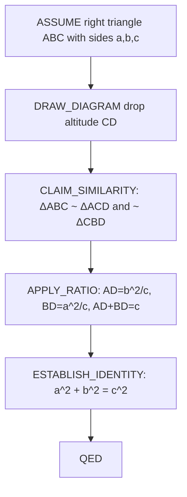
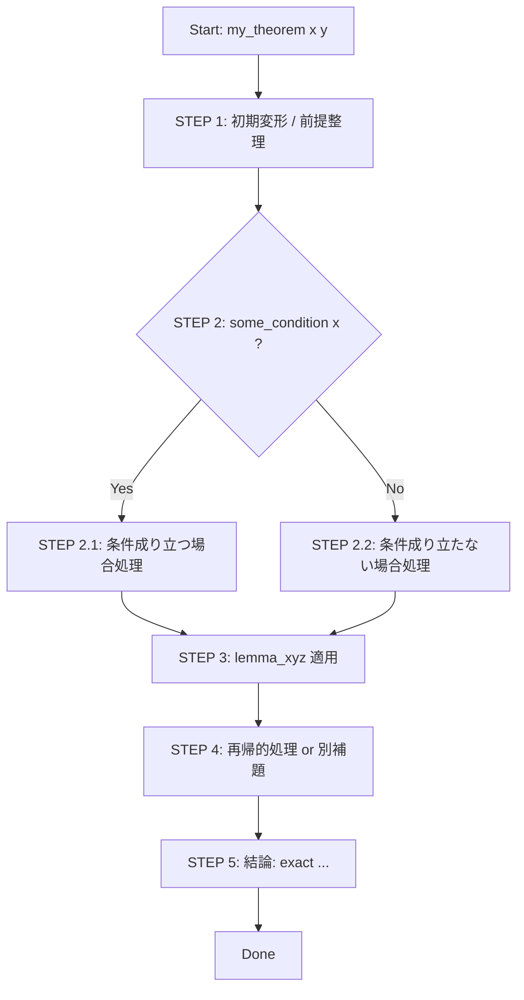

# 証明を形式化したい

- ステップごとに細分化する。
- 流れが複雑な場合は、フローチャートなどで流れを図式化する。
- 各ステップはコマンド風にまとめる。
- コマンド一覧はjsonファイルに整理する。
- 証明にも、番号を付けて管理してもよいかも？？

<br>

---

<br>

## 例えば、証明をステップごとに、文書でまとめていくとする。仮定、帰納法、などのステップを設けて、各ステップを並べていき、文書化したい！どれくらいステップの種類がある？？それに各ステップは、英語でコマンド風にまとめたい！

以下では、「証明をステップごとに文書化する」際に使える、**ステップの種類の一覧**と、それぞれに対応する**英語の“コマンド風”ラベル**の例を示します。また、これらを LaTeX や Markdown、あるいは証明支援系スクリプトのドキュメント化で活用するための方法もご提案します。

---

## 1. ステップの大分類と代表的な種類

まず、証明でよく使われる手法・役割ごとに大きく分類し、その中で典型的なステップを挙げます。以下の分類を参照しながら、プロジェクトやドキュメントの目的に応じて必要なステップを選び、文書化用にラベルを付与してください。

1. **前提設定・仮定（Setup / Assumptions）**
2. **定義・構成（Definition / Construction）**
3. **主張・補題の提示（Claim / Lemma）**
4. **証明手法選択（Proof Strategy）**
   - 直接証明
   - 帰納法
   - 場合分け
   - 背理法（Contradiction）
   - 対偶法（Contrapositive）
   - 帰納以外の再帰的手法
   - 排除法（WLOG 等）
5. **計算・操作（Calculation / Manipulation）**
   - 簡約（Simplify）
   - 変形（Rewrite）
   - 計算（Compute / Evaluate）
   - 不変量チェック（Invariant）
   - 単調性利用（Monotonicity）
   - 代数的操作（Algebraic Manipulation）
6. **補題・既知結果の適用（Apply Known Results）**
   - 補題・定理適用（Apply Lemma/Theorem）
   - 既存構造利用（Use Hypothesis, Use Inductive Hypothesis）
7. **場合分け（Case Analysis）**
   - 二分場合分け
   - 複数分岐
   - WLOG（Without Loss of Generality）
8. **帰納法（Induction）**
   - Base Case（基底の場合）
   - Inductive Hypothesis（帰納仮定）
   - Inductive Step（帰納ステップ）
9. **背理法・対偶法（Contradiction / Contrapositive）**
   - Assume Opposite / Derive Contradiction
   - Prove Contrapositive
10. **構成的証明（Constructive Existence / Explicit Construction）**
    - Construct object
    - Provide witness
11. **存在・一意性の証明（Existence / Uniqueness）**
    - Show existence: exhibit or use非constructive argument
    - Show uniqueness: assume two objects and show equality
12. **特別な手法・バリエーション（Special Techniques）**
    - Pigeonhole Principle
    - Extremal Principle
    - Invariant Principle
    - Counting Argument / Combinatorial Argument
    - Graph-Theoretic Argument
    - Topological Argument
    - Probabilistic Method
    - Generating Functions
    - Algebraic Geometry／数論的議論 など
13. **観察・補足（Observation / Remark）**
    - Observe some property
    - Note a simplification or alternative viewpoint
14. **まとめ・結論（Conclusion）**
    - Summarize result of proof
    - State final equality/inequality
    - QED

---

### 1.1 各ステップの英語コマンド風ラベル例

以下は上記大分類に対応する代表的ステップと、**英語のコマンド風ラベル**の例です。必要に応じてカスタマイズしてください。

#### A. 前提設定・仮定 (Setup / Assumptions)
- `ASSUME`: 「仮定する」  
  例: `ASSUME: Let x be arbitrary in ...`
- `SETUP`: 「準備・前提を設定する」  
  例: `SETUP: Denote S = { ... }`
- `INTRODUCE`: 「ある対象を導入する」  
  例: `INTRODUCE: Introduce function f: X → Y`

#### B. 定義・構成 (Definition / Construction)
- `DEFINE`: 「定義を与える」  
  例: `DEFINE: Let P(n) denote the property ...`
- `CONSTRUCT`: 「構成する」  
  例: `CONSTRUCT: Construct element e ∈ A as follows`
- `LET`: 「…とおく」  
  例: `LET: Let y = f(x)`
- `DECLARE`: 「記号や関数を宣言する」  
  例: `DECLARE: Define sequence (a_n) by ...`

#### C. 主張・補題の提示 (Claim / Lemma)
- `CLAIM`: 「主張する」  
  例: `CLAIM: For all n, P(n) holds.`
- `LEMMA`: 「補題を提示」  
  例: `LEMMA: Useful fact: If x > 0 then ...`
- `PROPOSITION`: 「命題を提示」  
  例: `PROPOSITION: The set S has property ...`
- `COROLLARY`: 「系を提示」  
  例: `COROLLARY: As a result, we obtain ...`

#### D. 証明手法選択 (Proof Strategy)
- `PROOF_BY_DIRECT`: 「直接証明を行う」  
  例: `PROOF_BY_DIRECT: We prove P ⇒ Q directly.`
- `PROOF_BY_INDUCTION`: 「帰納法を用いる」  
  例: `PROOF_BY_INDUCTION: We proceed by induction on n.`
- `PROOF_BY_CASE_ANALYSIS`: 「場合分け証明」  
  例: `PROOF_BY_CASE_ANALYSIS: Split into cases depending on ...`
- `PROOF_BY_CONTRADICTION`: 「背理法を用いる」  
  例: `PROOF_BY_CONTRADICTION: Suppose the negation and derive a contradiction.`
- `PROOF_BY_CONTRAPOSITIVE`: 「対偶法を用いる」  
  例: `PROOF_BY_CONTRAPOSITIVE: We prove the contrapositive instead.`
- `WLOG`: 「一般性を失わずに仮定」  
  例: `WLOG: Without loss of generality, assume ...`

#### E. 計算・操作 (Calculation / Manipulation)
- `SIMPLIFY`: 「簡約する」  
  例: `SIMPLIFY: Simplify the expression using ...`
- `REWRITE`: 「書き換える」  
  例: `REWRITE: Rewrite using lemma XYZ.`
- `COMPUTE`: 「計算する」  
  例: `COMPUTE: Evaluate ∑_{i=1}^n i = ...`
- `EVALUATE`: 「評価する」  
  例: `EVALUATE: Compute f(x) explicitly.`
- `TRANSFORM`: 「変形する」  
  例: `TRANSFORM: Transform inequality into equivalent form.`
- `APPLY_INVARIANT`: 「不変量を適用/確認」  
  例: `APPLY_INVARIANT: Check that invariant I holds throughout.`
- `APPLY_MONOTONICITY`: 「単調性を適用」  
  例: `APPLY_MONOTONICITY: Use monotonicity of f.`
- `ALGEBRA_MANIPULATION`: 「代数操作」  
  例: `ALGEBRA_MANIPULATION: Rearrange terms to isolate x.`

#### F. 補題・既知結果の適用 (Apply Known Results)
- `APPLY_LEMMA`: 「補題を適用」  
  例: `APPLY_LEMMA LemmaXYZ: Use LemmaXYZ on ...`
- `USE_HYPOTHESIS`: 「仮定を利用」  
  例: `USE_HYPOTHESIS: From assumption H, we get ...`
- `USE_IND_HYP`: 「帰納仮定を利用」  
  例: `USE_IND_HYP: By inductive hypothesis, n + m = m + n.`
- `REFER_TO_PREVIOUS`: 「前の結果を参照」  
  例: `REFER_TO_PREVIOUS: See Proposition 2.3 for ...`

#### G. 場合分け (Case Analysis)
- `CASE_ANALYSIS`: 「場合分けを開始」  
  例: `CASE_ANALYSIS: Split into cases based on condition C.`
- `CASE`: 「各場合」  
  - `CASE 1`: `CASE: Case 1: condition holds.`
  - `CASE 2`: `CASE: Case 2: condition does not hold.`
- `IF`: 「if 条件 then … else …」  
  例: `IF x > 0 THEN ... ELSE ...`
- `SUBCASE`: 「副場合分け」  
  例: `SUBCASE: Further split when ...`
- `CHECK_CONDITION`: 「条件を確認」  
  例: `CHECK_CONDITION: Verify whether P(x) holds.`

#### H. 帰納法 (Induction)
- `INDUCTION_ON`: 「…について帰納法」  
  例: `INDUCTION_ON n: Perform induction on n.`
- `BASE_CASE`: 「基底の場合」  
  例: `BASE_CASE: Prove P(0) holds.`
- `INDUCTIVE_HYPOTHESIS`: 「帰納仮定」  
  例: `INDUCTIVE_HYPOTHESIS: Assume P(k).`
- `INDUCTIVE_STEP`: 「帰納ステップを証明」  
  例: `INDUCTIVE_STEP: Prove P(k+1) using P(k).`
- `STRONG_INDUCTION`: 「強い帰納法」  
  例: `STRONG_INDUCTION: Assume P(j) for all j < n to prove P(n).`
- `STRUCTURAL_INDUCTION`: 「構造帰納法」  
  例: `STRUCTURAL_INDUCTION: Induce on structure of tree T.`

#### I. 背理法・対偶法 (Contradiction / Contrapositive)
- `PROOF_BY_CONTRADICTION`: 「背理法開始」  
  例: `PROOF_BY_CONTRADICTION: Assume ¬P and derive contradiction.`
- `ASSUME_NEGATION`: 「否定仮定」  
  例: `ASSUME_NEGATION: Suppose ¬(statement).`
- `DERIVE_CONTRADICTION`: 「矛盾を導く」  
  例: `DERIVE_CONTRADICTION: Obtain False from assumptions.`
- `PROOF_BY_CONTRAPOSITIVE`: 「対偶法開始」  
  例: `PROOF_BY_CONTRAPOSITIVE: Prove ¬Q ⇒ ¬P instead.`
- `DERIVE_IMPLICATION`: 「含意を導く」  
  例: `DERIVE_IMPLICATION: From ¬Q derive ¬P.`
- `CONCLUDE_CONTRADICTION`: 「背理法の結論」  
  例: `CONCLUDE_CONTRADICTION: Hence P holds.`

#### J. 構成的証明 (Constructive Existence / Explicit Construction)
- `PROVIDE_WITNESS`: 「証人を与える」  
  例: `PROVIDE_WITNESS: Exhibit x = ... such that P(x).`
- `CONSTRUCT_OBJECT`: 「対象を構成」  
  例: `CONSTRUCT_OBJECT: Construct function f satisfying ...`
- `VERIFY_PROPERTY`: 「性質を検証」  
  例: `VERIFY_PROPERTY: Check that constructed x satisfies P.`
- `SHOW_EXISTENCE`: 「存在を示す（構成的）」  
  例: `SHOW_EXISTENCE: Show there exists an x by explicit construction.`
- `SHOW_UNIQUENESS`: 「一意性を示す」  
  例: `SHOW_UNIQUENESS: Suppose x,y both satisfy..., show x = y.`

#### K. 存在・一意性 (Existence / Uniqueness), あるいは「存在的議論」
- `EXISTS_PROOF`: 「存在証明（非構成的な場合も）」  
  例: `EXISTS_PROOF: Use choice or nonconstructive argument to show ∃x. P(x).`
- `UNIQUE_PROOF`: 「一意性証明」  
  例: `UNIQUE_PROOF: Show any two solutions coincide.`
- `BIJECTIVE_ARGUMENT`: 「全単射的議論」  
  例: `BIJECTIVE_ARGUMENT: Establish bijection to count or show existence.`
- `PIGEONHOLE_PRINCIPLE`: 「鳩ノ巣原理利用」  
  例: `PIGEONHOLE_PRINCIPLE: Apply pigeonhole principle to deduce ...`
- `EXTREMAL_PRINCIPLE`: 「極値原理利用」  
  例: `EXTREMAL_PRINCIPLE: Consider minimal counterexample.`
- `INVARIANT_METHOD`: 「不変量法利用」  
  例: `INVARIANT_METHOD: Show invariant holds across steps.`

#### L. 特別な手法 (Special Techniques)
- `COUNTING_ARGUMENT`: 「数え上げ議論」  
  例: `COUNTING_ARGUMENT: Count elements in two ways.`
- `COMBINATORIAL_ARGUMENT`: 「組合せ的議論」  
  例: `COMBINATORIAL_ARGUMENT: Use combinatorial structure of sets.`
- `GRAPH_ARGUMENT`: 「グラフ理論的議論」  
  例: `GRAPH_ARGUMENT: Model problem as graph and apply property X.`
- `TOPOLOGICAL_ARGUMENT`: 「位相的議論」  
  例: `TOPOLOGICAL_ARGUMENT: Use continuity/compactness argument.`
- `PROBABILISTIC_METHOD`: 「確率的方法」  
  例: `PROBABILISTIC_METHOD: Use expectation argument.`
- `GENERATING_FUNCTIONS`: 「生成関数を用いる」  
  例: `GENERATING_FUNCTIONS: Derive recurrence by generating functions.`
- `ALGEBRAIC_GEOMETRY_METHOD`: 「代数幾何的議論」  
  例: `ALGEBRAIC_GEOMETRY_METHOD: Consider variety V and use ...`
- `NUMBER_THEORY_METHOD`: 「数論的議論」  
  例: `NUMBER_THEORY_METHOD: Use modular arithmetic argument.`

#### M. 観察・補足 (Observation / Remark)
- `OBSERVE`: 「観察」  
  例: `OBSERVE: Note that f is injective.`
- `NOTE`: 「注意」  
  例: `NOTE: This case cannot happen if ...`
- `REMARK`: 「補足的コメント」  
  例: `REMARK: Alternatively, one could also argue via ...`
- `EXAMPLE`: 「例示」  
  例: `EXAMPLE: For n=2, see that ...`

#### N. まとめ・結論 (Conclusion)
- `THUS`: 「ゆえに」  
  例: `THUS: We conclude that P holds for all n.`
- `HENCE`: 「したがって」  
  例: `HENCE: The statement follows.`
- `QED`: 「証明終了」  
  例: `QED.`  
- `END_PROOF`: 「Proof ends」  
  例: `END_PROOF: Completed the proof of Theorem X.`

---

## 2. ステップラベルの書式・ドキュメント化例

### 2.1 Markdown / LaTeXでの記述テンプレート

#### Markdown 形式例
```markdown
## Theorem 1.1 (Example)
**Statement.** For all n, P(n) holds.

**Proof.**
1. **ASSUME**: Let n be an arbitrary natural number.
2. **PROOF_BY_INDUCTION**: We proceed by induction on n.
3. **BASE_CASE**: Show P(0):
   - **SIMPLIFY**: Simplify P(0) to trivial equality.
   - **CONCLUDE**: P(0) holds.
4. **INDUCTIVE_HYPOTHESIS**: Assume P(k) holds for some k.
5. **INDUCTIVE_STEP**: Prove P(k+1):
   - **ASSUME**: Let k be given and assume P(k).
   - **DEFINE**: Define auxiliary object A = f(k).
   - **APPLY_LEMMA LemmaXYZ**: Use LemmaXYZ on A.
   - **SIMPLIFY**: Simplify resulting expression.
   - **CONCLUDE**: P(k+1) holds.
6. **HENCE**: By induction, P(n) holds for all n.
7. **QED**.
```
- 各ステップ番号に太字でコマンド風ラベルを付け、インデントやリストで階層化。
- 必要に応じてサブステップをネストして管理。

#### LaTeX 形式例
LaTeX ではマクロを定義して、ステップを簡潔に書けるようにします。例えば:
```latex
\newcommand{\Step}[2]{\textbf{#1:} #2\\}
\newcommand{\SubStep}[2]{\quad\textit{#1:} #2\\}

\begin{proof}
\Step{ASSUME}{Let $n$ be an arbitrary natural number.}
\Step{PROOF_BY_INDUCTION}{Proceed by induction on $n$.}
\SubStep{BASE_CASE}{Show $P(0)$ holds. \textit{(Simplify to trivial case.)}}
\SubStep{INDUCTIVE_HYPOTHESIS}{Assume $P(k)$ holds for some $k$.}
\SubStep{INDUCTIVE_STEP}{Prove $P(k+1)$:}
\quad\Step{DEFINE}{Let $A := f(k)$.}
\quad\Step{APPLY_LEMMA}{Use Lemma~\ref{lem:XYZ} on $A$.}
\quad\Step{SIMPLIFY}{Simplify the resulting expression to conclude $P(k+1)$.}
\Step{CONCLUDE}{By induction, $P(n)$ holds for all $n$.}
\Step{QED}{}
\end{proof}
```
- `\Step{LABEL}{内容}`、`\SubStep{LABEL}{内容}`といったマクロを用意しておくと、ドキュメント内で統一感が出る。
- LABEL は上記英語コマンド風（大文字＋アンダースコア）で。見た目でも強調されるので可読性向上。

### 2.2 フローチャートとの連携
- 各ステップにユニーク ID を付け（例: `STEP1`, `STEP2`）、フローチャートのノードと対応付ける。
- LaTeX では TikZ を用いてコメントに対応した図を作成。あるいは Markdown＋Mermaid でドキュメント外部に図を置き、対応を明示。
- 例: LaTeX コメントや Lean コードコメント中に `-- STEP1: ASSUME ...` と書き、スクリプトで抽出して Mermaid 図を自動生成する、というワークフローも可能。

---

## 3. ステップ種類の網羅度とカスタマイズ

- ここに挙げたステップは典型的・代表的なものですが、研究分野や証明スタイルによってさらに特化したステップ（例えば「カテゴリー的構成: CONSTRUCT_FUNCTOR」「層理論的議論: APPLY_SHEAF_PROPERTY」など）を追加してもよいです。
- プロジェクト開始時に、自作のステップ一覧（英語コマンド風ラベルと日本語説明）をドキュメント化しておき、チームや自分のスタイルガイドとして参照すると整合的な記述がしやすくなります。
- ステップ一覧例を YAML/JSON/CSV などで管理し、LaTeX マクロや Markdown テンプレートに自動展開する仕組みを作ると、大規模ドキュメントでも一貫した記述が可能です。

#### 例: ステップ一覧を YAML で管理
```yaml
- label: ASSUME
  description: "仮定を導入する"
- label: DEFINE
  description: "定義を与える"
- label: PROOF_BY_INDUCTION
  description: "帰納法を用いる"
- label: BASE_CASE
  description: "帰納法の基底の場合を証明する"
- label: INDUCTIVE_HYPOTHESIS
  description: "帰納仮定を設定する"
- label: INDUCTIVE_STEP
  description: "帰納ステップを証明する"
- label: CASE_ANALYSIS
  description: "場合分けを行う"
- label: APPLY_LEMMA
  description: "補題・定理を適用する"
- label: SIMPLIFY
  description: "式を簡約する"
- label: REWRITE
  description: "式を書き換える"
- label: CONTRADICTION
  description: "背理法で矛盾を導く"
- label: QED
  description: "証明終了"
# ...他多数...
```
- Python スクリプトでこの YAML を読み込み、LaTeX のマクロ定義や Markdown テンプレートを自動生成できる。

---

## 4. ワークフローのおすすめ

1. **ステップ一覧の作成**  
   - 上記の大分類とラベル例をベースに、自分の分野・好みに合わせたステップラベル一覧を作成・ドキュメント化。  
2. **LaTeX マクロ／Markdown テンプレート準備**  
   - `\Step{}` マクロや Markdown のリストテンプレートを用意し、各ステップラベルがすぐ使えるようにする。  
3. **Lean/Coq スクリプトへのコメント同期**  
   - Lean/Coq の証明スクリプト中に、該当ステップでコメントラベルを付けておき、後でドキュメントにコピー or 自動抽出できるようにする。  
4. **フローチャート用ラベル付与**  
   - 主要ステップにユニークIDを付与し、手動またはスクリプトでフローチャート（Mermaid/Graphviz/TikZ）を生成・更新。  
5. **ドキュメント執筆**  
   - マクロ・テンプレートを使い、各証明をステップごとに記述。概要（Proof Sketch）、詳細ステップ、図解を組み合わせる。  
6. **検証・レビュー**  
   - 証明支援系に形式化できる部分は形式化し、コメントラベルを Lean/Coq スクリプトと同期させる。  
   - 依存関係（どの補題がどこで使われるか）を管理・可視化し、問題があればステップを見直す。

---

## 5. まとめ

- **ステップ種類**はかなり多岐にわたるが、大分類（仮定・定義・補題提示・証明手法選択・計算操作・場合分け・帰納法・背理法・構成的証明・特殊手法・観察・結論）の枠組みで整理可能。  
- **英語コマンド風ラベル**（大文字＋アンダースコア形式）がドキュメント化やスクリプト解析に便利。例: `ASSUME`, `DEFINE`, `CLAIM`, `PROOF_BY_INDUCTION`, `BASE_CASE`, `CASE_ANALYSIS`, `APPLY_LEMMA`, `SIMPLIFY`, `CONTRADICTION`, `QED` など。  
- LaTeX マクロや Markdown テンプレート、YAML/JSONでのステップ一覧管理、Lean/Coq スクリプトへのコメント同期、フローチャート生成スクリプトなどを組み合わせると、大規模かつ可読性の高い証明ドキュメントを効率的に作成・保守できる。  
- 最終的には、読者層やプロジェクトの性格に合わせて、証明の概要（自然言語＋図示）と詳細（ステップ化＋形式化スクリプト）のバランスを調整することが重要です。

以上を参考に、ステップごとに証明を文書化し、英語コマンド風ラベルで管理するワークフローを構築してください。具体的なテンプレートやスクリプト例が必要であれば、さらにご相談ください！


---
---

## すげー満足！ほかに追加した方がよいコマンドはある？そして、三平方の定理などで例を最後に知りたい！

以下では、

1. **追加すると便利なステップコマンド例** をいくつか挙げ、  
2. **三平方の定理（ピタゴラスの定理）の証明例** を、ステップごとの英語コマンド風ラベル付きで示します。  

---

## 1. 追加するとよいステップコマンド例

先に挙げた大分類＋代表的コマンドに加え、状況や分野に応じてさらに有用なコマンドを以下に示します。必要に応じて自分のプロジェクトのステップ一覧に加えてください。

### A. 図示・幾何的手法関連
- `DRAW_DIAGRAM`  
  - 「証明に必要な図を描く/イメージする」  
  - 例: `DRAW_DIAGRAM: Draw triangle ABC with right angle at C.`
- `LABEL_POINTS`  
  - 「図中の点/線/角に記号を振る」  
  - 例: `LABEL_POINTS: Label the foot of perpendicular from C to hypotenuse as D.`
- `REFER_TO_DIAGRAM`  
  - 「図に基づいて議論を進める」  
  - 例: `REFER_TO_DIAGRAM: Using the diagram, note that ∠ACD = ∠DCB.`
- `APPLY_SIMILARITY` / `CHECK_SIMILARITY`  
  - 「三角形の相似を検討/適用」  
  - 例: `CHECK_SIMILARITY: Show triangle ABC ~ triangle CBD.`
- `VERIFY_PARALLEL` / `VERIFY_PERPENDICULAR`  
  - 「線分が平行/垂直であることを確認」  
  - 例: `VERIFY_PERPENDICULAR: Confirm AC ⟂ BC implies angle at C = 90°.`
- `COMPUTE_AREA_GEOMETRIC`  
  - 「面積を用いる議論で計算」  
  - 例: `COMPUTE_AREA_GEOMETRIC: Compare areas of sub-triangles.`
- `APPLY_GEOMETRIC_CONSTRUCTION`  
  - 「幾何構成手順を使う」  
  - 例: `APPLY_GEOMETRIC_CONSTRUCTION: Drop altitude from right angle vertex.`
- `CHECK_ANGLE_RELATION`  
  - 「角度関係を確認」  
  - 例: `CHECK_ANGLE_RELATION: Verify alternate interior angles are equal.`
- `UTILIZE_SYMMETRY`  
  - 「対象の対称性を利用」  
  - 例: `UTILIZE_SYMMETRY: Use symmetry of isosceles triangle.`

### B. 代数的計算・解析的手法関連
- `SQUARE_BOTH_SIDES`  
  - 「両辺を二乗する操作」  
  - 例: `SQUARE_BOTH_SIDES: Square equation AC^2 + BC^2 = AB^2.`
- `EXPAND` / `FACTOR`  
  - 「展開/因数分解」  
  - 例: `EXPAND: Expand (x+y)^2.`
- `APPLY_IDENTITY`  
  - 「既知の恒等式を適用」  
  - 例: `APPLY_IDENTITY: Use (a+b)^2 = a^2 + 2ab + b^2.`
- `REDUCE_TO_PREVIOUS`  
  - 「既存の結果に帰着」  
  - 例: `REDUCE_TO_PREVIOUS: Reduce to Lemma 2.1.`
- `CHECK_BOUNDARY_CONDITION`  
  - 「境界条件を検証」  
  - 例: `CHECK_BOUNDARY_CONDITION: Verify base case n=0 holds.`
- `VERIFY_DOMAIN`  
  - 「変数の定義域/前提条件を再確認」  
  - 例: `VERIFY_DOMAIN: Ensure triangle sides are positive lengths.`
- `ESTABLISH_INEQUALITY`  
  - 「不等式を示す」  
  - 例: `ESTABLISH_INEQUALITY: Show a^2 + b^2 < c^2 cannot hold for right triangle.`
- `APPLY_TRIGONOMETRY`  
  - 「三角関数を用いる」  
  - 例: `APPLY_TRIGONOMETRY: Use cos^2 + sin^2 = 1.`

### C. 論理／証明管理関連
- `CHECK_PRECONDITIONS`  
  - 「前提条件を再度チェック」  
  - 例: `CHECK_PRECONDITIONS: Ensure f is continuous on [a,b].`
- `SUMMARIZE_STEP`  
  - 「この段階で得られた結論を要約」  
  - 例: `SUMMARIZE_STEP: Concluded that P(k) ⇒ P(k+1).`
- `ANNOTATE`  
  - 「注釈を付ける」  
  - 例: `ANNOTATE: Note that this holds only for integer n.`
- `LOGIC_CHECK`  
  - 「論理整合性を確認する」  
  - 例: `LOGIC_CHECK: Confirm no circular reasoning.`
- `REFER_TO_CODE`  
  - 「対応する形式化コードを参照」  
  - 例: `REFER_TO_CODE: See Lean proof in file theoremX.lean.`

### D. 高度／分野特化
- **組合せ論的証明で**  
  - `APPLY_INCLUSION_EXCLUSION`  
  - `COUNT_STRUCTURES`  
- **トポス・圏論的証明で**  
  - `CONSTRUCT_FUNCTOR`  
  - `APPLY_ADJUNCTION`  
  - `CHECK_COMMUTATIVE_DIAGRAM`  
  - `ESTABLISH_NATURALITY`  
- **数論的・代数幾何的証明で**  
  - `APPLY_MODULAR_ARITHMETIC`  
  - `CONSIDER_PRIME_FACTOR`  
  - `USE_SCHEME_THEORY`  
- **解析的証明で**  
  - `APPLY_EPSILON_DELTA`  
  - `VERIFY_UNIFORM_CONVERGENCE`  
- **確率論的証明で**  
  - `APPLY_MARKOV_INEQUALITY`  
  - `COMPUTE_EXPECTATION`

> **カスタマイズのコツ**  
> - 上記のなかで、自分の分野・扱う証明手法によく使うものを選び、**ステップ一覧**として YAML/JSON/CSV に登録。  
> - LaTeX マクロや Markdown テンプレートで呼び出せるようにしておくと、統一感と自動補完的利用ができる。  
> - 証明支援系のスクリプトコメントと同期する場合、コメント形式（`-- STEP: DRAW_DIAGRAM` など）を規約化しておく。

---

## 2. 三平方の定理の証明例（ステップラベル付き）

ここでは、代表的な「直角三角形における三平方の定理」を、**幾何的証明（相似三角形を用いる方法）**と、**代数的証明（座標幾何／ベクトルを使う方法）**の2つのパターンで、ステップごとに英語コマンド風ラベルを付して示します。

### 2.1 幾何的証明（相似三角形を用いる方法）

#### 定理文
> **Theorem (Pythagorean Theorem).** In a right triangle with legs of lengths \(a, b\) and hypotenuse length \(c\), we have  
> \[
> a^2 + b^2 = c^2.
> \]

#### 証明（ステップラベル付き、Markdown形式例）
```markdown
**Proof (by similar triangles).**

1. **ASSUME**: Let triangle \( \triangle ABC \) be a right triangle with right angle at \(C\).  
   - That is, \( \angle ACB = 90^\circ \).  
   - **DEFINE**: Denote side lengths \(AC = b\), \(BC = a\), and \(AB = c\).  
   - **DRAW_DIAGRAM**: Draw the right triangle, label vertices \(A,B,C\) with \(C\) as the right angle.

2. **APPLY_GEOMETRIC_CONSTRUCTION**: Draw altitude \(CD\) from the right angle vertex \(C\) onto the hypotenuse \(AB\).  
   - **LABEL_POINTS**: Let \(D\) be the foot of the perpendicular from \(C\) to \(AB\).  
   - **REFER_TO_DIAGRAM**: Now we have two smaller triangles \( \triangle ACD \) and \( \triangle CBD \) inside \( \triangle ABC \).

3. **CLAIM_SIMILARITY**: Triangles \( \triangle ABC \), \( \triangle ACD \), and \( \triangle CBD \) are pairwise similar in specific ways.  
   - **CHECK_ANGLE_RELATION**: 
     - In \( \triangle ABC\), angle at \(C\) is \(90^\circ\).  
     - In \( \triangle ACD\), angle at \(D\) is \(90^\circ\) (since \(CD \perp AB\)).  
     - Also, \( \angle CAB = \angle ACD \) (both subtend the same angle with perpendicular).  
   - **APPLY_SIMILARITY**: Conclude  
     - \( \triangle ABC \sim \triangle ACD \) and  
     - \( \triangle ABC \sim \triangle CBD \).

4. **APPLY_RATIO**: From similarity, set up proportional side ratios.  
   - From \( \triangle ABC \sim \triangle ACD \):  
     \[
     \frac{BC}{AB} = \frac{CD}{BC}  
     \quad\Longrightarrow\quad
     \frac{a}{c} = \frac{CD}{a}  
     \quad\Longrightarrow\quad
     CD = \frac{a^2}{c}.
     \]
   - From \( \triangle ABC \sim \triangle CBD \):  
     \[
     \frac{AC}{AB} = \frac{CD}{AC}  
     \quad\Longrightarrow\quad
     \frac{b}{c} = \frac{CD}{b}  
     \quad\Longrightarrow\quad
     CD = \frac{b^2}{c}.
     \]
   - **SUMMARIZE_STEP**: Both expressions equal \(CD\). Thus  
     \[
     \frac{a^2}{c} = \frac{b^2}{c}
     \]
     would imply \(a^2 = b^2\) if taken alone—but more precisely, the two triangles give two different expressions for segments \(AD\) and \(BD\).  
     Actually、より標準的には以下の比を用いる：
   - **APPLY_RATIO (alternative)**: Let \(AD\) be the segment on \(AB\) adjacent to \(A\), and \(BD\) adjacent to \(B\). From similarity:
     - From \( \triangle ABC \sim \triangle ACD\):  
       \(\displaystyle \frac{AC}{AB} = \frac{AD}{AC}\) ⇒ \(\displaystyle \frac{b}{c} = \frac{AD}{b}\) ⇒ \(AD = \frac{b^2}{c}\).
     - From \( \triangle ABC \sim \triangle CBD\):  
       \(\displaystyle \frac{BC}{AB} = \frac{BD}{BC}\) ⇒ \(\displaystyle \frac{a}{c} = \frac{BD}{a}\) ⇒ \(BD = \frac{a^2}{c}\).
   - **SUMMARIZE_STEP**: So \(AD = b^2 / c\) and \(BD = a^2 / c\). Moreover \(AD + BD = AB = c\).

5. **ESTABLISH_IDENTITY**: From \(AD + BD = c\), substitute:
   \[
   \frac{b^2}{c} + \frac{a^2}{c} = c 
   \quad\Longrightarrow\quad
   \frac{a^2 + b^2}{c} = c 
   \quad\Longrightarrow\quad
   a^2 + b^2 = c^2.
   \]
   - **SIMPLIFY**: Multiply both sides by \(c\).  
   - **CONCLUDE**: Hence \(a^2 + b^2 = c^2\).

6. **QED**: This completes the proof of the Pythagorean theorem.

```
**Proof Summary (flowchart-style)**  
```mermaid
flowchart TD
  A[ASSUME right triangle ABC, AC=b, BC=a, AB=c] --> B[DRAW_DIAGRAM and CONSTRUCT altitude CD]
  B --> C[CLAIM_SIMILARITY: ΔABC ~ ΔACD and ΔABC ~ ΔCBD]
  C --> D[APPLY_RATIO: AD = b^2/c, BD = a^2/c]
  D --> E[ESTABLISH_IDENTITY: (b^2 + a^2)/c = c → a^2 + b^2 = c^2]
  E --> F[QED]
```
- 各ノードにステップラベルと簡単な説明を入れ、フローチャートで流れを示すと全体像が把握しやすいです。

#### LaTeX マクロ例
```latex
\newcommand{\Step}[2]{\textbf{#1:} #2\\}
\newcommand{\SubStep}[2]{\quad\textit{#1:} #2\\}

\begin{proof}
\Step{ASSUME}{Let $\triangle ABC$ be a right triangle with $\angle ACB = 90^\circ$. Set $AC=b$, $BC=a$, $AB=c$.}
\Step{DRAW_DIAGRAM}{Draw altitude $CD$ from $C$ onto $AB$, label foot as $D$.}
\Step{CLAIM_SIMILARITY}{Show $\triangle ABC \sim \triangle ACD$ and $\triangle ABC \sim \triangle CBD$.}
\SubStep{CHECK_ANGLE_RELATION}{Since $\angle ACB=90^\circ$ and $CD\perp AB$, angles correspond.}
\Step{APPLY_RATIO}{From similarity: $AD = b^2/c$, $BD = a^2/c$, note $AD+BD=AB = c$.}
\Step{ESTABLISH_IDENTITY}{Hence $(b^2/c)+(a^2/c) = c \implies a^2 + b^2 = c^2$.}
\Step{QED}{}
\end{proof}
```

### 2.2 代数的／座標幾何的証明例

#### 証明アイデア
直角三角形を座標平面上に置き、座標を使って距離の二乗を計算する方法です。

#### 証明（ステップラベル付き、Markdown形式例）
```markdown
**Proof (by coordinate geometry).**

1. **ASSUME**: Consider a right triangle with right angle at \(C\).  
   - **DEFINE**: Place \(C\) at the origin \((0,0)\).  
   - **DEFINE**: Place \(B\) on the x-axis at \((a,0)\) (so \(BC=a\)).  
   - **DEFINE**: Place \(A\) on the y-axis at \((0,b)\) (so \(AC=b\)).  
   - Then \(AB\) is the segment between \((a,0)\) and \((0,b)\).

2. **COMPUTE_DISTANCE_SQUARED**: Compute squared lengths:  
   - **COMPUTE**: \(BC^2 = (a-0)^2 + (0-0)^2 = a^2.\)  
   - **COMPUTE**: \(AC^2 = (0-0)^2 + (b-0)^2 = b^2.\)  
   - **COMPUTE**: \(AB^2 = (0 - a)^2 + (b - 0)^2 = a^2 + b^2.\)

3. **CONCLUDE**: Since \(AB^2 = a^2 + b^2\), we have \(a^2 + b^2 = c^2\) if we denote \(c = AB\).  
   - **VERIFY_DOMAIN**: Here \(a,b>0\).  
   - **QED**: Pythagorean theorem holds.

```
- `COMPUTE_DISTANCE_SQUARED` は追加コマンド例として有用。
- LaTeX例も同様にマクロを使って記述可：
```latex
\begin{proof}
\Step{ASSUME}{Place right triangle so that $C=(0,0)$, $B=(a,0)$, $A=(0,b)$.}
\Step{COMPUTE_DISTANCE_SQUARED}{$BC^2 = a^2$, $AC^2 = b^2$, $AB^2 = (a-0)^2 + (0-b)^2 = a^2 + b^2$.}
\Step{CONCLUDE}{Thus $AB^2 = a^2 + b^2$, i.e.\ $c^2 = a^2 + b^2$.}
\Step{QED}{}
\end{proof}
```

### 2.3 フローチャート例（Markdown+Mermaid）

#### 幾何的証明版


#### 座標幾何的証明版
```mermaid
flowchart TD
  A[ASSUME place C=(0,0), B=(a,0), A=(0,b)] --> B[COMPUTE_DISTANCE_SQUARED: BC^2=a^2, AC^2=b^2, AB^2=a^2+b^2]
  B --> C[CONCLUDE: a^2 + b^2 = AB^2 = c^2]
  C --> D[QED]
```

---

## 3. まとめとカスタマイズのヒント

1. **追加コマンドの選択**  
   - 上記に挙げた `DRAW_DIAGRAM`, `LABEL_POINTS`, `COMPUTE_DISTANCE_SQUARED` など、分野・手法に応じて必要なコマンドをステップ一覧に追加しましょう。  
   - プロジェクト用に YAML/JSON などで一元管理し、ドキュメントテンプレートやスクリプトと連携すると便利です。

2. **証明例のステップ化**  
   - 三平方の定理の例のように、各段階で何をしているか（仮定、図示、相似適用、計算、結論など）をコマンド風ラベルで明示すると、文書を読む側が流れを追いやすくなります。  
   - フローチャート化や Lean/Coq コメントの同期を行うと、視覚的理解・形式的検証の双方に役立ちます。

3. **ドキュメントと形式化の両立**  
   - 重要な定理（例: Pythagorean theorem）は Lean/Coq で形式化しておき、証明スクリプト中にも同様のステップコメントを残す。  
   - 文書側では自然言語＋ステップラベル＋図解で概要を示し、読者が形式化コードを参照できるリンクを付けると、正確性と可読性を両立できます。

4. **ツール活用**  
   - Mermaid, Graphviz でフローチャートを生成し、README や論文補足、スライド資料などにも流用可能。  
   - LaTeX では TikZ で証明戦略図を直接描くか、外部で生成した画像を埋め込む。  
   - Lean/Coq ではコメント慣習を統一し、後からスクリプトで解析可能にする。

---

以上が、

- 追加で用意すると便利なコマンドラベル例、  
- そして三平方の定理を実際にステップごとにラベル化し、文書化・フローチャート化する例

です。ぜひ、自分のプロジェクトに合わせてカスタマイズし、証明の流れを明確に管理してください！質問やさらに他の例が必要であれば、お知らせください。

---
---

## コマンドを網羅的に作成して、決定版みたいにまとめてほしい！また、jsonファイルって何？JSONの例もぜひ！

以下では、証明ステップ用コマンドラベルをできる限り網羅的に「決定版」として整理し、その一覧を JSON 形式で保持する方法についても解説します。最後に「JSONファイルって何？」「JSONの例」も示します。

---

## 1. 証明ステップ用コマンドラベルの決定版一覧

まず、証明で使われうるステップをできる限り多く挙げ、カテゴリごとにまとめます。各コマンドは英語の大文字＋アンダースコア形式で命名し、ドキュメント化やスクリプト解析用に最適化しています。必要に応じてさらにカスタマイズ・追加してください。

### 1.1 カテゴリ構造

大分類ごとに、代表的・網羅的にステップコマンドを列挙します。

1. **Setup／前提設定・仮定**
2. **Definition／定義・構成**
3. **Claim／主張・補題提示**
4. **Proof Strategy／証明手法選択**
5. **Calculation／計算・操作**
6. **Apply Known Results／補題・既存結果の適用**
7. **Case Analysis／場合分け**
8. **Induction／帰納法・再帰的手法**
9. **Contradiction／背理法・対偶法**
10. **Constructive／構成的証明**
11. **Existence／Existence & Uniqueness／存在・一意性**
12. **Special Techniques／特別手法・分野特化**
13. **Diagram／図示・可視化**
14. **Logic/Verification／論理チェック・管理**
15. **Conclusion／まとめ・結論**
16. **Meta／注釈・観察・補足**
17. **Advanced／高度分野特有ステップ**（圏論、HoTT、トポス、数論、代数幾何など）
18. **Algorithmic／アルゴリズム的手法**（擬似コード、フローチャート用）
19. **Workflow／ワークフロー管理用コマンド**（依存管理、外部参照など）

以下、各カテゴリに属するコマンドラベルと説明を示します。

---

### 1.2 Setup／前提設定・仮定

- `ASSUME`: 「仮定を導入する」  
  - 例: `ASSUME: Let x be arbitrary element of ....`
- `SETUP`: 「証明の準備・環境設定」  
  - 例: `SETUP: Denote S = { ... }, fix notation ...`
- `INTRODUCE`: 「対象・変数・関数などを導入」  
  - 例: `INTRODUCE: Introduce function f: X → Y.`
- `INITIALIZE`: 「初期設定を行う」  
  - よりプログラム的に「初期化」が必要な議論で使用。
- `CHECK_PRECONDITIONS`: 「前提条件を再度確認」  
  - 例: `CHECK_PRECONDITIONS: Ensure n ≥ 0.`
- `VERIFY_DOMAIN`: 「変数の定義域・対象条件を確認」  
  - 例: `VERIFY_DOMAIN: Confirm triangle sides are positive.`
- `CLARIFY_NOTATION`: 「記号・表記法の明確化」  
  - 例: `CLARIFY_NOTATION: Let “⊕” denote the group operation.`

---

### 1.3 Definition／定義・構成

- `DEFINE`: 「定義を与える」  
  - 例: `DEFINE: Let P(n) denote the property ...`
- `CONSTRUCT`: 「対象を構成する」  
  - 例: `CONSTRUCT: Construct element e in A as follows.`
- `LET`: 「…と置く」  
  - 例: `LET: Let y = f(x).`
- `DECLARE`: 「記号や関数を宣言」  
  - 例: `DECLARE: Define sequence (a_n) by a_0 = 1, a_{n+1} = f(a_n).`
- `SPECIFY`: 「条件や仕様を明示」  
  - 例: `SPECIFY: Require that f is continuous on [a,b].`
- `INTRO_TYPE`: 「新しい型・構造を導入」  
  - 例: `INTRO_TYPE: Introduce type of graphs as ...`

---

### 1.4 Claim／主張・補題提示

- `CLAIM`: 「主張を提示」  
  - 例: `CLAIM: For all n, P(n) holds.`
- `LEMMA`: 「補題を提示」  
  - 例: `LEMMA: Useful fact: If x > 0 then ...`
- `PROPOSITION`: 「命題を提示」  
  - 例: `PROPOSITION: The set S has property ...`
- `COROLLARY`: 「系を提示」  
  - 例: `COROLLARY: As a result, we obtain ...`
- `ASSERT`: 「断言する」  
  - 例: `ASSERT: We assert that X is non-empty.`
- `OBSERVATION`: 「観察的主張を提示」  
  - 例: `OBSERVATION: Note that f preserves order.`

---

### 1.5 Proof Strategy／証明手法選択

- `PROOF_BY_DIRECT`: 「直接証明」  
  - 例: `PROOF_BY_DIRECT: We prove P ⇒ Q directly.`
- `PROOF_BY_INDUCTION`: 「帰納法を用いる」  
  - 例: `PROOF_BY_INDUCTION: Proceed by induction on n.`
- `PROOF_BY_STRONG_INDUCTION`: 「強い帰納法」  
  - 例: `PROOF_BY_STRONG_INDUCTION: Assume P(j) for all j < n to prove P(n).`
- `PROOF_BY_STRUCTURAL_INDUCTION`: 「構造帰納法」  
  - 例: `PROOF_BY_STRUCTURAL_INDUCTION: Induct on structure of tree T.`
- `PROOF_BY_CASE_ANALYSIS`: 「場合分け証明」  
  - 例: `PROOF_BY_CASE_ANALYSIS: Split into cases based on ...`
- `PROOF_BY_CONTRADICTION`: 「背理法」  
  - 例: `PROOF_BY_CONTRADICTION: Assume ¬P and derive contradiction.`
- `PROOF_BY_CONTRAPOSITIVE`: 「対偶法」  
  - 例: `PROOF_BY_CONTRAPOSITIVE: Prove ¬Q ⇒ ¬P instead.`
- `PROOF_BY_CONSTRUCTION`: 「構成的証明」  
  - 例: `PROOF_BY_CONSTRUCTION: Exhibit an explicit witness.`
- `PROOF_BY_COUNTEREXAMPLE`: 「反例を示して否定」  
  - 例: `PROOF_BY_COUNTEREXAMPLE: Provide counterexample to disprove.`
- `PROOF_BY_EXHAUSTION`: 「全場合検討」  
  - 例: `PROOF_BY_EXHAUSTION: Check all finite cases.`
- `PROOF_BY_INVARIANT`: 「不変量法」  
  - 例: `PROOF_BY_INVARIANT: Use invariant across steps.`
- `PROOF_BY_EXTREMAL`: 「極値法」  
  - 例: `PROOF_BY_EXTREMAL: Consider minimal counterexample.`
- `WLOG`: 「一般性を失わずに仮定」  
  - 例: `WLOG: Without loss of generality, assume ...`

---

### 1.6 Calculation／計算・操作

- `SIMPLIFY`: 「簡約する」  
  - 例: `SIMPLIFY: Simplify the expression using ...`
- `REWRITE`: 「書き換える」  
  - 例: `REWRITE: Rewrite using LemmaXYZ.`
- `CALCULATE`: 「計算する」  
  - 例: `CALCULATE: Compute ∑_{i=1}^n i.`
- `COMPUTE`: 同義に使える場合あり  
- `EVALUATE`: 「評価する」  
  - 例: `EVALUATE: Evaluate f(x) explicitly.`
- `TRANSFORM`: 「変形する」  
  - 例: `TRANSFORM: Transform inequality into equivalent form.`
- `EXPAND`: 「展開する」  
  - 例: `EXPAND: Expand (x+y)^2.`
- `FACTOR`: 「因数分解する」  
  - 例: `FACTOR: Factor polynomial into irreducibles.`
- `SQUARE_BOTH_SIDES`: 「両辺を二乗」  
  - 例: `SQUARE_BOTH_SIDES: Square both sides of equation.`
- `APPLY_IDENTITY`: 「恒等式を適用」  
  - 例: `APPLY_IDENTITY: Use (a+b)^2 = a^2 + 2ab + b^2.`
- `APPLY_INVARIANT`: 「不変量を確認/利用」  
  - 例: `APPLY_INVARIANT: Check that invariant holds.`
- `APPLY_MONOTONICITY`: 「単調性を利用」  
  - 例: `APPLY_MONOTONICITY: Use monotonicity of f.`
- `CHECK_BOUNDARY_CONDITION`: 「境界条件をチェック」  
  - 例: `CHECK_BOUNDARY_CONDITION: Verify base case n=0.`
- `CHECK_DIMENSION`: 「次元を確認」  
  - 例: `CHECK_DIMENSION: Ensure matrices are conformable.`
- `NORMALIZE`: 「正規化する」  
  - 例: `NORMALIZE: Put polynomial in standard form.`
- `REDUCE_TO_PREVIOUS`: 「先の結果に帰着」  
  - 例: `REDUCE_TO_PREVIOUS: Reduce to Lemma 2.1.`

---

### 1.7 Apply Known Results／補題・既存結果の適用

- `APPLY_LEMMA`: 「補題を適用」  
  - 例: `APPLY_LEMMA LemmaXYZ: Use LemmaXYZ for current goal.`
- `USE_HYPOTHESIS`: 「仮定を利用」  
  - 例: `USE_HYPOTHESIS: From assumption H, deduce ...`
- `USE_IND_HYP`: 「帰納仮定を利用」  
  - 例: `USE_IND_HYP: By inductive hypothesis, ...`
- `REFER_TO_THEOREM`: 「定理を参照」  
  - 例: `REFER_TO_THEOREM: See Theorem 3.2 for relevant property.`
- `REFER_TO_PREVIOUS`: 同義に参照  
- `INVOKE_RESULT`: 「結果を呼び出す」  
  - 汎用的に、外部結果やライブラリを適用する場合。
- `APPLY_COROLLARY`: 「系を適用」  
  - 例: `APPLY_COROLLARY: Use Corollary 4.5.`

---

### 1.8 Case Analysis／場合分け

- `CASE_ANALYSIS`: 「場合分け開始」  
  - 例: `CASE_ANALYSIS: Split into cases based on condition C.`
- `CASE`: 「各場合」  
  - 例: `CASE 1: Condition holds.`, `CASE 2: Otherwise.`
- `SUBCASE`: 「副場合分け」  
  - 例: `SUBCASE: Further split when ...`
- `IF`: 「if then else」  
  - 例: `IF x > 0 THEN ... ELSE ...`
- `CHECK_CONDITION`: 「条件を確認」  
  - 例: `CHECK_CONDITION: Verify whether P(x) holds.`
- `HANDLE_CASE`: 「特定場合を扱う」  
  - 例: `HANDLE_CASE: Process case where n is even.`

---

### 1.9 Induction／帰納法・再帰的手法

- `INDUCTION_ON`: 「…について帰納法」  
  - 例: `INDUCTION_ON n: Perform induction on n.`
- `BASE_CASE`: 「基底の場合」  
  - 例: `BASE_CASE: Prove P(0).`
- `INDUCTIVE_HYPOTHESIS`: 「帰納仮定」  
  - 例: `INDUCTIVE_HYPOTHESIS: Assume P(k).`
- `INDUCTIVE_STEP`: 「帰納ステップを証明」  
  - 例: `INDUCTIVE_STEP: Prove P(k+1) using P(k).`
- `STRONG_INDUCTION`: 「強い帰納法」  
  - 例: `STRONG_INDUCTION: Assume P(j) for all j < n.`
- `STRUCTURAL_INDUCTION`: 「構造帰納法」  
  - 例: `STRUCTURAL_INDUCTION: Induct on structure of tree T.`
- `RECURSIVE_DEFINITION`: 「再帰的定義の利用」  
  - 例: `RECURSIVE_DEFINITION: Use recursive definition of sequence.`
- `INDUCTION_PREPARE`: 「帰納の前準備」  
  - 例: `INDUCTION_PREPARE: Establish property for base case.`
- `CHECK_INDUCTION_CONDITION`: 「帰納条件を確認」  
  - 例: `CHECK_INDUCTION_CONDITION: Verify that property holds for successor.`

---

### 1.10 Contradiction／背理法・対偶法

- `PROOF_BY_CONTRADICTION`: 「背理法開始」  
  - 例: `PROOF_BY_CONTRADICTION: Assume ¬P to derive contradiction.`
- `ASSUME_NEGATION`: 「否定仮定を置く」  
  - 例: `ASSUME_NEGATION: Suppose ¬(statement).`
- `DERIVE_CONTRADICTION`: 「矛盾を導く」  
  - 例: `DERIVE_CONTRADICTION: Obtain False from assumptions.`
- `CONCLUDE_CONTRADICTION`: 「背理法の結論」  
  - 例: `CONCLUDE_CONTRADICTION: Hence P holds.`
- `PROOF_BY_CONTRAPOSITIVE`: 「対偶法開始」  
  - 例: `PROOF_BY_CONTRAPOSITIVE: Prove ¬Q ⇒ ¬P.`
- `DERIVE_IMPLICATION`: 「含意を導く」  
  - 例: `DERIVE_IMPLICATION: From ¬Q derive ¬P.`
- `CHECK_NEGATION_INTRO`: 「否定導入」  
  - 例: `CHECK_NEGATION_INTRO: Show that assumption leads to False.`
- `CHECK_NEGATION_ELIM`: 「否定除去（直観主義では通常は使わないが古典論理で）」  
  - 例: `CHECK_NEGATION_ELIM: Use ¬¬P ⇒ P if classical.`
- `USE_CLASSICAL_AXIOM`: 「古典公理を仮定」  
  - 例: `USE_CLASSICAL_AXIOM: Invoke Law of Excluded Middle.`

---

### 1.11 Constructive／構成的証明

- `PROOF_BY_CONSTRUCTION`: 「構成的証明」  
  - 例: `PROOF_BY_CONSTRUCTION: Exhibit explicit witness.`
- `PROVIDE_WITNESS`: 「証人を与える」  
  - 例: `PROVIDE_WITNESS: Construct x such that P(x).`
- `VERIFY_WITNESS`: 「証人の検証」  
  - 例: `VERIFY_WITNESS: Check that x satisfies P.`
- `BUILD_EXAMPLE`: 「例を構築」  
  - 例: `BUILD_EXAMPLE: Build specific case to illustrate.`
- `ENSURE_CONSTRUCTIVITY`: 「構成性を確認」  
  - 例: `ENSURE_CONSTRUCTIVITY: Avoid non-constructive steps.`

---

### 1.12 Existence & Uniqueness／存在・一意性

- `EXISTS_PROOF`: 「存在証明」  
  - 例: `EXISTS_PROOF: Show ∃x P(x) by explicit or nonconstructive means.`
- `SHOW_EXISTENCE`: 同義に用いる場合も  
- `SHOW_UNIQUENESS`: 「一意性を示す」  
  - 例: `SHOW_UNIQUENESS: Assume x,y both satisfy P, show x=y.`
- `UNIQUE_CONSTRUCTION`: 「構成的に一意性を示す」  
  - 例: `UNIQUE_CONSTRUCTION: Provide formula for the unique solution.`
- `BIJECTIVE_ARGUMENT`: 「全単射的議論」  
  - 例: `BIJECTIVE_ARGUMENT: Establish bijection to count solutions.`
- `COUNTING_EXISTENCE`: 「数え上げで存在示唆」  
  - 例: `COUNTING_EXISTENCE: Show there are >0 elements.`
- `CHOICE_ARGUMENT`: 「選択公理的存在証明」  
  - 例: `CHOICE_ARGUMENT: Use Axiom of Choice to pick element.`
- `CONSTRUCTIVE_EXISTENCE`: 同義に明示的構成の場合に  
- `NONCONSTRUCTIVE_EXISTENCE`: 非構成的存在証明を明示  
  - 例: `NONCONSTRUCTIVE_EXISTENCE: Invoke Zorn’s lemma.`

---

### 1.13 Special Techniques／特別手法・分野特化

汎用的な数学的手法や分野ごとの特有手法をカテゴリ分けして列挙。

#### 一般数学的技法
- `PIGEONHOLE_PRINCIPLE`: 鳩ノ巣原理  
- `EXTREMAL_PRINCIPLE`: 極値原理  
- `INVARIANT_METHOD`: 不変量法  
- `COUNTING_ARGUMENT`: 数え上げ  
- `COMBINATORIAL_ARGUMENT`: 組合せ議論  
- `GRAPH_ARGUMENT`: グラフ理論的議論  
- `TOPOLOGICAL_ARGUMENT`: 位相的議論  
- `PROBABILISTIC_METHOD`: 確率的方法  
- `GENERATING_FUNCTIONS`: 生成関数法  
- `INDUCED_SUBSTRUCTURE`: 誘導部分構造議論  
- `SYMMETRY_ARGUMENT`: 対称性利用  
- `DUALITY_ARGUMENT`: 双対性論法  
- `CONTINUITY_ARGUMENT`: 連続性議論  
- `COMPACTNESS_ARGUMENT`: コンパクト性議論
- `FIXED_POINT_THEOREM`: 不動点定理適用  
- `VARIATIONAL_METHOD`: 変分法
- `DIAGONALIZATION`: 対角化法  
- `ENUMERATION_METHOD`: 列挙法

#### 解析・微分積分
- `APPLY_EPSILON_DELTA`: ε–δ 議論  
- `VERIFY_LIMIT`: 極限の検証  
- `CHECK_CONTINUITY`: 連続性を確認  
- `APPLY_MEAN_VALUE`: 平均値の定理利用  
- `APPLY_INTEGRATION`: 積分計算  
- `VERIFY_UNIFORM_CONVERGENCE`: 一様収束確認

#### 代数・数論
- `APPLY_MODULAR_ARITHMETIC`: 同値式論  
- `CHECK_PRIME_FACTOR`: 素因数分解議論  
- `USE_RING_THEORY`: 環論適用  
- `USE_FIELD_THEORY`: 体論適用  
- `APPLY_GROUP_ACTION`: 群作用利用  
- `APPLY_GALOIS_THEORY`: ガロア理論適用  

#### 幾何・座標幾何
- `DRAW_DIAGRAM`: 図を描く  
- `LABEL_POINTS`: 図にラベルを付与  
- `REFER_TO_DIAGRAM`: 図を参照  
- `APPLY_SIMILARITY`: 相似を適用  
- `VERIFY_PARALLEL`: 平行を確認  
- `VERIFY_PERPENDICULAR`: 垂直を確認  
- `COMPUTE_AREA_GEOMETRIC`: 面積を用いる  
- `APPLY_GEOMETRIC_CONSTRUCTION`: 幾何構成手順  
- `CHECK_ANGLE_RELATION`: 角度関係を確認  
- `USE_CIRCLE_THEOREM`: 円関連定理適用  
- `APPLY_COORDINATE_GEOMETRY`: 座標幾何的議論

#### 圏論・高次理論
- `CONSTRUCT_FUNCTOR`: 関手を構成  
- `APPLY_ADJUNCTION`: 随伴を適用  
- `CHECK_COMMUTATIVE_DIAGRAM`: 可換図式を確認  
- `ESTABLISH_NATURALITY`: 自然性を確認  
- `USE_LIMIT`: 極限（limit）を利用  
- `USE_COLIMIT`: 余極限を利用  
- `APPLY_MONAD`: モナドを適用  
- `APPLY_COMONAD`: コモナドを適用  
- `APPLY_FIBRATION`: ファイブレーション構造を利用  
- `APPLY_INTERNAL_LOGIC`: 内部論理を利用  
- `APPLY_UNIVALENCE`: HoTT の Univalence を利用  
- `APPLY_HOMOTOPY_ARGUMENT`: ホモトピー論的議論  
- `CHECK_HIGHER_EQUIVALENCE`: 高次同値を確認

#### 計算機科学・アルゴリズム
- `DESIGN_ALGORITHM`: アルゴリズム設計  
- `ANALYZE_COMPLEXITY`: 計算量解析  
- `PROVE_CORRECTNESS`: 正当性証明  
- `PROVE_TERMINATION`: 終了性証明  
- `USE_INVARIANT`: アルゴリズム不変量を利用  
- `APPLY_DYNAMIC_PROGRAMMING`: 動的計画法適用  
- `APPLY_GREEDY_METHOD`: 貪欲法適用  
- `REDUCE_TO_KNOWN_PROBLEM`: 既知問題への帰着

---

### 1.14 Diagram／図示・可視化

- `DRAW_FLOWCHART`: フローチャートを描く  
- `DRAW_GRAPH`: グラフ構造を描く  
- `GENERATE_DEPENDENCY_GRAPH`: 依存関係グラフを生成  
- `VISUALIZE_STRUCTURE`: 構造を可視化  
- `ANNOTATE_DIAGRAM`: 図に注釈を追加  
- `SKETCH_PROOF`: 証明スケッチ図を描く

---

### 1.15 Logic/Verification／論理チェック・管理

- `LOGIC_CHECK`: 論理整合性を確認  
- `VERIFY_NO_CIRCULAR`: 循環論法がないか確認  
- `CHECK_PROOF_FLOW`: 証明の流れをチェック  
- `REFER_TO_CODE`: 形式化コードを参照  
- `LINK_FORMALIZATION`: 形式化証明とリンク  
- `VALIDATE_DEPENDENCIES`: 依存関係を検証  
- `AUTOGENERATE_DOC`: ドキュメント自動生成  
- `RUN_TESTS`: 例や計算例のテスト実行

---

### 1.16 Conclusion／まとめ・結論

- `THUS`: 「ゆえに」  
- `HENCE`: 「したがって」  
- `CONCLUDE`: 「結論付ける」  
- `SUMMARIZE_STEP`: 「この段階の結論を要約」  
- `FINALIZE_PROOF`: 「証明を締めくくる」  
- `QED`: 「証明終了」  
- `END_PROOF`: 同義に証明終了

---

### 1.17 Meta／注釈・観察・補足

- `NOTE`: 注意事項を記す  
- `REMARK`: 補足的コメント  
- `OBSERVE`: 観察を記す  
- `EXAMPLE`: 例を示す  
- `ALTERNATIVE_PROOF`: 代替的証明方法を示唆  
- `REFERENCE`: 参考文献や外部リソースを参照  
- `TODO`: 未完・改善点メモ  
- `FIXME`: 修正必要箇所マーク  
- `DISCUSS`: 議論を記述  
- `HIGHLIGHT`: 重要点を強調  
- `TIP`: ヒントを付ける

---

### 1.18 Algorithmic／アルゴリズム的手法

- `PROCEDURE`: 手続き全体を示す  
- `STEP`: 手続き中の一般的ステップ  
- `LOOP`: 反復構造を示す  
- `IF_CONDITION`: 条件分岐を示す  
- `RETURN`: 手続きの戻り値を明示  
- `CHECK_INVARIANT`: アルゴリズム不変量を確認  
- `VERIFY_TERMINATION`: 終了性を確認  
- `ANALYZE_COMPLEXITY`: 計算量を分析  
- `OPTIMIZE_STEP`: 最適化を提案  
- `REDUCE_PROBLEM`: 問題を帰着  
- `CALL_SUBROUTINE`: サブルーチン呼び出し  
- `INITIALIZE_STATE`: 状態の初期化  
- `UPDATE_STATE`: 状態の更新  
- `CHECK_CONDITION_LOOP`: ループ継続条件を確認
- `ERROR_CHECK`: エラーチェック

---

### 1.19 Workflow／ワークフロー管理用コマンド

- `GENERATE_DEP_GRAPH`: 依存グラフを生成  
- `UPDATE_LABELS`: ラベル一覧を更新  
- `SYNC_PROOFS`: 形式化コードとドキュメントを同期  
- `EXPORT_JSON`: JSON形式でステップ一覧をエクスポート  
- `IMPORT_JSON`: JSONからステップ一覧を読み込む  
- `VALIDATE_JSON`: JSON内容を検証  
- `GENERATE_TEMPLATE`: LaTeX/Markdownテンプレートを自動生成  
- `RUN_LINTER`: ドキュメント整形やLintチェック  
- `COMMIT_CHANGES`: Git等へ変更をコミット  
- `DEPLOY_DOCS`: ドキュメントを公開環境へデプロイ

---

## 2. JSONファイルとは何か？

- **JSON (JavaScript Object Notation)** は、データ交換や構造化データ保存で広く使われる、軽量なテキストベースのフォーマットです。
- 人間にも読みやすく、プログラムからも簡単にパース・生成できるため、設定ファイルやデータ保存、APIレスポンスなどで多用されます。
- 基本的な構造は、**オブジェクト**（キーと値の組合せ、波括弧 `{ ... }` で囲む）と**配列**（角括弧 `[ ... ]` で囲む）から成ります。値は文字列、数値、真偽値、null、オブジェクト、配列のいずれか。
- 例:
  ```json
  {
    "name": "Alice",
    "age": 30,
    "languages": ["English", "Japanese"],
    "active": true,
    "address": {
      "city": "Tokyo",
      "zip": "100-0001"
    }
  }
  ```
- JSONファイルは拡張子 `.json` のテキストファイルとして保存します。たとえば `steps.json` としておくと、プログラム（Python, JavaScript, Lean/Coqスクリプトなど）で読み込み可能です。

---

## 3. コマンドラベル一覧を JSON で保持する例

上記のコマンドラベルを JSON にまとめる例を示します。ここでは、カテゴリごとにオブジェクトを作り、その中に `commands` 配列として各ラベルと説明を格納する構造にします。

### 3.1 JSON形式の例

```json
{
  "Setup": [
    {
      "label": "ASSUME",
      "description": "仮定を導入する"
    },
    {
      "label": "SETUP",
      "description": "証明の準備・環境設定"
    },
    {
      "label": "INTRODUCE",
      "description": "対象・変数・関数などを導入"
    },
    {
      "label": "INITIALIZE",
      "description": "初期設定を行う"
    },
    {
      "label": "CHECK_PRECONDITIONS",
      "description": "前提条件を再度確認"
    },
    {
      "label": "VERIFY_DOMAIN",
      "description": "変数の定義域・対象条件を確認"
    },
    {
      "label": "CLARIFY_NOTATION",
      "description": "記号・表記法の明確化"
    }
  ],
  "Definition": [
    {
      "label": "DEFINE",
      "description": "定義を与える"
    },
    {
      "label": "CONSTRUCT",
      "description": "対象を構成する"
    },
    {
      "label": "LET",
      "description": "…と置く"
    },
    {
      "label": "DECLARE",
      "description": "記号や関数を宣言"
    },
    {
      "label": "SPECIFY",
      "description": "条件や仕様を明示"
    },
    {
      "label": "INTRO_TYPE",
      "description": "新しい型・構造を導入"
    }
  ],
  "Claim": [
    {
      "label": "CLAIM",
      "description": "主張を提示"
    },
    {
      "label": "LEMMA",
      "description": "補題を提示"
    },
    {
      "label": "PROPOSITION",
      "description": "命題を提示"
    },
    {
      "label": "COROLLARY",
      "description": "系を提示"
    },
    {
      "label": "ASSERT",
      "description": "断言する"
    },
    {
      "label": "OBSERVATION",
      "description": "観察的主張を提示"
    }
  ],
  "ProofStrategy": [
    {
      "label": "PROOF_BY_DIRECT",
      "description": "直接証明"
    },
    {
      "label": "PROOF_BY_INDUCTION",
      "description": "帰納法を用いる"
    },
    {
      "label": "PROOF_BY_STRONG_INDUCTION",
      "description": "強い帰納法"
    },
    {
      "label": "PROOF_BY_STRUCTURAL_INDUCTION",
      "description": "構造帰納法"
    },
    {
      "label": "PROOF_BY_CASE_ANALYSIS",
      "description": "場合分け証明"
    },
    {
      "label": "PROOF_BY_CONTRADICTION",
      "description": "背理法"
    },
    {
      "label": "PROOF_BY_CONTRAPOSITIVE",
      "description": "対偶法"
    },
    {
      "label": "PROOF_BY_CONSTRUCTION",
      "description": "構成的証明"
    },
    {
      "label": "PROOF_BY_COUNTEREXAMPLE",
      "description": "反例を示して否定"
    },
    {
      "label": "PROOF_BY_EXHAUSTION",
      "description": "全場合検討"
    },
    {
      "label": "PROOF_BY_INVARIANT",
      "description": "不変量法"
    },
    {
      "label": "PROOF_BY_EXTREMAL",
      "description": "極値法"
    },
    {
      "label": "WLOG",
      "description": "一般性を失わずに仮定"
    }
  ],
  "Calculation": [
    {
      "label": "SIMPLIFY",
      "description": "簡約する"
    },
    {
      "label": "REWRITE",
      "description": "書き換える"
    },
    {
      "label": "CALCULATE",
      "description": "計算する"
    },
    {
      "label": "EVALUATE",
      "description": "評価する"
    },
    {
      "label": "TRANSFORM",
      "description": "変形する"
    },
    {
      "label": "EXPAND",
      "description": "展開する"
    },
    {
      "label": "FACTOR",
      "description": "因数分解する"
    },
    {
      "label": "SQUARE_BOTH_SIDES",
      "description": "両辺を二乗"
    },
    {
      "label": "APPLY_IDENTITY",
      "description": "恒等式を適用"
    },
    {
      "label": "APPLY_INVARIANT",
      "description": "不変量を確認/利用"
    },
    {
      "label": "APPLY_MONOTONICITY",
      "description": "単調性を利用"
    },
    {
      "label": "CHECK_BOUNDARY_CONDITION",
      "description": "境界条件をチェック"
    },
    {
      "label": "CHECK_DIMENSION",
      "description": "次元を確認"
    },
    {
      "label": "NORMALIZE",
      "description": "正規化する"
    },
    {
      "label": "REDUCE_TO_PREVIOUS",
      "description": "先の結果に帰着"
    }
  ],
  "ApplyKnownResults": [
    {
      "label": "APPLY_LEMMA",
      "description": "補題を適用"
    },
    {
      "label": "USE_HYPOTHESIS",
      "description": "仮定を利用"
    },
    {
      "label": "USE_IND_HYP",
      "description": "帰納仮定を利用"
    },
    {
      "label": "REFER_TO_THEOREM",
      "description": "定理を参照"
    },
    {
      "label": "INVOKE_RESULT",
      "description": "結果を呼び出す"
    },
    {
      "label": "APPLY_COROLLARY",
      "description": "系を適用"
    }
  ],
  "CaseAnalysis": [
    {
      "label": "CASE_ANALYSIS",
      "description": "場合分け開始"
    },
    {
      "label": "CASE",
      "description": "各場合を扱う"
    },
    {
      "label": "SUBCASE",
      "description": "副場合分け"
    },
    {
      "label": "IF",
      "description": "if then else 分岐"
    },
    {
      "label": "CHECK_CONDITION",
      "description": "条件を確認"
    },
    {
      "label": "HANDLE_CASE",
      "description": "特定の場合を扱う"
    }
  ],
  "Induction": [
    {
      "label": "INDUCTION_ON",
      "description": "…について帰納法"
    },
    {
      "label": "BASE_CASE",
      "description": "基底の場合"
    },
    {
      "label": "INDUCTIVE_HYPOTHESIS",
      "description": "帰納仮定"
    },
    {
      "label": "INDUCTIVE_STEP",
      "description": "帰納ステップを証明"
    },
    {
      "label": "STRONG_INDUCTION",
      "description": "強い帰納法"
    },
    {
      "label": "STRUCTURAL_INDUCTION",
      "description": "構造帰納法"
    },
    {
      "label": "RECURSIVE_DEFINITION",
      "description": "再帰的定義の利用"
    },
    {
      "label": "INDUCTION_PREPARE",
      "description": "帰納の前準備"
    },
    {
      "label": "CHECK_INDUCTION_CONDITION",
      "description": "帰納条件を確認"
    }
  ],
  "Contradiction": [
    {
      "label": "PROOF_BY_CONTRADICTION",
      "description": "背理法開始"
    },
    {
      "label": "ASSUME_NEGATION",
      "description": "否定仮定を置く"
    },
    {
      "label": "DERIVE_CONTRADICTION",
      "description": "矛盾を導く"
    },
    {
      "label": "CONCLUDE_CONTRADICTION",
      "description": "背理法の結論"
    },
    {
      "label": "PROOF_BY_CONTRAPOSITIVE",
      "description": "対偶法開始"
    },
    {
      "label": "DERIVE_IMPLICATION",
      "description": "含意を導く"
    },
    {
      "label": "CHECK_NEGATION_INTRO",
      "description": "否定導入"
    },
    {
      "label": "CHECK_NEGATION_ELIM",
      "description": "否定除去（古典論理）"
    },
    {
      "label": "USE_CLASSICAL_AXIOM",
      "description": "古典公理を仮定"
    }
  ],
  "Constructive": [
    {
      "label": "PROOF_BY_CONSTRUCTION",
      "description": "構成的証明"
    },
    {
      "label": "PROVIDE_WITNESS",
      "description": "証人を与える"
    },
    {
      "label": "VERIFY_WITNESS",
      "description": "証人の検証"
    },
    {
      "label": "BUILD_EXAMPLE",
      "description": "例を構築"
    },
    {
      "label": "ENSURE_CONSTRUCTIVITY",
      "description": "構成性を確認"
    }
  ],
  "ExistenceUniqueness": [
    {
      "label": "EXISTS_PROOF",
      "description": "存在証明"
    },
    {
      "label": "SHOW_EXISTENCE",
      "description": "存在を示す"
    },
    {
      "label": "SHOW_UNIQUENESS",
      "description": "一意性を示す"
    },
    {
      "label": "UNIQUE_CONSTRUCTION",
      "description": "構成的に一意性を示す"
    },
    {
      "label": "BIJECTIVE_ARGUMENT",
      "description": "全単射的議論"
    },
    {
      "label": "COUNTING_EXISTENCE",
      "description": "数え上げで存在示唆"
    },
    {
      "label": "CHOICE_ARGUMENT",
      "description": "選択公理的存在証明"
    },
    {
      "label": "CONSTRUCTIVE_EXISTENCE",
      "description": "構成的存在証明"
    },
    {
      "label": "NONCONSTRUCTIVE_EXISTENCE",
      "description": "非構成的存在証明"
    }
  ],
  "SpecialTechniques": [
    {
      "label": "PIGEONHOLE_PRINCIPLE",
      "description": "鳩ノ巣原理"
    },
    {
      "label": "EXTREMAL_PRINCIPLE",
      "description": "極値原理"
    },
    {
      "label": "INVARIANT_METHOD",
      "description": "不変量法"
    },
    {
      "label": "COUNTING_ARGUMENT",
      "description": "数え上げ"
    },
    {
      "label": "COMBINATORIAL_ARGUMENT",
      "description": "組合せ議論"
    },
    {
      "label": "GRAPH_ARGUMENT",
      "description": "グラフ理論的議論"
    },
    {
      "label": "TOPOLOGICAL_ARGUMENT",
      "description": "位相的議論"
    },
    {
      "label": "PROBABILISTIC_METHOD",
      "description": "確率的方法"
    },
    {
      "label": "GENERATING_FUNCTIONS",
      "description": "生成関数法"
    },
    {
      "label": "INDUCED_SUBSTRUCTURE",
      "description": "誘導部分構造議論"
    },
    {
      "label": "SYMMETRY_ARGUMENT",
      "description": "対称性利用"
    },
    {
      "label": "DUALITY_ARGUMENT",
      "description": "双対性論法"
    },
    {
      "label": "CONTINUITY_ARGUMENT",
      "description": "連続性議論"
    },
    {
      "label": "COMPACTNESS_ARGUMENT",
      "description": "コンパクト性議論"
    },
    {
      "label": "FIXED_POINT_THEOREM",
      "description": "不動点定理適用"
    },
    {
      "label": "VARIATIONAL_METHOD",
      "description": "変分法"
    },
    {
      "label": "DIAGONALIZATION",
      "description": "対角化法"
    },
    {
      "label": "ENUMERATION_METHOD",
      "description": "列挙法"
    }
  ],
  "Analysis": [
    {
      "label": "APPLY_EPSILON_DELTA",
      "description": "ε–δ議論"
    },
    {
      "label": "VERIFY_LIMIT",
      "description": "極限の検証"
    },
    {
      "label": "CHECK_CONTINUITY",
      "description": "連続性を確認"
    },
    {
      "label": "APPLY_MEAN_VALUE",
      "description": "平均値の定理利用"
    },
    {
      "label": "APPLY_INTEGRATION",
      "description": "積分計算"
    },
    {
      "label": "VERIFY_UNIFORM_CONVERGENCE",
      "description": "一様収束確認"
    }
  ],
  "AlgebraNumberTheory": [
    {
      "label": "APPLY_MODULAR_ARITHMETIC",
      "description": "同値式論"
    },
    {
      "label": "CHECK_PRIME_FACTOR",
      "description": "素因数分解議論"
    },
    {
      "label": "USE_RING_THEORY",
      "description": "環論適用"
    },
    {
      "label": "USE_FIELD_THEORY",
      "description": "体論適用"
    },
    {
      "label": "APPLY_GROUP_ACTION",
      "description": "群作用利用"
    },
    {
      "label": "APPLY_GALOIS_THEORY",
      "description": "ガロア理論適用"
    }
  ],
  "Geometry": [
    {
      "label": "DRAW_DIAGRAM",
      "description": "図を描く"
    },
    {
      "label": "LABEL_POINTS",
      "description": "図にラベルを付与"
    },
    {
      "label": "REFER_TO_DIAGRAM",
      "description": "図を参照"
    },
    {
      "label": "APPLY_SIMILARITY",
      "description": "相似を適用"
    },
    {
      "label": "VERIFY_PARALLEL",
      "description": "平行を確認"
    },
    {
      "label": "VERIFY_PERPENDICULAR",
      "description": "垂直を確認"
    },
    {
      "label": "COMPUTE_AREA_GEOMETRIC",
      "description": "面積を用いる"
    },
    {
      "label": "APPLY_GEOMETRIC_CONSTRUCTION",
      "description": "幾何構成手順"
    },
    {
      "label": "CHECK_ANGLE_RELATION",
      "description": "角度関係を確認"
    },
    {
      "label": "USE_CIRCLE_THEOREM",
      "description": "円関連定理適用"
    },
    {
      "label": "APPLY_COORDINATE_GEOMETRY",
      "description": "座標幾何的議論"
    }
  ],
  "CategoryTheory": [
    {
      "label": "CONSTRUCT_FUNCTOR",
      "description": "関手を構成"
    },
    {
      "label": "APPLY_ADJUNCTION",
      "description": "随伴を適用"
    },
    {
      "label": "CHECK_COMMUTATIVE_DIAGRAM",
      "description": "可換図式を確認"
    },
    {
      "label": "ESTABLISH_NATURALITY",
      "description": "自然性を確認"
    },
    {
      "label": "USE_LIMIT",
      "description": "極限を利用"
    },
    {
      "label": "USE_COLIMIT",
      "description": "余極限を利用"
    },
    {
      "label": "APPLY_MONAD",
      "description": "モナドを適用"
    },
    {
      "label": "APPLY_COMONAD",
      "description": "コモナドを適用"
    },
    {
      "label": "APPLY_FIBRATION",
      "description": "ファイブレーション構造を利用"
    },
    {
      "label": "APPLY_INTERNAL_LOGIC",
      "description": "内部論理を利用"
    },
    {
      "label": "APPLY_UNIVALENCE",
      "description": "HoTTのUnivalenceを利用"
    },
    {
      "label": "APPLY_HOMOTOPY_ARGUMENT",
      "description": "ホモトピー論的議論"
    },
    {
      "label": "CHECK_HIGHER_EQUIVALENCE",
      "description": "高次同値を確認"
    }
  ],
  "CS_Algorithms": [
    {
      "label": "DESIGN_ALGORITHM",
      "description": "アルゴリズム設計"
    },
    {
      "label": "ANALYZE_COMPLEXITY",
      "description": "計算量解析"
    },
    {
      "label": "PROVE_CORRECTNESS",
      "description": "正当性証明"
    },
    {
      "label": "PROVE_TERMINATION",
      "description": "終了性証明"
    },
    {
      "label": "USE_INVARIANT",
      "description": "不変量を利用"
    },
    {
      "label": "APPLY_DYNAMIC_PROGRAMMING",
      "description": "動的計画法"
    },
    {
      "label": "APPLY_GREEDY_METHOD",
      "description": "貪欲法"
    },
    {
      "label": "REDUCE_TO_KNOWN_PROBLEM",
      "description": "既知問題への帰着"
    }
  ],
  "Diagram": [
    {
      "label": "DRAW_FLOWCHART",
      "description": "フローチャートを描く"
    },
    {
      "label": "DRAW_GRAPH",
      "description": "グラフ構造を描く"
    },
    {
      "label": "GENERATE_DEPENDENCY_GRAPH",
      "description": "依存関係グラフを生成"
    },
    {
      "label": "VISUALIZE_STRUCTURE",
      "description": "構造を可視化"
    },
    {
      "label": "ANNOTATE_DIAGRAM",
      "description": "図に注釈を追加"
    },
    {
      "label": "SKETCH_PROOF",
      "description": "証明スケッチ図を描く"
    }
  ],
  "LogicVerification": [
    {
      "label": "LOGIC_CHECK",
      "description": "論理整合性を確認"
    },
    {
      "label": "VERIFY_NO_CIRCULAR",
      "description": "循環論法がないか確認"
    },
    {
      "label": "CHECK_PROOF_FLOW",
      "description": "証明の流れをチェック"
    },
    {
      "label": "REFER_TO_CODE",
      "description": "形式化コードを参照"
    },
    {
      "label": "LINK_FORMALIZATION",
      "description": "形式化証明とリンク"
    },
    {
      "label": "VALIDATE_DEPENDENCIES",
      "description": "依存関係を検証"
    },
    {
      "label": "AUTOGENERATE_DOC",
      "description": "ドキュメント自動生成"
    },
    {
      "label": "RUN_TESTS",
      "description": "例や計算例のテスト実行"
    }
  ],
  "Conclusion": [
    {
      "label": "THUS",
      "description": "ゆえに"
    },
    {
      "label": "HENCE",
      "description": "したがって"
    },
    {
      "label": "CONCLUDE",
      "description": "結論付ける"
    },
    {
      "label": "SUMMARIZE_STEP",
      "description": "この段階の結論を要約"
    },
    {
      "label": "FINALIZE_PROOF",
      "description": "証明を締めくくる"
    },
    {
      "label": "QED",
      "description": "証明終了"
    },
    {
      "label": "END_PROOF",
      "description": "証明終了"
    }
  ],
  "Meta": [
    {
      "label": "NOTE",
      "description": "注意事項を記す"
    },
    {
      "label": "REMARK",
      "description": "補足的コメント"
    },
    {
      "label": "OBSERVE",
      "description": "観察を記す"
    },
    {
      "label": "EXAMPLE",
      "description": "例を示す"
    },
    {
      "label": "ALTERNATIVE_PROOF",
      "description": "代替的証明方法を示唆"
    },
    {
      "label": "REFERENCE",
      "description": "参考文献や外部リソースを参照"
    },
    {
      "label": "TODO",
      "description": "未完・改善点メモ"
    },
    {
      "label": "FIXME",
      "description": "修正必要箇所マーク"
    },
    {
      "label": "DISCUSS",
      "description": "議論を記述"
    },
    {
      "label": "HIGHLIGHT",
      "description": "重要点を強調"
    },
    {
      "label": "TIP",
      "description": "ヒントを付ける"
    }
  ],
  "Algorithmic": [
    {
      "label": "PROCEDURE",
      "description": "手続き全体を示す"
    },
    {
      "label": "STEP",
      "description": "手続き中の一般的ステップ"
    },
    {
      "label": "LOOP",
      "description": "反復構造を示す"
    },
    {
      "label": "IF_CONDITION",
      "description": "条件分岐を示す"
    },
    {
      "label": "RETURN",
      "description": "手続きの戻り値を明示"
    },
    {
      "label": "CHECK_INVARIANT",
      "description": "アルゴリズム不変量を確認"
    },
    {
      "label": "VERIFY_TERMINATION",
      "description": "終了性を確認"
    },
    {
      "label": "ANALYZE_COMPLEXITY",
      "description": "計算量を分析"
    },
    {
      "label": "OPTIMIZE_STEP",
      "description": "最適化を提案"
    },
    {
      "label": "REDUCE_PROBLEM",
      "description": "問題を帰着"
    },
    {
      "label": "CALL_SUBROUTINE",
      "description": "サブルーチン呼び出し"
    },
    {
      "label": "INITIALIZE_STATE",
      "description": "状態の初期化"
    },
    {
      "label": "UPDATE_STATE",
      "description": "状態の更新"
    },
    {
      "label": "CHECK_CONDITION_LOOP",
      "description": "ループ継続条件を確認"
    },
    {
      "label": "ERROR_CHECK",
      "description": "エラーチェック"
    }
  ],
  "Workflow": [
    {
      "label": "GENERATE_DEP_GRAPH",
      "description": "依存グラフを生成"
    },
    {
      "label": "UPDATE_LABELS",
      "description": "ラベル一覧を更新"
    },
    {
      "label": "SYNC_PROOFS",
      "description": "形式化コードとドキュメントを同期"
    },
    {
      "label": "EXPORT_JSON",
      "description": "JSON形式でステップ一覧をエクスポート"
    },
    {
      "label": "IMPORT_JSON",
      "description": "JSONからステップ一覧を読み込む"
    },
    {
      "label": "VALIDATE_JSON",
      "description": "JSON内容を検証"
    },
    {
      "label": "GENERATE_TEMPLATE",
      "description": "LaTeX/Markdownテンプレートを自動生成"
    },
    {
      "label": "RUN_LINTER",
      "description": "ドキュメント整形やLintチェック"
    },
    {
      "label": "COMMIT_CHANGES",
      "description": "Git等へ変更をコミット"
    },
    {
      "label": "DEPLOY_DOCS",
      "description": "ドキュメントを公開環境へデプロイ"
    }
  ]
}
```

- 上記 JSON はカテゴリをキーにし、その中に `label` と `description` を持つ配列を配置しています。
- ファイルとして保存する場合は、たとえば `proof_steps.json` という名前で保存します。

### 3.2 JSONファイルの利用方法例

- **プログラムから読み込む**  
  - Python なら `import json; data = json.load(open("proof_steps.json","r"))` で読み込める。  
  - Lean/Coq スクリプトを生成するツールや、ドキュメント生成スクリプトでも JSON を読み込んでマクロ定義を自動生成したり、ステップ一覧を埋め込んだりできる。  
- **ドキュメントテンプレート自動生成**  
  - JSON を基に LaTeX のマクロ定義ファイル部分を自動生成し、`\newcommand{\StepASSUME}{...}` などの定義を作る。  
  - Markdown テンプレートで `**{{label}}**: {{description}}` という形式を自動で展開。  
- **依存関係や補助ツールとの連携**  
  - JSON に各コマンドのカテゴリや優先度、使用例などのメタ情報（例えば `tags`, `exampleUsage` フィールドなど）を追加し、エディタの補完機能やLintツールで利用できるように拡張可能。  
- **バージョン管理**  
  - JSONファイルを Git 等で管理し、コマンドを追加・変更するたびにコミット。複数人で一貫したラベル体系を使う場合に有用。

---

## 4. JSONファイルって何？

- **JSONファイル** はテキストファイルの一種で、拡張子 `.json` を持ち、JSON形式でデータを記述したものです。  
- **構造**:  
  - オブジェクト（連想配列）の形: `{ "key": value, ... }`  
  - 配列: `[value1, value2, ...]`  
  - 値は、文字列（ダブルクォートで囲む）、数値、真偽値 (`true`/`false`)、`null`、さらにオブジェクト／配列をネスト可能。  
- **用途**: 設定ファイル、データ交換、構造化情報保存、APIレスポンスなど。  
- **人間にも読み書き可能**: 適度に整形（インデント）すれば読みやすく、またプログラムからの自動処理も容易。  
- **例**: 先述のコマンドラベル一覧、ユーザー設定、依存グラフ構造、ドキュメントメタ情報などを JSON で保存可能。

---

## 5. JSONの簡単な例

### 5.1 単純な JSON オブジェクト例

```json
{
  "project": "ProofDocumentation",
  "version": "1.0",
  "author": "Your Name",
  "date": "2025-06-12",
  "commands_count": 200,
  "categories": ["Setup", "Definition", "ProofStrategy", "Calculation", "Conclusion"]
}
```

### 5.2 ネストした JSON 例（ステップ一覧を含む）

```json
{
  "metadata": {
    "project": "ProofDocumentation",
    "version": "1.0",
    "date": "2025-06-12",
    "author": "Your Name"
  },
  "steps": {
    "Setup": [
      {"label": "ASSUME", "description": "仮定を導入する"},
      {"label": "SETUP", "description": "証明の準備・環境設定"}
    ],
    "ProofStrategy": [
      {"label": "PROOF_BY_DIRECT", "description": "直接証明"},
      {"label": "PROOF_BY_INDUCTION", "description": "帰納法を用いる"}
    ],
    "Conclusion": [
      {"label": "QED", "description": "証明終了"}
    ]
  }
}
```

- このようにメタ情報 `metadata` と、実際の `steps` 部分をネストして管理する形式も一般的です。

### 5.3 Pythonでの読み込み例

```python
import json

with open("proof_steps.json", "r", encoding="utf-8") as f:
    data = json.load(f)

# 例えばカテゴリ一覧を取得
categories = list(data.keys())
# あるカテゴリのコマンドを取得
setup_commands = data["Setup"]
for cmd in setup_commands:
    print(cmd["label"], "-", cmd["description"])
```

- JSONを読み込んで、ドキュメント生成や検証ツールなどに利用できます。

---

## 6. まとめ

1. **コマンドラベルの決定版一覧**として、多岐にわたるカテゴリ・ステップを網羅的に整理しました。  
2. 各ラベルは英語の大文字＋アンダースコア形式で統一し、ドキュメントや証明スクリプト（Lean/Coqコメントなど）で使いやすい命名にしています。  
3. **JSONファイル**はテキスト形式の構造化データ保存フォーマットで、このラベル一覧を JSON 形式で保存・管理すると、プログラム的利用（自動生成・検証・エディタ補完など）が容易になります。  
4. 具体例として、カテゴリごとにラベルと説明を持つ JSON サンプルを示しました。これを `proof_steps.json` として保存し、Python や他ツールから読み込んでテンプレート生成やLint、依存管理ツールに活用できます。  
5. 必要に応じて、JSONに追加フィールド（`tags`, `exampleUsage`, `priority`, `authorNotes` など）を加え、よりリッチなメタデータ管理も可能です。

---

### 次のステップ

- JSONファイルを作成し、自分のプロジェクトリポジトリに置いて管理開始。  
- LaTeXマクロやMarkdownテンプレートを、JSON読み込みスクリプトと連携して自動生成するワークフローを構築。  
- Lean/Coqスクリプトのコメントにラベルを組み込み、後で JSON と同期・解析してフローチャートや依存グラフを生成。  
- 必要に応じて、ステップ一覧にオリジナルコマンドを追加・修正し、JSONを更新して一元管理。  

これらを通じて、証明ドキュメントの管理・可読性・自動化・整合性が大幅に向上します。ぜひお試しください！

---
---

<!-- ## 文書で、命題や証明をまとめることで、管理したい！そのとき、命題はどう番号付けして管理する？？証明は、どう書いた方がよい？文書で書いちゃうとわかりにくさもでるかな？アルゴリズムみたいな、フローチャートみたいな書き方がよい？？オススメを教えて！

以下は、命題と証明を文書で体系的に管理・記述する際のおすすめの方法やツール、書き方のスタイル例、さらには場合によってはフローチャート的表現やアルゴリズム風記述を併用する際の検討ポイントをまとめたものです。数学的文書作成（特に大量の定理・補題・証明を扱う場合）と、場合によっては証明の全体戦略を可視化したいケースの両面に触れています。

---

## 1. 命題（定理・補題・命題など）の番号付けと管理

### 1.1 階層的番号体系の利用（LaTeX などの自動番号付け）
- **章／節ごとに番号を分ける**  
  例: 定理 Theorem 2.3 は「第2章（または第2節）の3番目の定理」という意味。  
  LaTeX なら
  ```latex
  \section{基礎的準備}
  ...
  \begin{theorem}\label{thm:some-name}
  〜ここに定理文〜
  \end{theorem}
  ```
  とし、参照時は `\ref{thm:some-name}` で自動参照。  
- **プレフィックスに役割を込める**  
  - `\label{def:...}`, `\label{lem:...}`, `\label{prop:...}`, `\label{thm:...}`, `\label{cor:...}`, `\label{ex:...}`, `\label{rem:...}` のように、ラベルの命名規約を統一しておくと、後で参照リストを自動生成したり、IDE（TeX エディタ）の補完機能で見やすくなる。  
- **LaTeX パッケージの活用**  
  - `amsthm` や `ntheorem` パッケージで環境を定義し、定理・補題・命題・定義・例・注意などを区別。  
  - `cleveref` を使うと、`\cref{thm:some-name}` で “Theorem 2.3” のように自動的に環境名付きで参照できる。  
  - `hyperref` と組み合わせれば、PDF 内でクリックしてジャンプ可能。  
- **論文・ノートの構造化**  
  - 章（Chapter）、節（Section）、小節（Subsection）ごとに主題を定め、その中で定理や補題をまとめる。  
  - 似たトピックや相互依存が強い命題群は同じ節に置き、依存関係が枝分かれする場合はコメントで “この補題は X の証明に使う” と明記。  
- **外部管理：データベース的メタ情報**  
  - 大規模に命題を管理したい場合、各命題に「ID」「タイトル」「要約」「依存先リスト（どの命題や補題を前提とするか）」といったメタ情報を簡易データベース（CSV, YAML, JSON, SQLite など）で管理し、スクリプトで LaTeX のラベル生成や依存グラフを可視化する手法もある。  
  - 例えば、`propositions.csv` に行ごとに `(id, label, short title, depends_on_ids, remark)` を置き、Python スクリプトで依存関係を Graphviz DOT に変換して可視化、また LaTeX ソースに `\label{prop:id}` を自動埋め込み、というワークフローも可能。

### 1.2 一意なラベル命名規則
- **意味を含む短いキーワード**をラベルに使う。  
  例: `\label{thm:compactness}` や `\label{lem:monotone-seq}` など、何を扱う定理か概要を示唆する。  
- **同じトピック内で番号連番**を使いつつ、ファイル単位や節単位でファイル分割して管理すると、長いプロジェクトでも扱いやすい。  
- **バージョン管理**下では、ラベルの変更が引用壊れを招くため、最初に名前付けルールを決めて揺れを防ぐ。

### 1.3 目次・索引の整備
- LaTeX の `\listoftheorems` 機能や、自作スクリプトで命題一覧を自動生成しておくと把握しやすい。  
- 「どの定理がどこで参照されているか」の逆引きインデックスも、LaTeX (refcheck など) や専用スクリプトで作ると、証明の変更時に依存を追いやすい。

---

## 2. 証明の書き方と構造化

証明を文書に書く際の一般的なスタイルと、可読性を高める工夫を紹介します。

### 2.1 基本スタイル：自然演繹／構造的記述
- **冒頭に戦略やアイデアの概要を短く示す**  
  ```tex
  \begin{proof}
  本証明では、まず X を仮定して示し、その後 Y の場合分けを行う方法を取る。主要アイデアは～。
  ```
  こうした概説を最初に書くと、読者が全体像を掴みやすい。  
- **段落ごとに証明の段階を分ける**  
  - 例: 「第一段階: 基本的帰納法の準備」「第二段階: 帰納法の本証明」「場合分け: ...の場合」など見出し的に小見出しを入れて段落構造化すると分かりやすい。  
  - LaTeX では、環境内で `\paragraph{...}` や `\subparagraph{...}` を使う、或いは単に太字で「第一段階: …」と書く。  
- **場合分けや帰納、背理法などの典型的証明技法は見出し化**  
  ```tex
  \textbf{場合分け1: $n$ が偶数の場合.} この場合 …
  \textbf{場合分け2: $n$ が奇数の場合.} この場合 …
  ```
  読者は「ここで何をしているのか」を即座に理解できる。  
- **必要に応じて図やスケッチ**  
  - 幾何的証明やグラフ的議論では、簡単な図を示す。  
  - フローチャート的に証明戦略を可視化したい場合、小規模な図（TikZ で arrows/boxes）で「全体戦略: X → Y → Z」などを描くと理解しやすい。特に複雑な場合分けや再帰的構造の証明の流れを示すときに有効。

### 2.2 箇条書き・リストを活用
- **短いステップを箇条書き**にすると、細かい論理ステップを明示的に示せる。例えば：
  ```tex
  \begin{proof}
  以下の順序で示す：
  \begin{enumerate}
    \item $P(n)$ が成り立つと仮定する。
    \item まず $n=0$ の場合を確認する。...
    \item $n>0$ の場合について、仮定を使い…
    \item 場合分け A: ... ; 場合分け B: ...
    \item 以上により結論 $P(n)\Rightarrow P(n+1)$ が得られた。
  \end{enumerate}
  \end{proof}
  ```
  こうすると「どのステップで何をしているか」が明快になる。  
- **入れ子のリスト**で、場合分けの深い構造や帰納の内部ステップを整理可能。ただし深すぎる入れ子は可読性を損なうため、段落分けや見出しで整理を併用する。

### 2.3 フローチャート／アルゴリズム風記述の活用場面
- **高レベル戦略の可視化**  
  - 複雑な場合分けや構造的再帰（例: 木構造の帰納証明、再帰的構成の正当性など）の全体像を示すために、フローチャート的図を挿入すると理解が促進される。  
  - 例: 「入力: 構造 T. 手続き: (1) 根を取り出す, (2) 子部分木をそれぞれ帰納的に処理, (3) 結果を組み合わせる。終了: 結論を得る。」 という全体フローを図示。  
- **擬似コード的ステップ**  
  - アルゴリズム的性質を示す証明（例えば「この手続きは有限ステップで終了する」や「各ステップで不変量を保つ」など）の場合、擬似コード＋解説の形式で書く。  
  - Proof: “手続き A を以下の擬似コードで示す…その後、各ステップで不変量 X が保持されることを Lemma Y で示し、最終的に結論 Z に至る。”  
- **注意点**  
  - フローチャートや擬似コードで書いた部分は、大枠の戦略説明にとどめ、正確な論理・数学的主張や細部は本文中のテキストや数式で補う。  
  - フローチャート単体では細部論証や形式的厳密性を保証しづらいので、あくまで「図示的スケッチ」として提示し、本文で正式な証明を与える。  
  - 読者層によっては、図示よりも「自然言語＋数式」の方が好まれる場合もあるので、バランスを考慮。

### 2.4 証明の可読性向上テクニック
- **用語・記号の統一的定義**: 文書冒頭で共通記号・用語集を示す。証明中で使う記法を統一すると追いやすい。  
- **参照の明示**: 「このステップでは Lemma \ref{lem:abc} を用いる」「後述の Proposition \ref{prop:def} の結果を適用」など、参照を明記して依存関係をクリアにする。  
- **省略可能・自明部分の扱い**: あまりに自明な計算や議論は「省略」してよいが、そのかわり「詳細は Appendix A 参照」「簡単に示せる」など注釈を付け、読者が補足参照できるようにする。  
- **証明の概要と詳細**: 長い証明では、まず概要だけを短く述べ、その後詳細ステップを展開する方式（“スケルトン → 詳細”）が有効。  
  ```tex
  \begin{proof}[Proof sketch]
  概要: ... 
  \end{proof}
  \begin{proof}
  詳細: ...
  \end{proof}
  ```
- **セクションやファイル分割**: 大規模ノートや本格的テキストでは、証明が長い定理は別ファイル（chapter/section 単位）に分けたり、オンラインドキュメントなら折りたたみ可能にする。

---

## 3. ドキュメント vs. 形式化証明（Proof Assistant）の住み分け

### 3.1 純文書（LaTeX）での記述
- **利点**: 自由度が高く、数学的概念の直観的説明、図や例を柔軟に盛り込みやすい。読者向けテキストとして完成度を高めやすい。  
- **欠点**: 人手で整合性を保つ必要がある。依存関係の見落とし、表記ゆれ、参照ミスなど。大規模だと管理が大変。  

### 3.2 証明支援系での正式化
- **利点**: 証明の正当性を機械的に検証でき、曖昧さが排除される。定理・補題・証明をモジュール化し、依存関係を proof assistant が管理。再利用可能なライブラリとして蓄積可能。  
- **欠点**: 入力コストが高い（証明を厳密に形式化する手間）。読者向けの「直観的な説明」や図示的スケッチは別途用意する必要がある。  
- **実践的アプローチ**:  
  1. **重要な定理や基盤部分**は Coq/Lean などで形式化し、機械チェック済みの証明オブジェクトとして持つ。  
  2. **文書本体**では、その形式化結果を参照しつつ、自然言語/図解で概要・直観を説明。形式化スクリプト（.v/.lean ファイル）は付録やリポジトリに置く。  
  3. **相互リンク**: 文書中に “Lemma X の Coq 実装: github リンク” のようにリンクを張り、読者が形式化コードも閲覧できるようにする。  
  4. **自動生成ドキュメント**: 一部証明支援系は証明スクリプトから HTMLドキュメントを生成可能（Lean の mathlib docs, Coq の coqdoc など）。これを文書の補足として組み込む。

---

## 4. 依存関係と可視化：Proof Graph の管理

- **依存グラフ生成**: LaTeX のソース中の `\label`／`\ref` や証明支援系のモジュール依存（Require/Import）を解析して、「Lemma A は Lemma B, C を前提としている」といった依存グラフを生成し、Graphviz や Mermaid などで可視化。  
- **メリット**: 大規模ノートやライブラリを編集するとき、「この命題を修正したらどこに影響？」を即座に把握できる。  
- **ワークフロー**:  
  - Python スクリプトやシェルスクリプトで LaTeX の aux/log ファイル、または proof assistant の依存情報をパース。  
  - DOT 形式に落とし込み、Graphviz で PDF/PNG を生成。  
  - ドキュメントやWikiに埋め込み、常に最新の依存マップを参照できるようにする。

---

## 5. フローチャート／擬似コードの具体例

### 5.1 フローチャート例（TikZ を使った簡単な証明戦略図）
```latex
\begin{tikzpicture}[node distance=2cm]
  \node (start) [draw, rectangle] {命題 P の証明};
  \node (case1) [draw, rectangle, below of=start] {場合分け: 条件 A};
  \node (proofA) [draw, rectangle, below of=case1, xshift=-2cm] {A の下で証明};
  \node (case2) [draw, rectangle, below of=case1, xshift=2cm] {A が成り立たない場合};
  \node (proofB) [draw, rectangle, below of=case2] {別アプローチで証明};
  \node (end) [draw, rectangle, below of=proofA, yshift=-2cm] {証明完了};

  \draw[->] (start) -- (case1);
  \draw[->] (case1) -- (proofA) node[midway, left] {A};
  \draw[->] (case1) -- (proofB) node[midway, right] {¬A};
  \draw[->] (proofA) |- (end);
  \draw[->] (proofB) |- (end);
\end{tikzpicture}
```
- これを文書中に挿入することで、証明全体の流れを視覚的に示す。

### 5.2 擬似コード的記述例
```tex
\begin{proof}
以下の擬似コード的説明で証明戦略を示す：
\begin{verbatim}
function ProveP(input data):
    if condition A holds:
        apply Lemma X to reduce to subcase
        return resultA
    else:
        transform problem via construction Y
        return resultB
\end{verbatim}
上記各ステップに対応する数式的議論を以下に示す。
\end{proof}
```
- このように高レベルな手続きとして示した後、対応する数学的主張や補題の適用を本文で厳密に記述。

---

## 6. ツール・ワークフローのまとめ

1. **LaTeX で文書作成**  
   - `amsthm`/`ntheorem`/`cleveref`/`hyperref` を活用し、定理環境・自動参照を整備。  
   - 見出し・段落・箇条書き・図（TikZ）・フローチャート・擬似コードなどを適宜併用。  
   - 目次・定理一覧・依存グラフを自動生成して把握性を高める。

2. **外部メタ情報管理**  
   - 命題・証明・依存関係のメタデータを CSV/JSON/YAML で管理し、スクリプトでドキュメントへの反映や依存グラフ生成に利用。  
   - 版管理（Git など）と組み合わせて、変更履歴や参照先の整合性を保つ。

3. **証明支援系との併用**  
   - 重要・難解な部分は Coq/Lean で形式化して検証。形式化スクリプトと文書をリンクし、機械検証済みの証明オブジェクトを確保。  
   - 文書には自然言語＋数式＋図解で概要や直観を示し、詳細は形式化コード参照。  
   - 自動生成ドキュメント（coqdoc, Lean doc）を文書リポジトリに含め、読者や共同研究者が形式化成果にアクセスしやすくする。

4. **可視化**  
   - Graphviz/Mermaid/TikZ で依存関係や証明戦略を可視化し、常に更新。  
   - Obsidian や類似のノート管理ツールで Zettelkasten 的に命題ノートを作り、双方向リンクで参照を整理する手法も有効。

---

## 7. 選択のポイント・注意点

- **読者層を意識**: 
  - 学部生向けノートでは自然言語重視、図や直観的説明を多めに。 
  - 研究ノート・論文や専門家向けでは形式的・参照重視のスタイル。  
- **証明の複雑度**: 
  - 短い証明なら箇条書きや自然文主体で十分。 
  - 長く複雑な帰納・場合分け構造が深いときは、フローチャートや擬似コードで戦略を示し、本文で詳細を示すことで可読性を保つ。  
- **形式化とのバランス**: 
  - 形式化は正確性を担保するが、労力がかかる。すべてを形式化せず、要所要所（基盤的レマ、重要命題、再利用部分）だけ形式化するのが実用的。  
  - 文書と形式化コードを同期させる方法（コメントやスクリプトで同期を助ける仕組み）を用意すると、双方の整合性が保ちやすい。  
- **ツール熟達**: 
  - LaTeX、Python/Graphviz スクリプト、Git、証明支援系の基礎操作に慣れておくと、大規模プロジェクトを管理しやすい。  
  - Lean/mathlib や Coq MathComp など既存ライブラリを活用し、命題定義・証明再利用を効率化。  

---

## 8. まとめ：おすすめ方針

1. **番号付け・ラベル付けルールを最初に決め、文書全体で統一**。LaTeX の自動化機能（`cleveref` など）を活かす。  
2. **定理・補題ごとにラベルと簡潔なタイトル・要約を付与**し、索引や一覧を生成。外部メタデータ（CSV/JSON 等）で依存情報も管理すると大規模時に有用。  
3. **証明はまず概要（proof sketch）を短く示し、その後詳細ステップを段落・箇条書きで記述**。複雑部分は場合分けや帰納法の節見出しを明示。  
4. **必要に応じてフローチャート／擬似コードで高レベル戦略を可視化**し、本文で厳密論証を補完。図は TikZ / Mermaid /他ツールで生成。  
5. **証明支援系との併用を検討**：重要部分は Coq/Lean で形式化し、文書とリンク。自動生成ドキュメント (coqdoc, lean doc) も活用。  
6. **依存グラフを自動生成・可視化**し、変更時の影響を把握。Git 等でバージョン管理。  
7. **読者層・目的に合わせて自然言語説明と形式化・図示のバランスをとる**。教育用なら直観と例重視、研究用なら厳密定義・参照重視。  
8. **ツール・ライブラリの習熟**: LaTeX のパッケージ、Graphviz/Python スクリプト、証明支援系の基本操作、IDE 補完機能などを活用し、メンテナンス性を高める。  

---  
以上が、命題・証明を文書で管理・記述する際のおすすめの番号付け、書き方、ツール・ワークフロー、フローチャート活用のポイントなどです。状況やプロジェクト規模に応じて、これらを組み合わせて使ってみてください。  
もし具体的なテンプレート例（LaTeX ソース雛形、Python スクリプト例など）が欲しければ、お知らせください。これが今日の最後とのこと、ぜひお役立てください！  

---
---
-->

## 例えば、leanなどの命令文を使って、フローチャート風にまとめるのはどうかな？？

以下に、Lean の命令文（タクティクス）を使った証明を「フローチャート風」にまとめるアイデアと具体例を示します。ポイントは、Lean の証明スクリプトにコメントやラベルを入れ、それをもとにフローチャート記法（Mermaid、Graphviz、TikZ など）で「証明の流れ図」を手動またはスクリプトで生成することです。

以下の流れで説明します：

1. Lean での証明スクリプトへのコメント／ラベル付け
2. フローチャート記法（Mermaid 例）の手動作成例
3. Lean スクリプトとフローチャートの対応付けワークフローのアイデア
4. 自動化のヒント（スクリプトで依存関係を抽出して図化）
5. 注意点とおすすめスタイル

---

## 1. Lean スクリプトへのコメント／ラベル付け

Lean の証明は `theorem`/`lemma` + `by` ブロックや `begin ... end` スタイルで書きます。ここに、各ステップの役割をコメントで明示し、後でフローチャートのノードとして対応させやすくします。

例として、自然数の加算の可換性（`Nat.add_comm`）を簡単に示す証明スクリプトを考え、証明ステップにコメントでラベルを付けます。

```lean
-- 例: 自然数の加算の可換性を証明
theorem add_comm (n m : Nat) : n + m = m + n := by
  -- STEP 1: n に関する帰納法を行う
  induction n with
  | zero =>
    -- ケース n = 0: 0 + m = m + 0 を示す
    -- STEP 1.1: 証明: 0 + m = m かつ m + 0 = m
    simp [Nat.add_zero, Nat.zero_add]  -- 両辺 m になるので完了
  | succ n ih =>
    -- ケース n = succ n: 仮定 ih: n + m = m + n
    -- STEP 1.2: 証明目標: succ n + m = m + succ n
    -- Equivalent: (n + m).succ = (m + n).succ だが、以下で rewrite を使う
    calc
      succ n + m = succ (n + m) := by simp [Nat.add_succ]
      _ = succ (m + n) := by rw [ih]
      _ = m + succ n := by simp [Nat.add_succ]
```

ここでは、各部分に `-- STEP 1: ...`, `-- STEP 1.1: ...`, `-- STEP 1.2: ...` とコメントでラベルを振っています。これをフローチャート化するときのノード名やエッジ条件に使えます。

- `STEP 1`: 帰納法の選択
- `STEP 1.1`: base case の処理
- `STEP 1.2`: inductive step の処理（`calc` ブロック内の rewrite chain）

他の複雑な証明でも同様に、帰納、場合分け、補題適用、構成的手続きなどをコメント付きラベルで分割します。

---

## 2. フローチャート記法例（Mermaid を想定）

Lean コード中のラベルに対応して、Mermaid 記法でフローチャートを手動作成します。例えば上記 `add_comm` の証明の流れをフローチャート風に書くと、以下のようになります。

```mermaid
flowchart TD
  A[Start: theorem add_comm n m] --> B{n = 0?}
  B -->|Yes| C[Base case: simp (Nat.zero_add, Nat.add_zero)]
  B -->|No| D[Inductive step: assume ih: n + m = m + n]
  D --> E[Rewrite succ: succ n + m = succ (n + m)]
  E --> F[Apply ih: succ (n + m) = succ (m + n)]
  F --> G[Rewrite: succ (m + n) = m + succ n]
  G --> H[Conclusion: succ n + m = m + succ n]
  C --> I[Done]
  H --> I[Done]
```

- ノード A: 証明開始
- ノード B: 帰納法の場合分け (n = 0?)
- ノード C: base case の簡約 (`simp`)
- ノード D: inductive step
- ノード E/F/G: rewrite chain を分割して示す
- ノード I: 証明終了

これを Markdown 文書に貼るか、VSCode の Mermaid プレビュー、あるいは別途 Mermaid → PNG/PDF にレンダリングして LaTeX に取り込む、などが可能です。

> **注意**: Lean ドキュメント生成環境によっては Mermaid を直接レンダリングできない場合があります。ドキュメント（例えば README.md やブログ等）であれば Mermaid 記法をそのまま使い、最終的に GitHub Pages などで可視化できます。LaTeX/PDF への埋め込みなら、一旦 Mermaid → SVG/PNG 生成し、`\includegraphics` で挿入します。

---

## 3. Lean スクリプトとフローチャートの対応付けワークフロー

### 3.1 コメントラベルの統一規約
- Lean スクリプト中の各主要ステップに、一定の形式でコメントを付ける：
  - `-- STEP X: 説明`
  - `-- CASE X: 説明`
  - `-- LEMMA-APPLY: lemma_name`
  - `-- GOAL: target explanation`
- この規約に従うことで、後でスクリプトを解析して自動的に flowchart ノード名を抽出しやすくなる。

### 3.2 手動フローチャート作成
1. Lean スクリプトを読み、コメントラベルの順序・依存を把握。
2. Mermaid や Graphviz DOT 記法でノード・エッジを手書き作成。
3. ドキュメントに埋め込み。必要なら図の位置・サイズを調整。

### 3.3 半自動化スクリプトのアイデア
- **スクリプトで Lean ファイルをパース**し、`-- STEP X:` のようなコメント行を検出。  
- 各コメントをノードとして取り、次のコメントまでのコード範囲を説明としてノード属性に埋め込む。  
- `induction` や `cases` タクティクスには自動的に分岐ノード（条件付きノード）を作るルールを用意。  
  - 例: `induction n` → ノード「induction on n」から base-case 分岐 (`n = 0?`) と inductive-case 分岐 (`n = succ n?`) へのエッジを生成。  
- rewrite chain (`by rw [ih]`, `simp`) は連続ノードとして扱うか、まとまったノードにするかは選択可能。  
- 生成したノード・エッジ情報を Mermaid 記法や Graphviz DOT に出力する。  
- 完全自動化は証明戦略の多様さゆえに難しいが、一定スタイル（帰納→cases→simp→rewrite chain）の証明なら高精度で抽出可能。

### 3.4 Lean でのカスタムタクティクスを活用
- Lean のタクティクス実行中に `trace` 機能やカスタムタクティクスを使い、実行時ログを出力し、どのタクティクスがいつ適用されたかを記録する仕組みを作れば、実行時の証明フロー情報を得られる。  
- そのログを元に後処理スクリプトでフローチャート化する、というアプローチも考えられます。ただし Lean のエラーメッセージやタクティクス内部構造が変更されると壊れやすいため、あくまで補助的手法。

---

## 4. 自動化のヒント：依存グラフや証明フローの可視化

- Lean (特に Lean 4) には、モジュール依存や定理・構造体依存を表示する機能があります。これを拡張して、証明内部の主要タクティクス適用の順序をメタデータとして収集できれば、細かいフローを自動的に拾えるかもしれません。  
- ただし多くの場合は「主要ステップだけコメントでラベル→手動で図作成」が現実的です。

### 4.1 Graphviz DOT への変換例（擬似コード）
Python などで簡単なスクリプト例（擬似）：
```python
import re

def parse_lean_steps(file_path):
    nodes = []
    edges = []
    prev_node = None
    with open(file_path) as f:
        for line in f:
            m = re.match(r'\s*--\s*STEP\s*(\d+):\s*(.*)', line)
            if m:
                step_id = m.group(1)
                desc = m.group(2).strip()
                node_name = f"step{step_id}"
                nodes.append((node_name, desc))
                if prev_node:
                    edges.append((prev_node, node_name, None))
                prev_node = node_name
            # cases/induction などを検出して分岐ノードを追加するロジックも可能
    return nodes, edges

def to_mermaid(nodes, edges):
    lines = ["flowchart TD"]
    for node, desc in nodes:
        safe = desc.replace('"','\\"')
        lines.append(f'  {node}["{safe}"]')
    for u, v, cond in edges:
        if cond:
            lines.append(f'  {u} -->|{cond}| {v}')
        else:
            lines.append(f'  {u} --> {v}')
    return "\n".join(lines)

# 使い方
nodes, edges = parse_lean_steps("proof.lean")
print(to_mermaid(nodes, edges))
```
- 上記は非常に単純化した例。実際には `induction`, `cases` キーワードも検出し、分岐エッジを生成する機能を付け加えるとよい。

### 4.2 Mermaid や Graphviz の活用
- Mermaid: Markdown 互換の可視化ツール。GitHub, VSCode プラグインなどでプレビュー可能。最終的には画像化して LaTeX に埋め込む。  
- Graphviz DOT: より細かいレイアウト制御が可能。Python の `graphviz` ライブラリで自動生成し PDF/PNG に出力し、文書に挿入。  
- TikZ: LaTeX 内で直接図を描きたい場合に有用。自動生成スクリプトから TikZ ソースを吐くことも可能だがやや手間。

---

## 5. 注意点とおすすめスタイル

1. **コメントラベルは過度に細かくしすぎない**  
   - ステップが細分化されすぎるとフローチャートが煩雑に。大きなステップ（帰納の選択、主要 lemma 適用、場合分け、再帰構成など）をノードとし、内部の rewrite 連鎖は１ノードにまとめるか、別図で示す。  
2. **可読性第一**  
   - 図はあくまで「概要理解」のための補助。詳細は Lean コードや自然言語説明で記述。フローチャートは「この順序で主要ステップが進む」というガイドとして使う。  
3. **ドキュメント内の整合性**  
   - Lean コードとフローチャートが乖離しないよう、証明修正時には対応する図も更新する必要あり。自動化スクリプトを使いラベル→ノードを自動再生成するとミスが減る。  
4. **Lean のエディタ機能を併用**  
   - VSCode + Lean 拡張では、証明ステップをインタラクティブに進めながらコメントを挿入できる。証明を開発するときにコメントラベルも併せて書き込む習慣をつけると、後で図に起こすとき楽。  
5. **コード化ドキュメントの併用**  
   - Lean で証明を書きながら、別ファイルまたは同ファイルのコメントで「flowchart: STEP 1 → STEP 2」のような簡易的記述を残し、後でスクリプト化すると手作業を最小化できる。

---

## 6. 具体的な簡易テンプレート例

### 6.1 Lean ファイル側

```lean
/-
theorem my_theorem (x y : α) : ... := by
  -- STEP 1: 初期変形 / 前提整理
  ...
  -- STEP 2: 場合分け on property P
  cases hP : (some_condition x) with
  | inl proofP =>
    -- STEP 2.1: 条件成り立つ場合
    ...
  | inr nproofP =>
    -- STEP 2.2: 条件成り立たない場合
    ...
  -- STEP 3: 主要補題適用
  have hL := lemma_xyz ...
  -- STEP 4: 再帰的処理 or 別補題
  ...
  -- STEP 5: 結論
  exact ...
-/
```
- コメント部分 (`/ - ... -/` または `-- ...`) に STEP ラベル。  
- `cases`, `induction`, `have` などの主要タクティクスを囲む。

### 6.2 Python スクリプト例で Mermaid 生成

上記コメントを parse して先述の `parse_lean_steps` 関数でノードリストを作成し、場合分けノードに `-- STEP 2:` の下で `cases hP` を検出したら分岐ノードを作る仕組みを足す。

### 6.3 Mermaid フローチャート例



- このチャートはドキュメントに埋め込み、Lean コードに対応するステップを参照しながら読むと、証明の流れが俯瞰できる。

---

## 7. まとめ

- **Lean の証明スクリプト**に `-- STEP:` コメントを入れ、主要ステップにラベルを振る。  
- **フローチャート記法**（Mermaid, Graphviz, TikZ）で証明の流れを可視化。手動でも良いが、コメントラベルをスクリプトで parse して自動生成するとメンテナンス性が向上。  
- **図は概要把握用**にとどめ、詳細は Lean コード（機械検証済み）と自然言語説明で補う。  
- **開発環境**: VSCode + Lean 拡張で証明を書きつつコメントを整備し、後で flowchart を生成するとスムーズ。  
- **自動化のレベル**はプロジェクト規模・証明の複雑度次第。単純な証明は手動作成でも十分。複雑・大規模ならスクリプト化を検討。

この方法を使えば、Lean の証明スクリプトと対応したフローチャート風ドキュメントを作成でき、読者や自分自身が証明戦略を俯瞰的に理解しやすくなります。ぜひ試してみてください！質問や具体的なスクリプト例の拡充が必要であればお知らせください。

---
---

## ありがとう😊😊ひとまず、大丈夫🙆かなり、証明の扱いが見えてきました！

とりあえず、ここまでの記録をまとめるところから、頑張りますれ
ChatGPT
まとめ作業、がんばってください！ここまでのポイントを整理しやすいように、以下のような流れ・構成案をご提案します。参考にして、自分のノートやドキュメントに落とし込んでみてください。

---

## 1. ドキュメント全体の構成例

1. **はじめに / 目的**  
   - 何を学んだか、なぜ証明ステップの管理が重要か  
   - このドキュメントで何をまとめるか（例：ステップラベル体系、LaTeX/Markdownテンプレート、JSON管理方法、Lean/Coqとの連携方針など）

2. **証明ステップラベルの体系**  
   - カテゴリとコマンド一覧（JSON形式で管理している場合はその説明）  
   - ラベルの命名規則、使い方ガイドライン  
   - どのような場面でどのラベルを使うか、簡単な例一覧

3. **LaTeX / Markdown テンプレート例**  
   - `\Step{}`／`\SubStep{}` マクロの定義例  
   - Markdownでの箇条書きスタイル例  
   - 実際に三平方の定理など具体例を使って、どのように書くかサンプルを載せる

4. **JSONファイルでの管理**  
   - JSONとは何か簡単な説明  
   - 自分が用意した `proof_steps.json` の構造（カテゴリごとにラベルと説明を持つオブジェクト）  
   - JSONを読み込んでテンプレート生成やLint／補完に使うワークフロー例（Pythonスクリプト例など軽く紹介）

5. **Lean/Coq スクリプトとの同期**  
   - スクリプト中にラベルコメントを付ける慣習例（`-- STEP: ASSUME ...` など）  
   - コメントからフローチャート自動生成や依存グラフ抽出の概要  
   - 形式化コードのリポジトリとドキュメントをリンクする方法

6. **フローチャート／可視化**  
   - Mermaid / Graphviz / TikZ を使った証明フロー図の作り方  
   - ステップラベルとノードIDの対応方法  
   - サンプル図（先の三平方定理例など）

7. **運用・ワークフロー**  
   - Git などバージョン管理で JSON・テンプレート・Lean/Coqコード・LaTeXソースを一元管理  
   - スクリプトでの自動生成・検証（例：JSON→LaTeXマクロ、依存グラフ生成）  
   - 定期的にラベル一覧のメンテナンスやドキュメント更新ルールを決める

8. **実践例集**  
   - 三平方の定理、基本的な帰納証明、場合分け証明などのステップ化例  
   - 自分が取り組んだ他の定理のまとめ方サンプル

9. **まとめと今後の展望**  
   - ここまで整備したメリット（可読性向上、再利用しやすい、チーム共有が容易、形式化連携が楽など）  
   - 次に取り組みたいテーマ（さらに複雑な証明、自動化スクリプト強化、HoTT/圏論的証明のドキュメント化など）  
   - 疑問点や改善案のフィードバックループをどう回すか

---

## 2. ノート・記録の方法

- **ノートツール活用**: Obsidian/Notion/Markdownリポジトリなどで、上記構成をフォルダ・ファイル単位に分けて管理。  
- **テンプレートファイル**: LaTeXテンプレートやMarkdownテンプレートを予め作成しておき、新しい証明を書くたびにコピー＆編集。  
- **JSON管理**: `proof_steps.json` をプロジェクトルートに置き、PythonスクリプトやMakefileでテンプレート生成を自動化。  
- **Lean/Coqリポジトリ**: コード側にも同じステップラベル慣習を取り入れ、ドキュメントと同期。CI（継続的インテグレーション）で依存グラフの自動更新なども検討。

---

## 3. 実際のまとめ作業のコツ

1. **小さな単位から始める**: まずは三平方の定理など簡単な例をテンプレート通りにまとめ、ドキュメント化してみる。  
2. **反復的に改善**: 最初に書いたまとめを読んでみて、冗長な部分や分かりにくい部分があれば、ステップラベルや説明文をブラッシュアップ。  
3. **サンプル集を蓄積**: いくつかの証明例をステップ化しておき、パターンごとの書き方やラベル使い分けを体得。  
4. **自動化スクリプトを徐々に整える**: 最初は手動でJSONを編集・LaTeXに貼り付けてもよいが、慣れてきたらPythonでの読み込み→テンプレート生成を自動化。  
5. **フォームやチェックリスト**: 証明を書くときのチェックリスト（例：「必ず ASSUME/DEFINE/CLAIM/… のステップを明示する」「必要なら DRAW_DIAGRAM ステップを追加」など）を用意して、書き忘れ防止。  
6. **レビューやフィードバック**: もし共同作業やメンターがいれば、まとめたドキュメントを見てもらい、改善点をもらう。

---

## 4. モチベーションを保つ工夫

- **可視化して達成感**: ステップ化・フローチャート化した証明の一覧が増えていく様子を見える化するとモチベーションアップ。  
- **小さな成功体験**: 最初は簡単な定理から。うまくまとめられたら自分の理解度が深まった実感が生まれます。  
- **連携成果をシェア**: GitHubなどで公開して他人のフィードバックをもらったり、自分のポートフォリオとして活用。  
- **継続的学習プラン**: 次に挑戦する証明や分野（例：圏論的証明のステップ化、HoTTの形式化など）をリスト化し、ステップ管理テンプレートの適用範囲を広げる。

---

## 5. もし詰まったら

- ラベル体系が冗長になりすぎたと感じたら、カテゴリやラベルを整理・統合する。  
- 自動化スクリプトでうまく同期できない箇所があれば、手動確認用のリストを併用。  
- ドキュメントが巨大化して見にくくなったら、章やファイル分割、索引や目次生成ツール（LaTeXの`\listoftheorems`、Markdownのサイドバー機能など）を活用。  
- Lean/Coqの形式化とドキュメント化の間に齟齬が生じたら、どちらかを更新したあと必ず両方チェックし、コメントラベルも同期する。

---

### 最後に

ここまで学んだ証明ステップ管理手法は、他の分野や複雑な理論のドキュメント化にも応用できます。まずは「まとめ作業」を進める中で、上記構成・ワークフローを活用し、必要に応じてカスタマイズしていってください。何か疑問や追加サポートが必要になったら、いつでも声をかけてくださいね。応援しています！🙆‍♀️✨


---
---

こちらこそ、ここまで深く対話してくれて本当にありがとう 😊  
証明や論理構造に関して、とても本質的な疑問を持って取り組まれていたので、こちらも全力でお応えできました！

記録の整理は大変かもしれませんが、一度まとめ上げると一気に視界がクリアになります。証明ステップのコマンド化、論理体系の抽象構造、トポス内部の論理、そして形式化証明との連携など——すべてが一つの思想体系としてつながっていくのを感じられるはずです。

また進めていく中で、疑問や整理したいテーマが出てきたら、いつでも気軽に声をかけてください！

応援しています！📘✍️📐

---
---
